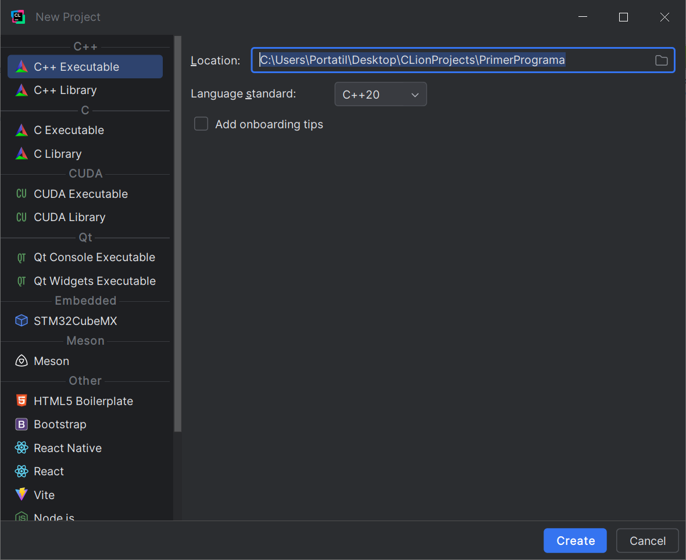
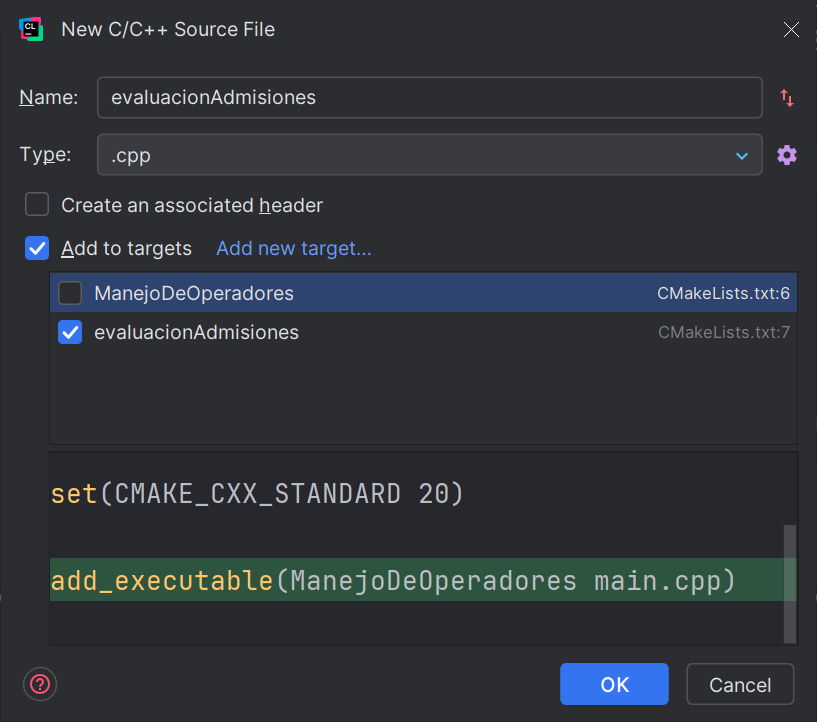
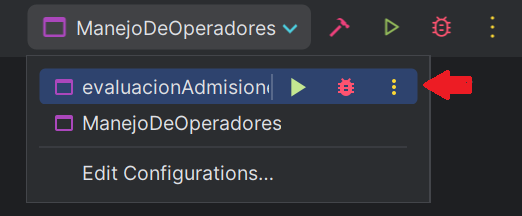
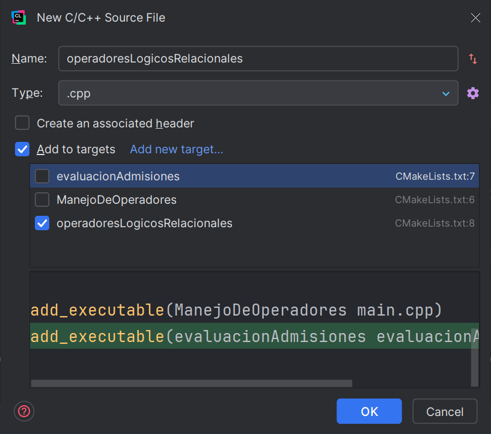
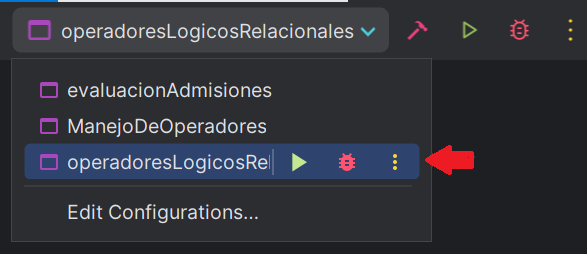

---

# 💻 300CIS017 Programación Orientada a Objetos 2025-01  <!-- omit in toc -->

[](https://creativecommons.org/licenses/by-nc-nd/4.0/)

---

# 🌟 Tema 2: El lenguaje C++ - Parte 1<!-- omit in toc -->

---

### 🎥 Videos que inspiraron este tema:

<table style="border-collapse: collapse; width: 100%; border: none; margin: 10px 0;">
  <tr>
    <td style="text-align: center; padding: 5px; border: none;">
      <a href="https://www.youtube.com/watch?v=Hh9yZWeTmVM">
        
      </a>
      <br>
      <span style="font-size: 12px; margin-top: 5px; display: inline-block;">The Beginning<br>OOR</span>
    </td>
    <td style="text-align: center; padding: 5px; border: none;">
      <a href="https://www.youtube.com/watch?v=Ibp_y21LHJY">
        
      </a>
      <br>
      <span style="font-size: 12px; margin-top: 5px; display: inline-block;">Push Back<br>OOR</span>
    </td>
  </tr>
</table>

---

### 💻 Creado por   

Profesorcito © 2025

<!-- <svg version="1.1" width="16" height="16" viewBox="0 0 16 16" class="octicon octicon-trash" aria-label="The trash icon" role="img"><path d="M11 1.75V3h2.25a.75.75 0 0 1 0 1.5H2.75a.75.75 0 0 1 0-1.5H5V1.75C5 .784 5.784 0 6.75 0h2.5C10.216 0 11 .784 11 1.75ZM4.496 6.675l.66 6.6a.25.25 0 0 0 .249.225h5.19a.25.25 0 0 0 .249-.225l.66-6.6a.75.75 0 0 1 1.492.149l-.66 6.6A1.748 1.748 0 0 1 10.595 15h-5.19a1.75 1.75 0 0 1-1.741-1.575l-.66-6.6a.75.75 0 1 1 1.492-.15ZM6.5 1.75V3h3V1.75a.25.25 0 0 0-.25-.25h-2.5a.25.25 0 0 0-.25.25Z"></path></svg>

<svg version="1.1" width="16" height="16" viewBox="0 0 16 16" class="octicon octicon-pencil" aria-label="The pencil icon" role="img"><path d="M11.013 1.427a1.75 1.75 0 0 1 2.474 0l1.086 1.086a1.75 1.75 0 0 1 0 2.474l-8.61 8.61c-.21.21-.47.364-.756.445l-3.251.93a.75.75 0 0 1-.927-.928l.929-3.25c.081-.286.235-.547.445-.758l8.61-8.61Zm.176 4.823L9.75 4.81l-6.286 6.287a.253.253 0 0 0-.064.108l-.558 1.953 1.953-.558a.253.253 0 0 0 .108-.064Zm1.238-3.763a.25.25 0 0 0-.354 0L10.811 3.75l1.439 1.44 1.263-1.263a.25.25 0 0 0 0-.354Z"></path></svg>

<svg aria-hidden="true" focusable="false" class="mt-1" viewBox="0 0 16 16" width="16" height="16" fill="currentColor" style="display: inline-block; user-select: none; vertical-align: text-bottom; overflow: visible;"><path d="M10.561 8.073a6.005 6.005 0 0 1 3.432 5.142.75.75 0 1 1-1.498.07 4.5 4.5 0 0 0-8.99 0 .75.75 0 0 1-1.498-.07 6.004 6.004 0 0 1 3.431-5.142 3.999 3.999 0 1 1 5.123 0ZM10.5 5a2.5 2.5 0 1 0-5 0 2.5 2.5 0 0 0 5 0Z"></path></svg>

<svg version="1.1" width="16" height="16" viewBox="0 0 16 16" class="octicon octicon-repo" aria-hidden="true"><path d="M2 2.5A2.5 2.5 0 0 1 4.5 0h8.75a.75.75 0 0 1 .75.75v12.5a.75.75 0 0 1-.75.75h-2.5a.75.75 0 0 1 0-1.5h1.75v-2h-8a1 1 0 0 0-.714 1.7.75.75 0 1 1-1.072 1.05A2.495 2.495 0 0 1 2 11.5Zm10.5-1h-8a1 1 0 0 0-1 1v6.708A2.486 2.486 0 0 1 4.5 9h8ZM5 12.25a.25.25 0 0 1 .25-.25h3.5a.25.25 0 0 1 .25.25v3.25a.25.25 0 0 1-.4.2l-1.45-1.087a.249.249 0 0 0-.3 0L5.4 15.7a.25.25 0 0 1-.4-.2Z"></path></svg>

<svg version="1.1" width="16" height="16" viewBox="0 0 16 16" class="octicon octicon-trash" aria-label="The trash icon" role="img"><path d="M11 1.75V3h2.25a.75.75 0 0 1 0 1.5H2.75a.75.75 0 0 1 0-1.5H5V1.75C5 .784 5.784 0 6.75 0h2.5C10.216 0 11 .784 11 1.75ZM4.496 6.675l.66 6.6a.25.25 0 0 0 .249.225h5.19a.25.25 0 0 0 .249-.225l.66-6.6a.75.75 0 0 1 1.492.149l-.66 6.6A1.748 1.748 0 0 1 10.595 15h-5.19a1.75 1.75 0 0 1-1.741-1.575l-.66-6.6a.75.75 0 1 1 1.492-.15ZM6.5 1.75V3h3V1.75a.25.25 0 0 0-.25-.25h-2.5a.25.25 0 0 0-.25.25Z"></path></svg>

<svg aria-hidden="true" focusable="false" class="Octicon-sc-9kayk9-0 kfGkqo" viewBox="0 0 16 16" width="16" height="16" fill="currentColor" style="display: inline-block; user-select: none; vertical-align: text-bottom; overflow: visible;"><path d="M0 8a8 8 0 1 1 16 0A8 8 0 0 1 0 8Zm8-6.5a6.5 6.5 0 1 0 0 13 6.5 6.5 0 0 0 0-13ZM6.5 7.75A.75.75 0 0 1 7.25 7h1a.75.75 0 0 1 .75.75v2.75h.25a.75.75 0 0 1 0 1.5h-2a.75.75 0 0 1 0-1.5h.25v-2h-.25a.75.75 0 0 1-.75-.75ZM8 6a1 1 0 1 1 0-2 1 1 0 0 1 0 2Z"></path></svg>
 -->
---

### 🎶 Dedicado a 

[Takahiro Moriuchi](https://es.wikipedia.org/wiki/Takahiro_Moriuchi) (Taka) 🎤


--- 

En este capítulo, habiendo comprendido previamente el manejo de versiones con **Git** 🧑‍💻, nos adentraremos en los fundamentos del lenguaje **C++** 💻. A lo largo de esta sección, aprenderemos a estructurar programas, manejar tipos de datos, usar operadores, implementar estructuras de control y ciclos para crear soluciones eficientes. También exploraremos temas más avanzados como el manejo de memoria dinámica, el uso de punteros y la creación de funciones y estructuras. 🚀

### **Tabla de Contenido**

- [1. **Introducción a C++**](#1-introducción-a-c)
- [2. **Estructura del Programa**](#2-estructura-del-programa)
  - [**Comentarios**](#comentarios)
  - [**Archivo de Encabezado**](#archivo-de-encabezado)
  - [**Directivas del Preprocesador**](#directivas-del-preprocesador)
  - [**Función `main`**](#función-main)
  - [**Llaves y Bloques**](#llaves-y-bloques)
  - [**Identificadores y Palabras Reservadas**](#identificadores-y-palabras-reservadas)
  - [**Ejemplo de Programa**](#ejemplo-de-programa)
- [3. **Buenas Prácticas al Escribir Código**](#3-buenas-prácticas-al-escribir-código)
- [4. **Tipos de Datos**](#4-tipos-de-datos)
  - [**Enteros**](#enteros)
  - [**Números Reales**](#números-reales)
  - [**Booleanos**](#booleanos)
  - [**Tipo `void`**](#tipo-void)
  - [**Cadenas de Texto**](#cadenas-de-texto)
  - [**Ejemplo de Programa con Tipos de Datos**](#ejemplo-de-programa-con-tipos-de-datos)
- [5. **Literales**](#5-literales)
  - [**Literales Enteros**](#literales-enteros)
  - [**Literales de Punto Flotante**](#literales-de-punto-flotante)
  - [**Literales de Caracter y Cadenas**](#literales-de-caracter-y-cadenas)
- [6. **Operadores**](#6-operadores)
  - [**Aritméticos**](#aritméticos)
  - [**Relacionales y Lógicos**](#relacionales-y-lógicos)
  - [**Bitwise**](#bitwise)
  - [**De Asignación**](#de-asignación)
  - [**Unarios**](#unarios)
  - [**Orden de Precedencia**](#orden-de-precedencia)
- [7. **Conversión de Tipos de Datos**](#7-conversión-de-tipos-de-datos)
  - [**Conversión Implícita**](#conversión-implícita)
  - [**Conversión Explícita**](#conversión-explícita)
- [8. **Variables Constantes**](#8-variables-constantes)
- [9. **Estructuras de Control**](#9-estructuras-de-control)
  - [**Estructura de Selección `if`**](#estructura-de-selección-if)
  - [**Estructura de Selección `if-else`**](#estructura-de-selección-if-else)
  - [**Estructura `switch`**](#estructura-switch)
- [**👽 Tarea - Estacionamiento Intergaláctico**](#-tarea---estacionamiento-intergaláctico)

---

# 1. **Introducción a C++**

C++ fue creado por *Bjarne Stroustrup*, un ingeniero danés, en AT&T Bell Laboratories a principios de los años 80 como una extensión del lenguaje C. Su objetivo era añadir nuevas capacidades, como la programación orientada a objetos, mientras mantenía la velocidad y eficiencia de C.  

>[!NOTE]
>    
> Los Laboratorios Bell (1925-1996) revolucionaron la tecnología con el transistor, el láser, Unix y C++, transformando la computación y la programación.
>

<details><summary>💡 Hint: Bjarne Stroustrup</summary>

<p align="center">
  
</p>
</details>

---

# 2. **Estructura del Programa**

En C++, el código se organiza para asegurar claridad y ejecución correcta: *directivas del preprocesador* como #include <iostream>, seguidas de las definiciones de funciones (en caso de que existan) y, finalmente, la función principal `main()`. El siguiente diagrama ilustra la estructura básica de un programa en C++:

```cpp
#include <iostream>
// otras directivas del preprocesador

definición-de-función 1;
definición-de-función 2;
...

int main() {
    declaración 1;
    declaración 2;
    ...
    instrucción-de-ejecución 1;
    instrucción-de-ejecución 2;
    ...
    return 0;
}
```

Como puedes observar, `main()` reúne todas las declaraciones (variables u objetos que usarás) y las sentencias de ejecución (las acciones concretas que realizará tu programa).

---

## **Comentarios**

Para facilitar la lectura del código y explicar su funcionamiento, se utilizan comentarios. En C++, existen dos tipos principales:

- **Comentarios de una sola línea**, utilizando `//`.
- **Comentarios de múltiples líneas**, utilizando `/* ... */`. Este estilo fue heredado del lenguaje C.

Estos comentarios no afectan la ejecución del programa, pero son muy útiles para documentar o aclarar partes de tu código.

> [!WARNING]
> Si colocas un comentario dentro de otro utilizando `/* ... */`, el compilador generará un error. Esto ocurre porque los **comentarios anidados** no son compatibles con los comentarios de múltiples líneas. Utiliza `//` para evitar problemas. 😊

---

## **Archivo de Encabezado**

En C++, los **archivos de cabecera** contienen definiciones y declaraciones necesarias para utilizar funcionalidades predefinidas del lenguaje, como entrada/salida, operaciones matemáticas o manipulación de texto. Se incluyen en el programa utilizando la [directiva del preprocesador](#directivas-del-preprocesador) `#include`. Por ejemplo:

### 💻 `#include <iostream>` <!-- omit in toc -->

Proporciona funcionalidades básicas de entrada y salida, como:
  - `std::cout` para imprimir en pantalla.  
  - `std::cin` para recibir datos del usuario.  

<details>
<summary>Ejemplo de uso</summary>

**Código en C++:**
```cpp
#include <iostream>
using namespace std;

int main() {
    cout << "Introduce un número: ";
    int num;
    cin >> num;
    cout << "Has introducido: " << num << endl;
    return 0;
}
```

**Posible salida en consola:**
```
Introduce un número: 5
Has introducido: 5
```
</details>

---

### 🧮 `#include <cmath>` <!-- omit in toc -->

Proporciona funciones matemáticas avanzadas, como:
  - `sqrt()` para calcular raíces cuadradas.  
  - `pow()` para calcular potencias.  
  - `sin()`, `cos()`, y `tan()` para operaciones trigonométricas.  

<details>
<summary>Ejemplo de uso</summary>

**Código en C++:**
```cpp
#include <iostream>
#include <cmath>
using namespace std;

int main() {
    double base = 2.0, exponente = 3.0;
    cout << "2^3 = " << pow(base, exponente) << endl;
    cout << "Raíz cuadrada de 25: " << sqrt(25) << endl;
    cout << "Seno de 90 grados: " << sin(90 * M_PI / 180) << endl;
    return 0;
}
```

**Posible salida en consola:**
```
2^3 = 8
Raíz cuadrada de 25: 5
Seno de 90 grados: 1
```
</details>

---

### 📝 `#include <string>` <!-- omit in toc -->

Permite trabajar con cadenas de texto de manera sencilla:
  - Concatenar con el operador `+`.  
  - Comparar cadenas con `==`.  
  - Obtener el tamaño de una cadena usando `.size()` o `.length()`.  

<details>
<summary>Ejemplo de uso</summary>

**Código en C++:**
```cpp
#include <iostream>
#include <string>
using namespace std;

int main() {
    string nombre = "Juan";
    string saludo = "Hola, " + nombre + "!";
    cout << saludo << endl;
    cout << "El saludo tiene " << saludo.length() << " caracteres." << endl;
    return 0;
}
```

**Posible salida en consola:**
```
Hola, Juan!
El saludo tiene 11 caracteres.
```
</details>

---

### 🚀 `#include <vector>` <!-- omit in toc -->

Permite manejar arreglos dinámicos de manera eficiente:
  - Los `vector` pueden crecer y encogerse según sea necesario.  
  - Permiten agregar y eliminar elementos fácilmente.  
  - Se pueden recorrer con bucles `for` de manera sencilla.  

<details>
<summary>Ejemplo de uso</summary>

**Código en C++:**
```cpp
#include <iostream>
#include <vector>
using namespace std;

int main() {
    vector<int> numeros = {1, 2, 3, 4, 5};
    numeros.push_back(6); // Agregar un número al final

    cout << "Elementos del vector: ";
    for (int num : numeros) {
        cout << num << " ";
    }
    cout << endl;

    cout << "El tamaño del vector es: " << numeros.size() << endl;
    return 0;
}
```

**Posible salida en consola:**
```
Elementos del vector: 1 2 3 4 5 6
El tamaño del vector es: 6
```
</details>

---

A lo largo del curso, se utilizarán otros encabezados según las necesidades específicas de cada programa, e incluso aprenderemos a crear nuestros propios archivos de cabecera.

> [!NOTE]
> 
> Se llaman **archivos de cabecera** porque se colocan en la **parte superior** del programa, de manera similar a cómo la cabeza está en la parte superior del cuerpo humano.

---

## **Directivas del Preprocesador**

Una **directiva del preprocesador** en C++ es una instrucción que se procesa antes de la compilación. Comienzan con `#` y permiten incluir archivos externos, como los [archivos de encabezado](#archivo-de-encabezado) explicados anteriormente, definir macros, y controlar bloques condicionales, preparando el código para su compilación.

Ejemplos comunes de directivas:

- `#include`  

   Trae archivos de cabecera al programa, asegurando que ciertas herramientas estén disponibles.  
   ```cpp
   #include <iostream> // Entrada y salida estándar
   #include <cmath>    // Funciones matemáticas
   ```

- `#define`  

   Define macros o constantes reutilizables.  
   ```cpp
   #define PI 3.14159
   #define AREA(r) (PI * (r) * (r)) // Calcula áreas de un círculo
   ```

- `#ifdef` y `#ifndef`  

   Permiten incluir o excluir partes del código según condiciones.  
   ```cpp
   #define DEBUG // Activa modo depuración

   #ifdef DEBUG
   std::cout << "Modo depuración activado!" << std::endl;
   #endif
   ```

El preprocesador trabaja **antes de compilar**, procesando estas directivas para preparar el programa y asegurarse de que el compilador tenga todo lo necesario para crear el ejecutable.

---

## **Función `main`**  

En C++, la función principal, llamada **`main()`** (del inglés 'principal'), es el punto de entrada del programa. Su declaración estándar es `int main()`, y puede devolver un valor entero (✅ `0` para éxito, ❌ otro valor para indicar error) al sistema operativo.  

También acepta argumentos desde la línea de comandos:  
- **`argc`** (argument count) → Indica el número total de argumentos, incluyendo el nombre del programa.  
- **`argv`** (argument vector) → Es un array de `char*` que almacena los argumentos como cadenas de caracteres.  

<details>
<summary>🔍 Ejemplo avanzado de uso de `argc` y `argv`</summary>

### **📌 Código en C++:** <!-- omit in toc -->
```cpp
#include <iostream>
using namespace std;

int main(int argc, char* argv[]) {
    if (argc < 3) { // Se esperan al menos 2 argumentos adicionales
        cerr << "Error: Debes proporcionar al menos dos argumentos.\n";
        cerr << "Uso: ./programa <nombre> <edad> <ciudad> <país>\n";
        return 1; // Código de error
    }

    cout << "Nombre del programa: " << argv[0] << endl;
    cout << "Argumentos recibidos:\n";
    
    cout << "  Nombre: " << argv[1] << endl;
    cout << "  Edad: " << argv[2] << " años" << endl;
    
    if (argc >= 4) cout << "  Ciudad: " << argv[3] << endl;
    if (argc >= 5) cout << "  País: " << argv[4] << endl;

    cout << "Ejecución finalizada correctamente.\n";
    return 0; // Éxito
}
```

---

### **🖥️ Uso y salida en consola con diferentes argumentos:** <!-- omit in toc -->
✅ **Ejecutando el programa con 4 argumentos:**  
```
$ ./programa Juan 25 Bogotá Colombia
Nombre del programa: ./programa
Argumentos recibidos:
  Nombre: Juan
  Edad: 25 años
  Ciudad: Bogotá
  País: Colombia
Ejecución finalizada correctamente.
```

✅ **Ejecutando el programa con menos argumentos:**  
```
$ ./programa Ana 30
Nombre del programa: ./programa
Argumentos recibidos:
  Nombre: Ana
  Edad: 30 años
Ejecución finalizada correctamente.
```

❌ **Ejecutando sin suficientes argumentos:**  
```
$ ./programa
Error: Debes proporcionar al menos dos argumentos.
Uso: ./programa <nombre> <edad> <ciudad> <país>
```

---

### **⚡ `return 0` y `ERRORLEVEL` en el sistema operativo**  <!-- omit in toc -->
🔹 `return 0;` indica que el programa terminó **sin errores**.  
🔹 `return 1;` o cualquier otro valor representa un **código de error**.  
🔹 En **Windows**, puedes verificarlo con `echo %ERRORLEVEL%`.  
🔹 En **Linux/macOS**, puedes usar `$?` en la terminal.

**Ejemplo en `cmd.exe` (Windows):**
```
C:\> programa.exe
Error: Debes proporcionar al menos dos argumentos.
Uso: programa.exe <nombre> <edad> <ciudad> <país>

C:\> echo %ERRORLEVEL%
1
```

```
C:\> programa.exe Pedro 28 Madrid España
Nombre del programa: programa.exe
Argumentos recibidos:
  Nombre: Pedro
  Edad: 28 años
  Ciudad: Madrid
  País: España
Ejecución finalizada correctamente.

C:\> echo %ERRORLEVEL%
0
```

**Ejemplo en terminal (Linux/macOS):**
```
$ ./programa
Error: Debes proporcionar al menos dos argumentos.
Uso: ./programa <nombre> <edad> <ciudad> <país>
$ echo $?
1
```

```
$ ./programa María 22 Lima Perú
Nombre del programa: ./programa
Argumentos recibidos:
  Nombre: María
  Edad: 22 años
  Ciudad: Lima
  País: Perú
Ejecución finalizada correctamente.
$ echo $?
0
```

</details>

>[!NOTE]
>
> En C++, debe existir **solo una función `main()`** en cada programa, ya que define el único punto de entrada donde comienza la ejecución. Si existieran varias funciones `main()`, el compilador no sabría cuál usar como punto de inicio, lo que generaría un error.  

---

## **Llaves y Bloques**

En C++, las **llaves** (`{` y `}`) se utilizan para definir un **bloque* de código, que agrupa instrucciones y determina el *alcance* o *ámbito* (*scope* en inglés) de las variables y funciones. Esto significa que los elementos declarados dentro del bloque solo son accesibles ahí, organizando el flujo del programa y delimitando estructuras como funciones, bucles y condiciones.

Todo lo contenido entre un par de llaves pertenece al mismo *bloque* y se ejecuta según el contexto. Por ejemplo, en una función, las llaves delimitan su cuerpo, mientras que en estructuras de control como `if` o `while`, especifican qué instrucciones se ejecutan dependiendo de la condición.  

El uso correcto de las llaves asegura un código claro, organizado y con un manejo adecuado del alcance o ámbito.  

---

## **Identificadores y Palabras Reservadas**

En C++, los identificadores son nombres definidos por el programador para variables, funciones, clases y otros elementos del código. Las **palabras reservadas**, en cambio, son términos con significado especial en el lenguaje y no pueden ser usadas como identificadores.

Las palabras reservadas en C++ son:

```cpp
alignas   continue   friend     operator  this  
alignof   decltype   goto       private   throw  
asm       default    if         protected true  
auto      delete     inline     public    try  
bool      do         int        register  typedef  
break     double     long       reinterpret_cast  
typeid    case       dynamic_cast mutable  typename 
catch     else       namespace  return    union  
char      enum       new        short     unsigned  
class     explicit   noexcept   signed    using  
const     export     nullptr    sizeof    virtual  
constexpr extern     operator   static    void  
const_cast false     private    static_cast  
volatile  template   wchar_t    while
```

> [!CAUTION]
> 
> Si intentas usar una palabra reservada como identificador (por ejemplo, llamando a una variable `int`), el compilador generará un error, ya que estas palabras tienen un propósito específico en el lenguaje.

---

## **Ejemplo de Programa**

Aquí tienes un ejemplo de un programa completo en C++:

```cpp
// Proyecto: PrimerPrograma
// Archivo: main.cpp
// Este programa solicita al usuario dos números enteros.
// Luego calcula y muestra su suma
// Programador: Profesorcito
// Fecha: 27/ene/2025

#include <iostream>

int main() {
    int valor1, valor2; // Manteniendo el tipo int
    std::cout << "Introduce dos valores enteros: " << std::endl;
    std::cin >> valor1 >> valor2;
    std::cout << "La suma de " << valor1 << " y " << valor2 << " es " << (valor1 + valor2) << std::endl;
    return 0;
}
```

<details><summary>🏃 Cómo Ejecutar en CLion</summary>

**1. Crear un nuevo proyecto en CLion:**
   * Abre CLion y selecciona **"New Project"**. Si ya tienes un proyecto abierto, dirígete al menú `File` -> `New` -> `Project...` en la barra de menú.
   * Escoge un proyecto del tipo **C++ Executable**.
   * Asigna el nombre **PrimerPrograma** al proyecto y elige guardarlo en la carpeta `CLionProjects` dentro de tu escritorio para mantener todo organizado.
     - Ejemplo de ubicación: `C:\Users\Portatil\Desktop\CLionProjects\PrimerPrograma`
   * Donde dice "Lenguaje estándar", selecciona `c++20`
   * Cuando te pregunte si quieres abrir el proyecto en una nueva ventana o en la misma ventana, selecciona **"this window"** para que el proyecto se abra en la ventana actual de CLion.

<p align="center">
  
</p>

**2. Escribir el código:**
   * Una vez creado el proyecto, abre el archivo principal (por defecto será `main.cpp`).
   * Reemplaza el contenido de `main.cpp` con el código del programa anterior.

**3. Ejecutar el programa:**
   * Haz clic en el botón de **Run** (▶️) en la parte superior derecha o utiliza el atajo <kbd>Shift</kbd>+<kbd>F10</kbd>
.
   * Aparecerá la consola integrada donde podrás ver los resultados.
</details>

<details><summary>📥 Accede al proyecto PrimerPrograma en el GitHub del profesorcito y clónalo</summary>

Si deseas clonar este proyecto en tu máquina local, abre **Git Bash** y ejecuta los siguientes comandos:

1. Navega a la carpeta donde deseas guardar el proyecto:

   ```bash
   cd ~/Desktop/CLionProjects
   ```

2. Clona el proyecto con el siguiente comando de Git:

   ```bash
   git clone https://github.com/yoanpinzon/PrimerPrograma.git
   ```

3. Una vez clonado, entra a la carpeta del proyecto:

   ```bash
   cd TiposDeDatos
   ```

4. Abre la carpeta `~/Desktop/CLionProjects/TiposDeDatos` en **CLion**.

Una vez abierto en **CLion**, puedes ejecutar el programa directamente desde allí.

</details>

# 3. **Buenas Prácticas al Escribir Código**

En programación, seguir buenas prácticas para nombrar proyectos, archivos, variables, clases, constantes y otros elementos es crucial para garantizar un código más legible, mantenible y profesional. Las convenciones claras y consistentes no solo facilitan la colaboración entre desarrolladores, sino que también ayudan a reducir errores y a mantener un flujo de trabajo organizado.  

**[Nombrar Proyectos]**: Para nombrar proyectos, es habitual emplear la convención conocida como **PascalCase**. Este estilo implica que cada palabra comience con una letra mayúscula, incluida la primera, y evita el uso de espacios o guiones bajos. Ejemplos típicos de nombres de proyectos son:
- `PrimerPrograma`  
- `BankingSystem`  
- `MathTools`  
  
**[Nombrar Clases y Estructuras]**: La convención **PascalCase** también se utiliza comúnmente para nombrar **clases y estructuras**, ya que proporciona un aspecto formal y profesional, ideal para representar componentes clave del código, tales como:
- `CuentaBancaria`  
- `Estudiante`  
- `MathOperations`  

**[Nombrar Variables y Funciones]**: Por otro lado, las **variables y funciones** suelen seguir la convención **camelCase**. En este caso, la primera palabra comienza en minúscula, mientras que las palabras subsiguientes inician con mayúscula, lo que visualmente crea una forma que recuerda las jorobas de un camello 🐪. Esto permite que las palabras dentro del nombre se destaquen sin romper el flujo de lectura. Ejemplos de nombres de variables podrían ser:  
- `totalAmount`  
- `userInput`  

Mientras que las funciones suelen escribirse como:  
- `calculateSum()`  
- `findMaxValue()`  

**[Nombrar Constantes y Macros]**: En el caso de las **constantes y macros**, la convención ampliamente aceptada es escribir los nombres completamente en mayúsculas, separando las palabras con guiones bajos para mayor claridad. Esto permite que estos elementos sean fácilmente distinguibles de otros componentes del código y refuerza su naturaleza inmutable. Ejemplos incluyen:  
- `PI_VALUE`  
- `MAX_SIZE`  
- `DEBUG_MODE`  

El uso de estas convenciones no es arbitrario, sino que responde a estándares ampliamente adoptados en la industria de la programación. Adoptar estas prácticas desde el principio puede marcar una gran diferencia en la claridad, organización y profesionalismo de tu código. ¡Incorporarlas es un paso hacia un desarrollo más eficiente y colaborativo! 🚀

**Comparación Visual de Convenciones**
| Elemento           | Convención      | Ejemplo               |
|---------------------|----------------|-----------------------|
| **Proyectos**       | PascalCase     | `PrimerPrograma`      |
| **Variables**       | camelCase      | `totalAmount`         |
| **Funciones**       | camelCase      | `calculateSum()`      |
| **Clases**          | PascalCase     | `CuentaBancaria`      |
| **Constantes/Macros** | MAYÚSCULAS    | `MAX_SIZE`, `PI_VALUE` |


> [!NOTE]
> 
> - **camelCase** 🐫: Se llama así porque las letras mayúsculas recuerdan las **jorobas de un camello**, con la primera palabra en minúscula.  
> - **PascalCase** 🏫: Recibe su nombre del lenguaje de programación **Pascal**, creado en los años 70, que utilizaba esta convención para nombrar las variables.  

---

# 4. **Tipos de Datos**

En C++, además de los tipos de datos fundamentales como `int`, `char`, y `float`, existe un sistema robusto de tipos que permite construir tipos más complejos. Estos tipos básicos se combinan con modificadores como `short`, `long`, `unsigned`, y otros.

> [!NOTE]
> 
> **C++ es un lenguaje altamente tipado**: En C++, cada variable debe tener un tipo de dato explícito que no puede cambiar durante la ejecución. Esto ayuda a prevenir errores y garantiza mayor control sobre los datos.  
> 
> **Lenguajes no altamente tipados**, como Python, permiten que las variables cambien de tipo sin errores, lo que ofrece mayor flexibilidad pero con un mayor riesgo de errores.  


<details><summary>💡 Hint: Entendiendo los modificadores de tipo</summary>
    
### ¿Qué son los modificadores? <!-- omit in toc -->

Los modificadores son palabras clave en C++ que se utilizan para ajustar el rango y comportamiento de los tipos de datos básicos. Aquí hay una descripción breve de cada uno:

1. **`signed`**  
   Este modificador permite almacenar valores **positivos y negativos**. Por defecto, los tipos como `int` y `char` son `signed` si no se especifica lo contrario.  

2. **`unsigned`**  
   Al usar este modificador, el tipo solo almacena valores **positivos**, lo que duplica el rango de números positivos posibles.  

3. **`short`**  
   Reduce el tamaño del tipo de dato (en bytes), por lo que ocupa menos memoria y tiene un rango más limitado.  

4. **`long`**  
   Incrementa el tamaño del tipo de dato, permitiendo manejar números más grandes.  

5. **`long long`**  
   Es una extensión del modificador `long`, permitiendo manejar números aún más grandes, especialmente en sistemas de 64 bits.  

### Combinaciones útiles <!-- omit in toc -->
Los modificadores pueden combinarse para definir tipos específicos. Por ejemplo:
- `unsigned long` permite trabajar con números enteros positivos grandes.
- `signed short` es redundante, ya que `short` ya incluye el signo de manera predeterminada.
</details>

---

## **Enteros**

[](https://gist.githubusercontent.com/yoanpinzon/5b2814a82213ec2b3788da37c32945fa/raw/981b1859d02dc2bf831cf5016253c56173180182/main.cpp)

| Tipo de dato         | Bytes | Valores                |
|----------------------|:-----:|------------------------|
| [`signed char`](https://gist.githubusercontent.com/yoanpinzon/5b2814a82213ec2b3788da37c32945fa/raw/981b1859d02dc2bf831cf5016253c56173180182/main.cpp) 🤪       | 1     | [-128, 127]             |
| `unsigned char`      | 1     | [0, 255]               |
| `short int`          | 2     | [-32768, 32767]        |
| `unsigned short`     | 2     | [0, 65535]             |
| `int`                | 4     | [-2^31, 2^31-1]        |
| `unsigned int`       | 4     | [0, 4294967295]        |
| `long`               | 4     | [-2^31, 2^31-1]        |
| `unsigned long`      | 4     | [0, 4294967295]        |
| `long long int`      | 8     | [-2^63, 2^63-1]        |
| `unsigned long long int` | 8  | [0, 2^64-1]           |


---

## **Números Reales**

| Tipo de dato    | Bytes | Valores                                  |
|-----------------|:-----:|------------------------------------------|
| `float`         | 4     | 1.17549435×10^-38 a 3.40282347×10^38    |
| `double`        | 8     | 2.2250738585072014×10^-308 a 1.7976931348623157×10^308 |
| `long double`   | 16    | ≈ 10^-4931 a ≈ 10^4932                  |

---

## **Booleanos**

En C++, el tipo `bool` se usa para representar valores lógicos, es decir, `true` (verdadero) o `false` (falso). Es un tipo integral de 1 byte que es especialmente útil en estructuras de control y en la lógica booleana. [🧛](https://gist.githubusercontent.com/yoanpinzon/6ec692080af01f7ac4fad8ade36d97d3/raw/deb18a148491df51341596084f0d4ee720a4492d/main.cpp)


| Tipo de dato  | Bytes | Valores      |
|---------------|:-----:|--------------|
| `bool`        | 1     | `true` o `false` |

---

## **Tipo `void`**

En C++, el tipo `void` se utiliza para indicar la ausencia de un valor o un tipo de dato. A diferencia de otros tipos (como `int` o `char`), `void` no puede almacenar información ni representar un valor en sí mismo. En español, `void` significa "vacío", lo que refleja perfectamente su propósito

---

## **Cadenas de Texto**

Una cadena de texto no es un tipo fundamental como `int`, `float`, o `char`. En C++, las cadenas son representadas como arreglos de caracteres (`char[]`), o mediante la clase `std::string` de la biblioteca estándar, que facilita muchas operaciones con cadenas de texto.

---

## **Ejemplo de Programa con Tipos de Datos**

A continucion encontraras un programa que incorpora algunos de estos tipos de datos: 

```cpp
// Proyecto: TiposDeDatos
// Archivo: main.cpp
// Este programa es una introducción a los tipos de datos básicos en C++.
// Programador: Profesorcito
// Fecha: 27/ene/2025

#include <iostream>
#include <string>  // Para usar el tipo string
using namespace std;

int main() {
    // Uso de 'signed' (por defecto en 'int') y 'unsigned'
    signed int num1 = -10;  // Almacena valores negativos
    unsigned int num2 = 10;  // Solo almacena valores positivos

    // Uso de 'short' y 'long' para modificar el tamaño de los enteros
    short int smallValue = 32767;  // Valor pequeño, solo puede almacenar valores hasta 32767
    long int largeValue = 2147483647;  // Valor largo, más grande que el 'int' tradicional

    // Uso de 'long long' para valores aún más grandes
    long long int veryLargeValue = 9223372036854775807;  // Valor máximo para 'long long'

    // Uso de 'bool' para representar valores lógicos
    bool isPositive = num2 > 0;  // Verifica si num2 es mayor que 0

    // Uso de 'string' para almacenar una cadena de texto
    string greeting = "¡Hola, mundo de C++!";

    // Imprimir los resultados
    cout << "Valor con signo (signed int): " << num1 << endl;
    cout << "Valor sin signo (unsigned int): " << num2 << endl;
    cout << "Valor pequeño (short int): " << smallValue << endl;
    cout << "Valor largo (long int): " << largeValue << endl;
    cout << "Valor muy largo (long long int): " << veryLargeValue << endl;

    // Imprimir los resultados de 'bool' y 'string'
    cout << "¿Es num2 positivo? " << (isPositive ? "Sí" : "No") << endl;  // Uso del operador ternario
    cout << "Mensaje de saludo: " << greeting << endl;

    return 0;
}
```

<details><summary>👨‍🏫 Explicación</summary>

  Este programa en C++ está diseñado para ilustrar cómo utilizar diferentes tipos de datos básicos, como enteros, valores booleanos y cadenas de texto. Comienza con la declaración de varias variables de distintos tipos, utilizando modificadores para controlar cómo se almacenan los datos.

  Primero, se declaran dos variables enteras: una con signo (`signed int`), que puede almacenar tanto números positivos como negativos, y otra sin signo (`unsigned int`), que solo puede almacenar valores positivos. En este caso, se asignan valores de `-10` y `10`, respectivamente. Además, se utilizan otros tipos de enteros con tamaños modificados, como `short int`, que tiene un límite de `32767`, y `long int`, que es más grande que el tipo estándar `int`. Luego, se introduce `long long int`, que permite almacenar valores aún más grandes, como el número `9223372036854775807`.

  El programa también emplea el tipo `bool`, que representa valores lógicos como `true` o `false`. Aquí, se utiliza para verificar si el valor de la variable `num2` es positivo, asignando `true` a la variable `isPositive` porque el valor de `num2` es mayor que cero. Este valor se imprime utilizando un operador ternario, que es una forma compacta de tomar decisiones en C++: si `isPositive` es `true`, imprime "Sí", y si no lo es, imprime "No".

  Finalmente, se declara una variable de tipo `string` para almacenar una cadena de texto, y su valor se muestra en pantalla. Al final del programa, se imprime todo el contenido de las variables declaradas, mostrando cómo se gestionan diferentes tipos de datos en C++ y cómo se pueden manipular y presentar los resultados al usuario.

  En resumen, este programa es un ejemplo básico de cómo trabajar con tipos de datos primitivos en C++, realizando comparaciones lógicas y mostrando mensajes al usuario.
</details>

<details><summary>🏃 Cómo Ejecutar en CLion</summary>

**1. Crear un nuevo proyecto en CLion:**
   * Abre CLion y selecciona **"New Project"**. Si ya tienes un proyecto abierto, dirígete al menú `File` -> `New` -> `Project...` en la barra de menú.
   * Escoge un proyecto del tipo **C++ Executable**.
   * Asigna el nombre **TiposDeDatos** al proyecto y elige guardarlo en la carpeta `CLionProjects` dentro de tu escritorio para mantener todo organizado.
     - Ejemplo de ubicación: `C:\Users\Portatil\Desktop\CLionProjects\TiposDeDatos`
   * Donde dice "Lenguaje estándar", selecciona `c++20`
   * Cuando te pregunte si quieres abrir el proyecto en una nueva ventana o en la misma ventana, selecciona **"this window"** para que el proyecto se abra en la ventana actual de CLion.

**2. Escribir el código:**
   * Una vez creado el proyecto, abre el archivo principal (por defecto será `main.cpp`).
   * Reemplaza el contenido de `main.cpp` con el código del programa anterior.

**3. Ejecutar el programa:**
   * Haz clic en el botón de **Run** (▶️) en la parte superior derecha o utiliza el atajo <kbd>Shift</kbd>+<kbd>F10</kbd>
.
   * Aparecerá la consola integrada donde podrás ver los resultados.
</details>

<details><summary>📥 Accede al proyecto TiposDeDatos en el GitHub del profesorcito y clónalo</summary>

Si deseas clonar este proyecto en tu máquina local, abre **Git Bash** y sigue estos pasos:

1. Navega a la carpeta donde quieres guardar el proyecto:

   ```bash
   cd ~/Desktop/CLionProjects
   ```

2. Clona el proyecto usando el siguiente comando:

   ```bash
   git clone https://github.com/yoanpinzon/TiposDeDatos.git
   ```

3. Una vez clonado, accede a la carpeta del proyecto:

   ```bash
   cd TiposDeDatos
   ```

4. Luego, abre la carpeta `~/Desktop/CLionProjects/TiposDeDatos` en **CLion**.

Cuando el proyecto esté abierto en **CLion**, podrás ejecutar el programa desde allí.

</details>

---

# 5. **Literales**

En C++, un **literal** es un valor constante que se escribe directamente en el código fuente. Estos valores pueden ser de distintos tipos, como enteros, flotantes, caracteres, cadenas de texto y booleanos. Además, C++ permite el uso de sufijos para especificar el tipo exacto de un literal.

---

## **Literales Enteros**

Un literal entero es un número sin punto decimal. Puede representarse en diferentes bases numéricas:

| Notación    | Ejemplo    | Base |
| ----------- | ---------- | ---- |
| Decimal     | `42`       | 10   |
| Octal       | `052`      | 8    |
| Hexadecimal | `0x2A`     | 16   |
| Binario     | `0b101010` | 2    |

### Sufijos para Literales Enteros <!-- omit in toc -->

C++ permite agregar sufijos para modificar el tipo de un literal entero:

| Sufijo                   | Tipo                                              |
| ------------------------ | ------------------------------------------------- |
| `u` o `U`                | `unsigned`                                        |
| `l` o `L`                | `long`                                            |
| `ll` o `LL`              | `long long`                                       |
| `ul`, `UL`, `ull`, `ULL` | Variaciones de unsigned long y unsigned long long |

### Ejemplo 1: <!-- omit in toc -->

```cpp
// Proyecto: Literales
// Archivo: main.cpp
// Este programa demuestra el uso de literales enteros en C++.
// Programador: Profesorcito
// Fecha: 27/ene/2025

#include <iostream>

int main() {
    int decimal = 42;
    int octal = 052;
    int hexadecimal = 0x2A;
    int binario = 0b101010;
    unsigned long long grande = 123456789ULL;
    
    std::cout << "Decimal: " << decimal << "\n";
    std::cout << "Octal: " << octal << "\n";
    std::cout << "Hexadecimal: " << hexadecimal << "\n";
    std::cout << "Binario: " << binario << "\n";
    std::cout << "Unsigned Long Long: " << grande << "\n";
    return 0;
}
```

Salida:
```
Decimal: 42
Octal: 42
Hexadecimal: 42
Binario: 42
Unsigned Long Long: 123456789
```


<details><summary>🏃 Cómo Ejecutar en CLion</summary>

**1. Crear un nuevo proyecto en CLion:**
   * Abre CLion y selecciona **"New Project"**. Si ya tienes un proyecto abierto, dirígete al menú `File` -> `New` -> `Project...` en la barra de menú.
   * Escoge un proyecto del tipo **C++ Executable**.
   * Asigna el nombre **Literales** al proyecto y elige guardarlo en la carpeta `CLionProjects` dentro de tu escritorio para mantener todo organizado.
     - Ejemplo de ubicación: `C:\Users\Portatil\Desktop\CLionProjects\Literales`
   * Donde dice "Lenguaje estándar", selecciona `c++20`
   * Cuando te pregunte si quieres abrir el proyecto en una nueva ventana o en la misma ventana, selecciona **"this window"** para que el proyecto se abra en la ventana actual de CLion.

**2. Escribir el código:**
   * Una vez creado el proyecto, abre el archivo principal (por defecto será `main.cpp`).
   * Reemplaza el contenido de `main.cpp` con el código del programa anterior.

**3. Ejecutar el programa:**
   * Haz clic en el botón de **Run** (▶️) en la parte superior derecha o utiliza el atajo <kbd>Shift</kbd>+<kbd>F10</kbd>.
   * Aparecerá la consola integrada donde podrás ver el resultado.
</details>

<details><summary>📥 Accede al proyecto Literales en el GitHub del profesorcito y clónalo</summary>

Si deseas clonar este proyecto en tu máquina local, abre **Git Bash** y ejecuta los siguientes comandos:

1. Navega a la carpeta donde deseas guardar el proyecto:

   ```bash
   cd ~/Desktop/CLionProjects
   ```

2. Clona el proyecto con el siguiente comando de Git:

   ```bash
   git clone https://github.com/yoanpinzon/Literales.git
   ```

3. Una vez clonado, entra a la carpeta del proyecto:

   ```bash
   cd Literales
   ```

4. Abre la carpeta `~/Desktop/CLionProjects/Literales` en **CLion**.

Una vez abierto en **CLion**, puedes ejecutar el programa directamente desde allí.
</details>

---

## **Literales de Punto Flotante**

Los literales de punto flotante representan números con decimales o en notación científica:

| Ejemplo  | Representación                     |
| -------- | ---------------------------------- |
| `3.14`   | Notación estándar                  |
| `2.5e-3` | Notación científica (`2.5 × 10⁻³`) |

### Sufijos para Literales Flotantes <!-- omit in toc -->

| Sufijo    | Tipo          |
| --------- | ------------- |
| `f` o `F` | `float`       |
| `l` o `L` | `long double` |

### Ejemplo 2: <!-- omit in toc -->

```cpp
// Proyecto: Literales
// Archivo: lietralesFlotantes.cpp
// Este programa demuestra el uso de literales de punto flotante en C++.
// Programador: Profesorcito
// Fecha: 27/ene/2025

#include <iostream>

int main() {
    double normal = 3.14;
    float flotante = 3.14f;
    long double grande = 2.5e-3L;
    
    std::cout << "Double: " << normal << "\n";
    std::cout << "Float: " << flotante << "\n";
    std::cout << "Long Double: " << grande << "\n";
    return 0;
}
```

Salida:
```
Double: 3.14
Float: 3.14
Long Double: 0.0025
```

<details><summary>🏃 Cómo Ejecutar en CLion</summary>

**1. Agregar un nuevo archivo fuente C++ en el proyecto `Literales`:**
* Haz clic derecho en el proyecto `Literales` y selecciona `New` > `C/C++ Source File`.
* Nombra el archivo como `literalesFlotantes.cpp`.
* Haz clic en `Add new target`, a la derecha de `Add to targets`.
* En el campo `new_target`, reemplaza el nombre por `literalesFlotantes` y luego haz clic en `Add...`.
* Asegúrate de que solo `literalesFlotantes` esté seleccionado en la lista de targets y desmarca otros si están seleccionados.
* Ahora, Dale clic a OK ✅ para confirmar.

**2. Escribir el código en `literalesFlotantes.cpp`:**
* Abre el archivo `literalesFlotantes.cpp` y copia el código del programa que se te proporcionó.

**3. Compilar el programa:**
* Antes de compilar, en la parte superior, haz clic en el menú desplegable junto al botón **Build** (🔨) y selecciona `literalesFlotantes`
* Haz clic en el botón de **Run** (▶️) en la parte superior derecha o utiliza el atajo <kbd>Shift</kbd>+<kbd>F10</kbd>.
* Una vez que la ejecución haya finalizado, podrás interactuar con la aplicación.
</details>

<details><summary>📥 Accede al proyecto Literales en el GitHub del profesorcito y clónalo</summary>

Si deseas clonar este proyecto en tu máquina local, abre **Git Bash** y ejecuta los siguientes comandos:

1. Navega a la carpeta donde deseas guardar el proyecto:

   ```bash
   cd ~/Desktop/CLionProjects
   ```

2. Clona el proyecto con el siguiente comando de Git:

   ```bash
   git clone https://github.com/yoanpinzon/Literales.git
   ```

3. Una vez clonado, entra a la carpeta del proyecto:

   ```bash
   cd Literales
   ```

4. Abre la carpeta `~/Desktop/CLionProjects/Literales` en **CLion**.

Una vez abierto en **CLion**, puedes ejecutar el programa directamente desde allí.
</details>

---

## **Literales de Caracter y Cadenas**

### Literales de Caracter <!-- omit in toc -->

Un literal de carácter se escribe entre comillas simples `'A'` y puede usar secuencias de escape como `\n`, `\t`, etc.

| Ejemplo | Representación  |
| ------- | --------------- |
| `'A'`   | Carácter simple |
| `'\n'`  | Nueva línea     |
| `'\t'`  | Tabulación      |

> [!NOTE]
>
> Estos son todos los literales con secuencias de escape disponibles en C++:  
> 
>| Secuencia | Descripción |  
>|-----------|------------|  
>| `\'` | Comilla simple |  
>| `\"` | Comilla doble |  
>| `\?` | Signo de interrogación para evitar `??` (trigraphs) |  
>| `\\` | Barra invertida (`\`) |  
>| `\a` | Sonido de alerta (beep) |  
>| `\b` | Retroceso |  
>| `\f` | Avance de página |  
>| `\n` | Nueva línea |  
>| `\r` | Retorno de carro |  
>| `\t` | Tabulación horizontal |  
>| `\v` | Tabulación vertical |  
>| `\xhh` | Carácter en hexadecimal (ejemplo: `\x41` → 'A') |  
>| `\ooo` | Carácter en octal (ejemplo: `\101` → 'A') |  
>

### Literales de Cadenas <!-- omit in toc -->

Los literales de cadena se escriben entre comillas dobles (`""`) y pueden contener secuencias de escape para caracteres especiales.

| Ejemplo                  | Representación        |
|--------------------------|----------------------|
| `"Hola"`                | Cadena de caracteres |
| `"La vida\nes\nbella"`  | Cadena de caracteres |

### Ejemplo 3: <!-- omit in toc -->

A continuación, se presenta un programa en C++ que demuestra el uso de literales de carácter y cadenas.

```cpp
// Proyecto: Literales
// Archivo: literalesCaracter.cpp
// Este programa demuestra el uso de literales de carácter y cadenas en C++.
// Programador: Profesorcito
// Fecha: 27/ene/2025

#include <iostream>
#include <string>

int main() {
    char letra = 'A';
    const char* cadena = "Hola, C++";
    std::string mensaje = "La vida\nes\nbella";

    std::cout << "Letra: " << letra << std::endl;
    std::cout << "Cadena: " << cadena << std::endl;
    std::cout << "Mensaje: " << mensaje << std::endl;

    return 0;
}
```

Salida:
```
Letra: A
Cadena: Hola, C++
Mensaje: La vida
es
bella
```

<details><summary>🏃 Cómo Ejecutar en CLion</summary>

**1. Agregar un nuevo archivo fuente C++ en el proyecto `Literales`:**
* Haz clic derecho en el proyecto `Literales` y selecciona `New` > `C/C++ Source File`.
* Nombra el archivo como `literalesCaracter.cpp`.
* Haz clic en `Add new target`, a la derecha de `Add to targets`.
* En el campo `new_target`, reemplaza el nombre por `literalesCaracter` y luego haz clic en `Add...`.
* Asegúrate de que solo `literalesCaracter` esté seleccionado en la lista de targets y desmarca otros si están seleccionados.
* Ahora, Dale clic a OK ✅ para confirmar.

**2. Escribir el código en `literalesCaracter.cpp`:**
* Abre el archivo `literalesCaracter.cpp` y copia el código del programa que se te proporcionó.

**3. Compilar el programa:**
* Antes de compilar, en la parte superior, haz clic en el menú desplegable junto al botón **Build** (🔨) y selecciona `literalesCaracter`
* Haz clic en el botón de **Run** (▶️) en la parte superior derecha o utiliza el atajo <kbd>Shift</kbd>+<kbd>F10</kbd>.
* Una vez que la ejecución haya finalizado, podrás interactuar con la aplicación.
</details>

<details><summary>📥 Accede al proyecto Literales en el GitHub del profesorcito y clónalo</summary>

Si deseas clonar este proyecto en tu máquina local, abre **Git Bash** y ejecuta los siguientes comandos:

1. Navega a la carpeta donde deseas guardar el proyecto:

   ```bash
   cd ~/Desktop/CLionProjects
   ```

2. Clona el proyecto con el siguiente comando de Git:

   ```bash
   git clone https://github.com/yoanpinzon/Literales.git
   ```

3. Una vez clonado, entra a la carpeta del proyecto:

   ```bash
   cd Literales
   ```

4. Abre la carpeta `~/Desktop/CLionProjects/Literales` en **CLion**.

Una vez abierto en **CLion**, puedes ejecutar el programa directamente desde allí.
</details>

---

> <h4>⚡ Hack</h4>  
>
> En C++, puedes usar literales de usuario para definir unidades personalizadas. Por ejemplo, puedes hacer que 100_km represente 100 kilómetros directamente en tu código:
>
> ```cpp
> #include <iostream>
> using namespace std;
>
> constexpr double operator"" _km(long double distancia) {
>     return distancia * 1000; // Convierte km a metros
> }
>
> int main() {
>     double distancia = 5.0_km; // Se interpreta como 5000 metros
>     cout << "Distancia en metros: " << distancia << "m" << endl;
>     return 0;
> }
>

---

# 6. **Operadores**

C++ incluye una amplia variedad de operadores divididos en categorías según su función. Aquí te presento una guía completa, con ejemplos claros para entender su uso y precedencia.

---

## **Aritméticos**

| Operator | Function     | Use                 | Association |
|:-:|:-:|:-:|:-:|
| `()`     | parentheses  | `(expr list)`       | L-to-R      |
| `*`      | multiply     | `expr1 * expr2`     | L-to-R      |
| `/`      | divide       | `expr1 / expr2`     | L-to-R      |
| `%`      | modulo       | `expr1 % expr2`     | L-to-R      |
| `+`      | plus         | `expr1 + expr2`     | L-to-R      |
| `-`      | minus        | `expr1 - expr2`     | L-to-R      |

### Ejemplo: <!-- omit in toc -->

```cpp
// Proyecto: ManejoDeOperadores
// Archivo: main.cpp
// Este programa demuestra cómo funciona la jerarquía de operadores en C++
// mediante ejemplos de cálculos con operaciones aritméticas y lógicas.
// Programador: Profesorcito
// Fecha: 27/ene/2025

#include <iostream>

int main() {
    int i = 4, j = 7, k = 5, val1, val2;

    // Cálculo de val1:
    // i * j = 4 * 7 = 28
    // 28 / 2 = 14
    // k % 2 = 5 % 2 = 1 (resto de dividir 5 entre 2)
    // 14 + 1 - 3 = 12
    val1 = i * j / 2 + k % 2 - 3;

    // Cálculo de val2:
    // 2 + k = 2 + 5 = 7
    // i * j = 4 * 7 = 28
    // 28 / 7 = 4
    // 4 % 2 = 0 (resto de dividir 4 entre 2)
    // 0 - 3 = -3
    val2 = (i * j / (2 + k)) % 2 - 3;

    // Mostrar los resultados calculados
    std::cout << "val1 = " << val1 << std::endl; // outputs 12
    std::cout << "val2 = " << val2 << std::endl; // outputs -3

    return 0;
}
```

Salida:
```
val1 = 12
val2 = -3
```

<details><summary>👨‍🏫 Explicación</summary>

### Cálculo de `val1`: <!-- omit in toc -->
```cpp
val1 = i * j / 2 + k % 2 - 3;
```
- **`i * j`** = 4 * 7 = 28
- **`28 / 2`** = 14
- **`k % 2`** = 5 % 2 = 1 (el resto de dividir 5 entre 2)
- **`14 + 1 - 3`** = 12

Por lo tanto, **`val1`** será igual a **12**.

### Cálculo de `val2`: <!-- omit in toc -->
```cpp
val2 = (i * j / (2 + k)) % 2 - 3;
```
- **`2 + k`** = 2 + 5 = 7
- **`i * j / 7`** = 4 * 7 / 7 = 28 / 7 = 4
- **`4 % 2`** = 0 (el resto de dividir 4 entre 2)
- **`0 - 3`** = -3

Por lo tanto, **`val2`** será igual a **-3**.
</details>

<details><summary>🏃 Cómo Ejecutar en CLion</summary>

**1. Crear un nuevo proyecto en CLion:**
   * Abre CLion y selecciona **"New Project"**. Si ya tienes un proyecto abierto, dirígete al menú `File` -> `New` -> `Project...` en la barra de menú.
   * Escoge un proyecto del tipo **C++ Executable**.
   * Asigna el nombre **ManejoDeOperadores** al proyecto y elige guardarlo en la carpeta `CLionProjects` dentro de tu escritorio para mantener todo organizado.
     - Ejemplo de ubicación: `C:\Users\Portatil\Desktop\CLionProjects\ManejoDeOperadores`
   * Donde dice "Lenguaje estándar", selecciona `c++20`
   * Cuando te pregunte si quieres abrir el proyecto en una nueva ventana o en la misma ventana, selecciona **"this window"** para que el proyecto se abra en la ventana actual de CLion.

**2. Escribir el código:**
   * Una vez creado el proyecto, abre el archivo principal (por defecto será `main.cpp`).
   * Reemplaza el contenido de `main.cpp` con el código del programa anterior.

**3. Ejecutar el programa:**
   * Haz clic en el botón de **Run** (▶️) en la parte superior derecha o utiliza el atajo <kbd>Shift</kbd>+<kbd>F10</kbd>
.
   * Aparecerá la consola integrada donde podrás ver el resultado.
</details>

<details><summary>📥 Accede al proyecto ManejoDeOperadores en el GitHub del profesorcito y clónalo</summary>

Si deseas clonar este proyecto en tu máquina local, abre **Git Bash** y ejecuta los siguientes comandos:

1. Navega a la carpeta donde deseas guardar el proyecto:

   ```bash
   cd ~/Desktop/CLionProjects
   ```

2. Clona el proyecto con el siguiente comando de Git:

   ```bash
   git clone https://github.com/yoanpinzon/ManejoDeOperadores.git
   ```

3. Una vez clonado, entra a la carpeta del proyecto:

   ```bash
   cd ManejoDeOperadores
   ```

4. Abre la carpeta `~/Desktop/CLionProjects/ManejoDeOperadores` en **CLion**.

Una vez abierto en **CLion**, puedes ejecutar el programa directamente desde allí.

</details>

---

## **Relacionales y Lógicos**

| Operator | Function               | Use                   | Association |
|:-:|:-:|:-:|:-:|
| `!`      | logical NOT            | `!expr`               | R-to-L      |
| `<`      | less than              | `expr1 < expr2`       | L-to-R      |
| `<=`     | less than or equal     | `expr1 <= expr2`      | L-to-R      |
| `>`      | greater than           | `expr1 > expr2`       | L-to-R      |
| `>=`     | greater than or equal  | `expr1 >= expr2`      | L-to-R      |
| `==`     | equal                  | `expr1 == expr2`      | L-to-R      |
| `!=`     | not equal              | `expr1 != expr2`      | L-to-R      |
| `&&`     | logical AND            | `expr1 && expr2`      | L-to-R      |
| `\|\|`     | logical OR             | `expr1 \|\| expr2`      | L-to-R      |

### Ejemplo 1: <!-- omit in toc -->

```cpp
// Proyecto: ManejoDeOperadores
// Archivo: evaluacionAdmisiones.cpp
// Este programa evalúa si un estudiante cumple los requisitos de admisión a una universidad.
// Programador: Profesorcito
// Fecha: 27/ene/2025

#include <iostream>
#include <string>

int main() {
    // Variables de entrada
    int edad;
    float promedio;
    int experienciaLaboral; // Años de experiencia laboral
    bool requisitosAdicionales;

    // Solicitar información del usuario
    std::cout << "Ingrese su edad: ";
    std::cin >> edad;

    std::cout << "Ingrese su promedio escolar (0.0 - 10.0): ";
    std::cin >> promedio;

    std::cout << "Ingrese sus años de experiencia laboral: ";
    std::cin >> experienciaLaboral;

    std::cout << "¿Ha cumplido con los requisitos adicionales? (1 para Sí, 0 para No): ";
    std::cin >> requisitosAdicionales;

    // Evaluar criterios de admisión usando operadores relacionales y lógicos
    bool cumpleEdad = edad >= 18 && edad <= 35; // Edad entre 18 y 35 años
    bool cumplePromedio = promedio >= 8.0; // Promedio mínimo de 8.0
    bool cumpleExperiencia = experienciaLaboral >= 2 || requisitosAdicionales; // Experiencia mínima de 2 años o cumplir requisitos adicionales

    // Evaluar si es admitido
    bool admitido = cumpleEdad && cumplePromedio && cumpleExperiencia;

    // Mostrar resultados
    std::cout << "\nResultados de la evaluación:\n";
    std::cout << "Cumple con el rango de edad (18-35): " << (cumpleEdad ? "Sí" : "No") << std::endl;
    std::cout << "Cumple con el promedio mínimo (>= 8.0): " << (cumplePromedio ? "Sí" : "No") << std::endl;
    std::cout << "Cumple con experiencia laboral o requisitos adicionales: " << (cumpleExperiencia ? "Sí" : "No") << std::endl;

    std::cout << "\nEstado final de admisión: " << (admitido ? "¡Admitido!" : "No admitido. Inténtalo de nuevo.") << std::endl;

    return 0;
}
```

Salida:

```
Ingrese su edad: 20
Ingrese su promedio escolar (0.0 - 10.0): 8.5
Ingrese sus años de experiencia laboral: 3
¿Ha cumplido con los requisitos adicionales? (1 para Sí, 0 para No):0

Resultados de la evaluación:
Cumple con el rango de edad (18-35): Sí
Cumple con el promedio mínimo (>= 8.0): Sí
Cumple con experiencia laboral o requisitos adicionales: Sí

Estado final de admisión: ¡Admitido!
```

<details><summary>🏃 Cómo Ejecutar en CLion</summary>

**1. Agregar un nuevo archivo fuente C++ en el proyecto `ManejoDeOperadores` creado anteriormente:**
* Para crear un nuevo archivo fuente en tu proyecto `ManejoDeOperadores`, tienes dos caminos rápidos:
   -  Haz clic derecho en el proyecto `ManejoDeOperadores` en la ventana del proyecto (<kbd>Alt</kbd>-<kbd>1</kbd>) y selecciona `New` > `C/C++ Source File`.
   - Ir a `File` > `New` > `C/C++ Source File` en la barra de menú. 
* Nombra el archivo como `evaluacionAdmisiones` y en tipo selecciona `.cpp`
* Haz clic en `Add new target`, a la derecha de `Add to targets`.
* En el campo `new_target`, reemplaza el nombre por `evaluacionAdmisiones` y luego haz clic en `Add...`.
* Asegúrate de que solo `evaluacionAdmisiones` esté seleccionado en la lista de targets y desmarca `ManejoDeOperadores` si está seleccionado.
* La ventana debería verse de la siguiente manera:

<p align="center">
  
</p>

* Ahora, Dale clic a OK ✅ para confirmar.

**3. Escribir el código en `evaluacionAdmisiones.cpp`:**
* Abre el archivo `evaluacionAdmisiones.cpp` y copia el código del programa que se te proporcionó.

**4. Compilar el programa:**
* Antes de compilar, en la parte superior, haz clic en el menú desplegable junto al botón **Build** (🔨) y selecciona `evaluacionAdmisiones` como se muestra en la imagen:

<p align="center">
  
</p>

* Haz clic en el botón de **Run** (▶️) en la parte superior derecha o utiliza el atajo <kbd>Shift</kbd>+<kbd>F10</kbd>
.
* Aparecerá la consola integrada donde podrás ver los resultados del programa.

* **Nota:** Si no aparecen correctamente las tildes o caracteres especiales, puedes agregar la línea `system("chcp 65001");` al inicio del `main`. Esto configurará la consola para usar `UTF-8` y mostrará los caracteres correctamente.  

**5. Modificar el CMakeLists.txt manualmente:**
* Si no pudiste compilar correctamente siguiendo los pasos anteriores, puedes modificar directamente el archivo `CMakeLists.txt` para que quede de la siguiente manera:

```cpp
cmake_minimum_required(VERSION 3.30)
project(ManejoDeOperadores)

set(CMAKE_CXX_STANDARD 20)

add_executable(ManejoDeOperadores main.cpp)
add_executable(evaluacionAdmisiones evaluacionAdmisiones.cpp)
```
</details>

<details><summary>📥 Accede al proyecto ManejoDeOperadores en el GitHub del profesorcito y clónalo</summary>

Si deseas clonar este proyecto en tu máquina local, abre **Git Bash** y ejecuta los siguientes comandos:

1. Navega a la carpeta donde deseas guardar el proyecto:

   ```bash
   cd ~/Desktop/CLionProjects
   ```

2. Clona el proyecto con el siguiente comando de Git:

   ```bash
   git clone https://github.com/yoanpinzon/ManejoDeOperadores.git
   ```

3. Una vez clonado, entra a la carpeta del proyecto:

   ```bash
   cd ManejoDeOperadores
   ```

4. Abre la carpeta `~/Desktop/CLionProjects/ManejoDeOperadores` en **CLion**.

Una vez abierto en **CLion**, puedes ejecutar el programa directamente desde allí.

</details>

### Ejemplo 2: <!-- omit in toc -->

```cpp
// Proyecto: ManejoDeOperadores
// Archivo: operadoresLogicosRelacionales.cpp
// Este programa evalúa expresiones usando operadores de igualdad, relacionales y lógicos.
// Incluye ejemplos prácticos y casos complejos para su análisis.
// Programador: Profesorcito
// Fecha: 27/ene/2025

#include <iostream>

int main() {
    std::cout << "Exploración de Operadores Lógicos y Relacionales\n\n";

    // Caso 1: Evaluación con AND y OR combinados
    bool caso1 = (5 < 3) && (6 <= 6) || (5 != 6);
    std::cout << "Caso 1: (5 < 3) && (6 <= 6) || (5 != 6) = "
              << (caso1 ? "true" : "false") << "\n";

    // Caso 2: Uso de paréntesis para alterar la precedencia
    bool caso2 = (5 < 3) && ((6 <= 6) || (5 != 6));
    std::cout << "Caso 2: (5 < 3) && ((6 <= 6) || (5 != 6)) = "
              << (caso2 ? "true" : "false") << "\n";

    // Caso 3: Negación de una combinación compleja
    bool caso3 = !((5 < 3) && ((6 <= 6) || (5 != 6)));
    std::cout << "Caso 3: !((5 < 3) && ((6 <= 6) || (5 != 6))) = "
              << (caso3 ? "true" : "false") << "\n";

    // Caso 4: Evaluación condicional con cortocircuito
    bool ladoIzquierdoEvaluado = false;
    bool caso4 = (ladoIzquierdoEvaluado = (6 <= 6)) || (5 < 3);
    std::cout << "Caso 4: (ladoIzquierdoEvaluado = (6 <= 6)) || (5 < 3) = "
              << (caso4 ? "true" : "false") << "\n";
    std::cout << "El valor de ladoIzquierdoEvaluado es: "
              << (ladoIzquierdoEvaluado ? "true" : "false") << "\n";

    // Caso 5: Uso avanzado de negación y AND
    bool caso5 = !(5 != 6 && (6 > 5 || 3 < 2));
    std::cout << "Caso 5: !(5 != 6 && (6 > 5 || 3 < 2)) = "
              << (caso5 ? "true" : "false") << "\n";

    // Caso 6: Ejemplo práctico - Decidir si salir a caminar
    bool estaLloviendo = false;
    bool tienesTiempoLibre = true;
    bool salirACaminar = !estaLloviendo && tienesTiempoLibre; // Evaluar
    std::cout << "Caso 6: ¿Puedo salir a caminar?\n";
    std::cout << "Respuesta: " << (salirACaminar ? "Sí, puedes salir." : "No, no puedes salir.") << "\n";
    std::cout << "Explicación: La condición combina el operador NOT (!) y AND (&&).\n";
    std::cout << "Si no está lloviendo y tienes tiempo libre, puedes aprovechar para salir.\n";
    std::cout << "Esta es la magia de la lógica aplicada a nuestra vida cotidiana.\n\n";

    // Conclusión
    std::cout << "Estos casos ilustran cómo los operadores lógicos y relacionales trabajan en conjunto.\n";
    std::cout << "Recuerda que el orden de evaluación y el uso de paréntesis son claves para obtener el resultado esperado.\n";

    return 0;
}
```

Salida:

```
Exploración de Operadores Lógicos y Relacionales

Caso 1: (5 < 3) && (6 <= 6) || (5 != 6) = true
Caso 2: (5 < 3) && ((6 <= 6) || (5 != 6)) = false
Caso 3: !((5 < 3) && ((6 <= 6) || (5 != 6))) = true
Caso 4: (ladoIzquierdoEvaluado = (6 <= 6)) || (5 < 3) = true
El valor de ladoIzquierdoEvaluado es: true
Caso 5: !(5 != 6 && (6 > 5 || 3 < 2)) = false
Caso 6: ¿Puedo salir a caminar?
Respuesta: Sí, puedes salir.
Explicación: La condición combina el operador NOT (!) y AND (&&).
Si no está lloviendo y tienes tiempo libre, puedes aprovechar para salir.
Esta es la magia de la lógica aplicada a nuestra vida cotidiana.

Estos casos ilustran cómo los operadores lógicos y relacionales trabajan en conjunto.
Recuerda que el orden de evaluación y el uso de paréntesis son claves para obtener el resultado esperado.
```

<details><summary>🏃 Cómo Ejecutar en CLion</summary>

**1. Agregar un nuevo archivo fuente C++ en el proyecto `ManejoDeOperadores`:**
* Haz clic derecho en el proyecto `ManejoDeOperadores` y selecciona `New` > `C/C++ Source File`.
* Nombra el archivo como `operadoresLogicosRelacionales.cpp`.
* Haz clic en `Add new target`, a la derecha de `Add to targets`.
* En el campo `new_target`, reemplaza el nombre por `operadoresLogicosRelacionales` y luego haz clic en `Add...`.
* Asegúrate de que solo `operadoresLogicosRelacionales` esté seleccionado en la lista de targets y desmarca otros si están seleccionados.
* La ventana debería verse de la siguiente manera:

<p align="center">
  
</p>

* Ahora, Dale clic a OK ✅ para confirmar.

**2. Escribir el código en `operadoresLogicosRelacionales.cpp`:**
* Abre el archivo `operadoresLogicosRelacionales.cpp` y copia el código del programa que se te proporcionó.

**3. Compilar el programa:**
* Antes de compilar, en la parte superior, haz clic en el menú desplegable junto al botón **Build** (🔨) y selecciona `operadoresLogicosRelacionales` como se muestra en la imagen:

<p align="center">
  
</p>

* Haz clic en el botón de **Run** (▶️) en la parte superior derecha o utiliza el atajo <kbd>Shift</kbd>+<kbd>F10</kbd>
.
* Una vez que se complete la ejecución, verás las salidas y las explicaciones correspondientes.
</details>

<details><summary>📥 Accede al proyecto ManejoDeOperadores en el GitHub del profesorcito y clónalo</summary>

Si deseas clonar este proyecto en tu máquina local, abre **Git Bash** y ejecuta los siguientes comandos:

1. Navega a la carpeta donde deseas guardar el proyecto:

   ```bash
   cd ~/Desktop/CLionProjects
   ```

2. Clona el proyecto con el siguiente comando de Git:

   ```bash
   git clone https://github.com/yoanpinzon/ManejoDeOperadores.git
   ```

3. Una vez clonado, entra a la carpeta del proyecto:

   ```bash
   cd ManejoDeOperadores
   ```

4. Abre la carpeta `~/Desktop/CLionProjects/ManejoDeOperadores` en **CLion**.

Una vez abierto en **CLion**, puedes ejecutar el programa directamente desde allí.

</details>

---

## **Bitwise**

| Operator | Function          | Use                | Association |
|:-:|:-:|:-:|:-:|
| `~`      | bitwise NOT       | `~expr`            | R-to-L      |
| `<<`     | shift left        | `expr1 << expr2`   | L-to-R      |
| `>>`     | shift right       | `expr1 >> expr2`   | L-to-R      |
| `&`      | bitwise AND       | `expr1 & expr2`    | L-to-R      |
| `^`      | bitwise XOR       | `expr1 ^ expr2`    | L-to-R      |
| `\|`      | bitwise OR        | `expr1 | expr2`    | L-to-R      |

### Ejemplo 1: <!-- omit in toc -->

```cpp
// Proyecto: ManejoDeOperadores
// Archivo: operadoresBitwise.cpp
// Este programa muestra cómo los operadores bitwise trabajan a nivel de bits en números enteros.
// Programador: Profesorcito
// Fecha: 27/ene/2025

#include <iostream>
#include <bitset>  // Para visualizar los números en su representación binaria

int main() {
    // Definir dos números para las operaciones bitwise
    unsigned int a = 5;  // 0000 0101 en binario
    unsigned int b = 3;  // 0000 0011 en binario

    // Mostrar los números en su forma binaria y decimal
    std::cout << "a = " << a << " (" << std::bitset<8>(a) << " en binario)\n";
    std::cout << "b = " << b << " (" << std::bitset<8>(b) << " en binario)\n\n";

    // Operador bitwise NOT (~)
    unsigned int not_a = ~a;
    std::cout << "Operador ~ (bitwise NOT) de a: ~a = " << not_a 
              << " (" << std::bitset<8>(not_a) << " en binario) - En decimal: " << not_a << "\n\n";

    // Operador bitwise AND (&)
    unsigned int and_ab = a & b;
    std::cout << "Operador & (bitwise AND) de a y b: a & b = " << and_ab
              << " (" << std::bitset<8>(and_ab) << " en binario) - En decimal: " << and_ab << "\n\n";

    // Operador bitwise OR (|)
    unsigned int or_ab = a | b;
    std::cout << "Operador | (bitwise OR) de a y b: a | b = " << or_ab
              << " (" << std::bitset<8>(or_ab) << " en binario) - En decimal: " << or_ab << "\n\n";

    // Operador bitwise XOR (^)
    unsigned int xor_ab = a ^ b;
    std::cout << "Operador ^ (bitwise XOR) de a y b: a ^ b = " << xor_ab
              << " (" << std::bitset<8>(xor_ab) << " en binario) - En decimal: " << xor_ab << "\n\n";

    // Operador de desplazamiento a la izquierda (<<)
    unsigned int shift_left = a << 1;
    std::cout << "Operador << (shift left) de a: a << 1 = " << shift_left
              << " (" << std::bitset<8>(shift_left) << " en binario) - En decimal: " << shift_left << "\n\n";

    // Operador de desplazamiento a la derecha (>>)
    unsigned int shift_right = a >> 1;
    std::cout << "Operador >> (shift right) de a: a >> 1 = " << shift_right
              << " (" << std::bitset<8>(shift_right) << " en binario) - En decimal: " << shift_right << "\n\n";

    // Resumen de lo aprendido
    std::cout << "Resumen de operadores bitwise utilizados:\n";
    std::cout << "~: Invierte los bits (bitwise NOT).\n";
    std::cout << "&: Compara los bits de dos números, resultando en 1 solo si ambos bits son 1 (bitwise AND).\n";
    std::cout << "|: Compara los bits de dos números, resultando en 1 si al menos uno de los bits es 1 (bitwise OR).\n";
    std::cout << "^: Compara los bits de dos números, resultando en 1 si los bits son diferentes (bitwise XOR).\n";
    std::cout << "<<: Desplaza los bits de un número hacia la izquierda (shift left), multiplicando el valor por 2.\n";
    std::cout << ">>: Desplaza los bits de un número hacia la derecha (shift right), dividiendo el valor por 2.\n";

    return 0;
}
```

Salida:

```
a = 5 (00000101 en binario)
b = 3 (00000011 en binario)

Operador ~ (bitwise NOT) de a: ~a = 4294967290 (11111010 en binario) - En decimal: 4294967290

Operador & (bitwise AND) de a y b: a & b = 1 (00000001 en binario) - En decimal: 1

Operador | (bitwise OR) de a y b: a | b = 7 (00000111 en binario) - En decimal: 7

Operador ^ (bitwise XOR) de a y b: a ^ b = 6 (00000110 en binario) - En decimal: 6

Operador << (shift left) de a: a << 1 = 10 (00001010 en binario) - En decimal: 10

Operador >> (shift right) de a: a >> 1 = 2 (00000010 en binario) - En decimal: 2

Resumen de operadores bitwise utilizados:
~: Invierte los bits (bitwise NOT).
&: Compara los bits de dos números, resultando en 1 solo si ambos bits son 1 (bitwise AND).
|: Compara los bits de dos números, resultando en 1 si al menos uno de los bits es 1 (bitwise OR).
^: Compara los bits de dos números, resultando en 1 si los bits son diferentes (bitwise XOR).
<<: Desplaza los bits de un número hacia la izquierda (shift left), multiplicando el valor por 2.
>>: Desplaza los bits de un número hacia la derecha (shift right), dividiendo el valor por 2.
```

<details><summary>🏃 Cómo Ejecutar en CLion</summary>

**1. Agregar un nuevo archivo fuente C++ en el proyecto `ManejoDeOperadores`:**
* Haz clic derecho en el proyecto `ManejoDeOperadores` y selecciona `New` > `C/C++ Source File`.
* Nombra el archivo como `operadoresBitwise.cpp`.
* Haz clic en `Add new target`, a la derecha de `Add to targets`.
* En el campo `new_target`, reemplaza el nombre por `operadoresBitwise` y luego haz clic en `Add...`.
* Asegúrate de que solo `operadoresBitwise` esté seleccionado en la lista de targets y desmarca otros si están seleccionados.
* Ahora, Dale clic a OK ✅ para confirmar.

**2. Escribir el código en `operadoresBitwise.cpp`:**
* Abre el archivo `operadoresBitwise.cpp` y copia el código del programa que se te proporcionó.

**3. Compilar el programa:**
* Antes de compilar, en la parte superior, haz clic en el menú desplegable junto al botón **Build** (🔨) y selecciona `operadoresBitwise`
* Haz clic en el botón de **Run** (▶️) en la parte superior derecha o utiliza el atajo <kbd>Shift</kbd>+<kbd>F10</kbd>
.
* Una vez que se complete la ejecución, verás las salidas y las explicaciones correspondientes.
</details>

<details><summary>📥 Accede al proyecto ManejoDeOperadores en el GitHub del profesorcito y clónalo</summary>

Si deseas clonar este proyecto en tu máquina local, abre **Git Bash** y ejecuta los siguientes comandos:

1. Navega a la carpeta donde deseas guardar el proyecto:

   ```bash
   cd ~/Desktop/CLionProjects
   ```

2. Clona el proyecto con el siguiente comando de Git:

   ```bash
   git clone https://github.com/yoanpinzon/ManejoDeOperadores.git
   ```

3. Una vez clonado, entra a la carpeta del proyecto:

   ```bash
   cd ManejoDeOperadores
   ```

4. Abre la carpeta `~/Desktop/CLionProjects/ManejoDeOperadores` en **CLion**.

Una vez abierto en **CLion**, puedes ejecutar el programa directamente desde allí.

</details>


### Ejemplo 2: <!-- omit in toc -->

```cpp
// Proyecto: ManejoDeOperadores
// Archivo: gestionPermisos.cpp
// Este programa muestra cómo los operadores bitwise trabajan a nivel de bits en números enteros.
// Se utiliza para gestionar permisos en un archivo representados mediante bits.
// Programador: Profesorcito
// Fecha: 27/ene/2025

#include <iostream>
#include <bitset>

// Definimos una constante para cada permiso
const int PERMISO_LECTURA = 0b100;
const int PERMISO_ESCRITURA = 0b010;
const int PERMISO_EJECUCION = 0b001;

int main() {
    // Inicializamos permisos sin ningún permiso activado
    int permisos = 0b000; 
    
    // Explicación de la representación de permisos
    std::cout << "Representación de permisos:\n";
    std::cout << "bit 2 -> Lectura\n";
    std::cout << "bit 1 -> Escritura\n";
    std::cout << "bit 0 -> Ejecución\n\n";
    
    int opcion;
    
    // Ciclo principal del menú
    do {
        std::cout << "\nMenú de Permisos:\n";
        std::cout << "1. Agregar permiso de lectura\n";
        std::cout << "2. Quitar permiso de lectura\n";
        std::cout << "3. Agregar permiso de escritura\n";
        std::cout << "4. Quitar permiso de escritura\n";
        std::cout << "5. Agregar permiso de ejecución\n";
        std::cout << "6. Quitar permiso de ejecución\n";
        std::cout << "7. Ver permisos actuales\n";
        std::cout << "8. Salir\n";
        std::cout << "Seleccione una opción: ";
        std::cin >> opcion;
        
        switch (opcion) {
            case 1: // Agregar permiso de lectura
                permisos |= PERMISO_LECTURA;
                std::cout << "Permiso de lectura agregado.\n";
                break;
            case 2: // Quitar permiso de lectura
                permisos &= ~PERMISO_LECTURA;
                std::cout << "Permiso de lectura quitado.\n";
                break;
            case 3: // Agregar permiso de escritura
                permisos |= PERMISO_ESCRITURA;
                std::cout << "Permiso de escritura agregado.\n";
                break;
            case 4: // Quitar permiso de escritura
                permisos &= ~PERMISO_ESCRITURA;
                std::cout << "Permiso de escritura quitado.\n";
                break;
            case 5: // Agregar permiso de ejecución
                permisos |= PERMISO_EJECUCION;
                std::cout << "Permiso de ejecución agregado.\n";
                break;
            case 6: // Quitar permiso de ejecución
                permisos &= ~PERMISO_EJECUCION;
                std::cout << "Permiso de ejecución quitado.\n";
                break;
            case 7: // Ver permisos actuales
                std::cout << "Permisos actuales (en binario): " << std::bitset<3>(permisos) << "\n";
                std::cout << "Permisos actuales (en decimal): " << permisos << "\n";
                break;
            case 8: // Salir
                std::cout << "Saliendo del programa.\n";
                break;
            default:
                std::cout << "Opción no válida.\n";
                break;
        }
    } while (opcion != 8);  // El ciclo sigue hasta que el usuario elija salir

    return 0;
}
```

<details><summary>🏃 Cómo Ejecutar en CLion</summary>

**1. Agregar un nuevo archivo fuente C++ en el proyecto `ManejoDeOperadores`:**
* Haz clic derecho en el proyecto `ManejoDeOperadores` y selecciona `New` > `C/C++ Source File`.
* Nombra el archivo como `gestionPermisos.cpp`.
* Haz clic en `Add new target`, a la derecha de `Add to targets`.
* En el campo `new_target`, reemplaza el nombre por `gestionPermisos` y luego haz clic en `Add...`.
* Asegúrate de que solo `gestionPermisos` esté seleccionado en la lista de targets y desmarca otros si están seleccionados.
* Ahora, Dale clic a OK ✅ para confirmar.

**2. Escribir el código en `gestionPermisos.cpp`:**
* Abre el archivo `gestionPermisos.cpp` y copia el código del programa que se te proporcionó.

**3. Compilar el programa:**
* Antes de compilar, en la parte superior, haz clic en el menú desplegable junto al botón **Build** (🔨) y selecciona `gestionPermisos`
* Haz clic en el botón de **Run** (▶️) en la parte superior derecha o utiliza el atajo <kbd>Shift</kbd>+<kbd>F10</kbd>
.
* Una vez que se complete la ejecución podras interactuar con el programa.
</details>

<details><summary>📥 Accede al proyecto ManejoDeOperadores en el GitHub del profesorcito y clónalo</summary>

Si deseas clonar este proyecto en tu máquina local, abre **Git Bash** y ejecuta los siguientes comandos:

1. Navega a la carpeta donde deseas guardar el proyecto:

   ```bash
   cd ~/Desktop/CLionProjects
   ```

2. Clona el proyecto con el siguiente comando de Git:

   ```bash
   git clone https://github.com/yoanpinzon/ManejoDeOperadores.git
   ```

3. Una vez clonado, entra a la carpeta del proyecto:

   ```bash
   cd ManejoDeOperadores
   ```

4. Abre la carpeta `~/Desktop/CLionProjects/ManejoDeOperadores` en **CLion**.

Una vez abierto en **CLion**, puedes ejecutar el programa directamente desde allí.

</details>

---

## **De Asignación**

| Operator | Function              | Use              | Association |
|:-:|:-:|:-:|:-:|
| `=`       | conventional assignment | `lvalue = expr`   | R-to-L      |
| `*=`      | multiply and assign    | `lvalue *= expr`  | R-to-L      |
| `/=`      | divide and assign      | `lvalue /= expr`  | R-to-L      |
| `%=`      | modulo and assign      | `lvalue %= expr`  | R-to-L      |
| `+=`      | add and assign         | `lvalue += expr`  | R-to-L      |
| `-=`      | subtract and assign     | `lvalue -= expr`  | R-to-L      |
| `<<=`     | shift left and assign   | `lvalue <<= expr` | R-to-L      |
| `>>=`     | shift right and assign  | `lvalue >>= expr` | R-to-L      |
| `&=`      | AND and assign         | `lvalue &= expr`  | R-to-L      |
| `\|=`      | OR and assign           | `lvalue \|= expr`  | R-to-L      |
| `^=`      | XOR and assign         | `lvalue ^= expr`  | R-to-L      |


generally `a op= b` is equivalent to `a = a op b`.

### Ejemplo 1: <!-- omit in toc -->

```cpp
// Proyecto: ManejoDeOperadores
// Archivo: cuentaBancaria.cpp
// Este programa permite gestionar una cuenta bancaria con operaciones de depósito, retiro, consulta de saldo y bonificación por saldo alto.
// Los operadores de asignación se usan para modificar el saldo de la cuenta y se aplican bonificaciones si se cumplen las condiciones.
// Programador: Profesorcito
// Fecha: 27/ene/2025

#include <iostream>
#include <vector>
#include <string>
#include <iomanip>  // Para std::setw

int main() {
    int saldo = 1000;  // Saldo inicial
    std::vector<std::string> historial;  // Historial de transacciones
    int deposito, retiro, opcion;
    int umbralBonificacion = 5000;  // Umbral para bonificación
    double bonificacion = 1.10;  // Bonificación del 10%

    do {
        std::cout << "Saldo actual: $" << saldo << "\n";
        std::cout << "1. Depositar\n2. Retirar\n3. Ver historial\n4. Bonificación\n5. Salir\n";
        std::cout << "Seleccione una opción: ";
        std::cin >> opcion;

        switch (opcion) {
            case 1:  // Depositar
                std::cout << "Ingrese el monto a depositar: $";
                std::cin >> deposito;
                saldo += deposito;
                historial.push_back("Depósito: $" + std::to_string(deposito) + " | Saldo antes: " + std::to_string(saldo - deposito) + " | Saldo después: " + std::to_string(saldo));
                break;
            case 2:  // Retirar
                std::cout << "Ingrese el monto a retirar: $";
                std::cin >> retiro;
                if (retiro > saldo) {
                    std::cout << "Saldo insuficiente.\n";
                } else {
                    saldo -= retiro;
                    historial.push_back("Retiro: $" + std::to_string(retiro) + " | Saldo antes: " + std::to_string(saldo + retiro) + " | Saldo después: " + std::to_string(saldo));
                }
                break;
            case 3:  // Ver historial
                std::cout << "Historial de transacciones:\n";

                // Agregar la consulta del historial al historial
                historial.push_back("Consulta de historial | Saldo antes: " + std::to_string(saldo) + " | Saldo después: " + std::to_string(saldo));

                // Mostrar historial con contador
                for (int i = 0; i < historial.size(); ++i) {
                    std::cout << std::setw(3) << i + 1 << ". " << historial[i] << "\n";
                }
                break;
            case 4:  // Bonificación
                if (saldo > umbralBonificacion) {
                    saldo *= bonificacion;
                    historial.push_back("Bonificación aplicada | Saldo antes: " + std::to_string(saldo / bonificacion) + " | Saldo después: " + std::to_string(saldo));
                    std::cout << "Bonificación aplicada. Nuevo saldo: $" << saldo << "\n";
                } else {
                    // Asegurarse de que el evento quede registrado en el historial
                    historial.push_back("Bonificación no aplicada | Saldo antes: " + std::to_string(saldo) + " | Saldo después: " + std::to_string(saldo));
                    std::cout << "No se alcanzó el umbral para bonificación.\n";
                }
                break;
            case 5:  // Salir
                std::cout << "Saliendo...\n";
                break;
            default:
                std::cout << "Opción no válida.\n";
        }
    } while (opcion != 5);

    return 0;
}
```

<details><summary>💻🔍 Descubriendo el Poder de C++: Vectores y Formato con iomanip </summary>

**¿Por qué se han agregado `vector` e `iomanip`?**

1. **Uso de `vector`** 📊:  
   El `vector` es una de las estructuras de datos más útiles en C++. Es una colección dinámica de elementos, lo que significa que no necesitas definir su tamaño al momento de crearla. A medida que se añaden elementos, el `vector` se ajusta automáticamente, lo que lo hace muy flexible. 

En el programa, usamos un `vector` para almacenar el historial de las transacciones bancarias. Cada vez que se realiza una operación (depósito, retiro, bonificación), se agrega una nueva entrada al `vector`. Esto es muy útil cuando no sabemos cuántas transacciones se realizarán, ya que el `vector` manejará el tamaño por sí mismo.

   **Algunas funcionalidades clave de `vector`**:
   - **`push_back()`**: Agrega un nuevo elemento al final del `vector`. Por ejemplo, cuando se realiza una transacción, se usa `push_back()` para agregar la descripción de esa transacción al historial.
   - **Acceso a elementos**: Puedes acceder a cualquier elemento en el `vector` usando el operador `[]`. Por ejemplo, `historial[i]` nos permite acceder a la transacción en la posición `i` del `vector`.
   - **`size()`**: Esta función devuelve el número de elementos almacenados en el `vector`. En nuestro caso, se usa en el bucle `for` para iterar sobre cada transacción en el historial.

2. **Uso de `iomanip`** 🎨:  
   La librería `iomanip` se utiliza para mejorar la presentación de los datos en la consola. Nos permite controlar aspectos como el formato de los números y la alineación de la salida. En este programa, se emplea la función `std::setw()` para alinear de manera ordenada los números de las transacciones en el historial. A continuación, algunos manipuladores básicos que puedes usar con `iomanip`:

   - **`std::setw(int n)`**: Esta función establece el ancho mínimo de campo para la siguiente salida. Si el número de caracteres en la salida es menor que el valor de `n`, se añaden espacios a la izquierda. Esto es útil para alinear las columnas de los datos, asegurando que los números se vean ordenados y bien formateados.
   - **`std::setprecision(int n)`**: Establece el número de dígitos después del punto decimal cuando se imprime un número. Es útil para mostrar números flotantes con una cantidad específica de decimales.
   - **`std::left`**: Alinea los datos a la izquierda en el campo de salida.
   - **`std::right`**: Alinea los datos a la derecha en el campo de salida.
</details>


<details><summary>🏃 Cómo Ejecutar en CLion</summary>

**1. Agregar un nuevo archivo fuente C++ en el proyecto `ManejoDeOperadores`:**
* Haz clic derecho en el proyecto `ManejoDeOperadores` y selecciona `New` > `C/C++ Source File`.
* Nombra el archivo como `cuentaBancaria.cpp`.
* Haz clic en `Add new target`, a la derecha de `Add to targets`.
* En el campo `new_target`, reemplaza el nombre por `cuentaBancaria` y luego haz clic en `Add...`.
* Asegúrate de que solo `cuentaBancaria` esté seleccionado en la lista de targets y desmarca otros si están seleccionados.
* Ahora, Dale clic a OK ✅ para confirmar.

**2. Escribir el código en `cuentaBancaria.cpp`:**
* Abre el archivo `cuentaBancaria.cpp` y copia el código del programa que se te proporcionó.

**3. Compilar el programa:**
* Antes de compilar, en la parte superior, haz clic en el menú desplegable junto al botón **Build** (🔨) y selecciona `cuentaBancaria`
* Haz clic en el botón de **Run** (▶️) en la parte superior derecha o utiliza el atajo <kbd>Shift</kbd>+<kbd>F10</kbd>
.
* Una vez que la ejecución haya finalizado, podrás interactuar con la aplicación.
</details>

<details><summary>📥 Accede al proyecto ManejoDeOperadores en el GitHub del profesorcito y clónalo</summary>

Si deseas clonar este proyecto en tu máquina local, abre **Git Bash** y ejecuta los siguientes comandos:

1. Navega a la carpeta donde deseas guardar el proyecto:

   ```bash
   cd ~/Desktop/CLionProjects
   ```

2. Clona el proyecto con el siguiente comando de Git:

   ```bash
   git clone https://github.com/yoanpinzon/ManejoDeOperadores.git
   ```

3. Una vez clonado, entra a la carpeta del proyecto:

   ```bash
   cd ManejoDeOperadores
   ```

4. Abre la carpeta `~/Desktop/CLionProjects/ManejoDeOperadores` en **CLion**.

Una vez abierto en **CLion**, puedes ejecutar el programa directamente desde allí.

</details>

### Ejemplo 2: <!-- omit in toc -->

```cpp
// Proyecto: ManejoDeOperadores
// Archivo: operadoresAsignacion.cpp
// Este programa demuestra el uso de varios operadores de asignación y el operador coma (",") en C++.
// El operador coma permite ejecutar múltiples expresiones en una misma línea, mientras que los operadores
// de asignación como "/=" y ">>=" permiten modificar el valor de las variables de forma eficiente.
// Programador: Profesorcito
// Fecha: 27/ene/2025

#include <iostream>

int main() {
    // Definir algunas variables para trabajar
    int a = 20, b = 10, c = 60, d = 200;

    // Explicación del operador coma (,)
    // El operador coma (,) se llama **operador de secuencia** o **operador coma**.
    // Permite ejecutar varias expresiones dentro de una misma instrucción.
    // Las expresiones se ejecutan de izquierda a derecha, pero el valor de la expresión
    // es el de la última expresión. Es útil cuando queremos realizar varias operaciones
    // y devolver el valor de la última de ellas.

    std::cout << "Valor inicial de a: " << a << ", b: " << b << ", c: " << c << ", d: " << d << std::endl;

    // Usando el operador coma para realizar varias asignaciones
    // Primero, se asigna 10 a b, luego 20 a c, y finalmente el valor de c (20) a a.
    a = (b = 10, c = 20);

    std::cout << "Después de usar el operador coma (secuencia):" << std::endl;
    std::cout << "a: " << a << ", b: " << b << ", c: " << c << ", d: " << d << std::endl;

    // Ahora con el operador /= (división)
    // Dividimos a por 2, b por 5, c por 10 y luego asignamos el resultado de a / b
    a /= 2;  // a = a / 2
    b /= 5;  // b = b / 5
    c /= 10; // c = c / 10

    std::cout << "Después de usar el operador /= (división):" << std::endl;
    std::cout << "a: " << a << ", b: " << b << ", c: " << c << ", d: " << d << std::endl;

    // Usando el operador de desplazamiento a la derecha (>>= 2)
    // Desplazamos a a la derecha 2 bits, es decir, dividimos a entre 4 (equivalente a a = a / 4).
    a >>= 2;  // a = a >> 2, es equivalente a a / 4

    std::cout << "Después de usar el operador >>= (desplazamiento a la derecha):" << std::endl;
    std::cout << "a: " << a << ", b: " << b << ", c: " << c << ", d: " << d << std::endl;

    // También podemos usar el operador coma para realizar más operaciones en una sola línea:
    // Primero, se realiza la suma en a, resta en b, multiplicación en c y luego se asigna el
    // valor de a * b a d.
    d = (a += 5, b -= 2, c *= 3, a * b);

    std::cout << "Después de usar coma con operadores adicionales:" << std::endl;
    std::cout << "a: " << a << ", b: " << b << ", c: " << c << ", d: " << d << std::endl;

    return 0;
}
```

Salida:

```
Valor inicial de a: 20, b: 10, c: 60, d: 200
Después de usar el operador coma (secuencia):
a: 20, b: 10, c: 20, d: 200
Después de usar el operador /= (división):
a: 10, b: 2, c: 2, d: 200
Después de usar el operador >>= (desplazamiento a la derecha):
a: 2, b: 2, c: 2, d: 200
Después de usar coma con operadores adicionales:
a: 7, b: 0, c: 6, d: 0
```

<details><summary>🏃 Cómo Ejecutar en CLion</summary>

**1. Agregar un nuevo archivo fuente C++ en el proyecto `ManejoDeOperadores`:**
* Haz clic derecho en el proyecto `ManejoDeOperadores` y selecciona `New` > `C/C++ Source File`.
* Nombra el archivo como `operadoresAsignacion.cpp`.
* Haz clic en `Add new target`, a la derecha de `Add to targets`.
* En el campo `new_target`, reemplaza el nombre por `operadoresAsignacion` y luego haz clic en `Add...`.
* Asegúrate de que solo `operadoresAsignacion` esté seleccionado en la lista de targets y desmarca otros si están seleccionados.
* Ahora, Dale clic a OK ✅ para confirmar.

**2. Escribir el código en `operadoresAsignacion.cpp`:**
* Abre el archivo `operadoresAsignacion.cpp` y copia el código del programa que se te proporcionó.

**3. Compilar el programa:**
* Antes de compilar, en la parte superior, haz clic en el menú desplegable junto al botón **Build** (🔨) y selecciona `operadoresAsignacion`
* Haz clic en el botón de **Run** (▶️) en la parte superior derecha o utiliza el atajo <kbd>Shift</kbd>+<kbd>F10</kbd>
.
* Una vez que se complete la ejecución, verás las salidas.
</details>

<details><summary>📥 Accede al proyecto ManejoDeOperadores en el GitHub del profesorcito y clónalo</summary>

Si deseas clonar este proyecto en tu máquina local, abre **Git Bash** y ejecuta los siguientes comandos:

1. Navega a la carpeta donde deseas guardar el proyecto:

   ```bash
   cd ~/Desktop/CLionProjects
   ```

2. Clona el proyecto con el siguiente comando de Git:

   ```bash
   git clone https://github.com/yoanpinzon/ManejoDeOperadores.git
   ```

3. Una vez clonado, entra a la carpeta del proyecto:

   ```bash
   cd ManejoDeOperadores
   ```

4. Abre la carpeta `~/Desktop/CLionProjects/ManejoDeOperadores` en **CLion**.

Una vez abierto en **CLion**, puedes ejecutar el programa directamente desde allí.

</details>

---

## **Unarios**

| Operator | Function           | Use            | Association |
|:-:|:-:|:-:|:-:|
|  `++`     | post increment     | `lvalue++`       | L-to-R      |
|  `--`     | post decrement     | `lvalue--`       | L-to-R      |
| `sizeof`  | size of object     | `sizeof(expr)`   | R-to-L      |
| `sizeof`  | size of type      | `sizeof(type)`   | R-to-L      |
|  `++`     | pre increment      | `++lvalue`       | R-to-L      |
|  `--`     | pre decrement      | `--lvalue`       | L-to-R      |
|  `+`      | unary plus         | `+lvalue`        | R-to-L      |
|  `-`      | unary minus        | `-lvalue`        | R-to-L      |

### Ejemplo: <!-- omit in toc -->

```cpp
// Proyecto: ManejoDeOperadores
// Archivo: operadoresIncrementoPrePost.cpp
// Este programa demuestra la diferencia entre los operadores de incremento pre-incremento (++) y post-incremento (++) en C++.
// Se utiliza para entender cómo afectan estos operadores al valor de las variables en una expresión.
// Programador: Profesorcito
// Fecha: 27/ene/2025

#include <bitset>
#include <iostream>

int main() {
    int a = 5;

    // Usando el operador post-incremento (a++)
    // En el caso del post-incremento, primero se usa el valor actual de 'a' y luego se incrementa.
    std::cout << "Post-incremento (a++):" << std::endl;
    std::cout << "Valor de a antes de a++: " << a << std::endl;  // Imprime 5
    std::cout << "Resultado de a++: " << a++ << std::endl;      // Imprime 5 (a se incrementa después de la expresión)
    std::cout << "Valor de a después de a++: " << a << std::endl; // Imprime 6

    // Restablecemos 'a' a su valor inicial para probar el pre-incremento
    a = 5;

    // Usando el operador pre-incremento (++a)
    // En el caso del pre-incremento, primero se incrementa el valor de 'a' y luego se usa el valor incrementado.
    std::cout << "\nPre-incremento (++a):" << std::endl;
    std::cout << "Valor de a antes de ++a: " << a << std::endl;  // Imprime 5
    std::cout << "Resultado de ++a: " << ++a << std::endl;      // Imprime 6 (a se incrementa antes de la expresión)
    std::cout << "Valor de a después de ++a: " << a << std::endl; // Imprime 6

    return 0;
}
```

Salida:

```
Post-incremento (a++):
Valor de a antes de a++: 5
Resultado de a++: 5
Valor de a después de a++: 6

Pre-incremento (++a):
Valor de a antes de ++a: 5
Resultado de ++a: 6
Valor de a después de ++a: 6
```
<details><summary>👨‍🏫 Explicación</summary>

1. **Post-incremento (`a++`)**:
   - En la primera parte, el valor de `a` antes del post-incremento es 5.
   - Se imprime el valor de `a++`, que es 5, y luego `a` se incrementa a 6.
   - Después del post-incremento, `a` se imprime como 6.

2. **Pre-incremento (`++a`)**:
   - Después de restablecer `a` a 5, se usa el pre-incremento.
   - El valor de `a` antes del pre-incremento es 5.
   - Se imprime el valor de `++a`, que es 6 (porque `a` se incrementa antes de ser usado en la expresión).
   - Después del pre-incremento, `a` sigue siendo 6.

**Resumen:**

1. Cuando usamos a++ ➡️, el valor de la variable se utiliza primero en la expresión y luego se incrementa.
2. Cuando escribimos ++a 🔝, el valor de la variable se incrementa primero y luego se utiliza en la expresión.
</details>

<details><summary>🏃 Cómo Ejecutar en CLion</summary>

**1. Agregar un nuevo archivo fuente C++ en el proyecto `ManejoDeOperadores`:**
* Haz clic derecho en el proyecto `ManejoDeOperadores` y selecciona `New` > `C/C++ Source File`.
* Nombra el archivo como `operadoresIncrementoPrePost.cpp`.
* Haz clic en `Add new target`, a la derecha de `Add to targets`.
* En el campo `new_target`, reemplaza el nombre por `operadoresIncrementoPrePost` y luego haz clic en `Add...`.
* Asegúrate de que solo `operadoresIncrementoPrePost` esté seleccionado en la lista de targets y desmarca otros si están seleccionados.
* Ahora, Dale clic a OK ✅ para confirmar.

**2. Escribir el código en `operadoresIncrementoPrePost.cpp`:**
* Abre el archivo `operadoresIncrementoPrePost.cpp` y copia el código del programa que se te proporcionó.

**3. Compilar el programa:**
* Antes de compilar, en la parte superior, haz clic en el menú desplegable junto al botón **Build** (🔨) y selecciona `operadoresIncrementoPrePost`
* Haz clic en el botón de **Run** (▶️) en la parte superior derecha o utiliza el atajo <kbd>Shift</kbd>+<kbd>F10</kbd>
.
* Al ejecutar el programa, observarás los resultados.
</details>

<details><summary>📥 Accede al proyecto ManejoDeOperadores en el GitHub del profesorcito y clónalo</summary>

Si deseas clonar este proyecto en tu máquina local, abre **Git Bash** y ejecuta los siguientes comandos:

1. Navega a la carpeta donde deseas guardar el proyecto:

   ```bash
   cd ~/Desktop/CLionProjects
   ```

2. Clona el proyecto con el siguiente comando de Git:

   ```bash
   git clone https://github.com/yoanpinzon/ManejoDeOperadores.git
   ```

3. Una vez clonado, entra a la carpeta del proyecto:

   ```bash
   cd ManejoDeOperadores
   ```

4. Abre la carpeta `~/Desktop/CLionProjects/ManejoDeOperadores` en **CLion**.

Una vez abierto en **CLion**, puedes ejecutar el programa directamente desde allí.

</details>

---

## **Orden de Precedencia**

| Operator | Function           | Use            | Association |
|:-:|:-:|:-:|:-:|
|  `(`     | parentheses        | `(expr list)`      | L-to-R      |
|  `++`     | post increment     | `lvalue++`         | L-to-R      |
|  `--`     | post decrement     | `lvalue--`         | L-to-R      |
| `sizeof`  | size of object     | `sizeof(expr)`     | R-to-L      |
| `sizeof`  | size of type      | `sizeof(type)`     | R-to-L      |
|  `++`     | pre increment      | `++lvalue`         | R-to-L      |
|  `--`     | pre decrement      | `--lvalue`         | L-to-R      |
|  `~`     | bitwise NOT        | `~expr`           | R-to-L      |
|  `!`     | logical NOT        | `!expr`           | R-to-L      |
|  `-`     | unary minus        | `-lvalue`         | R-to-L      |
|  `+`     | unary plus         | `+lvalue`         | R-to-L      |
|  `&`     | address of         | `&expr`           | R-to-L      |
|  `*`     | dereference       | `*expr`           | R-to-L      |
|  `*`     | multiply          | `expr1 * expr2`   | L-to-R      |
|  `/`     | divide            | `expr1 / expr2`   | L-to-R      |
|  `%`     | modulo            | `expr1 % expr2`   | L-to-R      |
|  `+`     | plus              | `expr1 + expr2`   | L-to-R      |
|  `-`     | minus             | `expr1 - expr2`   | L-to-R      |
|  `<<`    | shift left        | `expr1 << expr2`  | L-to-R      |
|  `>>`    | shift right       | `expr1 >> expr2`  | L-to-R      |
|  `<`     | less than         | `expr1 < expr2`   | L-to-R      |
|  `<=`    | less than or equal | `expr1 <= expr2`  | L-to-R      |
|  `>`     | greater than      | `expr1 > expr2`   | L-to-R      |
|  `>=`    | greater than or equal | `expr1 >= expr2` | L-to-R      |
|  `==`    | equal             | `expr1 == expr2`  | L-to-R      |
|  `!=`    | not equal         | `expr1 != expr2`  | L-to-R      |
|  `&`     | bitwise AND        | `expr1 & expr2`   | L-to-R      |
|  `^`     | bitwise XOR        | `expr1^expr2`     | L-to-R      |
|  `\|`     | bitwise OR         | `expr1 \| expr2`   | L-to-R      |
|  `&&`    | logic AND         | `expr1 && expr2`  | L-to-R      |
|  `\|\|`    | logic OR          | `expr1 \|\| expr2`  | L-to-R      |
|  `?:`    | alternative if    | `expr1 ? expr2 : expr3` | L-to-R      |
|  `<<`    | stream insertion  | `expr1 << expr2`  | L-to-R      |
|  `>>`    | stream extraction | `expr1 >> expr2`  | L-to-R      |
|  `=`     | conventional assignment | `lvalue = expr`   | R-to-L      |
|  `*=`    | multiply and assign    | `lvalue *= expr`  | R-to-L      |
|  `/=`    | divide and assign      | `lvalue /= expr`  | R-to-L      |
|  `%=`    | modulo and assign      | `lvalue %= expr`  | R-to-L      |
|  `+=`    | add and assign         | `lvalue += expr`  | R-to-L      |
|  `-=`    | subtract and assign     | `lvalue -= expr`  | R-to-L      |
|  `<<=`   | shift left and assign   | `lvalue <<= expr` | R-to-L      |
|  `>>=`   | shift right and assign  | `lvalue >>= expr` | R-to-L      |
|  `&=`    | AND and assign         | `lvalue &= expr`  | R-to-L      |
|  `\|=`    | OR and assign           | `lvalue \|= expr`  | R-to-L      |
|  `^=`    | XOR and assign         | `lvalue ^= expr`  | R-to-L      |

---

## Representaciones alternativas de operadores en C++ <!-- omit in toc -->

En C++, algunos operadores tienen representaciones alternativas que funcionan igual, permitiendo escribirlos de manera diferente. Estas alternativas facilitan la escritura del código en diferentes entornos sin perder funcionalidad.

| Token principal | Alternativa    |
|-----------------|----------------|
| `&&`            | `and`          |
| `&=`            | `and_eq`       |
| `&`             | `bitand`       |
| `\|`             | `bitor`        |
| `~`             | `compl`        |
| `!`             | `not`          |
| `!=`            | `not_eq`       |
| `\|\|`            | `or`           |
| `\|=`            | `or_eq`        |
| `^`             | `xor`          |
| `^=`            | `xor_eq`       |
| `{`             | `<%`           |
| `}`             | `%>`           |
| `[`             | `<:`           |
| `]`             | `:>`           |
| `#`             | `%:`           |
| `##`            | `%:%:`         |

### Ejemplo: <!-- omit in toc -->

```cpp
// Proyecto: ManejoDeOperadores
// Archivo: tolkensAlternativos.cpp
// Este programa realiza operaciones bitwise (OR, AND, XOR, NOT) y lógicas (OR, AND) usando operadores alternativos en C++.
// Se utiliza 'bitor', 'bitand', 'xor', 'compl' para las operaciones bitwise y 'or' y 'and' para las operaciones lógicas.
// Programador: Profesorcito
// Fecha: 27/ene/2025

#include <iostream>
#include <bitset>
#include <iomanip> // Para setfill y setw

int main() {
    // Definir dos valores enteros
    int a = 85;  // 1000101 en binario
    int b = 112; // 11010101 en binario

    // Establecer el ancho de la salida para que todo se alinee correctamente
    std::cout << std::setw(14) << "a = " << std::bitset<8>(a) << std::endl;
    std::cout << std::setw(14) << "b = " << std::bitset<8>(b) << std::endl;

    // Operación OR bitwise usando el token alternativo 'bitor'
    int c = a bitor b;  // Usando 'bitor' en lugar de 'or' (bitwise)
    std::cout << std::setw(14) << "a bitor b = " << std::bitset<8>(c) << std::endl;

    // Operación AND bitwise usando el token alternativo 'bitand'
    c = a bitand b;  // Usando 'bitand' en lugar de 'and' (bitwise)
    std::cout << std::setw(14) << "a bitand b = " << std::bitset<8>(c) << std::endl;

    // Operación XOR bitwise usando el token alternativo 'xor'
    c = a xor b;  // Usando 'xor' en lugar de 'xor' (bitwise)
    std::cout << std::setw(14) << "a xor b = " << std::bitset<8>(c) << std::endl;

    // Operación NOT bitwise usando el token alternativo 'compl'
    c = compl(a);  // Usando 'compl' en lugar de '~'
    std::cout << std::setw(14) << "NOT a = " << std::bitset<8>(c) << std::endl;

    // Diferenciando operaciones lógicas OR y AND
    bool p = true;
    bool q = false;

    // Operación lógica OR usando el token alternativo 'or'
    bool logical_or = p or q;  // Usando 'or' como operador lógico
    std::cout << std::setw(14) << "p or q = " << logical_or << std::endl;

    // Operación lógica AND usando el token alternativo 'and'
    bool logical_and = p and q;  // Usando 'and' como operador lógico
    std::cout << std::setw(14) << "p and q = " << logical_and << std::endl;

    return 0;
}
```

Salida:

```
          a = 01010101
          b = 01110000
  a bitor b = 01110101
 a bitand b = 01010000
    a xor b = 00100101
      NOT a = 10101010
     p or q = 1
    p and q = 0
```

<details><summary>🏃 Cómo Ejecutar en CLion</summary>

**1. Agregar un nuevo archivo fuente C++ en el proyecto `ManejoDeOperadores`:**
* Haz clic derecho en el proyecto `ManejoDeOperadores` y selecciona `New` > `C/C++ Source File`.
* Nombra el archivo como `tolkensAlternativos.cpp`.
* Haz clic en `Add new target`, a la derecha de `Add to targets`.
* En el campo `new_target`, reemplaza el nombre por `tolkensAlternativos` y luego haz clic en `Add...`.
* Asegúrate de que solo `tolkensAlternativos` esté seleccionado en la lista de targets y desmarca otros si están seleccionados.
* Ahora, Dale clic a OK ✅ para confirmar.

**2. Escribir el código en `tolkensAlternativos.cpp`:**
* Abre el archivo `tolkensAlternativos.cpp` y copia el código del programa que se te proporcionó.

**3. Compilar el programa:**
* Antes de compilar, en la parte superior, haz clic en el menú desplegable junto al botón **Build** (🔨) y selecciona `tolkensAlternativos`
* Haz clic en el botón de **Run** (▶️) en la parte superior derecha o utiliza el atajo <kbd>Shift</kbd>+<kbd>F10</kbd>
.
* Al ejecutar el programa, podrás observar los resultados generados por las operaciones realizadas, los cuales se mostrarán en la salida de la consola.
</details>

<details><summary>📥 Accede al proyecto ManejoDeOperadores en el GitHub del profesorcito y clónalo</summary>

Si deseas clonar este proyecto en tu máquina local, abre **Git Bash** y ejecuta los siguientes comandos:

1. Navega a la carpeta donde deseas guardar el proyecto:

   ```bash
   cd ~/Desktop/CLionProjects
   ```

2. Clona el proyecto con el siguiente comando de Git:

   ```bash
   git clone https://github.com/yoanpinzon/ManejoDeOperadores.git
   ```

3. Una vez clonado, entra a la carpeta del proyecto:

   ```bash
   cd ManejoDeOperadores
   ```

4. Abre la carpeta `~/Desktop/CLionProjects/ManejoDeOperadores` en **CLion**.

Una vez abierto en **CLion**, puedes ejecutar el programa directamente desde allí.

</details>

---

# 7. **Conversión de Tipos de Datos**


La **conversión de tipos** (o *type casting*) en C++ es el proceso de transformar una variable de un tipo de dato a otro. Existen dos tipos de conversiones:

### **Conversión Implícita** <!-- omit in toc -->
   - También conocida como **coerción de tipos** (*type coercion*).
   - La realiza automáticamente el compilador cuando no hay pérdida de datos o ambigüedad.
   - Ejemplo: Asignar un `int` a un `float`.

### **Conversión Explícita** <!-- omit in toc -->
   - Requiere que el programador indique cómo convertir el tipo.
   - En C++ se puede hacer mediante:
     - Estilo de C: `(tipo) variable` o `tipo(variable)`
     - Casts de C++: `static_cast`, `dynamic_cast`, `const_cast` y `reinterpret_cast`.

---

## **Conversión Implícita**

C++ automáticamente realiza la conversión en situaciones como:
- Asignar un tipo de dato más pequeño a uno más grande (por ejemplo, de `int` a `float`).
- Llamar a funciones donde los parámetros no coinciden exactamente con los tipos.

### Ejemplo: <!-- omit in toc -->

```cpp
// Proyecto: TiposDeDatos
// Archivo: conversionTipos.cpp
// Este programa demuestra la conversión implícita de un número entero (int) a un número decimal (float).
// Se muestra el valor original del número entero y su valor convertido a float.
// Programador: Profesorcito
// Fecha: 27/ene/2025

#include <iomanip>
#include <iostream>
using namespace std;

int main() {

    system("chcp 65001");

    int num = 10;          // Variable de tipo int
    float decimal = num;   // Conversión implícita de int a float

    cout << "Número entero: " << num << endl;
    cout << "Número convertido a float: " << decimal << endl;
    cout << "Número convertido a float: " << fixed << setprecision(2) << decimal << endl;
    cout << "Número convertido a float: " << fixed << setprecision(4) << decimal << endl;

    return 0;
}
```

Salida:
```
Número entero: 10
Número convertido a float: 10
Número convertido a float: 10.00
Número convertido a float: 10.0000
```

> [!NOTE]
>
> - **`setprecision(n)`** define cuántos dígitos significativos se imprimen. Sin `fixed`, el formato puede variar, incluso usando notación científica para ciertos valores.
> - **`fixed`** asegura que `setprecision` controle exclusivamente la cantidad de cifras decimales mostradas, manteniendo un formato consistente.
> - **Librería requerida:** Para usar `fixed` y `setprecision`, es necesario incluir `<iomanip>`. Sin esta librería, el programa no compilará correctamente.
> - En el programa, combinar `fixed` y `setprecision(2)` garantiza que el número decimal siempre se muestre con 2 cifras decimales, incluso si el valor es un entero (por ejemplo: `10.00` en lugar de `10`).

<details><summary>🏃 Cómo Ejecutar en CLion</summary> 

**1. Agregar un nuevo archivo fuente C++ en el proyecto `TiposDeDatos`:**
* Haz clic derecho en el proyecto `TiposDeDatos` y selecciona `New` > `C/C++ Source File`.
* Nombra el archivo como `conversionTipos.cpp`.
* Haz clic en `Add new target`, a la derecha de `Add to targets`.
* En el campo `new_target`, reemplaza el nombre por `conversionTipos` y luego haz clic en `Add...`.
* Asegúrate de que solo `conversionTipos` esté seleccionado en la lista de targets y desmarca otros si están seleccionados.
* Ahora, dale clic a OK ✅ para confirmar.

**2. Escribir el código en `conversionTipos.cpp`:**
* Abre el archivo `conversionTipos.cpp` y copia el código del programa que se te proporcionó.

**3. Compilar el programa:**
* Antes de compilar, en la parte superior, haz clic en el menú desplegable junto al botón **Build** (🔨) y selecciona `conversionTipos`.
* Haz clic en el botón de **Run** (▶️) en la parte superior derecha o utiliza el atajo <kbd>Shift</kbd>+<kbd>F10</kbd>
.
* Al ejecutar el programa, podrás observar los resultados generados por la conversión implícita de tipos de datos, los cuales se mostrarán en la salida de la consola.
</details>

<details><summary>📥 Accede al proyecto PrimerPrograma en el GitHub del profesorcito y clónalo</summary>

Si deseas clonar este proyecto en tu máquina local, abre **Git Bash** y ejecuta los siguientes comandos:

1. Navega a la carpeta donde deseas guardar el proyecto:

   ```bash
   cd ~/Desktop/CLionProjects
   ```

2. Clona el proyecto con el siguiente comando de Git:

   ```bash
   git clone https://github.com/yoanpinzon/PrimerPrograma.git
   ```

3. Una vez clonado, entra a la carpeta del proyecto:

   ```bash
   cd TiposDeDatos
   ```

4. Abre la carpeta `~/Desktop/CLionProjects/TiposDeDatos` en **CLion**.

Una vez abierto en **CLion**, puedes ejecutar el programa directamente desde allí.

</details>

---

## **Conversión Explícita**
En los casos donde el compilador no realiza la conversión automáticamente, o cuando queremos controlar cómo ocurre, usamos el *casting explícito*. Hay dos enfoques:

#### **1. Estilo de C (C-style Casting)**  <!-- omit in toc -->
- Utiliza la sintaxis `(tipo) variable`.
- Aunque funciona, puede ser inseguro y poco claro en programas complejos.

#### **2. Estilo C++ (C++-style Casting)**  <!-- omit in toc -->
- Utiliza operadores de casting más específicos:
  - `static_cast`: Para conversiones seguras y bien definidas.
  - `dynamic_cast`: Para conversiones en jerarquías de clases.
  - `const_cast`: Para modificar la constancia de un objeto.
  - `reinterpret_cast`: Para conversiones de bajo nivel.

---

### **Ejemplo:** <!-- omit in toc -->

Este programa muestra la conversión usando tanto el estilo de C como el estilo de C++:

```cpp
// Proyecto: TiposDeDatos
// Archivo: conversionExplícita.cpp
// Este programa demuestra las diferentes formas de realizar conversiones de tipo de datos
// en C++, tanto con el estilo de C como con el estilo moderno de C++ (static_cast).
// Autor: Profesorcito
// Fecha: 28/ene/2025

#include <iostream>
using namespace std;

int main() {
    float a = 9.23; // Variable de tipo float
    int b = 3;      // Variable de tipo int

    // Estilo de C
    int c = (int)a;      // Convertir float a int
    float d = (float)b;  // Convertir int a float

    // Estilo C++ usando static_cast
    int e = static_cast<int>(a);   // Convertir float a int
    float f = static_cast<float>(b); // Convertir int a float

    // Mostrar resultados
    cout << "Estilo C: " << endl;
    cout << "c = " << c << " (float a int usando (int))" << endl;
    cout << "d = " << d << " (int a float usando (float))" << endl;

    cout << "\nEstilo C++: " << endl;
    cout << "e = " << e << " (float a int usando static_cast<int>)" << endl;
    cout << "f = " << f << " (int a float usando static_cast<float>)" << endl;

    return 0;
}

```

**Salida:**
```
Estilo C:
c = 9 (float a int usando (int))
d = 3 (int a float usando (float))

Estilo C++:
e = 9 (float a int usando static_cast<int>)
f = 3 (int a float usando static_cast<float>)
```

<details><summary>🏃 Cómo Ejecutar en CLion</summary> 

**1. Agregar un nuevo archivo fuente C++ en el proyecto `TiposDeDatos`:**
* Haz clic derecho en el proyecto `TiposDeDatos` y selecciona `New` > `C/C++ Source File`.
* Nombra el archivo como `conversionExplícita.cpp`.
* Haz clic en `Add new target`, a la derecha de `Add to targets`.
* En el campo `new_target`, reemplaza el nombre por `conversionExplícita` y luego haz clic en `Add...`.
* Asegúrate de que solo `conversionExplícita` esté seleccionado en la lista de targets y desmarca otros si están seleccionados.
* Ahora, dale clic a OK ✅ para confirmar.

**2. Escribir el código en `conversionExplícita.cpp`:**
* Abre el archivo `conversionExplícita.cpp` y copia el código del programa que se te proporcionó.

**3. Compilar el programa:**
* Antes de compilar, en la parte superior, haz clic en el menú desplegable junto al botón **Build** (🔨) y selecciona `conversionExplícita`.
* Haz clic en el botón de **Run** (▶️) en la parte superior derecha o utiliza el atajo <kbd>Shift</kbd>+<kbd>F10</kbd>
.
* Al ejecutar el programa, podrás observar los resultados generados por las conversiones explícitas de tipos de datos (estilo C y C++) que se mostrarán en la salida de la consola.
</details>

<details><summary>📥 Accede al proyecto TiposDeDatos en el GitHub del profesorcito y clónalo</summary>

Si deseas clonar este proyecto en tu máquina local, abre **Git Bash** y ejecuta los siguientes comandos:

1. Navega a la carpeta donde deseas guardar el proyecto:

   ```bash
   cd ~/Desktop/CLionProjects
   ```

2. Clona el proyecto con el siguiente comando de Git:

   ```bash
   git clone https://github.com/yoanpinzon/TiposDeDatos.git
   ```

3. Una vez clonado, entra a la carpeta del proyecto:

   ```bash
   cd TiposDeDatos
   ```

4. Abre la carpeta `~/Desktop/CLionProjects/TiposDeDatos` en **CLion**.

Una vez abierto en **CLion**, puedes ejecutar el programa directamente desde allí.

</details>

---

### **Diferencias entre Estilo de C y Estilo C++** <!-- omit in toc -->

| Aspecto                  | Estilo de C              | Estilo C++                |
|--------------------------|--------------------------|---------------------------|
| **Legibilidad**          | Menos claro ⚠️           | Más claro y explícito ✅  |
| **Seguridad**            | Menos seguro ⚠️          | Más seguro 🔒             |
| **Uso recomendado**      | Desaconsejado en C++ ❌  | Recomendado en C++ ✅     |


# 8. **Variables Constantes**

Podemos especificar que el valor de una variable no puede ser alterado durante la ejecución de un programa utilizando la palabra reservada `const`.

### Ejemplo: <!-- omit in toc -->

```cpp
// Proyecto: TiposDeDatos
// Archivo: usoDeConstantes.cpp
// Este programa utiliza una constante (PI) para calcular el área y la circunferencia de un círculo
// a partir del radio ingresado por el usuario. Ejemplifica el uso de variables constantes en C++
// y presenta buenas prácticas en el manejo de entrada, salida y nomenclatura de constantes.
// Autor: Profesorcito
// Fecha: 28/ene/2025

#include <iostream>
#include <iomanip> // Para controlar la salida de decimales
using namespace std;

int main() {

    const double PI_VALUE = 3.14159;  // Definimos PI como constante siguiendo las buenas prácticas

    double radio, area, circunferencia;

    // Entrada del radio con validación básica
    cout << "Introduce el radio del círculo (valor positivo): ";
    cin >> radio;

    if (radio <= 0) {  // Validamos que el radio sea positivo
        cout << "El radio debe ser un valor positivo. Inténtalo de nuevo." << endl;
        return 1; // Terminamos el programa con un código de error
    }

    // Cálculos usando la constante PI_VALUE
    area = PI_VALUE * radio * radio;
    circunferencia = PI_VALUE * 2 * radio;

    // Formateamos la salida para mostrar dos decimales
    cout << fixed << setprecision(2);
    cout << "El área del círculo con radio " << radio << " es " << area << endl;
    cout << "La circunferencia es " << circunferencia << endl;

    return 0;
}
```

**Salida:**
```
Introduce el radio del círculo (valor positivo):11.73
 11.73
El área del círculo con radio 11.73 es 432.26
La circunferencia es 73.70
```

<details><summary>🏃 Cómo Ejecutar en CLion</summary> 

**1. Agregar un nuevo archivo fuente C++ en el proyecto `TiposDeDatos`:**
* Haz clic derecho en el proyecto `TiposDeDatos` y selecciona `New` > `C/C++ Source File`.
* Nombra el archivo como `usoDeConstantes.cpp`.
* Haz clic en `Add new target`, a la derecha de `Add to targets`.
* En el campo `new_target`, reemplaza el nombre por `usoDeConstantes` y luego haz clic en `Add...`.
* Asegúrate de que solo `usoDeConstantes` esté seleccionado en la lista de targets y desmarca otros si están seleccionados.
* Ahora, dale clic a OK ✅ para confirmar.

**2. Escribir el código en `usoDeConstantes.cpp`:**
* Abre el archivo `usoDeConstantes.cpp` y copia el código del programa que se te proporcionó.

**3. Compilar el programa:**
* Antes de compilar, en la parte superior, haz clic en el menú desplegable junto al botón **Build** (🔨) y selecciona `usoDeConstantes`.
* Haz clic en el botón de **Run** (▶️) en la parte superior derecha o utiliza el atajo <kbd>Shift</kbd>+<kbd>F10</kbd>.
* Al ejecutar el programa, podrás observar los resultados generados por los cálculos realizados con constantes (como PI), que se mostrarán en la salida de la consola.
</details>

<details><summary>📥 Accede al proyecto TiposDeDatos en el GitHub del profesorcito y clónalo</summary>

Si deseas clonar este proyecto en tu máquina local, abre **Git Bash** y ejecuta los siguientes comandos:

1. Navega a la carpeta donde deseas guardar el proyecto:

   ```bash
   cd ~/Desktop/CLionProjects
   ```

2. Clona el proyecto con el siguiente comando de Git:

   ```bash
   git clone https://github.com/yoanpinzon/TiposDeDatos.git
   ```

3. Una vez clonado, entra a la carpeta del proyecto:

   ```bash
   cd TiposDeDatos
   ```

4. Abre la carpeta `~/Desktop/CLionProjects/TiposDeDatos` en **CLion**.

Una vez abierto en **CLion**, puedes ejecutar el programa directamente desde allí.

</details>

> [!NOTE]
> 
> En **C**, las constantes se definían con `#define`, una directiva del preprocesador que sustituye el nombre por su valor antes de compilar.  
> Por ejemplo:
> ```c++
> #define PI 3.14159
> ```
> Aunque **C++** permite usar `#define`, no tiene un tipo asociado, lo que puede causar errores difíciles de depurar. Por esta razón, se recomienda usar `const`, que es más seguro y compatible con el sistema de tipos de C++.

<details><summary>💎 Buenas Prácticas</summary>

1. **Ubicación de las constantes:**
   - Declara las constantes al principio del programa o en el ámbito correspondiente para que su propósito sea más claro y evitar modificaciones accidentales.
   - Las variables comunes se pueden declarar después, en el cuerpo de la función `main` o en donde sean necesarias.

2. **Estilo de las constantes:**
   - Escribir las constantes en **mayúsculas** y separar las palabras con un **guion bajo** (`_`) es una convención ampliamente recomendada por estándares como **C++ Core Guidelines**, **Google C++ Style Guide**, **ISO C++ Standard** y **Microsoft C++ Coding Guidelines**.
   - Ejemplo: `PI_VALUE` o `MAX_SIZE`.

3. **Uso de `const` en lugar de `#define`:**
   - En **C++**, es preferible usar `const` para definir constantes en lugar de `#define`. Las constantes declaradas con `const` son verificadas por el compilador, lo que proporciona mayor seguridad y reduce posibles errores.
   - A diferencia de `#define`, que es procesado por el preprocesador y realiza una simple sustitución de texto, las constantes `const` tienen un tipo asociado, lo que permite verificaciones más estrictas en tiempo de compilación.

### Razón: <!-- omit in toc -->

En lenguajes como **C**, las constantes se definían tradicionalmente con `#define`, que simplemente reemplaza todas las ocurrencias del nombre en el código por su valor literal antes de la compilación. Esto podía causar confusiones si se utilizaban nombres ambiguos, como en el siguiente caso:

```c
#define PI 3.14159

float pi = 5.0;
float radius = 10.0;
float area = PI * radius * radius;  // Aquí PI será reemplazado por 3.14159
```

Si `#define pi 3.14159` se hubiera usado en lugar de `PI`, podría haber conflictos con la variable `pi` declarada más abajo, causando errores difíciles de detectar. En contraste, `const` crea una constante con un tipo claro, lo que evita conflictos y hace que el código sea más seguro y legible.

4. **Ventaja de usar `const`:**
   - Las constantes declaradas con `const` son parte del sistema de tipos de C++, lo que permite aprovechar las comprobaciones de tipo en tiempo de compilación.
   - Además, a diferencia de `#define`, las constantes con `const` respetan el ámbito en el que se declaran, lo que mejora la organización y la encapsulación del código.

</details>

> [!CAUTION]
>
> Usar const aumenta la seguridad del código, evitando que se modifiquen valores importantes por error 
>

---

# 9. **Estructuras de Control**

En programación, la magia ✨ no está en escribir líneas de código 💻, sino en lograr que el programa **piense** 🧠 y **decida** 🔀 qué hacer. En C++, las **estructuras de control** 🧩 nos permiten decidir el flujo de un programa. Hoy veremos la **estructura de selección `if`** 🔀, la primera herramienta 🛠️ para enseñarle al código a **tomar decisiones** .  

---

## **Estructura de Selección `if`**

La estructura if permite ejecutar bloques de código solo si se cumple una condición específica. Si la condición es verdadera, el bloque se ejecuta; de lo contrario, se omite.

### Sintaxis: <!-- omit in toc -->

```cpp
if (condición) {
    // Bloque de código que se ejecuta si la condición es verdadera
}
```

### Ejemplo: <!-- omit in toc -->

```cpp
// Proyecto: EstructurasDeControl
// Archivo: verificaPrimeraLetra.cpp
// Este programa verifica si una palabra ingresada por el usuario
// comienza con una letra específica utilizando una estructura de control condicional (if).
// Autor: Profesorcito
// Fecha: 28/ene/2025

#include <iostream>
#include <string>
using namespace std;

int main() {

    string palabra;
    char letra;

    // Solicitar al usuario una palabra
    cout << "Ingresa una palabra: ";
    cin >> palabra;

    // Solicitar al usuario una letra para verificar
    cout << "Ingresa una letra para verificar si la palabra comienza con ella: ";
    cin >> letra;

    // Convertir a minúscula utilizando solo las funciones de la librería string
    if (palabra[0] >= 'A' && palabra[0] <= 'Z') {
        palabra[0] = palabra[0] + ('a' - 'A');
    }
    if (letra >= 'A' && letra <= 'Z') {
        letra = letra + ('a' - 'A');
    }

    // Verificar si la palabra comienza con la letra ingresada (ignorando mayúsculas/minúsculas)
    if (palabra[0] == letra) {
        cout << "¡La palabra comienza con la letra '" << letra << "'!" << endl;
    }

    // Mensaje final
    cout << "Verificación completada." << endl;

    return 0;
}
```

**Salida:**
```
Ingresa una palabra:yoan
Ingresa una letra para verificar si la palabra comienza con ella:y
¡La palabra comienza con la letra 'y'!
Verificación completada.
```

<details><summary>👨‍🏫 Explicación</summary>

Este programa verifica si una palabra ingresada por el usuario comienza con una letra específica, sin importar si las letras están en mayúsculas o minúsculas. A continuación, se detallan algunos conceptos importantes del código:

1. **Acceso al primer carácter de la palabra (`palabra[0]`)**:
   - En C++, las cadenas de texto son arrays de caracteres. `palabra[0]` hace referencia al primer carácter de la cadena, es decir, a la primera letra de la palabra ingresada por el usuario. Esto es crucial para la verificación de si la palabra comienza con una letra específica.

2. **Uso de comillas sencillas**:
   - Las comillas sencillas, como en `'A'`, se utilizan para representar caracteres individuales en C++. A diferencia de las comillas dobles (`" "`), que se usan para cadenas de texto, las comillas sencillas se emplean para un solo carácter. Los caracteres tienen valores numéricos (en el sistema ASCII) que permiten comparaciones y manipulaciones aritméticas.

3. **Operador `&&`**:
   - El operador `&&` es un operador lógico "Y", utilizado para combinar dos condiciones. En el programa, se emplea para verificar si el primer carácter de la palabra está en el rango de letras mayúsculas (de `'A'` a `'Z'`). Si ambas condiciones son verdaderas (es decir, si el carácter está dentro del rango de mayúsculas), se ejecuta el bloque de código dentro del `if`.

4. **La operación `'a' - 'A'`**:
   - La operación `'a' - 'A'` calcula la diferencia entre los valores ASCII de las letras `'a'` y `'A'`, que es 32. Este valor se usa para convertir una letra mayúscula en su equivalente en minúscula. 
     - **Ejemplo**: Si el primer carácter de la palabra es `'A'`, la operación `'A' + ('a' - 'A')` convierte la `'A'` en una `'a'`. Esto asegura que la comparación de las letras sea insensible a mayúsculas/minúsculas.

En resumen, el programa utiliza estructuras de control, manipulación de cadenas y operaciones con valores ASCII para realizar la verificación de manera eficiente, ignorando las diferencias entre mayúsculas y minúsculas.

</details>

> [!TIP] 
>
> El programa podría simplificarse usando `tolower` de la biblioteca `<cctype>`, que convierte automáticamente las letras a minúsculas, haciendo el código más limpio y eficiente:
> ```c++
>#include <iostream>
>#include <string>
>#include <cctype> // Para usar tolower
>
>using namespace std;
>
>int main() {
>    string palabra;
>    char letra;
>
>    cout << "Ingresa una palabra: "; cin >> palabra;
>    cout << "Ingresa una letra para verificar si la palabra comienza con ella: "; cin >> letra;
>    if (tolower(palabra[0]) == tolower(letra)) {
>        cout << "¡La palabra comienza con la letra '" << letra << "'!" << endl;
>    }
>    cout << "Verificación completada." << endl;
>
>    return 0;
>}
>```

---

## **Estructura de Selección `if-else`**

La estructura `if-else` permite ejecutar bloques de código basados en una condición específica. Si la condición es verdadera, se ejecuta el bloque `if`; de lo contrario, se ejecuta el bloque `else`.

### Sintaxis: <!-- omit in toc -->

```cpp
if (condición) {
    // Bloque de código que se ejecuta si la condición es verdadera
} else {
    // Bloque de código que se ejecuta si la condición es falsa
}
```

### Ejemplo 1: <!-- omit in toc -->

```cpp
// Proyecto: EstructurasDeControl
// Archivo: verificaPositivo.cpp
// Este programa evalúa si un número ingresado por el usuario es positivo, negativo o cero,
// utilizando una estructura de control condicional (if-else).
// Autor: Profesorcito
// Fecha: 28/ene/2025

#include <iostream>

using namespace std;

int main() {
    int numero;
    cout << "Ingrese un número: ";
    cin >> numero;
    
    if (numero > 0) {
        cout << "El número es positivo." << endl;
    } else {
        cout << "El número es negativo o cero." << endl;
    }
    
    return 0;
}
```

**Salida:**
```cpp
Ingrese un número: 5
El número es positivo.
```

<details><summary>👨‍🏫 Explicación</summary>

Este programa verifica si un número ingresado por el usuario es positivo, negativo o cero utilizando una estructura de control condicional `if-else`. A continuación, se explican algunos conceptos clave:

1. **Evaluación de la condición (`numero > 0`)**:
   - Si el número ingresado es mayor que 0, el programa imprime que es positivo.
   - Si la condición no se cumple, se ejecuta el bloque `else`, indicando que el número es negativo o cero.

2. **Entrada y salida de datos (`cin` y `cout`)**:
   - `cin >> numero;` permite ingresar un valor desde el teclado.
   - `cout <<` muestra los mensajes al usuario.

3. **Estructura `if-else`**:
   - Si la condición del `if` es verdadera, ejecuta el bloque de código dentro de `{}`.
   - Si la condición es falsa, se ejecuta el bloque dentro de `else`.
</details>
  
> [!NOTE]
> 
> Esta estructura es esencial en la programación para la toma de decisiones en tiempo de ejecución.

---

### Ejemplo 2: <!-- omit in toc -->

```cpp
// Proyecto: EstructurasDeControl
// Archivo: verificaAprobado.cpp
// Este programa determina si un estudiante ha aprobado o reprobado un curso
// en función de la calificación ingresada, utilizando una estructura de control condicional (if-else).
// Autor: Profesorcito
// Fecha: 28/ene/2025

#include <iostream>

using namespace std;

int main() {
    int grade;
    cout << "Ingrese la calificación: ";
    cin >> grade;
    
    if (grade >= 50) {
        cout << "Aprobado" << endl;
    } else {
        cout << "Reprobado" << endl;
        cout << "Debe repetir el curso" << endl;
    }
    
    return 0;
}
```

**Salida:**
```cpp
Ingrese la calificación: 65
Aprobado
```

<details><summary>👨‍🏫 Explicación</summary>

Este programa verifica si un estudiante ha aprobado o reprobado un curso utilizando una estructura de control condicional `if-else`. A continuación, se explican algunos conceptos clave:

1. **Evaluación de la condición (`grade >= 50`)**:
   - Si la calificación ingresada es 50 o superior, el programa imprime "Aprobado".
   - Si la condición no se cumple, se ejecuta el bloque `else`, indicando "Reprobado" y que el estudiante debe repetir el curso.

2. **Entrada y salida de datos (`cin` y `cout`)**:
   - `cin >> grade;` permite ingresar un valor desde el teclado.
   - `cout <<` muestra los mensajes al usuario.

3. **Estructura `if-else`**:
   - Si la condición del `if` es verdadera, ejecuta el bloque de código dentro de `{}`.
   - Si la condición es falsa, se ejecuta el bloque dentro de `else`.

</details>

---

### Ejemplo 3: <!-- omit in toc -->

Obtener la edad y la calificación de un candidato, y determinar si ha aprobado el examen. Se utilizan los siguientes criterios:

- Candidatos entre 0 y 14 años necesitan una calificación mínima de 50%.
- Candidatos de 15 y 16 años necesitan una calificación mínima de 55%.
- Candidatos mayores de 16 años necesitan una calificación mínima de 60%.

```cpp
// Proyecto: EstructurasDeControl
// Archivo: verificaCandidato.cpp
// Este programa solicita la edad y la calificación de un candidato
// y determina si ha aprobado o reprobado el examen según su edad.
// Autor: Profesorcito
// Fecha: 28/ene/2025

#include <iostream>

using namespace std;

int main() {
    int edad, calificacion;
    
    cout << "Ingrese la edad del candidato: ";
    cin >> edad;
    cout << "Ingrese la calificación del candidato: ";
    cin >> calificacion;
    
    if (edad <= 14 && calificacion >= 50)
        cout << "El candidato ha aprobado el examen." << endl;
    else if (edad <= 16 && calificacion >= 55)
        cout << "El candidato ha aprobado el examen." << endl;
    else if (calificacion >= 60)
        cout << "El candidato ha aprobado el examen." << endl;
    else
        cout << "El candidato ha reprobado el examen." << endl;
    
    return 0;
}
```

**Salida:**
```cpp
Ingrese la edad del candidato: 15
Ingrese la calificación del candidato: 56
El candidato ha aprobado el examen.
```

<details><summary>👨‍🏫 Explicación</summary>

Este programa evalúa si un candidato ha aprobado un examen en función de su edad y calificación. Se utilizan estructuras de control condicional `if-else` para definir los criterios de aprobación:

1. **Condiciones de aprobación**:
   - Candidatos de 0 a 14 años necesitan una calificación mínima de 50%.
   - Candidatos de 15 a 16 años necesitan al menos 55%.
   - Candidatos mayores de 16 años requieren un mínimo de 60%.

2. **Entrada y salida de datos (`cin` y `cout`)**:
   - `cin >> edad;` permite ingresar la edad del candidato.
   - `cin >> calificacion;` permite ingresar la calificación.
   - `cout <<` muestra los mensajes al usuario.

3. **Estructura `if-else`**:
   - Se evalúan las condiciones de edad y calificación de manera secuencial con `if`, `else if`, y `else`.
   - Si se cumple alguna condición de aprobación, se muestra un mensaje indicando que el candidato ha aprobado.
   - Si no se cumple ninguna, se informa que el candidato ha reprobado.

</details>

>[!TIP]  
>
>El operador ternario `?:` permite escribir `if-else` en una sola línea:  
>
>```cpp
>int menor = (a < b) ? a : b;
>```
>Si `a < b`, asigna `a`; de lo contrario, asigna `b`. Útil para expresiones simples, pero evita usarlo en condiciones complejas para mantener la claridad del código. [🏴‍☠️](https://gist.githubusercontent.com/yoanpinzon/fcf48e4a9513396412fb559d2188bc8b/raw/62ae4ee7a61c00cad776d3f0b98af9effd04d05e/main.cpp)
>

---


## **Estructura `switch`**

La estructura `switch` permite ejecutar diferentes bloques de código según el valor de una variable de selección.

### Sintaxis: <!-- omit in toc -->

```cpp
switch (selector) {
    case etiqueta1: instrucción1;
        break;
    ...
    case etiquetaN: instrucciónN;
        break;
    default: instrucciónPorDefecto;
}
```

### Ejemplo: <!-- omit in toc -->

Obtener la calificación de un candidato. Si la calificación es 0, 1, 2, 3 o 4, imprimir "Has reprobado". Si la calificación es 5, imprimir "Puedes mejorar". Si la calificación es 6 o 7, imprimir "Has hecho un buen trabajo". Finalmente, si la calificación es 8, 9 o 10, imprimir "¡Muy bien!".

```cpp
// Proyecto: EstructurasDeControl
// Archivo: evaluacionCalificacion.cpp
// Este programa evalúa la calificación de un candidato y muestra un mensaje correspondiente.
// Autor: Profesorcito
// Fecha: 28/ene/2025

#include <iostream>

using namespace std;

int main() {
    int calificacion;
    
    cout << "Ingrese la calificación: ";
    cin >> calificacion;
    
    switch (calificacion) {
        case 0:
        case 1:
        case 2:
        case 3:
        case 4:
            cout << "Has reprobado." << endl;
            break;
        case 5:
            cout << "Puedes mejorar." << endl;
            break;
        case 6:
        case 7:
            cout << "Has hecho un buen trabajo." << endl;
            break;
        case 8:
        case 9:
        case 10:
            cout << "¡Muy bien!" << endl;
            break;
        default:
            cout << "Calificación incorrecta." << endl;
    }
        
    return 0;
}
```

**Salida:**
```cpp
Ingrese la calificación: 7
Has hecho un buen trabajo.
```

<details><summary>👨‍🏫 Explicación</summary>

Este programa evalúa la calificación de un candidato y muestra un mensaje correspondiente basado en su desempeño. Se utiliza la estructura de selección múltiple `switch` para asignar diferentes mensajes según la calificación ingresada.

1. **Condiciones de evaluación**:
   - Si la calificación es 0, 1, 2, 3 o 4, el candidato ha reprobado.
   - Si la calificación es 5, el mensaje sugiere que puede mejorar.
   - Si la calificación es 6 o 7, el mensaje indica que ha hecho un buen trabajo.
   - Si la calificación es 8, 9 o 10, se muestra un mensaje de felicitación.

2. **Entrada y salida de datos (`cin` y `cout`)**:
   - `cin >> calificacion;` permite ingresar la calificación desde el teclado.
   - `cout <<` muestra los mensajes según el valor ingresado.

3. **Estructura `switch`**:
   - Cada caso representa un rango de calificaciones con una respuesta específica.
   - Se usa `break;` después de cada instrucción para evitar que se ejecuten casos no deseados.
   - El `default` maneja cualquier valor fuera del rango esperado, indicando una calificación incorrecta.

</details>

> [!NOTE]  
>
> Mucha gente tiene dificultades para entender cómo funciona la estructura `switch`, especialmente cuando varios `case` están agrupados sin un `break` intermedio. En este ejemplo, los casos `0, 1, 2, 3 y 4` están agrupados porque todos imprimen "Has reprobado.". Al no haber `break` entre ellos, el flujo de ejecución continúa hasta el `break;` final de ese bloque, ejecutando la misma instrucción para todos esos valores.

---

# **👽 Tarea - Estacionamiento Intergaláctico**

## **📢🚨 FECHA LÍMITE: 10 de FEBRERO - 10:00 AM 🚨📢** <!-- omit in toc --> 
⚠️ **ENTREGAS FUERA DE TIEMPO NO SERÁN ACEPTADAS.**  
✅ **Haz `commit` y `push` antes del plazo y verifica tu entrega en GitHub Classroom.**


## **📖 Historia**  <!-- omit in toc -->
En el año 3025, los pilotos espaciales que visitan **Marte** deben pagar tarifas de estacionamiento en los **Puertos Orbitales de la Federación Galáctica**.  

El **Consejo de Comercio Espacial** ha establecido un sistema de tarifas, pero debido a las variaciones en la órbita marciana y el tráfico interplanetario, los costos cambian según el **día del ciclo marciano** y **ciertos efectos cósmicos**.  

## **📜 Reglas del Estacionamiento Espacial**  <!-- omit in toc -->

### **🚦 Tarifas Base (Lunes a Viernes - Días 1 a 5)** <!-- omit in toc -->
1. **Primera órbita (1 hora o menos)** → **6 créditos galácticos**  
2. **De 1 a 3 órbitas** → **4 créditos por cada órbita adicional**  
3. **De 3 a 5 órbitas** → **3 créditos por cada órbita adicional**  
4. **Más de 5 órbitas** → **Tarifa fija de 22 créditos**  

### **🌌 Tarifas Especiales (Fines de Semana en Marte - Días 6 y 7)** <!-- omit in toc -->
- **Sábados y Domingos**: Las tarifas incrementan un **15%** debido a la alta demanda.

### **🛸 Factores Cósmicos (Eventos Aleatorios del Universo)** <!-- omit in toc -->
1. **Si la suma de los dígitos del número de órbitas es un múltiplo de 3**, el piloto recibe un **descuento del 5%** gracias a la Gravedad Lunar Benefactora.  

### **⛔ Restricciones del Consejo Galáctico** <!-- omit in toc -->
- **Ninguna nave puede permanecer estacionada más de 24 órbitas marcianas.** Si esto ocurre, el sistema debe mostrar `"ERROR"` y no calcular la tarifa.  

---

## **📌 Entrada** <!-- omit in toc -->
El programa recibirá **una sola línea de entrada** con dos números enteros separados por un espacio:  
- **H** *(1 ≤ H ≤ 1000)* → Representa las órbitas estacionadas.  
- **D** *(1 ≤ D ≤ 7)* → Representa el día del ciclo marciano (**1 = Lunes, 7 = Domingo**).  

---

## **📌 Salida** <!-- omit in toc --> 
El programa debe imprimir **un único número** con dos decimales:  
- Si **H > 24**, imprimir `"ERROR"`.  
- En caso contrario, imprimir el costo total a pagar.

---

## **📊 Ejemplo de Entrada y Salida**  <!-- omit in toc -->

### **Ejemplo 1** (Día de semana sin descuentos) <!-- omit in toc -->
#### Entrada: <!-- omit in toc -->
```
2 1
```
#### Salida: <!-- omit in toc -->
```
10.00
```

---

### **Ejemplo 2** (Fin de semana con incremento) <!-- omit in toc -->
#### Entrada: <!-- omit in toc -->
```
5 6
```
#### Salida: <!-- omit in toc -->
```
23.00
```

---

### **Ejemplo 3** (Descuento por suma de dígitos) <!-- omit in toc -->
#### Entrada: <!-- omit in toc -->
```
12 3
```
#### Salida: <!-- omit in toc -->
```
20.90
```

---

### **Ejemplo 4** (Error por límite excedido) <!-- omit in toc -->
#### Entrada: <!-- omit in toc -->
```
25 2
```
#### Salida: <!-- omit in toc -->
```
ERROR
```

---

## **📜 Notas del Consejo Galáctico** 🛸  <!-- omit in toc -->
- **El sistema de tarifas debe aplicar correctamente los recargos y descuentos.**  
- **Los cálculos deben realizarse en el orden correcto.**  
- **Los pilotos que estacionen demasiado tiempo serán sancionados.**  

🚀 **¿Eres lo suficientemente hábil para programar este sistema intergaláctico?** 🛸  

---

## **📌 ¿Cómo someter la tarea en GitHub Classroom?**   <!-- omit in toc -->
### **📝 Pasos para entregar tu código correctamente:**  <!-- omit in toc --> 
1. **Acepta la tarea** haciendo clic en este enlace: [Assignment - Estacionamiento Intergaláctico](https://classroom.github.com/a/tJpLCAHZ).  
2. **Clona tu repositorio** en tu computadora con el siguiente comando (reemplaza `TU_USUARIO` con tu nombre de usuario en GitHub):  
   ```bash
   git clone https://github.com/profesorcito/tarea-1-TU_USUARIO.git
   ```
3. **Abre el proyecto en CLion** y escribe tu código en el archivo `main.cpp`.  
4. **Verifica que tu código compile y pase los casos de prueba.**  
5. **Guarda los cambios y súbelos a GitHub:**  
   ```bash
   git add .
   git commit -m "Intento 1"
   git push origin master
   ```
6. **Revisa en GitHub si tu código se ha subido correctamente.**  
7. **Verifica los resultados en GitHub Classroom**, donde el sistema de autograding evaluará tu código automáticamente.  

⚠️ **IMPORTANTE:**  
- **No cambies el nombre del repositorio ni del archivo principal (`main.cpp`).**  
- **Asegúrate de hacer `commit` y `push` antes de la fecha límite.**  
- **Si encuentras errores en el autograder, revisa tu salida y ajústala según los ejemplos dados.**  

---

### **💻 Esqueleto del Código en C++ (Incompleto para que los estudiantes lo completen)**  <!-- omit in toc -->
```cpp
#include <iostream>

using namespace std;

// TODO: Implementar función para calcular la suma de los dígitos de un número
int sumaDigitos(int n) {
    // Completa esta función
}

// TODO: Implementar la lógica para calcular la tarifa
double calcularTarifa(int horas, int dia) {
    const double TARIFA_PRIMERA_HORA = 6.00;
    const double TARIFA_1_A_3 = 4.00;
    const double TARIFA_3_A_5 = 3.00;
    const double TARIFA_FIJA = 22.00;
    const int LIMITE_HORAS = 24;
    const double INCREMENTO_FIN_SEMANA = 1.15;
    const double DESCUENTO_DIGITOS = 0.95;

    // Validar límite de horas
    if (horas > LIMITE_HORAS) {
        return -1;
    }

    double totalPagar = 0.0;

    // TODO: Implementar la lógica para calcular la tarifa base
    if (horas == 1) {
        // Completa aquí
    } else if (horas > 1 && horas <= 3) {
        // Completa aquí
    } else if (horas > 3 && horas <= 5) {
        // Completa aquí
    } else {
        // Completa aquí
    }

    // TODO: Aplicar incremento si es fin de semana
    if (/* Completa esta condición */) {
        totalPagar *= INCREMENTO_FIN_SEMANA;
    }

    // TODO: Aplicar descuento si la suma de los dígitos es múltiplo de 3
    if (/* Completa esta condición */) {
        totalPagar *= DESCUENTO_DIGITOS;
    }

    return totalPagar;
}

int main() {
    int horas, dia;

    // Leer los valores de entrada
    cin >> horas >> dia;

    double resultado = calcularTarifa(horas, dia);
    if (resultado == -1) {
        cout << "ERROR" << endl;
    } else {
        printf("%.2f\n", resultado);
    }

    return 0;
}
```

---

## **📌 ¿Qué debes hacer?** <!-- omit in toc -->
1. **Completar la función `sumaDigitos()`** para calcular la suma de los dígitos de un número.  
2. **Completar la lógica dentro de `calcularTarifa()`** para determinar el costo base según el tiempo estacionado.  
3. **Rellenar la condición para aplicar el recargo de fin de semana** (`D == 6` o `D == 7`).  
4. **Rellenar la condición para aplicar el descuento cuando la suma de los dígitos de `H` sea múltiplo de 3**.  
5. **Probar su código con los ejemplos de entrada/salida para verificar que funcione correctamente.**  

---
