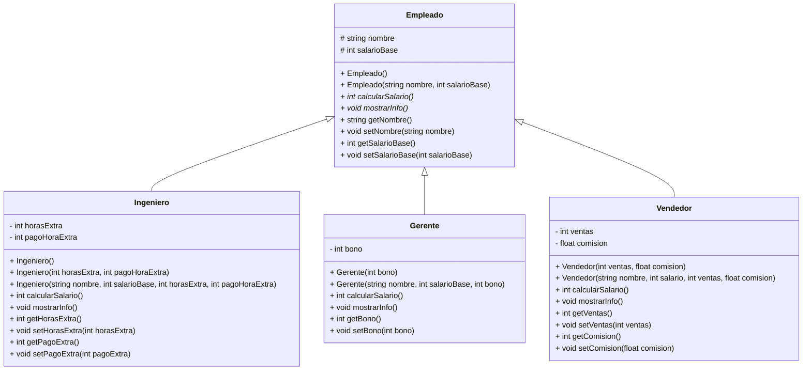
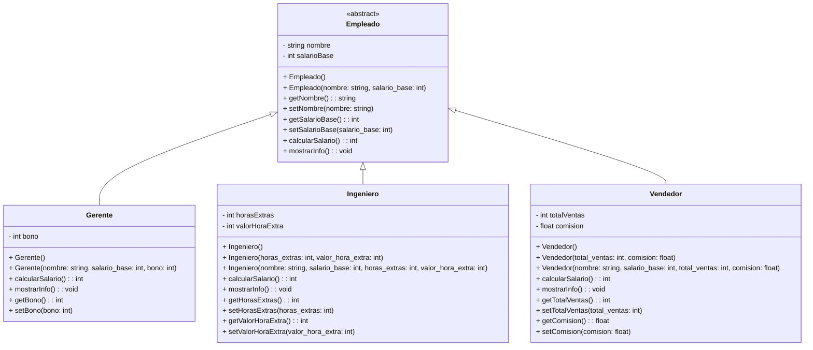

# Reto 

```mermaid
classDiagram
    class Empleado {
        # string nombre
        # int salarioBase
        + Empleado()
        + Empleado(string nombre, int salarioBase)
        + int calcularSalario()*
        + void mostrarInfo()*
        + string getNombre()
        + void setNombre(string nombre)
        + int getSalarioBase()
        + void setSalarioBase(int salarioBase)
    }

    class Gerente {
        - int bono
        + Gerente(int bono)
        + Gerente(string nombre, int salarioBase, int bono)
        + int calcularSalario()
        + void mostrarInfo()
        + int getBono()
        + void setBono(int bono)
    }

    class Ingeniero {
        - int horasExtra
        - int pagoHoraExtra
        + Ingeniero()
        + Ingeniero(int horasExtra, int pagoHoraExtra)
        + Ingeniero(string nombre, int salarioBase, int horasExtra, int pagoHoraExtra)
        + int calcularSalario()
        + void mostrarInfo()
        + int getHorasExtra()
        + void setHorasExtra(int horasExtra)
        + int getPagoExtra()
        + void setPagoExtra(int pagoExtra)
    }

    class Vendedor {
        - int ventas
        - float comision
        + Vendedor(int ventas, float comision)
        + Vendedor(string nombre, int salario, int ventas, float comision)
        + int calcularSalario()
        + void mostrarInfo()
        + int getVentas()
        + void setVentas(int ventas)
        + int getComision()
        + void setComision(float comision)
    }

    Empleado <|-- Ingeniero
    Empleado <|-- Gerente
    Empleado <|-- Vendedor
```

```mermaid
classDiagram
    class Empleado {
        <<abstract>>
        - string nombre
        - int salarioBase
        + Empleado()
        + Empleado(nombre: string, salario_base: int)
        + getNombre(): string
        + setNombre(nombre: string)
        + getSalarioBase(): int
        + setSalarioBase(salario_base: int)
        + calcularSalario(): int
        + mostrarInfo(): void
    }

    class Gerente {
        - int bono
        + Gerente()
        + Gerente(nombre: string, salario_base: int, bono: int)
        + calcularSalario(): int
        + mostrarInfo(): void
        + getBono(): int
        + setBono(bono: int)
    }

    class Ingeniero {
        - int horasExtras
        - int valorHoraExtra
        + Ingeniero()
        + Ingeniero(horas_extras: int, valor_hora_extra: int)
        + Ingeniero(nombre: string, salario_base: int, horas_extras: int, valor_hora_extra: int)
        + calcularSalario(): int
        + mostrarInfo(): void
        + getHorasExtras(): int
        + setHorasExtras(horas_extras: int)
        + getValorHoraExtra(): int
        + setValorHoraExtra(valor_hora_extra: int)
    }

    class Vendedor {
        - int totalVentas
        - float comision
        + Vendedor()
        + Vendedor(total_ventas: int, comision: float)
        + Vendedor(nombre: string, salario_base: int, total_ventas: int, comision: float)
        + calcularSalario(): int
        + mostrarInfo(): void
        + getTotalVentas(): int
        + setTotalVentas(total_ventas: int)
        + getComision(): float
        + setComision(comision: float)
    }

    Empleado <|-- Gerente
    Empleado <|-- Ingeniero
    Empleado <|-- Vendedor
```

