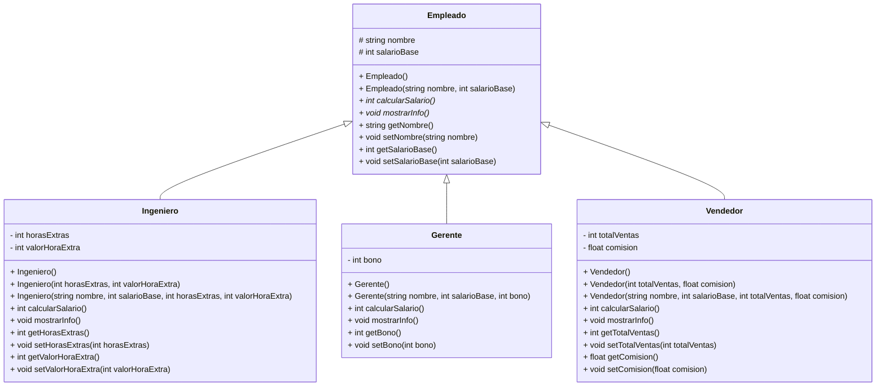

# Reto 

<div style="display: flex; justify-content: center;">


</div>

---

<p>

```text
# Salida esperda 

=== Nomina de empleados ===
[Ingeniero] Alice | Base: 1200 | Horas extra: 15 | Pago extra: 20 | Total: 1500
[Gerente] Bob | Base: 2000 | Bono: 500 | Total: 2500
[Vendedor] Charlie | Base: 1000 | Ventas: 3000 | Comision: 0.1 | Total: 1300

Total a pagar en nomina: 5300
```

</div>
