---

# 💻 300CIS017 Programación Orientada a Objetos 2025-01  

[](https://creativecommons.org/licenses/by-nc-nd/4.0/)

---


# 🌟 Tema 1: **Dominando Git**


### 🎥 Videos que inspiraron este tema:

<table style="border-collapse: collapse; width: 100%; border: none; margin: 10px 0;">
  <tr>
    <td style="text-align: center; padding: 5px; border: none;">
      <a href="https://www.youtube.com/watch?v=SRXH9AbT280">
        
      </a>
      <br>
      <span style="font-size: 12px; margin-top: 5px; display: inline-block;">Emptiness Matching<br>&nbsp;</span>
    </td>
    <td style="text-align: center; padding: 5px; border: none;">
      <a href="https://www.youtube.com/watch?v=5FrhtahQiRc">
        
      </a>
      <br>
      <span style="font-size: 12px; margin-top: 5px; display: inline-block;">Heavy is the Crowd<br>&nbsp;</span>
    </td>
    <td style="text-align: center; padding: 5px; border: none;">
      <a href="https://www.youtube.com/watch?v=26SMJH6ff0g">
        
      </a>
      <br>
      <span style="font-size: 12px; margin-top: 5px; display: inline-block;">Emptiness Matching<br>(Neuro-Sama)</span>
    </td>
  </tr>
</table>

---

### 💻 Creado por   

Profesorcito © 2025

---

### 🎶 Dedicado a 

[Chester Bennington](https://es.wikipedia.org/wiki/Chester_Bennington)  🕊️ (2017)

--- 

En este curso de **Programación Orientada a Objetos (POO)** 🔥 con **C++** 💻, exploraremos conceptos clave como **clases**, **objetos** y **herencia** 🚀. Aprenderás cómo aplicar estos principios de forma efectiva para crear proyectos potentes. Pero antes de sumergirnos en la programación, es esencial que dominemos una herramienta fundamental para gestionar el código de manera eficiente: **Git** 🧑‍💻.

### **Tabla de Contenido**

1. [**Introducción a Git**](#1-introducción-a-git)  
2. [**Principales características de Git**](#2-principales-características-de-git)  
3. [**Instalación de Git**](#3-instalación-de-git)  
4. [**Configuración inicial de Git**](#4-configuración-inicial-de-git)  
5. [**Comandos básicos**](#5-comandos-básicos-de-git) 
    - [**Comandos de Bash**](#comandos-de-bash)
      - [ls](#-ls-listar-los-archivos)
      - [clear](#-clear-borra-la-pantalla)
      - [pwd](#-pwd-conocer-tu-ubicación-en-el-sistema)
      - [mkdir](#-mkdir--crear-un-nuevo-directorio)
      - [rmdir](#-rmdir-eliminar-un-directorio)
      - [cd](#-cd--cambiar-de-directorio)
    - [**Comandos de Git**](#comandos-de-git)  
      - [git init](#-git-init-inicializando-el-repositorio)  
      - [git status](#-git-status-ver-el-estado-actual-del-repositorio)  
      - [git add](#-git-add-agregar-archivos-al-staging-area)  
      - [git commit](#-git-commit-crear-un-nuevo-commit)  
      - [git log](#-git-log-ver-el-historial-de-confirmaciones-en-el-repositorio) 
      - [git diff](#-git-diff-muestra-qué-cambios-has-hecho-en-los-archivos-desde-el-último-commit)  
      - [git branch](#-git-branch-crear-y-gestionar-ramas)  
      - [git checkout](#-git-checkout-cambiar-de-rama)  
      - [git merge](#-git-merge-fusionar-ramas)
      - [git push](#-git-push-subir-cambios-al-repositorio-remoto)
      - [git pull](#-git-pull-traer-cambios-del-repositorio-remoto)
      - [git clone](#git-clone-crear-una-copia-local-de-un-repositorio-remoto-️) 
6. [**Manejo de Conflictos en Git**](#6-manejo-de-conflictos-en-git)
    - [**Conflictos en `git merge` 🌀**](#conflictos-en-git-merge-)
    - [**Conflictos en `git push` 🚀**](#conflictos-en-git-push-)
    - [**Conflictos en `git pull` ⬇️**](#conflictos-en-git-pull-️)
7. [**Moviéndonos en el Historial de Git**](#7-moviéndonos-en-el-historial-de-git)
8. [**Prácticas**](#prácticas)  
    - [Práctica #1](#práctica-1-usando-git-init-️) Usando `git init` 🖥️
    - [Práctica #2 ](#práctica-2-usando-git-add-git-status-y-git-commit-)  Usando `git add`, `git status` y `git commit` 📝
    - [Práctica #3](#práctica-3-usando-git-log-y-git-diff-) Usando `git log` y `git diff` 🔍
    - [Práctica #4](#práctica-4-usando-git-branch-y-git-checkout-) Usando `git branch` y `git checkout` 🌿
    - [Práctica #5](#práctica-5-usando-git-merge-) Usando `git merge` 🔗 
    - [Práctica #6](#práctica-6-usando-git-push-) Usando `git push` 📤 
    - [Práctica #7](#práctica-7-usando-git-pull-️) Usando `git pull` ⬇️ 
    - [Práctica #8](#práctica-8-manejo-de-conflictos-en-git-merge-️) Manejo de Conflictos en `git merge` ⚠️
---

# 1. Introducción a Git

<p align="center">
  
</p>

En este curso aprenderás a utilizar Git, un sistema de control de versiones distribuido (Version Control System, VCS) 🌍, que te permite rastrear cambios en tu código 📝, colaborar con otros desarrolladores 🤝 y gestionar múltiples versiones de tus proyectos 🚀.

Hoy en día, el control de versiones (VCS) es una habilidad imprescindible en el desarrollo de software. Grandes empresas como **Google**, **Facebook**, **Microsoft**, **Amazon**, **Netflix** y **Apple** gestionan gigantescos proyectos con miles de desarrolladores trabajando al mismo tiempo. Git permite coordinar de manera eficiente esos esfuerzos titánicos, garantizando:

1. Control de los cambios. 🔒💻  
2. Ausencia de conflictos entre desarrolladores. 🤝🔧  
3. La posibilidad de regresar a versiones anteriores. 🔙🛠️"

Desde proyectos individuales hasta gigantescas colaboraciones en equipo, Git es una herramienta indispensable para gestionar el flujo de trabajo y garantizar el éxito de cualquier proyecto.

> [!NOTE]
> 
> Es como dicen los bomberos, "¡no hay que pisarse la manguera!" 🚒. Git permite que los desarrolladores colaboren sin interferencias, ya que las ramas independientes organizan y aíslan las tareas de cada uno, permitiendo un flujo de trabajo sin tropiezos.
> 

<details><summary>💡 Hint: ¿Te suena Git? 🤔</summary>

¡Seguro lo has escuchado un millón de veces!
  
No es casualidad que estas herramientas estén por todas partes en el mundo del desarrollo. Si ya tienes algo de experiencia, ¡perfecto! Este curso te ayudará a llevar esas habilidades al siguiente nivel. Y si aún no has tenido la oportunidad de profundizar en ellas, no te preocupes, ¡aquí aprenderás a dominarlas de manera efectiva! 😎

</details>

<details><summary>💡 Hint: Git vs GitHub 🤔</summary>

**Git** es como una **caja de herramientas** 🧰 en tu computadora. Te permite gestionar y controlar tu código, guardar versiones y retroceder cuando algo sale mal. Todo esto ocurre de manera **local** en tu máquina. 🖥️ **GitHub**, en cambio, es como un **almacén en la nube** 🌥️ donde puedes **guardar, compartir y colaborar** con otros desarrolladores. Es el lugar donde subes tu repositorio Git para trabajar en equipo más fácilmente.

**En resumen**: Git es para trabajar **localmente** en tu máquina y GitHub es para **compartir** tu trabajo en línea. 🌐

En este curso, primero aprenderemos Git para gestionar tu código de manera eficiente, y luego GitHub para compartir y colaborar con otros. 🚀

</details>

<details><summary>💡 Hint: ¿Sabías que Git fue creado por Linus Torvalds? 👨‍💻</summary>

<p align="center">
  
</p>

**Git** fue creado por **Linus Torvalds**, el brillante finlandés 🇫🇮 detrás de **Linux** 🐧. Aunque mucha gente asocia su nombre con Estados Unidos, Linus nació en Helsinki, Finlandia, en 1969. Así que, la próxima vez que uses Git, recuerda que todo comenzó en el corazón de Escandinavia ❄️.

En 1991, mientras aún estudiaba en la **Universidad de Helsinki** 🎓, Linus desarrolló Linux como un proyecto personal, con la idea de crear un sistema operativo libre, accesible y flexible. El resto, como sabemos, es historia. Linux ha revolucionado la tecnología, desde servidores hasta dispositivos móviles 📱💻.

Y aquí va un dato curioso: aunque **Linus Torvalds** y **el profesorcito** 👨‍🏫 nunca coincidieron en persona, **el profesorcito** tuvo la suerte de trabajar en una **estancia de investigación** en la **Universidad de Helsinki** 🏫, la misma universidad donde Linus desarrolló Linux. Esto ocurrió en 2002, cuando Linus ya no formaba parte de la universidad. Así que, en cierto modo, **el profesorcito** caminó por el mismo suelo donde Linus forjó el futuro del software 🚀.

><h4>📌 Nota</h4>
> 
> cada vez que uses Git, el legado de **Linus Torvalds** está detrás de cada línea de código 💻. Y aunque no fue Linus quien me enseñó, fue su visión la que, indirectamente, me inspiró a compartir este conocimiento contigo en este curso. ¡Vamos a por ello! 💪

</details>

<details><summary>💡 Hint: ¿Por qué se llama Git? 🤔</summary>

El nombre **Git** fue elegido por **Linus Torvalds** de manera algo peculiar. En inglés, "git" es una palabra que se usa como una expresión de desdén, algo así como "tonto" o "idiota" 😅. Linus, conocido por su sentido del humor y su actitud irreverente, decidió darle este nombre al sistema de control de versiones para reflejar su carácter desafiante.

En sus propias palabras, **Linus Torvalds** dijo que Git es “*un sistema de control de versiones para personas inteligentes*”, y que él mismo eligió ese nombre como una forma de reírse un poco de sí mismo y de los demás desarrolladores. ¡Una elección original y muy Linus! 😎

Por si tienes curiosidad, puedes ver la traducción de *"he is git and she is also git"* al español en [Google Translate](https://translate.google.com/?sl=en&tl=es&text=he%20is%20git%20and%20she%20is%20also%20git&op=translate).

</details> 

&nbsp;&nbsp;&nbsp;[↩️](#tabla-de-contenido)

---

# 2. Principales características de Git

Git es un sistema de control de versiones **descentralizado** 🔄 y **distribuido** 🌍: Cada desarrollador tiene una copia completa del proyecto en su máquina local, sin depender de un servidor central, lo que permite trabajar de manera independiente y sin conexión, garantizando una colaboración eficiente y sin riesgos.

Estas son las características más destacadas de Git:

1. **🔄 Descentralizado:** No depende de un servidor central.
2. **🌍 Distribuido:** Cada desarrollador tiene una copia completa del proyecto y su historial de cambios.
3. **🤝 Colaborativo:** Permite que múltiples desarrolladores trabajen en el mismo proyecto simultáneamente.  
4. **📜 Histórico:** Mantiene un registro detallado de todos los cambios realizados.  
5. **⚙️ Versátil:** Escala perfectamente desde proyectos pequeños hasta desarrollos en empresas multinacionales.
6. **⚡ Velocidad:** Git es increíblemente rápido, incluso con proyectos grandes.
7. **🔓 Open-Source & Gratuito:** Git es un software libre y de código abierto, lo que significa que es accesible para todos y continuamente mejorado por la comunidad.


&nbsp;&nbsp;&nbsp;[↩️](#tabla-de-contenido)

---

# 3. Instalación de Git 

Para instalar Git en tu sistema, sigue las instrucciones específicas para tu sistema operativo:

- **Windows**: Descarga el instalador desde [git-scm.com](https://git-scm.com/download/) y sigue las instrucciones del asistente de instalación.

- **macOS**: Puedes instalar Git utilizando [Homebrew](https://brew.sh/). Ejecuta el siguiente comando en la terminal:
  ```bash
  brew install git
  ```

- **Linux**: Utiliza el gestor de paquetes de tu distribución. Por ejemplo, en Debian o Ubuntu:
  ```bash
  sudo apt-get update
  sudo apt-get install git
  ```

### Instalación en Windows

#### **Paso 1: Descarga Git**  
1. Abre tu navegador favorito y dirígete a la página oficial de Git:  
   👉 [https://git-scm.com/downloads](https://git-scm.com/downloads)  

2. Una vez en la página, verás una imagen similar a la siguiente:  

<p align="center">
  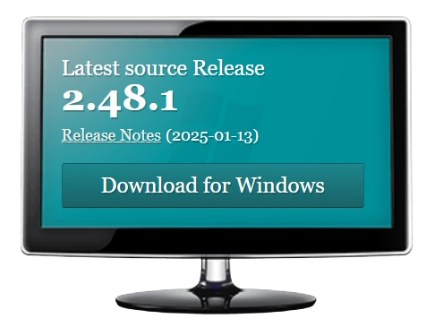
</p>

   > [!NOTE]
   >
   > Al momento de escribir este tutorial, la versión más reciente es la **2.48.1**, pero esta puede variar dependiendo de cuándo lo estés realizando.  

3. Como puedes observar, el sitio web detectará automáticamente tu sistema operativo (en este caso, Windows).  
   - Si no lo detecta correctamente, selecciona manualmente el enlace correspondiente a tu sistema operativo.  

4. Haz clic en el botón **Download for Windows**
5. A continuación, haz clic en el enlace **Click here to download** que aparece en la siguiente ventana:

<p align="center">
  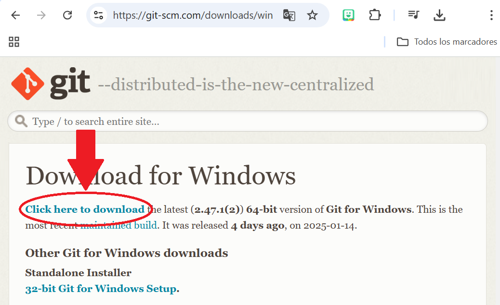
</p>

---

#### **Paso 2: Instala Git**
1. Una vez descargado el archivo, ábrelo para iniciar el instalador.
2. En la ventana de **select components** no cambien nada solo da click en next, next:

<p align="center">
  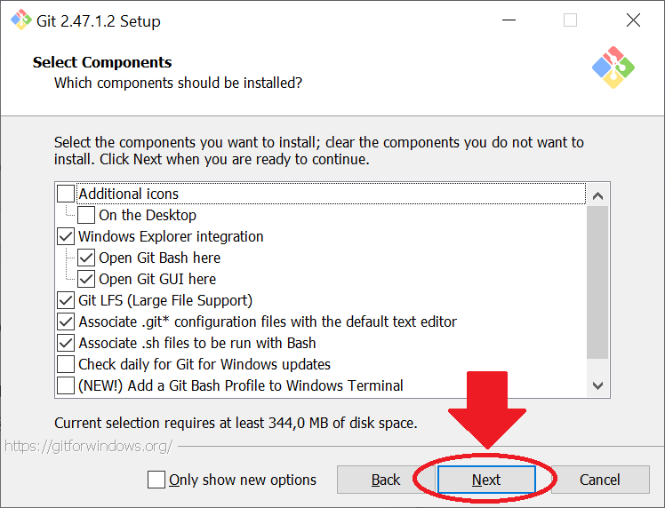
</p>

3. Sigue los pasos del asistente de instalación:  
   - Presiona **Siguiente** en cada pantalla.    

4. **¡Y listo!** Git estará instalado en tu computadora. 🎉

---

#### **Paso 3: Usa Git Bash**

- **Git Bash** es una aplicación que se instala junto con Git. Esta terminal es muy importante porque:  
  - Te permite ejecutar comandos de Git.  
  - Emula comandos de Linux, que son muy útiles para trabajar con Git.  


> [!CAUTION]
> 
> **No utilices** la terminal predeterminada de Windows (**cmd**) cuando trabajes con Git, ya que puede causarte problemas y más de un dolor de cabeza durante el curso.  Usa siempre **Git Bash**. ¡Es más confiable y hará tu vida más fácil! 😎🚀

#### ¿Cómo abrir Git Bash?  

Para comenzar a usar Git Bash, sigue estos pasos:

1. Ve al **menú de inicio** de tu sistema operativo.
2. Busca **"Git Bash"** en la barra de búsqueda.
3. Haz clic en el icono de **Git Bash** para abrirlo.

Así es como debería verse la ventana de **Git Bash** cuando lo abras:

<p align="center">
  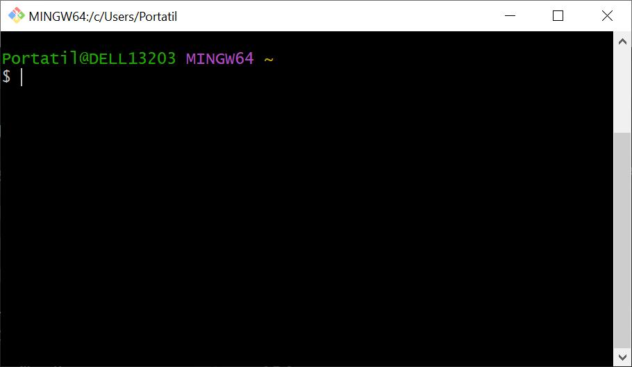
</p>

---

#### Paso 4: Verificar que Git esté instalado correctamente

Para asegurarte de que Git está instalado correctamente, ejecuta el siguiente comando:

```bash
git --version
```

Este comando mostrará la versión de Git instalada. Si ves algo como esto:

```bash
git version 2.47.1.windows.2
```

¡Genial! Git está correctamente instalado y listo para usarse. 🎉

<details> <summary>💡 Hint: ¿Qué hacer si no te aparece nada? 🤔</summary>
Si al ejecutar el comando no ves ninguna respuesta o aparece un error, es posible que Git no esté instalado correctamente o no se haya agregado al PATH de tu sistema. En ese caso, te sugiero revisar la instalación o volver a instalar Git siguiendo los pasos previos. 🔧

<br>

><h4>📢 Importante</h4>
> 
> Recuerde que **profesorcito** siempre estará allí para brindarle su apoyo y guiarle. ¡No dude en pedir ayuda, estamos en esto juntos! 🙌👨‍🏫💡

</details>

&nbsp;&nbsp;&nbsp;[↩️](#tabla-de-contenido)

---

# 4. Configuración Inicial de Git

Ahora que Git está listo para usarse, es necesario configurarlo con tu nombre y correo electrónico. Esto solo se hace una vez y es fundamental para que Git pueda asociar tus cambios a tu identidad. Vamos a configurarlo:

1. Escribe este comando en **Git Bash** para configurar tu **nombre**:
   ```bash
   git config --global user.name "Tu Nombre"
   ```

   Reemplaza `"Tu Nombre"` por tu nombre real.

2. Configura tu **correo electrónico**:
   ```bash
   git config --global user.email "tu@correo.com"
   ```

3. Opcional: Configura un **editor** para que Git utilice

En ciertas ocasiones, Git abrirá un editor de texto para que ingreses información o realices ajustes, como describir cambios o resolver conflictos. De forma predeterminada, utiliza un editor básico (como `vim`), que puede no ser el más intuitivo. Configurar un editor que conozcas y prefieras mejorará tu experiencia, haciéndola más ágil y consistente.

Por ejemplo, para usar **Notepad** en Windows, ejecuta: 

```bash
git config --global core.editor "notepad"
```
> [!NOTE]
>
> **Profesorcito** te recomienda **Notepad**, porque le encanta lo sencillo y eficiente. Es perfecto para comenzar, sin complicaciones. Sin embargo, **Linus Torvalds**, el creador de Git, seguramente preferiría **Vim**. **Vim** es un editor muy eficiente para usuarios avanzados, especialmente cuando se trabaja directamente desde la terminal. Es rápido y no necesita un entorno gráfico, lo que lo hace ideal para entornos de desarrollo más técnicos. 💻

<details>
  <summary>💡 Hint: Otros editores que puedes usar con Git</summary>

  - **Notepad** (Windows):  
    ```bash
    git config --global core.editor "notepad"
    ```

  - **Visual Studio Code**:  
    ```bash
    git config --global core.editor "code --wait"
    ```

  - **Sublime Text**:  
    ```bash
    git config --global core.editor "subl -n -w"
    ```

  - **Atom**:  
    ```bash
    git config --global core.editor "atom --wait"
    ```

  - **Vim**:  
    ```bash
    git config --global core.editor "vim"
    ```

  - **Nano**:  
    ```bash
    git config --global core.editor "nano"
    ```

  - **Emacs**:  
    ```bash
    git config --global core.editor "emacs"
    ```
> <h4>⚠️ Cuidado</h4>
> 
> Los editores Vim y Nano vienen preinstalados con Git Bash. Notepad viene preinstalado con Windows. Los demás editores (Visual Studio Code, Sublime Text, Atom, Emacs) necesitarán ser instalados por separado.

</details>

4. Configura el **manejo de finales de línea**

Los sistemas operativos manejan los finales de línea de manera diferente, lo que puede generar problemas al trabajar en un proyecto colaborativo. Aquí te explicamos cómo se gestionan los saltos de línea en distintos sistemas:

- **Windows** utiliza **CR+LF** (Carriage Return + Line Feed), es decir, dos caracteres especiales: `\r\n`.  
- **Linux/macOS** solo utiliza **LF** (Line Feed), representado por `\n`.

> [!NOTE]
> 
> - **CR** (**Carriage Return**): Es un carácter que regresa el cursor al principio de la línea. Su representación es `\r` 📝.
> - **LF** (**Line Feed**): Es un carácter que mueve el cursor hacia abajo a la siguiente línea. Su representación es `\n` ↘️.
> En **Windows**, los archivos de texto utilizan **CR+LF** (`\r\n`) como final de línea. En cambio, en **Linux** y sistemas similares (como macOS), únicamente se usa **LF** (`\n`) ⚙️.
>

#### ¿Por qué importa esto?

Imagina que dos desarrolladores están trabajando en el mismo repositorio:  
- **Desarrollador A** está usando **Windows**.
- **Desarrollador B** está usando **Linux/macOS**.

Cuando el **Desarrollador A** (en Windows) agrega un salto de línea, Git registra dos caracteres (`CR+LF`), mientras que el **Desarrollador B** (en Linux/macOS) solo usa un carácter (`LF`). Este desajuste puede causar conflictos, ya que Git detectará cambios innecesarios en los archivos debido a los diferentes finales de línea.

Para evitar estos problemas, Git incluye la configuración `core.autocrlf`, que ajusta automáticamente los finales de línea según el sistema operativo que estés usando. Git se encarga de convertir los saltos de línea de manera adecuada al momento de descargar o subir archivos, así no tendrás que preocuparte por los detalles.

- **En Windows**: Git convertirá los saltos de línea de `LF` a `CRLF` al descargar archivos y de `CRLF` a `LF` al subirlos.
- **En Linux/macOS**: Git solo convertirá `CRLF` a `LF` cuando sea necesario, pero no realizará cambios adicionales.

#### ⚙️ ¿Cómo configurar el manejo de finales de línea?

1. **Si usas Windows**: Configura Git para manejar los finales de línea de manera automática, adaptando los saltos de línea a `CRLF` al descargar archivos y convirtiéndolos a `LF` al subirlos:
   ```bash
   git config --global core.autocrlf true
   ```

2. **Si usas Linux/macOS**: Configura Git para que solo guarde los saltos de línea con `LF` y elimine los caracteres `CR` si se introducen accidentalmente:
   ```bash
   git config --global core.autocrlf input
   ```

Esta configuración asegura que los archivos se mantengan consistentes sin importar el sistema operativo que estés utilizando, evitando conflictos innecesarios relacionados con los saltos de línea. 🙌

<details><summary>🎩 Tricks: Conviértete en un mago avanzado de Git</summary>

¿Quieres dominar Git desde la terminal? 🚀 Vamos a explorar algunos comandos que te harán un experto en configuraciones.

#### 🔮 Hechizo 1: Edita las configuraciones globales de Git
Usa este comando para abrir y editar las configuraciones globales:  
```bash
git config --global -e
```
👀 **¿Qué pasa aquí?** Este comando abre el archivo `.gitconfig`, que se encuentra en la raíz de tu directorio home (`~`). Este archivo contiene configuraciones clave como tu nombre de usuario y correo electrónico que configuraste previamente. Puedes editar este archivo directamente y cualquier cambio que realices se reflejará en las configuraciones globales.

---

#### 🔮 Hechizo 2: Descubre más configuraciones de Git

Además de editar las configuraciones, también puedes visualizarlas de diferentes maneras:

- **Listar las configuraciones globales actuales:**  
  ```bash
  git config --global --list
  ```
<p></p>

- **Listar todas las configuraciones actuales:**
 
  ```bash
  git config --list
  ```

Después de ejecutar estos dos comandos, la ventana se verá de la siguiente manera:

<p align="center">
  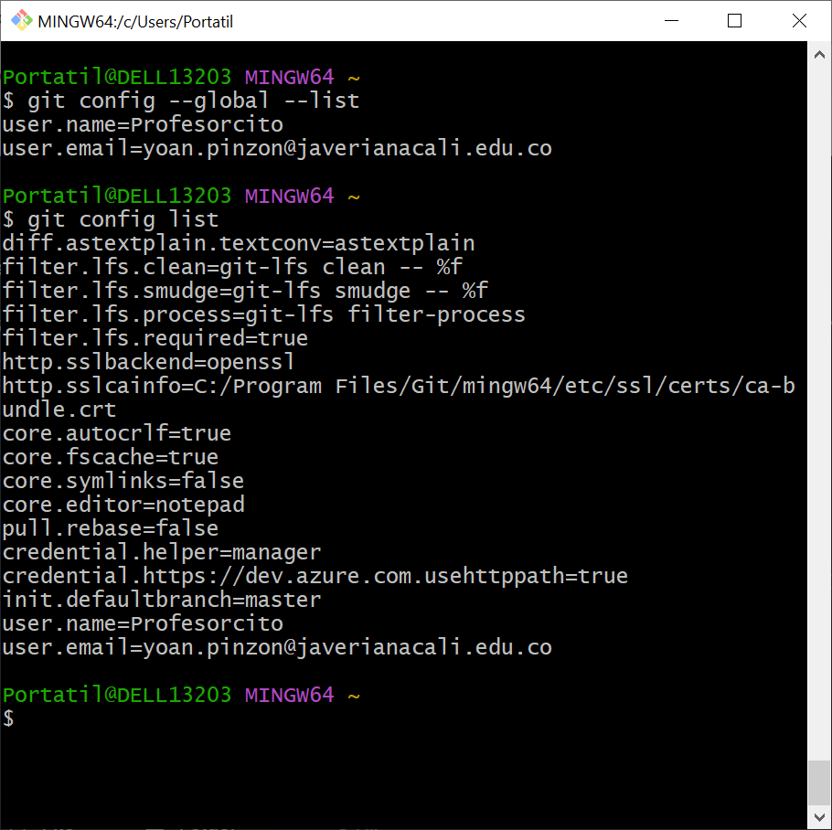
</p>

✨ **Pro Tip:** Investiga más opciones de configuración para personalizar Git a tu gusto. Por ejemplo, puedes definir alias para comandos frecuentes o establecer comportamientos específicos para tus repositorios.

> <h4>📢 Importante</h4>
> 
> La terminal es tu mejor aliada para entender y personalizar Git. Con práctica, ¡te convertirás en un verdadero maestro de las Git! 🧙‍♂️✨

</details>

> [!IMPORTANT]
> 
> En este curso, nos centraremos en aprender Git desde la `terminal` 🖥️. Esto te permitirá entender a fondo cómo funciona Git, dándote el control total sobre tus proyectos y tu flujo de trabajo 💪. Una vez que te sientas cómodo trabajando en la terminal, puedes explorar herramientas gráficas como GitHub 🌐.

<br>   

> [!WARNING]  
> 
> Es posible que, al aprender Git desde la terminal, **te enamores de ella** ❤️ y nunca más quieras salir. 😅 La terminal puede ser adictiva, ¡pero no te preocupes, es un amor que vale la pena!

&nbsp;&nbsp;&nbsp;[↩️](#tabla-de-contenido)

---

# 5. Comandos básicos de Git

## Comandos de Bash

Antes de comenzar con los comandos específicos de **Git**, es importante conocer algunos **comandos básicos de Bash** que utilizaremos para movernos por el sistema de archivos y realizar tareas esenciales. Los comandos que veremos incluyen:

1. [`ls`](#-ls-listar-los-archivos): Para listar los archivos y directorios.
2. [`clear`](#-clear-borra-la-pantalla): Para limpiar la pantalla de la terminal.
3. [`pwd`](#-pwd-conocer-tu-ubicación-en-el-sistema): Para conocer tu ubicación actual en el sistema.
4. [`mkdir`](#-mkdir--crear-un-nuevo-directorio): Para crear un nuevo directorio.
5. [`rmdir`](#-rmdir-eliminar-un-directorio): Para eliminar un directorio vacío.
6. [`cd`](#-cd--cambiar-de-directorio): Para cambiar de directorio.


&nbsp;&nbsp;&nbsp;[↩️](#tabla-de-contenido)

Con estos comandos, podrás navegar y organizar tu entorno de trabajo antes de sumergirnos en los **comandos de Git**. ¡Vamos a empezar! 💻✨

### * `ls`: Listar los archivos

El comando `ls` se utiliza para listar los archivos y directorios en el directorio actual. Al escribir este comando, verás una lista simple de los archivos y carpetas, pero **no mostrará los archivos ocultos** (aquellos que comienzan con un punto `.`). 👀

```bash
ls
```

Si quieres ver también los archivos ocultos y obtener más detalles, puedes usar `ls -al`. Este comando combina dos opciones: `-a` para mostrar **todos** los archivos, incluidos los ocultos, y `-l` para ver una lista detallada con información como permisos, propietario, tamaño y fecha de modificación. 📝

```bash
ls -al
```

Con este comando, verás no solo los archivos ocultos, sino también información adicional que te ayudará a entender mejor cómo está organizado tu directorio. 📋

### * `clear`: Borra la pantalla

El comando `clear` se utiliza para limpiar la pantalla de la terminal. Cuando lo ejecutas, elimina todo el texto y la información que se muestra en la ventana, dejándola vacía para que puedas ver mejor lo que haces a continuación. Esto es útil si tienes muchas líneas de salida o si simplemente quieres empezar de nuevo sin distracciones. 🌟

```bash
clear
```

Un atajo de teclado que hace lo mismo es <kbd>Ctrl</kbd>+<kbd>L</kbd>. Si prefieres no escribir el comando, simplemente presiona <kbd>Ctrl</kbd> y <kbd>L</kbd> al mismo tiempo y la pantalla se limpiará al instante. ¡Es aún más rápido! ⚡

### * `pwd`: Conocer tu ubicación en el sistema

El comando `pwd` (print working directory) se utiliza para mostrar la **ruta completa del directorio actual** en el que te encuentras. Esto es útil cuando no sabes en qué carpeta estás trabajando, ya que te da la ruta exacta desde la raíz del sistema. 🗺️

```bash
pwd
```

Al ejecutar este comando, verás la ruta completa de tu directorio actual, por ejemplo: 

<p align="center">
  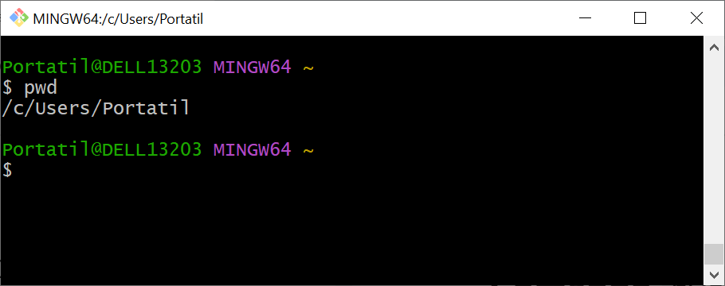
</p>

Este comando es una excelente manera de orientarte en tu estructura de carpetas.

### * `mkdir` : Crear un nuevo directorio

El comando `mkdir` (que significa **Make Directory**) se utiliza para **crear un nuevo directorio** o carpeta dentro del sistema de archivos. Este comando es esencial cuando necesitas organizar tus archivos y proyectos en diferentes carpetas.

#### Ejemplos de uso:

1. **Crear una nueva carpeta**: Supongamos que quieres crear una carpeta llamada `mirepo` en el directorio actual donde te encuentras. Para hacerlo, escribes:

  ```bash
  mkdir mirepo
  ```

  Este comando crea la carpeta `mirepo` en tu ubicación actual, ya sea en tu directorio `home`, escritorio o cualquier otra carpeta en la que estés trabajando.

2. **Crear varias carpetas al mismo tiempo**: También puedes crear varias carpetas a la vez utilizando un solo comando. Por ejemplo, para crear `proyecto1` y `proyecto2`:

  ```bash
  mkdir proyecto1 proyecto2
  ```

  Este comando crea ambas carpetas en el directorio donde te encuentras.

3. **Crear una carpeta dentro de otra**:  Si quieres crear una carpeta dentro de otra, puedes hacerlo especificando la ruta. Por ejemplo, para crear una carpeta `documentos` dentro de `mirepo`, puedes hacer:

  ```bash
  mkdir mirepo/documentos
  ```

  Si `mirepo` ya existe, `mkdir` crea `documentos` dentro de `mirepo`. **Sin embargo**, si `mirepo` no existe, se generará un **error**, ya que el comando `mkdir` no creará automáticamente directorios intermedios (sin usar la opción `-p`).

4. Forzar la creación de directorios intermedios con `-p`: Si necesitas crear una estructura de directorios completa y algunos de ellos no existen aún, puedes usar la opción `-p`. Esto permite crear directorios de manera recursiva, es decir, si el directorio principal no existe, también lo creará junto con los subdirectorios que especifiques. Por ejemplo, para crear `koko1/koko2` (y asegurarte de que ambos directorios se creen, aunque `koko1` no exista):

  ```bash
  mkdir -p koko1/koko2
  ```

  Este comando crea `koko1` y dentro de él, `koko2`, sin importar si `koko1` ya existe o no.

### * `rmdir`: Eliminar un directorio

El comando `rmdir` se utiliza para **eliminar un directorio vacío** en el sistema de archivos. Es útil cuando ya no necesitas una carpeta vacía y deseas liberar espacio.

#### Ejemplos de uso:

1. **Eliminar un directorio vacío**: Para eliminar una carpeta llamada `mirepo` (que debe estar vacía), simplemente ejecutas:

   ```bash
   rmdir mirepo
   ```

   Este comando elimina `mirepo` solo si está vacío. Si contiene archivos o subdirectorios, recibirás un error como `rmdir: failed to remove 'mirepo/': Directory not empty
`
2. Eliminar directorios no vacíos con `rm -r`: 

**¡Con mucha precaución!** Si deseas eliminar un directorio que **no esté vacío**, debes usar `rm -r`. Este comando eliminará el directorio y **todo** su contenido (archivos y subdirectorios).

Por ejemplo, para eliminar `koko1` y todo lo que contiene:

```bash
rm -r koko1
```
> [!CAUTION]
>
> Este comando elimina todo el contenido de la carpeta `koko1` de manera permanente, ¡sin posibilidad de recuperación fácilmente! Asegúrate de que realmente quieres eliminar todo antes de usarlo.

### * `cd` : Cambiar de directorio

El comando `cd` (que significa **Change Directory**) se utiliza para **navegar entre directorios** dentro de tu sistema de archivos. Te permite moverte a diferentes carpetas para poder trabajar en ellas.

#### Ejemplo paso a paso: Crear y navegar con `cd`

1. **Ubicarte en el directorio correcto**:

   Supongamos que estás en tu directorio `home` (es decir, en la raíz de tu usuario) y quieres **moverte a tu escritorio** donde vas a crear una nueva carpeta.

   Para hacerlo, utilizas el comando `cd` seguido de la ruta al directorio:

   ```bash
   cd ~
   cd Desktop
   ```

   Este comando te llevará al directorio `home` (`~`) y luego al `Desktop`, que está dentro de tu directorio `home` (`~`).

2. Crear una carpeta en el directorio `Desktop`:

   Ahora, en el directorio `Desktop`, vas a crear una carpeta llamada `mirepo`. Para esto, usa el comando `mkdir`:

   ```bash
   mkdir mirepo
   ```

   Esto creará la carpeta `mirepo` dentro de `Desktop`.

3. **Moverse dentro de la nueva carpeta**:

   Ahora, para entrar en la carpeta `mirepo` que acabas de crear, usas el comando `cd` nuevamente:

   ```bash
   cd mirepo
   ```

   Este comando te llevará a la carpeta `mirepo` dentro de `Desktop`, y podrás empezar a trabajar en ella.

4. Volver al directorio anterior con `cd ..`

Si en algún momento quieres **volver al directorio anterior**, simplemente escribe:

  ```bash
  cd ..
  ```

  El comando `cd ..` te lleva al **directorio padre** del directorio en el que estás. En este caso, si estás dentro de `mirepo`, al usar `cd ..`, regresarías al directorio `Desktop`.

A continuación, puedes ver un ejemplo visual de cómo se utilizan estos comandos:

<p align="center">
  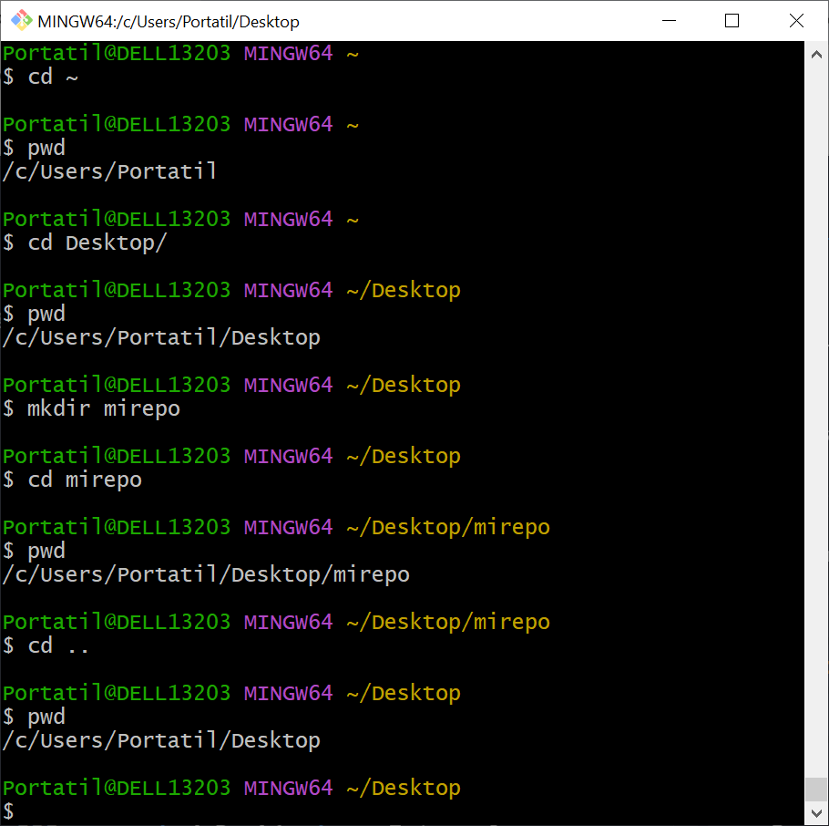
</p>

Es importante aclarar que los comandos mencionados hasta ahora son **comandos de Bash**, no de Git. 🖥️ Estos comandos permiten interactuar con el sistema de archivos, como listar archivos 📂, cambiar de directorio 📁, crear carpetas 🗂️ y más. Además, a medida que se avanza, es posible aprender otros comandos de Bash que serán útiles para complementar el trabajo con Git. 💡

&nbsp;&nbsp;&nbsp;[↩️](#tabla-de-contenido)

---

## Comandos de Git

Con esta base sólida sobre cómo navegar en la terminal, ¡ha llegado el momento de explorar los **comandos de Git**! 🚀👨‍💻 Estos serán herramientas clave para gestionar proyectos y colaborar de forma eficiente. Algunos de los **comandos de Git** que utilizaremos son:  

1. [`git init`](#-git-init-inicializando-el-repositorio): Inicializando tu repositorio.  
2. [`git status`](#-git-status-ver-el-estado-actual-del-repositorio): Ver el estado actual del repositorio.  
3. [`git add`](#-git-add-agregar-archivos-al-staging-area): Agregar archivos al staging area.  
4. [`git commit`](#-git-commit-crear-un-nuevo-commit): Crear un nuevo commit.  
5. [`git log`](#-git-log-ver-el-historial-de-confirmaciones-en-el-repositorio): Ver el historial de confirmaciones en el repositorio.  
6. [`git diff`](#-git-diff-muestra-qu%C3%A9-cambios-has-hecho-en-los-archivos-desde-el-%C3%BAltimo-commit): Muestra qué cambios has hecho en los archivos desde el último commit.  
7. [`git branch`](#-git-branch-crear-y-gestionar-ramas): Crear y gestionar ramas.  
8. [`git checkout`](#-git-checkout-cambiar-de-rama): Cambiar de rama.  
9. [`git merge`](#-git-merge-fusionar-ramas): Fusionar ramas.

&nbsp;&nbsp;&nbsp;[↩️](#tabla-de-contenido)

Con estos comandos, se puede empezar a trabajar con Git y organizar proyectos de manera eficiente. ¡Manos a la obra! 💪"  

---

### * `git init`: Inicializando el repositorio

Cuando se trabaja con **Git**, lo primero que se necesita hacer es **crear un repositorio** para el proyecto. Esto se logra con el comando `git init`. Este comando convierte el directorio actual en un repositorio de Git, permitiendo **rastrear los cambios** en los archivos y mantener un **control de versiones** en el proyecto.

<details>
  <summary>💡 Hint: ¿Qué es un repositorio? 🤔</summary>
   
Un **repositorio** (o **repo**, como se le llama de forma abreviada) es simplemente un lugar donde Git guarda toda la información sobre el proyecto. Dentro del repositorio, Git almacena todos los archivos que forman el proyecto, un historial completo de todos los cambios realizados y la información sobre las versiones de esos archivos. Gracias a esta estructura, es posible **revertir a versiones anteriores** si es necesario o hacer un seguimiento de cómo ha evolucionado el proyecto a lo largo del tiempo.
</details>

Al ejecutar `git init`, se crea un repositorio vacío en el directorio actual. Esto permite comenzar a agregar archivos y registrar todos los cambios que se realicen. Este repositorio proporciona la **infraestructura necesaria** para gestionar el proyecto con Git. En la siguiente práctica [Práctica #1](#práctica-1-usando-git-init) se explicará en detalle cómo funciona.

---


## Práctica #1: Usando `git init` 🖥️

En esta práctica, vamos a crear un **repositorio de Git** desde cero. El objetivo es aprender a inicializar un repositorio en tu computadora, organizando el proyecto de una manera eficiente desde el principio. Vamos a crear una carpeta (o directorio) llamada `mirepo` en el escritorio, y dentro de esa carpeta, inicializaremos nuestro repositorio Git con el comando `git init`. De esta manera, Git comenzará a rastrear y gestionar los archivos y cambios dentro de esa carpeta. 📂

Específicamente, vamos a seguir estos pasos:

1. Comenzaremos en el directorio **home** de tu sistema.
2. Desde allí, navegaremos al directorio **Desktop** (escritorio).
3. En el escritorio, crearemos una carpeta llamada `mirepo` para alojar nuestro repositorio.
4. Dentro de esa carpeta, inicializaremos un repositorio Git con el comando `git init`.
5. Finalmente, verificaremos que Git haya creado correctamente el repositorio mostrando la carpeta oculta `.git`.

Una vez completados estos pasos, tendrás tu repositorio listo para empezar a trabajar en tu proyecto. 🚀

---

Ahora sí, empecemos con los pasos detallados:

---

1. **Comienza en tu directorio home**  
   Abre tu terminal y empieza desde tu directorio **home** con el siguiente comando:

   ```bash
   cd ~
   ```

   Este comando te llevará a tu directorio home, el lugar donde se encuentran todas tus carpetas de usuario. 🏡

2. **Accede al directorio Desktop**  
   Ahora, navega a tu directorio **Desktop** (escritorio) donde vamos a crear la carpeta para nuestro repositorio:

   ```bash
   cd Desktop
   ```

   Este comando te moverá a la carpeta de tu escritorio, donde normalmente se encuentran tus archivos y carpetas principales. 💻

3. **Crea una carpeta para tu proyecto**  
   Vamos a crear una nueva carpeta llamada `mirepo` para alojar nuestro repositorio. Este será el directorio donde gestionaremos todos los archivos relacionados con nuestro proyecto. Para esto, utilizamos el comando `mkdir`:

   ```bash
   mkdir mirepo
   ```

   Este comando crea una carpeta llamada `mirepo` dentro del escritorio. 🗂️

4. **Accede a la carpeta recién creada**  
   Ahora que ya tienes la carpeta `mirepo`, entra dentro de ella para inicializar el repositorio de Git:

   ```bash
   cd mirepo
   ```

   ¡Ya estás dentro de la carpeta donde se creará el repositorio! 🔑

5. Inicializa el repositorio con `git init`  
   Ahora, vamos a inicializar el repositorio en la carpeta `mirepo` con el comando `git init`. Esto convierte la carpeta en un repositorio Git, es decir, en un lugar donde Git empezará a rastrear todos los cambios de archivos y versiones:

   ```bash
   git init
   ```

   La salida que verás será algo como:

   ```bash
   Initialized empty Git repository in C:/Users/Portatil/Desktop/mirep
   o/.git/
   ```

   Esto significa que Git ha creado una nueva carpeta oculta llamada `.git` dentro de `mirepo`. Esta carpeta es donde Git guarda toda la información sobre el historial y los cambios de tu proyecto. 🎉

7. **Verifica que el repositorio se ha creado correctamente**  
   Para asegurarte de que el repositorio se ha creado correctamente, usa el comando `ls -a` para ver todos los archivos, incluidos los ocultos. Deberías ver la carpeta `.git`, que es clave para el funcionamiento de Git:

   ```bash
   ls -a
   ```

   La salida será algo así:

   ```bash
   .  ..  .git
   ```

   La carpeta `.git` es donde Git almacena toda la información sobre el historial de tu repositorio. 

   > [!CAUTION]
   >
   > La carpeta `.git` contiene toda la información crucial sobre el historial de tu repositorio, como los commits, las ramas y las configuraciones. ¡No la elimines ni la modifiques manualmente! Esto podría romper tu repositorio y hacer que pierdas todo el historial de cambios."  

#### Resumen de la práctica

Con el comando `git init`, has creado un repositorio vacío en tu carpeta `mirepo` dentro del escritorio. A partir de aquí, puedes empezar a agregar archivos y registrar tus cambios con Git. ¡Todo está listo para que empieces a trabajar con tu proyecto y a gestionar tu código de manera eficiente! 🚀📂

A continuación, te muestro un ejemplo visual de cómo se verá tu Git Bash después de haber ejecutado todos estos comandos:

<p align="center">
  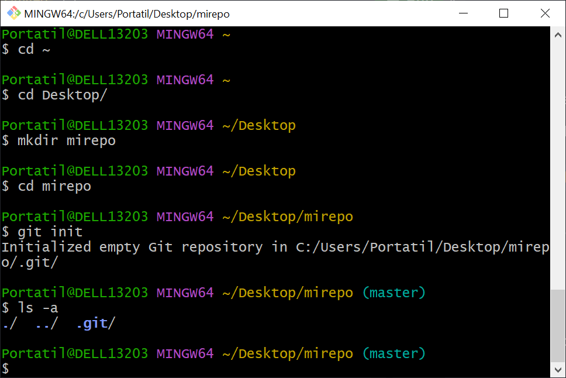
</p>

&nbsp;&nbsp;&nbsp;[↩️](#tabla-de-contenido)

---

### * `git status`: Ver el estado actual del repositorio  

El comando `git status` permite ver el estado del repositorio en cualquier momento. Te muestra información útil, como qué archivos han sido modificados, cuáles están listos para ser confirmados (en el área de preparación), y cuáles no están siendo rastreados por **Git**. Es una excelente forma de asegurarse de que sabes en qué estado se encuentra el repositorio antes de proceder con más acciones.

> [!NOTE]  
> 
> En la **[Práctica #2](#práctica-2-usando-git-add-git-status-y-git-commit)**, se aplicará este comando para verificar el estado del repositorio y decidir qué pasos seguir.

---

### * `git add`: Agregar archivos al staging area  

El comando `git add` permite preparar los archivos para ser confirmados en el historial de **Git**. Al agregar archivos al **staging area**, seleccionas específicamente qué cambios deseas incluir en el próximo **commit**. Se pueden añadir archivos individualmente o todos los archivos modificados con un solo comando.

> [!NOTE]  
> 
> En la **[Práctica #2](#práctica-2-usando-git-add-git-status-y-git-commit)**, este comando se utilizará para agregar los archivos modificados al staging area, listos para ser confirmados.

---

### * `git commit`: Crear un nuevo commit  

El comando `git commit` es utilizado para guardar los cambios en el repositorio de manera permanente. Cada vez que se hace un commit, se crea un punto de referencia en el historial del proyecto. Es recomendable acompañar cada commit con un mensaje descriptivo que explique los cambios realizados, ya que esto facilita el seguimiento de la evolución del proyecto.

> [!NOTE]  
> 
> En la **[Práctica #2](#práctica-2-usando-git-add-git-status-y-git-commit)**, se aplicará este comando para registrar los cambios realizados y mantener un historial claro de las modificaciones del proyecto.

---

<p align="center">
  
</p>

## Práctica #2: Usando `git add`, `git status` y `git commit` 📝

> [!WARNING]  
> Esta práctica es una continuación de la [Práctica #1](#práctica-1-usando-git-init-️) 🖥️ donde configuramos nuestro repositorio y aprendimos a inicializar Git con `git init`. Asegúrate de haber completado la primera práctica antes de comenzar esta, ya que usaremos el repositorio creado anteriormente y continuaremos trabajando sobre los mismos archivos.

---


En esta práctica, vamos a continuar con el proyecto que iniciamos en la [práctica anterior](#práctica-1-usando-git-init-️), donde ya creamos un directorio `mirepo` y lo inicializamos como un repositorio Git utilizando el comando `git init`. Ahora, aprenderemos cómo agregar archivos al repositorio usando el comando `git add` y entenderemos el concepto de **stage** en Git.

#### Lo que vamos a hacer en esta práctica:

1. **Crear dos archivos vacíos** dentro del directorio `mirepo` llamado `frutas.txt` y `ciudades.txt`.
2. **Verificar el estado** de estos archivos con el comando `git status`, para ver que Git los reconoce como archivos no rastreados.
3. **Agregar estos archivos al stage** usando el comando `git add`. El **stage** es un área intermedia donde Git guarda los cambios antes de confirmarlos con un **commit**.
4. **Hacer un commit** con un mensaje que describa el cambio realizado.
5. **Verificar nuevamente el estado** con `git status` para asegurarnos de que los cambios han sido confirmados.

---

#### Paso a Paso

#### Paso 1: Navegar hasta el directorio `mirepo`

Primero, asegurémonos de que estamos ubicados en el directorio `mirepo`, donde ya inicializamos el repositorio con `git init`. Si no estás allí, sigue estos pasos:

1. **Ir a tu directorio home** con:

   ```bash
   cd ~
   ```

   Este comando te llevará a tu directorio **home**, donde están tus carpetas de usuario. 🏡

2. **Acceder al directorio Desktop**:

   ```bash
   cd Desktop
   ```

   Este comando te lleva al escritorio, donde tenemos la carpeta `mirepo`. 💻

3. **Entrar en el directorio mirepo**:

   ```bash
   cd mirepo
   ```

   Ahora estás dentro de la carpeta `mirepo`, donde ya inicializamos el repositorio con `git init`. ¡Listo para seguir con la práctica! 🔑

<details><summary>💡 Hint: Accede al directorio en un solo paso</summary>
   
Puedes acceder a tu directorio `mirepo` con un solo comando, simplificando todo el proceso de ir al directorio **home**, acceder a **Desktop** y entrar a la carpeta **mirepo**:

```bash
cd ~/Desktop/mirepo
```
</details>
   
#### Paso 2: Crear los archivos `frutas.txt` y `ciudades.txt`

Ahora vamos a crear dos archivos vacíos llamados `frutas.txt` y `ciudades.txt` con el comando `touch`:

```bash
touch frutas.txt ciudades.txt
```

Esto crea los archivos vacíos en el directorio `mirepo`.

#### Paso 3: Verificar los archivos creados con `ls`

Después de ejecutar el comando anterior, verifica que los archivos se hayan creado correctamente con `ls`:

```bash
ls
```

La salida debería ser algo como esto:

```bash
frutas.txt  ciudades.txt
```

#### Paso 4: Verificar el estado con `git status`

Ahora vamos a ver cómo Git detecta esos archivos con el comando `git status`:

```bash
git status
```

La salida será algo como esto:

```bash
On branch master
No commits yet

Untracked files:
  (use "git add <file>..." to include in what will be committed)
  frutas.txt
  ciudades.txt

nothing added to commit but untracked files present (use "git add" to track)
```

Git nos indica que los archivos `frutas.txt` y `ciudades.txt` son **no rastreados** (untracked). Esto significa que Git los ha detectado, pero aún no los está siguiendo para llevar un control de sus cambios. Necesitamos **agregarlos al stage** para que Git comience a hacer un seguimiento de ellos.

#### Paso 5: Usar `git add` para colocar los archivos en el Stage

El siguiente paso es **agregar los archivos al stage**. Para agregar los archivos `frutas.txt` y `ciudades.txt` al stage, usamos el siguiente comando `git add`:

```bash
git add frutas.txt ciudades.txt
```

<details>
  <summary>💡 Hint: ¿Qué es el Stage en Git?</summary>

   El **stage** es una especie de área intermedia donde colocamos los archivos que queremos que Git registre en la siguiente versión del proyecto. Es un lugar donde podemos preparar los archivos antes de confirmarlos (hacer un commit). Cuando agregamos un archivo con `git add`, lo estamos moviendo al stage, lo que le indica a Git que queremos que se tenga en cuenta para la siguiente confirmación. 📋

Así que, el stage nos da control sobre qué archivos formarán parte del commit que vamos a hacer, permitiéndonos decidir qué cambios incluir en nuestra próxima versión del proyecto.

Para ver qué archivos están en el stage, puedes usar el comando `git status`. Esto te mostrará los archivos que están listos para ser confirmados (commiteados) y te dará una vista general de los cambios en tu repositorio. 🧐

</details>

<details>
  <summary>💡 Hint: ¿Qué significa hacer un Commit?</summary>
   
Un **commit** es el proceso de confirmar los cambios que hemos agregado al stage, creando una versión fija de esos archivos. Cuando haces un commit con `git commit`, Git guarda los cambios en el historial del repositorio, lo que te permite regresar a esa versión en el futuro si es necesario. 📅

  Es como tomar una "foto" de tu proyecto en ese momento. A partir de ese momento, cualquier cambio posterior no afectará ese commit, y podrás regresar a esa versión cuando lo necesites. Además, cada commit tiene un mensaje que describe qué cambios se hicieron, ayudándote a llevar un historial claro de la evolución de tu proyecto.
</details>


#### Paso 6: Verificar el estado con `git status` después de agregar los archivos

Ahora, vamos a ejecutar `git status` nuevamente para verificar que los archivos `frutas.txt` y `ciudades.txt` han sido agregados al stage. Deberíamos ver algo así:

```bash
git status
```

La salida será:

```bash
On branch master
No commits yet

Changes to be committed:
  (use "git rm --cached <file>..." to unstage)
  new file:   frutas.txt
  new file:   ciudades.txt
```

Esto significa que los archivos están ahora en el **stage**, listos para ser confirmados en el próximo commit. 🎉

#### Paso 7: Realizar un commit con un mensaje

Ahora que los archivos están en el stage, vamos a **confirmarlos** con el comando `git commit`. Esto guarda los archivos en el historial de Git. Vamos a agregar un mensaje al commit para describir qué cambios estamos guardando:

```bash
git commit -m "Archivos frutas.txt y ciudades.txt vacíos"
```

Este comando confirma los archivos en el repositorio con el mensaje **"Archivos frutas.txt y ciudades.txt vacíos"**. Git genera una salida similar a la siguiente:

```
[master (root-commit) 01ea681] Archivos frutas.txt y ciudades.txt vacíos
 2 files changed, 0 insertions(+), 0 deletions(-)
 create mode 100644 ciudades.txt
 create mode 100644 frutas.txt
```

<details>
<summary>🔒 ¿Qué significa 100644? 🧐</summary>

El `100644` es un código que Git utiliza para describir los **permisos** de un archivo en su sistema de control de versiones. Aquí está lo que significa:

- **100**: Especifica que el archivo es **regular**, no un directorio ni un enlace simbólico.
- **644**: Indica los permisos de acceso del archivo, que en formato octal se desglosan así:
  - **6** (propietario): Permisos de **lectura y escritura** (`rw-`).
  - **4** (grupo): Permisos de **solo lectura** (`r--`).
  - **4** (otros): Permisos de **solo lectura** (`r--`).

En resumen, `100644` muestra que el archivo tiene permisos de lectura y escritura para el **propietario** y solo **lectura** para el **grupo** y **otros usuarios**. 📜🔐

Este modo es común para archivos regulares y es el estándar para los archivos que no son ejecutables ni directorios. ¡Git se encarga de todo para que no tengas que preocuparte! 😌💻

</details> 
Esta salida nos muestra lo siguiente:

1. **[master (root-commit) 01ea681]**: La rama actual es `master`, y `01ea681` es el identificador único (hash) del commit que acabas de hacer.
2. **Archivos frutas.txt y ciudades.txt vacíos**: El mensaje de commit, que debe describir los cambios realizados, en este caso indica que los archivos `frutas.txt` y `ciudades.txt` fueron creados y están vacíos.
3. **2 files changed**: Se modificaron dos archivos.
4. **0 insertions, 0 deletions**: No se agregaron ni eliminaron líneas, ya que los archivos estaban vacíos.
5. **create mode 100644**: Se crearon los archivos `ciudades.txt` y `frutas.txt`, con permisos de archivo estándar (100644).

<details>
  <summary>😅 Tip: ¿Te diste cuenta de que el mensaje del commit no es el que querías? No te preocupes, es posible corregirlo fácilmente</summary>

  Si te diste cuenta de que cometiste un error en el mensaje de tu último commit, no te preocupes, ¡tienes una segunda oportunidad! Puedes cambiar el mensaje del commit más reciente con el comando `git commit --amend`. Así, podrás corregirlo sin necesidad de crear un nuevo commit.

  ### Comando básico:
  ```bash
  git commit --amend
  ```
  Este comando abrirá tu editor de texto predeterminado y te permitirá editar el mensaje del commit.

  ### Comando con mensaje directo:
  Si prefieres no abrir el editor, puedes modificar el mensaje directamente desde la terminal con:
  ```bash
  git commit --amend -m "Nuevo mensaje para el commit"
  ```
</details>

---

Cada comando en Git construye la historia de tu proyecto. Acabas de hacer tu primer commit (**root-commit**), que marca el inicio de todo. Para facilitarte la comprensión, aquí tienes un grafo que te ayudará a entender mejor lo que acabas de hacer:

<p align="center">
  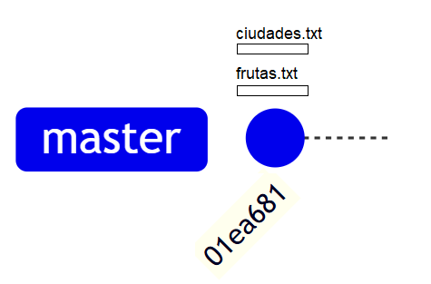
</p>

#### Paso 8: Verificar el estado con `git status` después del commit

Finalmente, vamos a ejecutar `git status` una vez más. Veremos que ya no hay cambios pendientes:

```bash
git status
```

La salida será:

```bash
On branch master
nothing to commit, working tree clean
```

Esto significa que todos los cambios han sido confirmados y ahora no hay nada pendiente en el directorio de trabajo. 🧹

---

#### Resumen de lo aprendido

1. `git add`: Este comando coloca los archivos en el **stage**, lo que significa que Git los prepara para ser confirmados en el siguiente commit.
2. **El Stage**: Es una área intermedia en Git donde colocamos los cambios antes de ser confirmados. Los archivos deben estar en el stage antes de ser confirmados (committed).
3. `git status`: Este comando nos ayuda a ver qué archivos están en el stage y qué archivos necesitan ser agregados.

Para que tengas una mejor referencia, aquí te dejo una imagen que muestra cómo debería verse tu Git Bash después de haber ejecutado todos estos comandos:

<p align="center">
  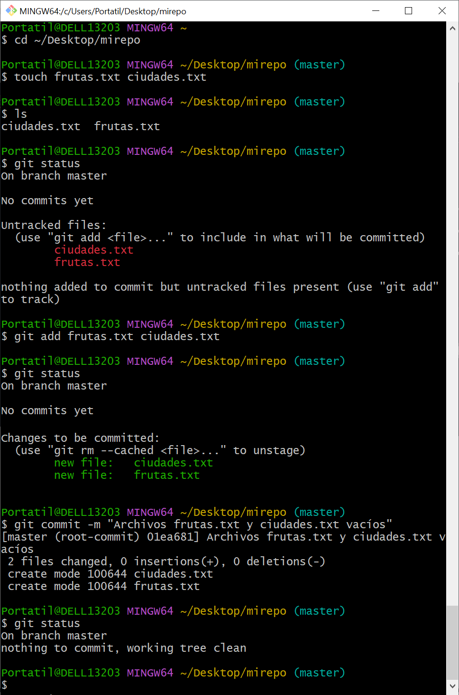
</p>

&nbsp;&nbsp;&nbsp;[↩️](#tabla-de-contenido)

---

### * `git log`: Ver el historial de confirmaciones en el repositorio

El comando `git log` permite ver el historial de confirmaciones (commits) de tu repositorio. Te muestra una lista detallada de todos los **commits** realizados hasta el momento, junto con información relevante como el autor, la fecha y el mensaje asociado a cada commit. Este comando es útil para revisar el historial de tu proyecto y entender qué cambios se han hecho a lo largo del tiempo.

> [!NOTE]  
> 
> En la **[Práctica #3](#práctica-3-usando-git-log-y-git-diff-)**, este comando se utilizará para explorar el historial de confirmaciones y entender cómo ha evolucionado tu proyecto.

&nbsp;&nbsp;&nbsp;[↩️](#tabla-de-contenido)

---

### * `git diff`: Muestra qué cambios has hecho en los archivos desde el último commit

El comando `git diff` permite ver las diferencias entre tu versión actual de los archivos y la última confirmación. Este comando es útil para revisar los cambios que has realizado antes de decidir si deseas agregarlos al área de preparación o hacer un commit. Muestra una comparación línea por línea de los archivos modificados.

> [!NOTE]  
> 
> En la **[Práctica #3](#práctica-3-usando-git-log-y-git-diff-)**, se utilizará este comando para ver las diferencias entre los cambios realizados y el último commit, ayudando a decidir qué archivos agregar al staging area.

---

<p align="center">
  
</p>

## Práctica #3: Usando `git log` y `git diff` 🔍

> [!WARNING]  
> Esta práctica se basa en lo aprendido en las [Práctica #1](#práctica-1-usando-git-init-️) 🖥️ y [Práctica #2](#práctica-2-usando-git-add-git-status-y-git-commit-) 📝, por lo que es importante haber completado esas prácticas antes de continuar. En esta sección, utilizaremos el repositorio y los archivos que ya creamos y modificamos en los pasos anteriores, para explorar cómo revisar el historial de cambios y comparar diferencias en los archivos.

---

En esta práctica aprenderás a usar `git log` para explorar el historial de commits y `git diff` para comparar los cambios en tus archivos antes y después de agregarlos al **stage**. Comenzaremos navegando al repositorio, editando los archivos `frutas.txt` y `ciudades.txt`, y utilizando `git diff` para ver las diferencias. Luego, agregaremos los archivos al **stage** para realizar un nuevo **commit**, lo que nos permitirá explorar el historial de commits con `git log`.

#### **1. Navegar al repositorio**  
Abre la terminal y navega al repositorio en tu escritorio:  
```bash
cd ~/Desktop/mirepo
```

#### **2. Editar los archivos**  
Agrega dos frutas al archivo `frutas.txt` y dos ciudades al archivo `ciudades.txt`:  
```bash
echo "Manzana" >> frutas.txt  
echo "Banana" >> frutas.txt  
echo "Nueva York" >> ciudades.txt  
echo "Tokio" >> ciudades.txt  
```

#### **3. Ver las diferencias antes de hacer el commit**  
Antes de agregar los archivos al **stage**, puedes usar `git diff` para ver qué cambios has realizado en los archivos desde el último commit. Esto es útil para revisar qué modificaciones has hecho.  
```bash
git diff
```

**Salida esperada:**  
```diff
diff --git a/ciudades.txt b/ciudades.txt
index e69de29..9d53851 100644
--- a/ciudades.txt
+++ b/ciudades.txt
@@ -0,0 +1,2 @@
+Nuevo York
+Tokio
diff --git a/frutas.txt b/frutas.txt
index e69de29..d342878 100644
--- a/frutas.txt
+++ b/frutas.txt
@@ -0,0 +1,2 @@
+Manzana
+Banana
```

#### **4. Agregar los cambios al stage**  
Ahora, vamos a agregar los archivos al **stage** con `git add`. Esto prepara los cambios para ser confirmados en el siguiente commit:  
```bash
git add frutas.txt ciudades.txt
```

> [!TIP]
>
> El comando `git add .` agrega todos los archivos modificados en tu directorio de trabajo (excepto los que están ignorados por `.gitignore`) al área de preparación (staging area). Es una forma rápida de incluir todos los cambios sin tener que agregar archivo por archivo.
>
>  ```bash
>  git add .
>  ```

> [!WARNING]
>
> Aunque es una opción muy común, **usar `git add .` puede no ser la mejor opción**, ya que podría agregar archivos no deseados al commit. **Es preferible ser más selectivo** al agregar archivos al área de preparación para asegurarte de que solo los cambios relevantes sean incluidos.

> [!TIP]
> 
> En lugar de `git add .`, usa `git add -u` si solo deseas agregar los archivos modificados y eliminados que Git ya rastrea, sin incluir archivos nuevos no rastreados. Este comando es útil para asegurarte de que solo los cambios relevantes (sin nuevos archivos) sean parte del commit, evitando así cometer errores. 

> <h4>⚡ Hack</h4>  
>
>  Aquí tienes un truco que lo hace todo **en un solo comando**. Lo mejor de todo: nadie tiene que saberlo. 🤫
> 
> ```bash
> git commit -am "subiendo todo"
> ```
> Este comando es como si hicieras primero un `git add -u` para agregar todos los archivos modificados que ya están siendo rastreados por Git y luego un `git commit -m "subiendo todo"` para hacer el commit con el mensaje que hayas especificado. Todo se hace de una vez.


#### **5. Verificar el estado de los cambios**  
Usa `git status` para confirmar que los archivos están en el **stage** y listos para ser confirmados:  
```bash
git status
```

**Salida esperada:**  
```plaintext
On branch master
Changes to be committed:
  (use "git restore --staged <file>..." to unstage)
        modified:   frutas.txt
        modified:   ciudades.txt
```

#### **6. Ver que `git diff` no muestra nada después de agregar al stage**  
Si ahora ejecutas `git diff`, notarás que **no muestra nada**. Esto es porque los cambios ya están en el **stage**, listos para el commit. `git diff` solo muestra las diferencias entre el directorio de trabajo y el último commit.  
```bash
git diff
```

**Salida esperada (vacía):**  
```plaintext
(no output)
```

#### **7. Ver las diferencias después de agregar al stage (opcional)**  
Si quieres ver las diferencias entre los archivos en el **stage** y el último commit, usa `git diff --staged`. Esto te muestra los cambios listos para ser confirmados.  
```bash
git diff --staged
```

**Salida esperada:**  
```diff
diff --git a/ciudades.txt b/ciudades.txt
index e69de29..9d53851 100644
--- a/ciudades.txt
+++ b/ciudades.txt
@@ -0,0 +1,2 @@
+Nuevo York
+Tokio
diff --git a/frutas.txt b/frutas.txt
index e69de29..d342878 100644
--- a/frutas.txt
+++ b/frutas.txt
@@ -0,0 +1,2 @@
+Manzana
+Banana
```

#### **8. Confirmar los cambios**  
Ahora, realiza el commit con los cambios que hemos preparado en el **stage**. Añade un mensaje explicando lo que hicimos:  
```bash
git commit -m "Agregué dos frutas y dos ciudades a los archivos frutas.txt y ciudades.txt respectivamente"
```

**Salida esperada:**  
```plaintext
[master f09e9ad] Agregué dos frutas y dos ciudades a los archivos
 frutas.txt y ciudades.txt respectivamente
 2 files changed, 4 insertions(+)
```

A continuación, te mostramos el grafo que ilustra el commit recién realizado:

<p align="center">
  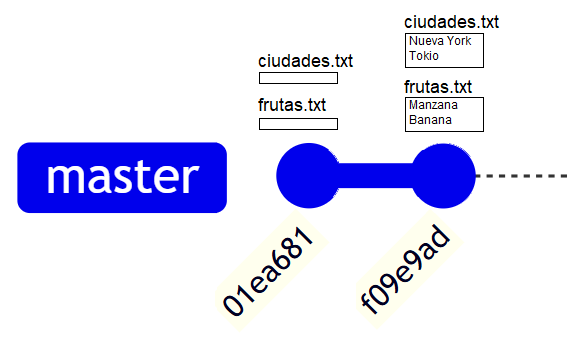
</p>

#### **9. Verificar el historial con `git log`** 
Explora el historial de commits con diferentes opciones:  

- **Ver el historial estándar:**  
   ```bash
   git log
   ```
   **Salida esperada:**  
```plaintext
commit f09e9adb158aefec03fc1bc79bec17f4772e2e30 (HEAD -> master)
Author: Profesorcito <yoan.pinzon@javerianacali.edu.co>
Date:   Sun Jan 19 09:41:59 2025 -0500

    Agregué dos frutas y dos ciudades a los archivos frutas.txt y
 ciudades.txt respectivamente

commit 01ea681636c7a5964a3e540a32c611a0fdf5cc3d
Author: Profesorcito <yoan.pinzon@javerianacali.edu.co>
Date:   Sat Jan 18 22:43:40 2025 -0500

    Archivos frutas.txt y ciudades.txt vacíos
```

#### **10. Ver el historial en una sola línea**  
```bash
git log --oneline
```
   **Salida esperada:**  
```plaintext
f09e9ad (HEAD -> master) Agregué dos frutas y dos ciudades a los
archivos frutas.txt y ciudades.txt respectivamente
01ea681 Archivos frutas.txt y ciudades.txt vacíos
```

<details>
  <summary>💡 Hint: Opciones adicionales de git log</summary>

  Con `git log` no solo puedes ver el historial de commits de manera básica, sino que también tienes varias opciones útiles para personalizar la salida:

  - `--graph`: Muestra el historial de commits de forma visual, representando las ramas y merges con un gráfico en el terminal.  
    Ejemplo:  
    ```bash
    git log --graph
    ```

  - `--decorate`: Añade información sobre las referencias (como las ramas) junto con los commits.  
    Ejemplo:  
    ```bash
    git log --decorate
    ```

  - `--oneline`: Muestra los commits en una sola línea, facilitando una vista más compacta del historial.  
    Ejemplo:  
    ```bash
    git log --oneline
    ```

  - `--author="nombre"`: Filtra los commits para mostrar solo los hechos por un autor específico.  
    Ejemplo:  
    ```bash
    git log --author="Profesorcito"
    ```

  Además, una combinación común y útil sería usar `--graph`, `--decorate`, y `--oneline` para obtener una vista compacta y visual del historial, mostrando las ramas y los commits en una sola línea:

  Ejemplo combinado:  
  ```bash
  git log --oneline--graph --decorate 
  ```
</details>

#### 11. Explicación de la información generada por `git log`  
Cada entrada de `git log` incluye:  
1. **Hash del commit:** Identificador único del commit (ejemplo: `f09e9ad`).  
2. **Autor:** Nombre y correo de la persona que realizó el commit.  
3. **Fecha:** Cuándo se realizó el commit.  
4. **Mensaje:** Descripción del cambio realizado.  

Aquí tienes una imagen que muestra cómo debería verse tu Git Bash después de ejecutar todos los comandos de esta práctica:

<p align="center">
  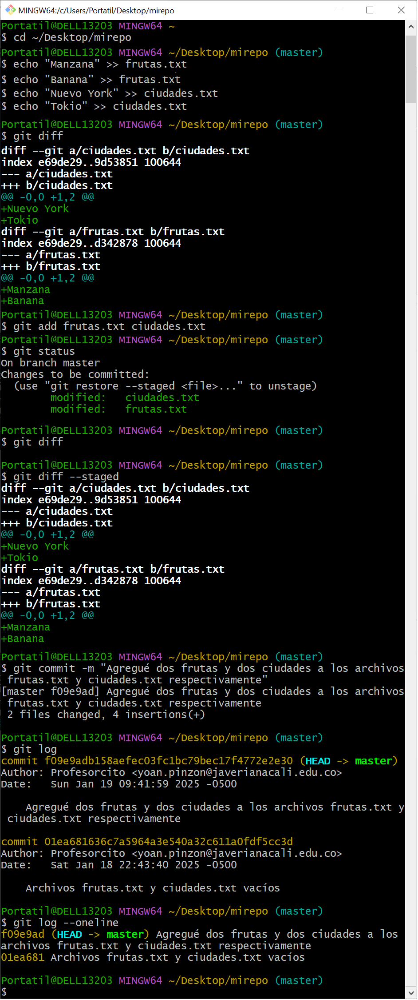
</p>

&nbsp;&nbsp;&nbsp;[↩️](#tabla-de-contenido)

---

### * `git branch`: Crear y gestionar ramas

El comando `git branch` se utiliza para crear, listar y gestionar ramas dentro de un repositorio de Git. Las ramas permiten trabajar en nuevas características o correcciones sin afectar el código principal. Con `git branch`, puedes ver todas las ramas existentes en tu repositorio y crear nuevas ramas para desarrollar nuevas funcionalidades de manera aislada.

> [!NOTE]  
> 
> En la **[Práctica #4](#práctica-4-usando-git-branch-y-git-checkout-)**, se aplicará este comando para crear y gestionar ramas en tu proyecto, permitiéndote trabajar en diferentes versiones del código.

---

### * `git checkout`: Cambiar de rama

El comando `git checkout` se utiliza para cambiar entre ramas dentro de un repositorio de Git. Cuando usas este comando, Git actualizará tu área de trabajo a la rama seleccionada, permitiéndote trabajar en una versión específica del código. Es útil para cambiar de contexto entre diferentes funcionalidades o versiones sin perder el progreso realizado.

> [!NOTE]  
> 
> En la **[Práctica #4](#práctica-4-usando-git-branch-y-git-checkout-)**, este comando se utilizará para cambiar entre ramas y trabajar en distintas funcionalidades de tu proyecto sin conflictos.

---

<p align="center">
  
</p>

## Práctica #4: Usando `git branch` y `git checkout` 🌿

> [!WARNING]  
> Esta práctica sigue sobre lo aprendido en las [Práctica #1](#práctica-1-usando-git-init-️) 🖥️, [Práctica #2](#práctica-2-usando-git-add-git-status-y-git-commit-) 📝 y [Práctica #3](#práctica-3-usando-git-log-y-git-diff-) 🔍. Es fundamental que hayas completado todas estas prácticas para aprovechar al máximo esta sección. En esta práctica, exploraremos cómo gestionar diferentes ramas dentro del repositorio creado en los ejercicios anteriores, permitiéndote manejar múltiples versiones del proyecto de manera eficiente.

---

En esta práctica aprenderás a trabajar con ramas en Git usando los comandos `git branch` y `git checkout`. Verás cómo crear y moverte entre ramas, realizar cambios en cada una, y confirmar esos cambios con `git commit`. Además, comprobarás cómo las modificaciones se mantienen separadas entre ramas, permitiendo alternar entre ellas fácilmente. ¡Vamos a organizar y gestionar tu repositorio como un pro! 🚀  

---

#### **Pasos de la Práctica**

#### **1. Navegar al repositorio** 📂
  
Primero, accedemos al repositorio donde trabajaremos:  
```bash
cd ~/Desktop/mirepo
```
---

#### **2. Modificar los archivos existentes ✏️**  
Agregamos dos frutas y dos ciudades a los archivos existentes `frutas.txt` y `ciudades.txt`:  
```bash
echo "Naranja" >> frutas.txt  
echo "Fresa" >> frutas.txt  
echo "París" >> ciudades.txt  
echo "Londres" >> ciudades.txt  
```

**Salida esperada:** No hay salida visible tras usar `echo`.

---

#### **3. Agregar al stage y confirmar los cambios** 📌
 
Añadimos los cambios al **stage** y realizamos un commit:  
```bash
git add frutas.txt ciudades.txt
git commit -m "Archivos con cuatro frutas y cuatro ciudades"
```

**Salida esperada del commit:**  
```plaintext
[master be45620] Archivos con cuatro frutas y cuatro ciudades
 2 files changed, 4 insertions(+)
```

Aquí tienes el grafo que refleja la evolución del repositorio con el tercer commit registrado:

<p align="center">
  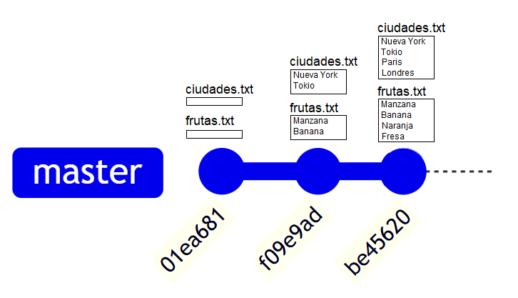
</p>

---

#### **4. Crear una nueva rama** 🌱
 
Creamos una nueva rama llamada `ramab` y nos movemos a ella:  
```bash
git branch ramab
git checkout ramab
```

**Salida esperada del checkout:**  
```plaintext
switched to branch 'ramab'
```

<details>
  <summary>💡 Hint: Atajo con -b</summary>

  Cuando utilizas `git checkout -b <nombre_de_la_rama>`, **creas y cambias directamente a una nueva rama** en un solo paso. Esto te ahorra tener que ejecutar dos comandos separados:  

  - **Sin `-b` (más pasos):**  
    ```bash
    git branch nueva-rama
    git checkout nueva-rama
    ```  
<p></p>

  - **Con `-b` (un solo paso):**  
    ```bash
    git checkout -b nueva-rama
    ```  

  Esto no solo es más rápido, sino que también reduce el riesgo de olvidarte de cambiar a la nueva rama tras crearla. 🚀
</details>

<details><summary>💡 Tip: ¡Ubícate rápido!</summary>

   Si quieres saber en qué rama estás, solo ejecuta:  

   ```bash
   git branch
   ```  

   Este comando te muestra todas las ramas de tu repositorio y marca la rama activa con un asterisco (`*`). Por ejemplo:  

   ```
     master
   * ramab
   ```  

   Así sabrás al instante que estás trabajando en la rama `ramab`.
</details>

#### **5. Modificar archivos y agregar uno nuevo en `ramab` 🆕**  
En la nueva rama:  

Agregamos tres frutas y tres ciudades a los archivos existentes:  
   ```bash
   echo "Piña" >> frutas.txt  
   echo "Mango" >> frutas.txt  
   echo "Durazno" >> frutas.txt  
   echo "Madrid" >> ciudades.txt  
   echo "Roma" >> ciudades.txt  
   echo "Berlín" >> ciudades.txt  
   ```
   
Creamos un nuevo archivo llamado `paises.txt` con cuatro países:  
   ```bash
   touch paises.txt
   echo "Colombia" >> paises.txt  
   echo "México" >> paises.txt  
   echo "Francia" >> paises.txt  
   echo "Japón" >> paises.txt  
   ```

#### **6. Hacemos un `git status` para ver los cambios detectados**  
   ```bash
   git status
   ```

**Salida esperada del `git status`:**  
```plaintext
On branch ramab
Changes not staged for commit:
  (use "git add <file>..." to update what will be committed)
  (use "git restore <file>..." to discard changes in working dire
ctory)
        modified:   ciudades.txt
        modified:   frutas.txt

Untracked files:
  (use "git add <file>..." to include in what will be committed)
        paises.txt

no changes added to commit (use "git add" and/or "git commit -a")
```

#### Explicación de la salida de `git status`

1. **"On branch ramab"**: Estás trabajando en la rama llamada `ramab`.  
2. **"Changes not staged for commit"**: Git detectó modificaciones en dos archivos: `ciudades.txt` y `frutas.txt`, porque le hemos agregado tres items a cada uno, pero esos cambios no están listos para ser confirmados (no están en el stage).  
3. **"Untracked files"**: Git encontró un archivo nuevo llamado `paises.txt` que no está siendo rastreado, es decir, no está incluido en el control de versiones aún.  
4. **"no changes added to commit"**: No hemos puesto ningún cambio ni archivo en el stage, por lo que no hay nada listo para confirmar.

#### **7. Agregamos los cambios al stage**  
   ```bash
   git add frutas.txt ciudades.txt paises.txt
   ```
#### **8. Hacemos un `git status` para ver el stage después del `git add`**  
   ```bash
   git status
   ```

**Salida esperada del `git status`:**  
```plaintext
On branch ramab
Changes to be committed:
  (use "git restore --staged <file>..." to unstage)
        modified:   ciudades.txt
        modified:   frutas.txt
        new file:   paises.txt
```

#### Explicación de la salida de `git status`

1. **"On branch ramab"**: Estás trabajando en la rama llamada `ramab`.  
2. **"Changes to be committed"**: Los archivos listados están en el área de **staging** y están listos para ser confirmados (commit).  
3. `ciudades.txt` y `frutas.txt` han sido modificados y sus cambios están preparados para el commit.
4. `paises.txt` es un archivo nuevo que ahora está siendo rastreado y también está listo para ser confirmado.  

#### **9. Hacemos un commit** 
 
   ```bash
   git commit -m "Archivos con siete frutas, siete ciudades, y paises.txt con cuatro elementos"
   ```

**Salida esperada del commit:**  
```plaintext
[ramab 2142e89] Archivos con siete frutas, siete ciudades, y pais
es.txt con cuatro elementos
 3 files changed, 10 insertions(+)
 create mode 100644 paises.txt
```

Este grafo muestra el estado actual del repositorio, donde se refleja la creación la ramab y cómo el cuarto commit se ha realizado sobre ella. Ahora puedes ver claramente cómo se ha ramificado el historial de cambios:

<p align="center">
  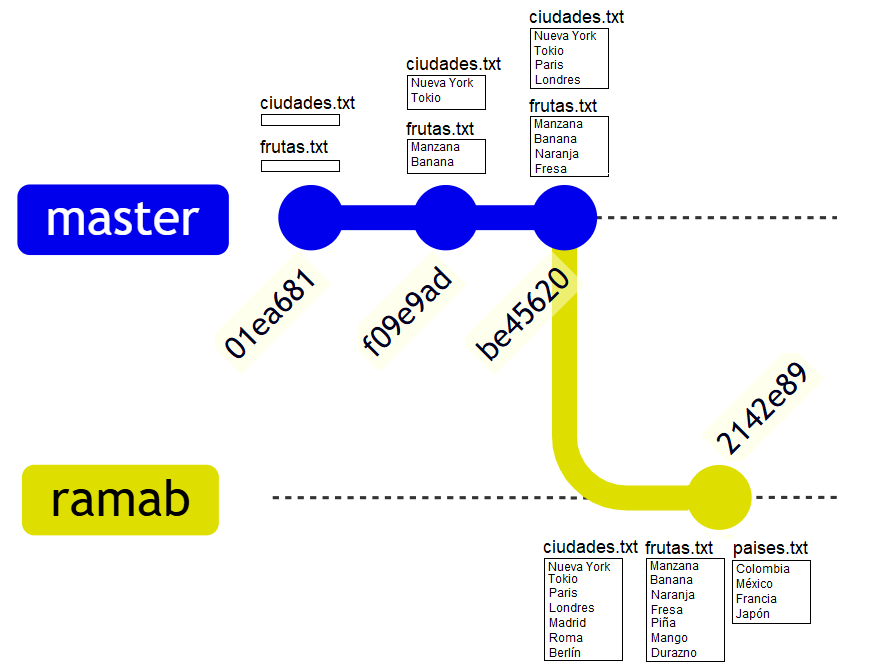
</p>

---

#### **10.  Modificar los archivos para que tengan seis elementos cada uno** ✂️

En `ramab`, quitamos la primera fruta y la primera ciudad y agregamos dos países al archivo `paises.txt` para que todos los archivos queden con seis elementos:
   ```bash
   sed -i '1d' frutas.txt  
   sed -i '1d' ciudades.txt  
   echo "Italia" >> paises.txt  
   echo "Argentina" >> paises.txt  
   ```
#### **11. Hacemos un `git status`**  
   ```bash
   git status
   ```

**Salida esperada del `git status`:**  
```plaintext
On branch ramab
Changes not staged for commit:
  (use "git add <file>..." to update what will be committed)
  (use "git restore <file>..." to discard changes in working dire
ctory)
        modified:   ciudades.txt
        modified:   frutas.txt
        modified:   paises.txt

no changes added to commit (use "git add" and/or "git commit -a")
```
#### **12. Agregamos los cambios al stage** 
   ```bash
   git add frutas.txt ciudades.txt paises.txt
   ```
#### **13. Hacemos un `git status`**  
   ```bash
   git status
   ```

**Salida esperada del `git status`:**  
```plaintext
On branch ramab
Changes to be committed:
  (use "git restore --staged <file>..." to unstage)
        modified:   ciudades.txt
        modified:   frutas.txt
        modified:   paises.txt
```
#### **14. Hacemos el commit correspondiente**  
   ```bash
   git commit -m "Tres archivos con seis elementos cada uno"
   ```

**Salida esperada del commit:**  
```plaintext
[ramab 1f571b5] Tres archivos con seis elementos cada uno
 3 files changed, 2 insertions(+), 2 deletions(-)
```

Este grafo muestra el estado actual del repositorio, destacando el quinto commit, que es el segundo realizado en la nueva rama. Aquí puedes ver cómo el historial de cambios se ha ramificado, con el commit fluyendo sobre esta rama recién creada:

<p align="center">
  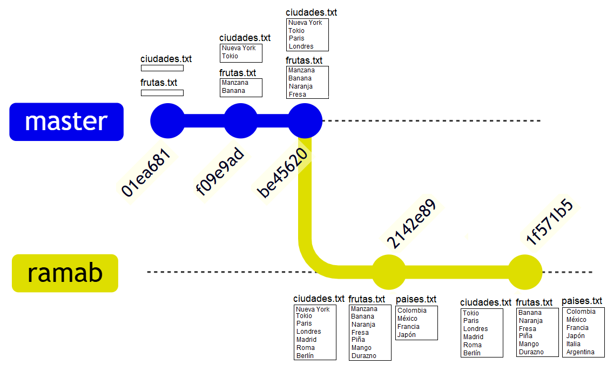
</p>

---

#### **15. Volver a la rama `master` y comparar** 🔄
  
Volvemos a la rama `master`, revisamos el contenido de los archivos y verificamos que los cambios de `ramab` no están presentes:  
```bash
git checkout master
ls
cat frutas.txt ciudades.txt
```

**Salida esperada:**  
```plaintext
Switched to branch 'master'

ciudades.txt  frutas.txt 

Manzana
Banana
Naranja
Fresa

Nuevo York
Tokio
París
Londres
```

<details>
  <summary>💡 Hint:  ¿Qué hace cat?</summary>

  El comando `cat` es de **Linux** 🐧 (también en Git Bash) y se usa para ver el contenido de archivos en la terminal. Viene de "concatenate" (concatenar) porque originalmente servía para juntar archivos. ¡No tiene nada que ver con un gato! 🐱

  Ejemplo:  
  ```bash
  cat frutas.txt ciudades.txt
  ```  
  Así ves ambos archivos en la terminal, rápido y fácil. 📄👀
</details>

---

#### **16. Volver a `ramab` y verificar los cambios** 🌟
  
Regresamos a `ramab` para confirmar que los archivos tienen seis elementos cada uno:  
```bash
git checkout ramab
ls
cat frutas.txt ciudades.txt paises.txt
```

**Salida esperada:**  
```plaintext
Switched to branch 'ramab'

ciudades.txt  frutas.txt  paises.txt

Banana
Naranja
Fresa
Piña
Mango
Durazno

Tokio
París
Londres
Madrid
Roma
Berlín

Colombia
México
Francia
Japón
Italia
Argentina
```
---

#### Conclusión 🚀  
En esta práctica aprendiste a:  
1. Crear y cambiar entre ramas con `git branch` y `git checkout`.  
2. Mantener cambios independientes en ramas diferentes.  
3. Volver a la rama principal para comparar los contenidos.  

Para ayudarte a visualizar el resultado, te dejo esta imagen que muestra cómo debería lucir tu Git Bash después de ejecutar todos los comandos de esta práctica:

<p align="center">
  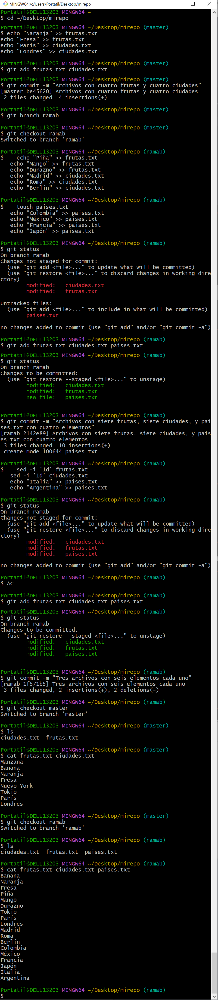
</p>

Así podrás tener una referencia clara de lo que deberías ver al seguir todos los pasos 😎📊.

&nbsp;&nbsp;&nbsp;[↩️](#tabla-de-contenido)

---

### * `git merge`: Fusionar ramas

El comando `git merge` se utiliza para combinar los cambios de una rama con otra. Es útil cuando has estado trabajando en una rama separada y deseas integrar esos cambios en otra rama, como la rama principal. Al hacer un `git merge`, Git fusionará los cambios de ambas ramas, añadiendo los cambios nuevos a la rama actual. Si no hay conflictos, el proceso es automático, pero si hay cambios incompatibles, tendrás que resolver los conflictos manualmente.

> [!NOTE]  
> 
> En la **[Práctica #5](#práctica-5-usando-git-merge-)**, este comando se utilizará para fusionar los cambios realizados en diferentes ramas, ayudándote a integrar nuevas funcionalidades o correcciones en la rama principal.

---

<p align="center">
  
</p>

## Práctica #5: Usando `git merge` 🔗

> [!WARNING]  
> Esta práctica sigue sobre lo aprendido en las [Práctica #1](#práctica-1-usando-git-init-️) 🖥️, [Práctica #2](#práctica-2-usando-git-add-git-status-y-git-commit-) 📝, [Práctica #3](#práctica-3-usando-git-log-y-git-diff-) 🔍 y [Práctica #4](#práctica-4-usando-git-branch-y-git-checkout-) 🌿, así que asegúrate de haber completado esas antes de continuar. En esta práctica, aprenderás a fusionar cambios de distintas ramas en Git utilizando el comando `git merge`. Será importante que entiendas bien cómo funcionan las ramas y los commits previos para integrar los cambios correctamente.

---

El **merge** permite combinar los cambios de una rama con otra. En esta práctica, aprenderemos a fusionar los cambios de la rama `ramab` en `master` usando el comando `git merge`. Veremos cómo Git maneja los archivos comunes y cómo incorpora los nuevos archivos de una rama a otra.

#### **Pasos para Ejecutar el Merge** 🔄

1. **Verificar en qué rama estamos**  
   Antes de hacer cualquier fusión, siempre debemos asegurarnos de estar en la rama a la que queremos traer los cambios. En este caso, debemos estar en la rama `master`. Ejecutamos:

   ```bash
   git checkout master
   ```

   **Salida esperada:**  
   ```
   Switched to branch 'master'
   ```
<p></p>

2. **Hacer el merge desde `ramab`**  
   Ahora que estamos en la rama `master`, vamos a fusionar los cambios de la rama `ramab` usando el comando `git merge`:

   ```bash
   git merge ramab
   ```

   **Salida esperada:**  
   ```
   Updating 2142e89..1f571b5
   Fast-forward
    archivos/frutas.txt | 6 ++++++
    archivos/ciudades.txt | 6 ++++++
    archivos/paises.txt | 4 ++++
    3 files changed, 16 insertions(+)
   ```

   Como la rama `ramab` tiene archivos nuevos y cambios en archivos existentes, Git realizará un **fast-forward** y traerá los cambios a `master` sin generar conflictos. Los archivos `frutas.txt` y `ciudades.txt` se han mezclado, y el archivo `paises.txt` se ha agregado a `master`.

3. **Ver los archivos en la rama `master`**  
   Después de hacer el merge, podemos listar los archivos para ver cómo se han combinado:

   ```bash
   ls
   cat frutas.txt ciudades.txt paises.txt
   ```

   **Salida esperada:**  
   ```plaintext
   ciudades.txt  frutas.txt  paises.txt

   Tokio
   París
   Londres
   Madrid
   Roma
   Berlín

   Banana
   Naranja
   Fresa
   Piña
   Mango
   Durazno

   Colombia
   México
   Francia
   Japón
   Italia
   Argentina
   ```

   Ahora, tenemos el archivo `paises.txt`, que estaba en `ramab` pero no en `master`, y también los archivos `frutas.txt` y `ciudades.txt` que han sido fusionados. Es posible que ahora el contenido de esos archivos sea diferente al de la rama `master` original.

#### **¿Qué Pasa con los Archivos Comunes?** 🔄  
El comando `git merge` automáticamente combinará los cambios de los archivos comunes, como `frutas.txt` y `ciudades.txt`. Si las modificaciones no se superponen, Git las fusionará sin problemas. Sin embargo, si se han realizado cambios conflictivos en las mismas líneas de estos archivos en ambas ramas, **Git marcará un conflicto** y necesitarás resolverlo manualmente.

En la siguiente imagen se muestra gráficamente el resultado del merge, donde puedes ver cómo la rama `ramab` se ha fusionado con la rama `master`.

<p align="center">
  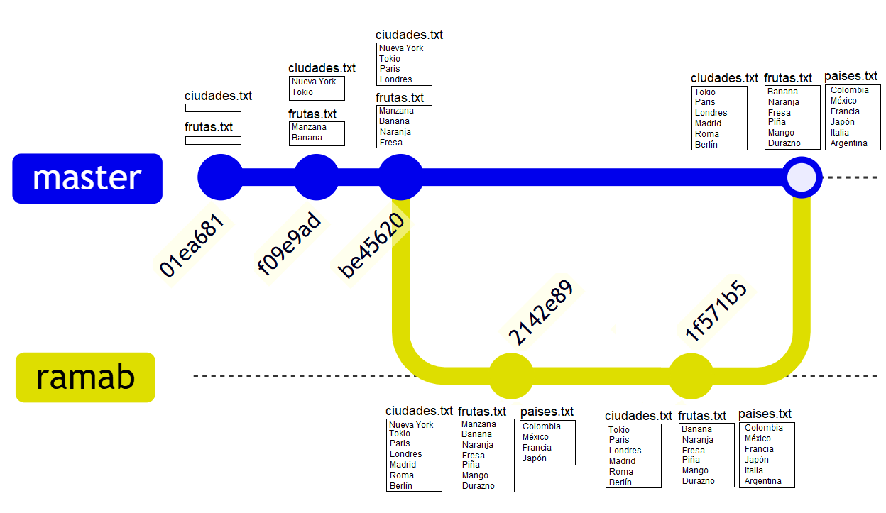
</p>

&nbsp;&nbsp;&nbsp;[↩️](#tabla-de-contenido)

### * `git push`: Subir cambios al repositorio remoto 

El comando `git push` se utiliza para subir los cambios que has realizado en tu repositorio local a un repositorio remoto 🌐, como GitHub. Esto es fundamental para compartir tus actualizaciones con otros colaborares o para respaldar tu trabajo en un servidor remoto. Cuando ejecutas `git push`, Git envía los commits de tu rama local al repositorio remoto.  

>[!NOTE]  
> En la **[Práctica #6](#práctica-6-usando-git-push-)**, este comando se utilizará para actualizar tu repositorio remoto con los últimos cambios de tu repositorio local, asegurando que el trabajo realizado en tu máquina esté reflejado en GitHub.

<details>
  <summary>💡 Hint: ¿Qué pensar de un estudiante que cree que GitHub es Git? 🤦‍♂️</summary>

Es bastante común que los nuevos programadores confundan **GitHub** con **Git**, ya que ambos están muy relacionados, pero no son lo mismo. Si eres uno de esos que aún no ve la diferencia, no te preocupes. Esta confusión es más común de lo que parece, y está bien no tenerlo claro al principio. Vamos a explicarlo.

- **Git**: Es una herramienta de control de versiones. Trabajas con tus repositorios Git en tu máquina local. 💻  
- **GitHub**: Es una plataforma en la nube donde puedes almacenar los repositorios Git que tienes en tu máquina local y colaborar con otros. 🌐  

Ahora, para entender por qué ocurre esta confusión, es útil reflexionar sobre algunas razones clave:

1. **GitHub es muy popular**: GitHub se ha convertido en una de las plataformas más conocidas en el desarrollo de software, tanto que muchos novatos asocian la palabra "Git" directamente con **GitHub**. Al buscar tutoriales o ejemplos de proyectos, la mayoría se encuentran en GitHub, lo que puede llevar a pensar que Git y GitHub son lo mismo.

2. **Falta de contexto inicial**: En muchos casos, cuando comienzas a aprender programación, te enseñan **Git** y **GitHub** casi al mismo tiempo. Sin una explicación clara de la diferencia entre ambos, es fácil caer en la idea de que Git es solo una parte de GitHub, o una característica adicional.

3. **GitHub hace que Git sea más accesible**: GitHub facilita mucho el uso de **Git**. Subir proyectos, clonar repositorios y colaborar en equipo se vuelve muy sencillo con su interfaz visual. Esto puede hacer que algunos olviden que **Git** es una herramienta independiente que se puede usar localmente, sin necesidad de GitHub.

4. **El nombre "GitHub"**: El hecho de que el nombre de la plataforma incluya **"Git"** puede llevar a pensar que GitHub es una extensión de Git. Sin embargo, GitHub es solo una plataforma donde puedes almacenar y gestionar los repositorios **Git** en la nube, pero Git en sí mismo no depende de GitHub.

5. **Usuarios novatos buscando soluciones fáciles**: Muchos programadores principiantes buscan herramientas que hagan su vida más fácil, y GitHub parece ser una solución todo en uno. La interfaz amigable y las opciones de colaboración pueden hacer que se confunda la idea de tener un repositorio "en GitHub" con tener un repositorio "en Git", sin entender que son conceptos diferentes.

En resumen, la confusión entre **Git** y **GitHub** proviene principalmente de la popularidad de GitHub, la falta de explicación en los primeros pasos de aprendizaje y cómo GitHub simplifica el uso de Git. Pero no te preocupes, a medida que sigas aprendiendo, la diferencia se volverá mucho más clara. ¡Todo a su tiempo! 😄

</details>

<details>
  <summary>💡 Hint: Otros servicios en la nube 💻☁️</summary>

Además de **GitHub**, existen otras plataformas populares para almacenar y gestionar repositorios Git en la nube:

- **GitLab**: Al igual que GitHub, GitLab te permite almacenar tus repositorios, pero ofrece aún más opciones como integración continua (CI/CD) y gestión de proyectos. Además, puedes usarlo tanto en la nube como instalarlo de manera privada en tu propio servidor. 🔄  
  Sitio web: [https://gitlab.com](https://gitlab.com)

- **Bitbucket**: Este servicio está más enfocado en entornos empresariales. Además de almacenar repositorios, Bitbucket se integra muy bien con herramientas como **Jira** para la gestión de proyectos y seguimiento de tareas, lo que lo hace ideal para equipos de trabajo más grandes. 🧑‍💻  
  Sitio web: [https://bitbucket.org](https://bitbucket.org)

- **SourceForge**: Aunque ha perdido algo de popularidad en comparación con GitHub, sigue siendo una opción viable para proyectos de código abierto. Ofrece funcionalidades similares a las de GitHub y GitLab, pero con una comunidad más pequeña. 💾  
  Sitio web: [https://sourceforge.net](https://sourceforge.net)

</details>

---

<p align="center">
  
</p>

## Práctica #6: Usando `git push` 📤  

> [!WARNING]  
> Esta práctica sigue sobre lo aprendido en las [Práctica #1](#práctica-1-usando-git-init-️) 🖥️, [Práctica #2](#práctica-2-usando-git-add-git-status-y-git-commit-) 📝, [Práctica #3](#práctica-3-usando-git-log-y-git-diff-) 🔍, [Práctica #4](#práctica-4-usando-git-branch-y-git-checkout-) 🌿 y [Práctica #5](#práctica-5-usando-git-merge-) 🔗, así que asegúrate de haber completado esas antes de continuar. En esta práctica, aprenderás a subir tus cambios al repositorio remoto usando el comando `git push`.  

---  

El comando `git push` es el paso final para compartir tu trabajo con el mundo 🌍. Vamos a practicar cómo subir los cambios de una rama local al repositorio remoto.  


#### **Pasos para Usar `git push` desde cero** 💻🔧

1. **Crear una cuenta en GitHub**  
   - Primero, abre [GitHub](https://github.com) y regístrate con tu correo. Si ya tienes una cuenta, solo inicia sesión.

2. **Crear un repositorio en GitHub**  
   - Una vez que estés dentro, haz clic en el botón **"New"** para crear un nuevo repositorio.
  
  <p align="center">
    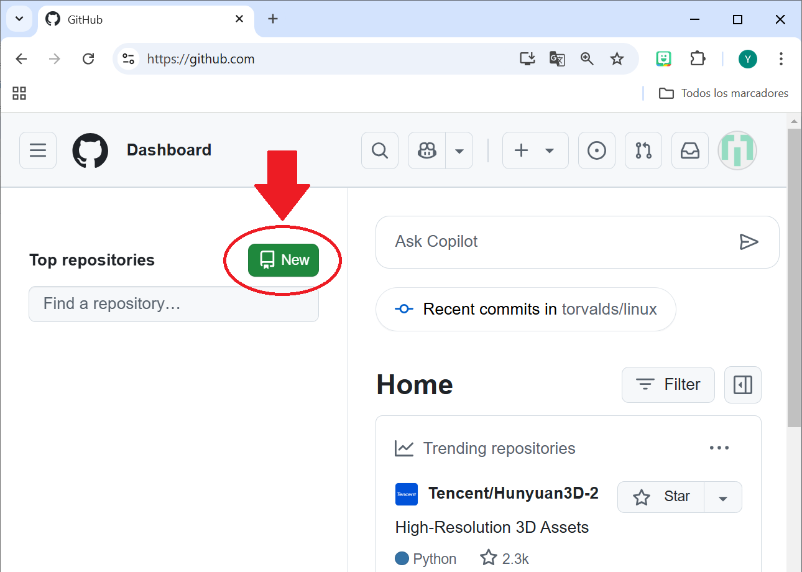
  </p>

   - Dale un nombre a tu repositorio (marcado con un 1️⃣ en rojo en la imagen), por ejemplo, **"mirepo"**, para identificarlo fácilmente.  

  >[!NOTE]
  >  
  > Es una buena práctica que el nombre del repositorio en GitHub sea el mismo que el de tu carpeta local, aunque no es estrictamente necesario. Esto ayuda a mantener todo más organizado y fácil de identificar.

   - Escoge la opción **público** (recomendado para empezar y compartir), aunque también puedes optar por **privado** si prefieres que solo tú tengas acceso.  
   - Deja el resto de las opciones como están por ahora (no marques la opción de crear un README ni ninguna otra configuración adicional).  
   - Por último, haz clic en **"Create repository"** (marcado con un 2️⃣ en rojo en la imagen) para finalizar la creación de tu repositorio. 🎉  

  Tu ventana debería lucir algo así:

  <p align="center">
    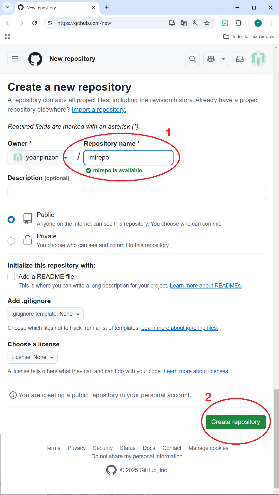
  </p>

#### **Configurar el repositorio remoto** 🌐

Si tu repositorio local no está vinculado a un repositorio remoto, debes configurarlo. Para esto:  

1. Una vez que crees tu repositorio en GitHub, busca la sección titulada **"…or create a new repository on the command line"**.  

   Aquí encontrarás el comando necesario para vincular tu repositorio local al remoto, así como otras opciones que puedes usar con el repositorio. Esta información está diseñada para facilitarte el proceso de configuración.  

  <p align="center">
    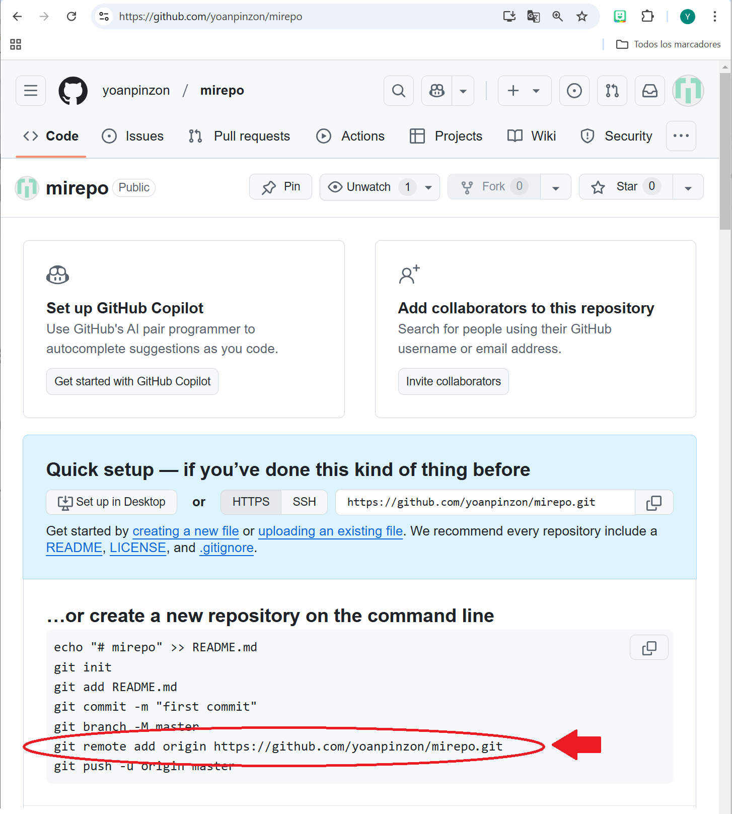
  </p>

2. Copia y pega en tu terminal el comando que aparece en esa sección, estando dentro de la carpeta de tu repositorio local. Por ejemplo:  

   ```bash
   git remote add origin https://github.com/yoanpinzon/mirepo.git
   ```

>[!NOTE]
>
> Es más rápido y menos propenso a errores copiar los comandos directamente desde GitHub, ya que incluyen la URL exacta de tu repositorio.

<details>
  <summary>💡 Hint: ¿Cómo verificar si mi repositorio está conectado a un remoto? 🤔</summary>

En cualquier momento, puedes verificar si tu repositorio local está conectado a un repositorio remoto utilizando el siguiente comando:  

```bash
git remote -v
```

### Salida esperada  
Si tu repositorio está conectado al remoto, verás algo como esto:  

```bash
origin  https://github.com/yoanpinzon/mirepo.git (fetch)  
origin  https://github.com/yoanpinzon/mirepo.git (push)  
```

#### ¿Qué significa esta salida?  
1. `origin`: Es el nombre que Git asigna al repositorio remoto cuando lo configuras.  
2. `fetch`: Indica la URL desde la cual Git traerá actualizaciones del repositorio remoto a tu máquina local. Este proceso se realiza con el comando `git pull`, que explicaremos a continuación.  
3. `push`: Indica la URL donde Git enviará los cambios desde tu repositorio local al remoto.  

Esto confirma que tu repositorio local está conectado al remoto en GitHub en las direcciones indicadas para "fetch" y "push".

</details>  

<details>
  <summary>💡 Hint: ¿Cómo verificar si tu repositorio está sincronizado con el remoto? 🤔</summary>

Puedes usar el comando `git status` para saber si tu repositorio local está sincronizado con el remoto:

```bash
git status
```

### Salida esperada de `git status`  
```bash
On branch master
Your branch is up to date with 'origin/master'.

nothing to commit, working tree clean
```

#### ¿Qué significa esta salida?  
- `On branch master`: Estás trabajando en la rama `master`.  
- `Your branch is up to date with 'origin/master'`: Tu rama local está sincronizada con la rama `master` del repositorio remoto.  
- `nothing to commit, working tree clean`: No hay cambios pendientes, todo está actualizado y limpio.

Si tu repositorio no está sincronizado, Git lo indicará de esta manera:

```bash
Your branch is behind 'origin/master' by 2 commits, and can be fast-forwarded.
```

Esto quiere decir que el repositorio remoto tiene cambios adicionales que puedes traer a tu repositorio local usando el comando `git pull`.

</details>

---

#### **Hacer push** 🚀


Aquí tienes una versión revisada para mejorar la redacción, ortografía y flujo del mensaje:

>[!WARNING]  
>
>Antes de continuar, asegúrate de que la rama principal tenga el mismo nombre en tu repositorio local y remoto. En esta práctica, estamos utilizando `master` como la rama principal. Si tu repositorio local tiene un nombre diferente (por ejemplo, `main`), cámbialo a `master` para evitar errores al hacer `push` o `pull`. Usa el siguiente comando para renombrar la rama local:
>
>```bash
>git branch -m master  
>```  
>
>Si el problema es que en GitHub la rama principal se llama `main` en lugar  `master`, sigue estos pasos para cambiarla:
>
>1. Ve a tu repositorio en GitHub y haz clic en **"Settings"**.
>2. En el menú lateral, selecciona **"General"**.
>3. Busca la opción **"Default branch"** y cámbiala de `main` a `master`.

<details>
<summary>💡 Hint: ¿Cómo cambiar la rama predeterminada en GitHub a master? 🤔</summary>

1. **Accede a la configuración de tu cuenta en GitHub**:  
   Ve a [https://github.com/settings/repositories](https://github.com/settings/repositories).

2. **Busca la sección de "Default branch"** (Rama predeterminada):  
   En esta sección, podrás modificar la rama predeterminada para todos los repositorios que crees en el futuro.

3. **Cambiar la rama predeterminada**:  
   Cambia el nombre de la rama predeterminada de **`main`** a **`master`**.

4. **Guardar los cambios**:  
   Haz clic en el botón de guardar para aplicar la nueva configuración.

><h4>📌 Nota</h4>
>
> Este cambio solo afectará a los **nuevos repositorios**. Los repositorios existentes mantendrán su configuración actual.

</details>


1. **Subir los cambios a GitHub**  

    Para subir tus cambios al repositorio remoto, escribe:

    ```bash
    git push -u origin master
    ```

    <details>
    <summary>💡 Hint: ¿Qué hace el parámetro -u en git push?</summary>
    El parámetro `-u` establece la relación entre tu rama local `master` y la rama remota `origin/master`, lo que facilita futuras interacciones con Git, ya que Git recordará esta referencia.

    ><h4>📌 Nota</h4>
    > 
    > Usar `-u` configura `origin` como el repositorio remoto predeterminado para tu rama local. Esto significa que, en el futuro, solo necesitarás escribir `git push` sin necesidad de especificar el repositorio remoto. 🎯

    </details>

    Si es la primera vez que haces un `git push`, GitHub te pedirá autenticarte. Aquí es donde puede que veas una ventana emergente que te da la opción de iniciar sesión a través de tu navegador:
     - **Ventana de inicio de sesión**:  
    Cuando Git detecta que necesitas autenticarte, abre una ventana emergente con un botón que dice algo como **"Sign in through your browser"**.
    
     - **Autenticación directa sin pedir más detalles**:  
    En muchos casos, al hacer clic en este botón, GitHub automáticamente te redirige a tu navegador donde ya estás logueado en GitHub, y no te pedirá más detalles. Si ya tienes sesión iniciada en tu navegador, GitHub automáticamente autoriza el `git push` sin solicitar más información.  
    
    Si todo va bien, verás algo como esto en la terminal:

    ```plaintext
    Enumerating objects: 26, done.
    Counting objects: 100% (26/26), done.
    Delta compression using up to 8 threads
    Compressing objects: 100% (13/13), done.
    Writing objects: 100% (26/26), 2.25 KiB | 1.12 MiB/s, done.
    Total 26 (delta 1), reused 0 (delta 0), pack-reused 0
    remote: Resolving deltas: 100% (1/1), done.
    To https://github.com/yoanpinzon/mirepo.git
    * [new branch]      master -> master
    branch 'master' set up to track 'origin/master'.
    ```

  >[!TIP]  
  > El comando `git push -u origin master` lo encuentras en GitHub después de crear tu repositorio, en la sección **"…or create a new repository on the command line"**, junto al comando `git remote add origin https://github.com/yoanpinzon/mirepo.git` que utilizamos arriba. 

2. **Verificar los cambios en GitHub** 🌍  
   
    ¡Eso es todo! Ahora, solo dirígete a tu repositorio en GitHub y verifica que los cambios se hayan subido correctamente.

  <p align="center">
    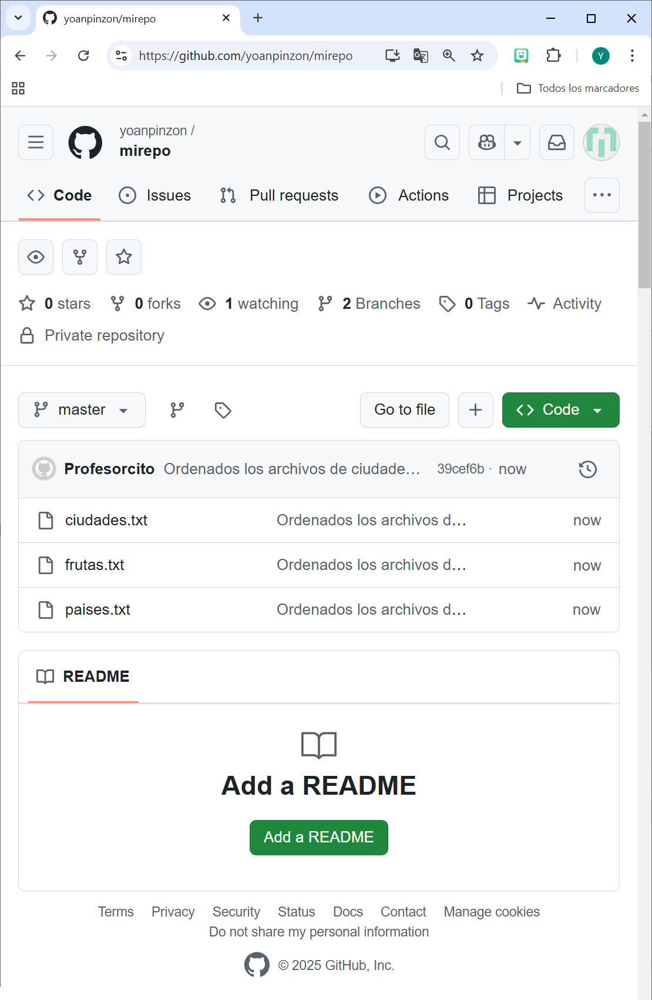
  </p>


---

### Cómo Subir Modificaciones a tu Repositorio Remoto con `git push` 🚀

A partir de ahora, que ya tenemos nuestro repositorio vinculado con el remoto en GitHub, cada vez que hagamos cambios en los archivos, debemos asegurarnos de que esos cambios se reflejen en el repositorio remoto.

#### **Ejemplo: Vamos a Modificar y Subir Cambios a GitHub**

1. **Hacemos los Cambios en los Archivos**  
   Vamos a realizar una modificación en los archivos, como por ejemplo, ordenar alfabéticamente los archivos **ciudades.txt**, **frutas.txt** y **países.txt**:

   ```bash
   $ sort -o ciudades.txt ciudades.txt
   $ sort -o frutas.txt frutas.txt
   $ sort -o países.txt países.txt
   ```

2. **Verificamos Qué Archivos Fueron Modificados**  
   Luego, usamos `git status` para ver qué archivos han sido modificados:

   ```bash
   $ git status
   ```

   Esto nos muestra los archivos que han cambiado y que están listos para ser añadidos al commit.

3. **Añadimos los Archivos Modificados**  
   Ahora, añadimos esos archivos modificados con `git add`:

   ```bash
   $ git add ciudades.txt frutas.txt países.txt
   ```

4. **Realizamos el Commit**  
   Registramos los cambios con un mensaje claro, explicando qué cambios hicimos:

   ```bash
   $ git commit -m "Ordenados los archivos de ciudades, frutas y países"
   ```

5. **Subimos los Cambios al Repositorio Remoto**  
   Finalmente, subimos los cambios al repositorio remoto con `git push`:

   ```bash
   $ git push
   ```
   Esto asegurará que todos los cambios que hicimos en los archivos se reflejen en el repositorio de GitHub.

   <details><summary>💡 Hint: ¿git push solo sube la rama en la que estamos? 🤔</summary>

    Cuando usas `git push` sin ningún modificador, Git sube **solo la rama en la que te encuentras** al repositorio remoto. Esto significa que los cambios que has realizado en esa rama se subirán al remoto. Por ejemplo, si estás en la rama `master` y ejecutas `git push`, solo esa rama se actualizará en el remoto.

    Si quieres subir una **rama específica** que no es la actual, usas:

    ```bash
    git push origin nombre_de_rama
    ```

    Para subir **todas las ramas locales** de una vez, puedes usar:

    ```bash
    git push --all
    ```

    Además, si la rama remota no existe aún, Git la creará automáticamente cuando subas tu rama local.
    </details>


>[!TIP]  
>
>A partir de ahora, cada vez que hagas cambios en tu repo, asegúrate de reflejarlos en GitHub con estos pasos:  
>1. **Modifica** los archivos 
>2. **Verifica** con `git status`  
>3. **Añade** con `git add`  
>4. **Confirma** con `git commit`  
>5. **Sube** con `git push`  

> [!TIP]
>   
> Antes de hacer un `git push`, ejecuta un `git pull` si ya has realizado un `push` previo. Esto asegura que tu repositorio local esté sincronizado con los últimos cambios del remoto, evita conflictos y garantiza que no sobrescribas el trabajo de otros colaboradores 🚦.  

&nbsp;&nbsp;&nbsp;[↩️](#tabla-de-contenido)

### * `git pull`: Traer cambios del repositorio remoto 

El comando `git pull` se utiliza para traer y fusionar los cambios realizados en un repositorio remoto 🌐 hacia tu repositorio local. Es un paso clave para asegurarte de trabajar con la versión más actualizada del código y evitar conflictos al colaborar con otros desarrolladores.  

Cuando ejecutas `git pull`, Git realiza dos operaciones principales:  
1. **Fetch**: Descarga los cambios del remoto.  
2. **Merge**: Combina esos cambios con la rama activa en tu máquina local.  

>[!NOTE]  
> En la **[Práctica #7](#práctica-7-usando-git-pull-️)**, este comando será fundamental para garantizar que tu trabajo local esté sincronizado con el repositorio remoto, especialmente cuando trabajas en equipo.  

¡Entendido! Aquí está la versión modificada, aclarando que el cambio se realiza directamente desde GitHub:

---

## Práctica #7: Usando `git pull` ⬇️ 

> [!WARNING]  
> 
> Asegúrate de haber completado las prácticas previas con **mirepo**. En esta práctica, aprenderás a usar `git pull` para actualizar tu repositorio local con los cambios hechos en GitHub, específicamente la inclusión de "Sevilla" en orden alfabético en el archivo `ciudades.txt`.

---

El comando `git pull` permite traer los cambios que se han realizado en el repositorio remoto y fusionarlos con tu repositorio local. Vamos a trabajar con el archivo `ciudades.txt`, agregando la ciudad "Sevilla" en el orden adecuado desde GitHub, y luego usando `git pull` para sincronizar esos cambios con tu repositorio local.

#### Pasos para Usar `git pull`

1. **Realiza el cambio en GitHub**  
   Accede a tu repositorio **mirepo** en **GitHub** y abre el archivo `ciudades.txt`. Añade la ciudad **"Sevilla"** en el lugar correspondiente según el orden alfabético, es decir, entre **"Roma"** y **"Tokio"**. Una vez hecho el cambio, guarda los cambios directamente en GitHub.

   El archivo `ciudades.txt` en GitHub debería quedar así:

   ```plaintext
   Berlín
   Londres
   Madrid
   París
   Roma
   Sevilla
   Tokio
   ```

   No olvides confirmar los cambios con un mensaje de commit, como:

   ```
   Agregada la ciudad Sevilla al archivo ciudades.txt
   ```

2. **Traer los cambios del repositorio remoto**  
   Regresa a tu terminal, asegurándote de estar en la rama `master`, y ejecuta:

   ```bash
   git pull
   ```

>[!NOTE]  
>
>Como ya hiciste un `git push -u origin master`, la opción `-u` establece la rama remota predeterminada, lo que permite que el comando `git pull` traiga automáticamente los cambios. Si fuera necesario, puedes usar `git pull origin master` para especificar explícitamente el repositorio y la rama.  

   **Salida esperada:**  
   ```bash
    remote: Enumerating objects: 5, done.
    remote: Counting objects: 100% (5/5), done.
    remote: Compressing objects: 100% (2/2), done.
    remote: Total 3 (delta 0), reused 0 (delta 0), pack-reused 0 (from 0)
    Unpacking objects: 100% (3/3), 1017 bytes | 145.00 KiB/s, done.
    From https://github.com/yoanpinzon/mirepo
      39cef6b..9371fa5  master     -> origin/master
    Updating 39cef6b..9371fa5
    Fast-forward
    ciudades.txt | 1 +
    1 file changed, 1 insertion(+)
   ```

   El comando `git pull` descargará los cambios de GitHub (donde agregaste la ciudad "Sevilla") y los fusionará con tu archivo local `ciudades.txt`.

3. **Verificar los cambios**  

   Después del `git pull`, verifica que "Sevilla" esté en el archivo `ciudades.txt` con:

   ```bash
   cat ciudades.txt
   ```

   **Salida esperada:**

   ```plaintext
   Berlín
   Londres
   Madrid
   París
   Roma
   Sevilla
   Tokio
   ```  

>[!TIP]  
> Usa `git pull --rebase` si prefieres aplicar tus cambios locales después de los del remoto en lugar de fusionarlos automáticamente. Esto genera un historial más limpio. 🚦  

&nbsp;&nbsp;&nbsp;[↩️](#tabla-de-contenido)

## `git clone`: Crear una copia local de un repositorio remoto 👯‍♂️

El comando `git clone` se utiliza para crear una copia exacta de un repositorio remoto (como el de GitHub) en tu máquina local. Al ejecutar este comando, Git se encarga de crear la carpeta correspondiente y descargar todo el contenido del repositorio en ella. ¡No tienes que preocuparte por crear la carpeta tú mismo! 😎

>[!IMPORTANT]
>  
> Cuando clonas un repositorio con `git clone`, no solo obtienes el último commit, sino toda la **historia de commits** del proyecto. Esto significa que puedes moverte a cualquier versión anterior del proyecto en cualquier momento usando comandos como `git checkout <commit-hash>` o `git checkout <nombre-de-rama>`. ¡Esto te permite explorar el código en cualquier punto del tiempo! 🔄

> <h4>⚡ Hack</h4>  
>
> Si solo te interesa la **última versión** del proyecto, puedes usar `git clone --depth 1`. Esto hará que Git solo descargue el **último commit** del repositorio, **ahorrando tiempo ⏱️ y espacio 💾**, pero sin acceso al historial completo.

---

#### Pasos para usar `git clone`:

1. **Obtener la URL del repositorio**  
   Dirígete a la página del repositorio en GitHub (o en otro servicio similar) y copia la URL del repositorio. En GitHub, puedes encontrar esta URL haciendo clic en el botón verde que dice **Code**, y luego copiar el enlace.

2. **Ejecutar el comando `git clone`**  
   Una vez tengas la URL, ve a tu terminal y navega hasta el lugar donde quieras que se guarde el repositorio. Luego, ejecuta el siguiente comando:

   ```bash
   git clone https://github.com/usuario/nombre-del-repositorio.git
   ```
---

**Ejemplo:**  
Si estás clonando el repositorio llamado `mirepo` de **profesorcito**, el comando será:

```bash
git clone https://github.com/profe/mirepo.git
```

---

>[!IMPORTANT]
>
>Git **creará automáticamente** una carpeta con el nombre del repositorio (en este caso, `mirepo`) y descargará todos los archivos dentro de esa carpeta. No es necesario que hagas un `mkdir` por adelantado.

<details>
  <summary>💡 Hint: ¿Se puede cambiar el nombre de un repositorio al clonarlo? 🤔</summary>
  Si no quieres que Git cree la carpeta con el nombre del repositorio, puedes darle el nombre que quieras cuando clones el repositorio. Solo tienes que añadir el nombre de la carpeta al final del comando:
  
  ```bash
  git clone https://github.com/yoanpinzon/mirepo.git mirepo2
  ```

  Esto clonará el repositorio en una carpeta llamada `mirepo2` en lugar de usar el nombre del repositorio (`mirepo`). ¡Es útil si prefieres organizar las cosas de forma distinta!
</details>

<details>
  <summary>💡 Hint: ¿Se puede clonar solo una rama específica de un repositorio? 🌱🤔</summary>
  
  Si solo te interesa trabajar con una rama específica, como una rama de desarrollo, puedes clonar únicamente esa rama de la siguiente forma:

   ```bash
   git clone --branch ramab https://github.com/yoanpinzon/mirepo.git
   ```

  Así, solo se descargará la rama que necesitas, ahorrando espacio y tiempo.
</details>

3. **Acceder a la carpeta del repositorio clonado**  
   Una vez que el repositorio esté clonado, entra en la carpeta que Git acaba de crear con el siguiente comando:

   ```bash
   cd mirepo
   ```

   ¡Ahora estás dentro de la carpeta del repositorio y listo para trabajar! 🚀

> <h4>⚡ Hack</h4>
> 
> Usa `-b` para clonar y cambiar de rama en un solo paso 🏃‍♂️💨:
> 
> ```bash
> git clone -b ramab https://github.com/yoanpinzon/mirepo.git
> ```
> 
> Ahorras el `git checkout ramab` posterior. ⏱️ 

&nbsp;&nbsp;&nbsp;[↩️](#tabla-de-contenido)

---


# 6. Manejo de Conflictos en Git  

Cuando trabajamos con Git en equipo o en proyectos individuales, es común encontrarnos con conflictos 🔥. Estos ocurren cuando Git no puede fusionar automáticamente los cambios entre dos versiones de un archivo y necesita que el usuario los resuelva manualmente.  

Los conflictos pueden aparecer en diferentes situaciones:  

### **Conflictos en `git merge` 🌀**  
Ocurren cuando intentamos fusionar dos ramas y ambas han modificado la misma línea de un archivo.  
- Git no puede decidir qué versión conservar y nos pide que resolvamos el conflicto manualmente.  
- Se deben editar los archivos afectados y luego confirmar los cambios.  
- Este tipo de conflicto será el enfoque de la [Práctica #8](#práctica-8-manejo-de-conflictos-en-git-merge-️).  

### **Conflictos en `git push` 🚀**  
Aparecen cuando intentamos subir cambios (`push`) al repositorio remoto, pero este ha recibido modificaciones desde la última vez que descargamos el código.  
- Git rechaza el `push` para evitar sobrescribir cambios de otros colaboradores.  
- Se resuelve trayendo los cambios remotos (`git pull`) antes de intentar el `push` nuevamente.  

### **Conflictos en `git pull` ⬇️**  
Suceden cuando intentamos actualizar nuestro repositorio local con `git pull`, pero hay cambios sin confirmar en nuestra máquina que entran en conflicto con los cambios del remoto.  
- Git no puede fusionar los cambios automáticamente.  
- Es necesario guardar o descartar los cambios locales antes de hacer el `pull`.  

A continuación, en la [Práctica #8](#práctica-8-manejo-de-conflictos-en-git-merge-️) daremos un ejemplo completo de cómo manejar conflictos en el caso de un `merge`.** 🚀

## Práctica #8: Manejo de Conflictos en `git merge` ⚠️  

En esta práctica trabajaremos con un archivo llamado `cuento.md`, donde escribiremos un breve cuento y provocaremos un conflicto en la segunda línea.  

1. Creamos un repositorio con algunos commits en `master`.  
2. Creamos una rama y realizamos un **merge sin conflictos**.  
3. Creamos otra rama y editamos **la segunda línea** del cuento en `master` y en la nueva rama, provocando un **conflicto en `git merge`**.  
4. Usamos `git status` para ver los archivos en conflicto.  
5. Resolvemos el conflicto manualmente y verificamos el resultado con `cat`.  

---

### **1. Configurar el repositorio y hacer algunos commits**  <!-- omit in toc -->  

📌 **Creamos el repositorio en el escritorio (`~/Desktop`) y entramos en la carpeta:**  

```bash
cd ~/Desktop
mkdir practica-merge
cd practica-merge
git init
```

🔍 **Salida esperada:**

```plaintext
Initialized empty Git repository in C:/Users/Portatil/Desktop/practica-merge/.git/
```

**¿Qué estamos haciendo aquí?**  
- Creamos una nueva carpeta `practica-merge` en el escritorio.  
- Entramos en la carpeta recién creada.  
- Inicializamos un repositorio de Git con `git init`, lo que nos permitirá realizar seguimiento de los cambios.  

📌 **Creamos el archivo `cuento.md` y escribimos la primera línea del cuento:**  

```bash
echo "El bosque era inmenso." > cuento.md
git add cuento.md
git commit -m "Primera línea del cuento"
```

🔍 **Salida esperada:**

```plaintext
[master (root-commit) 2ae03e5] Primera línea del cuento
 1 file changed, 1 insertion(+)
 create mode 100644 cuento.md
```

**¿Qué hace este comando?**  
- `echo "El bosque era inmenso." > cuento.md` → Crea el archivo `cuento.md` con la primera línea del cuento.  
- `git add cuento.md` → Agrega el archivo al área de preparación de Git.  
- `git commit -m "Primera línea del cuento"` → Guarda el primer commit con la línea inicial del cuento.  

📌 **Agregamos la segunda línea y hacemos otro commit:**  

```bash
echo "Un zorro curioso lo exploraba." >> cuento.md
git commit -am "Segunda línea del cuento"
```

🔍 **Salida esperada:**

```plaintext
[master 2cc03df] Segunda línea del cuento
 1 file changed, 1 insertion(+)
```

**Explicación:**  
- `>>` significa **agregar** texto al archivo sin sobrescribirlo.  
- `git commit -am "Segunda línea del cuento"` realiza dos acciones en un solo comando:  
  - `-a` → Agrega automáticamente los archivos ya versionados.  
  - `-m` → Permite escribir un mensaje en el commit.  

📌 **Agregamos la tercera línea y hacemos otro commit:**  

```bash
echo "Un día encontró un sendero." >> cuento.md
git commit -am "Tercera línea del cuento"
```

📌 **Verificamos el historial con `git log --oneline` para entender el progreso:**  

```bash
git log --oneline
```

🔍 **Salida esperada:**  

```
e736bbb (HEAD -> master) Tercera línea del cuento
2cc03df Segunda línea del cuento
2ae03e5 Primera línea del cuento
```

**Explicación:**  
- `git log --oneline` muestra el historial de commits de forma compacta.  
- `HEAD -> master` indica que estamos en la rama `master` y señala el commit más reciente.  
- Cada línea representa un commit con su identificador único y el mensaje que le dimos.  

---

### **2. Crear una rama y hacer un merge sin conflicto**  <!-- omit in toc -->  

📌 **Creamos una nueva rama `ramab`:**  

```bash
git checkout -b ramab
```

🔍 **Salida esperada:**

```plaintext
Switched to a new branch 'ramab'
```

**¿Qué estamos haciendo?**  
- `git checkout -b ramab` → Crea una nueva rama llamada `ramab` y cambia a ella automáticamente.  
- Ahora podemos hacer cambios en `ramab` sin afectar `master`.  

📌 **Añadimos una nueva línea que no genera conflicto:**  

```bash
echo "El sendero llevaba a un puente." >> cuento.md
git commit -am "Cuarta línea del cuento"
```

📌 **Volvemos a `master` y fusionamos `ramab`:**  

```bash
git checkout master
git merge ramab
```

🔍 **Salida esperada:**

```plaintext
Updating e736bbb..c854729
Fast-forward
 cuento.md | 1 +
 1 file changed, 1 insertion(+)
```

**Explicación:**  
- `git checkout master` → Volvemos a la rama principal (`master`).  
- `git merge ramab` → Fusionamos los cambios de `ramab` en `master`.  

📌 **Verificamos el contenido del archivo después del merge sin conflicto:**  

```bash
cat cuento.md
```

🔍 **Salida esperada:**  

```plaintext
El bosque era inmenso.
Un zorro curioso lo exploraba.
Un día encontró un sendero.
El sendero llevaba a un puente.
```

**¿Por qué no hubo conflicto?**  
- El cambio en `ramab` solo **añadió** una línea al final, sin modificar ninguna de las líneas existentes en `master`.  
- Git pudo combinar ambas versiones sin problemas.  

---

### **3. Generar un conflicto en `git merge`** <!-- omit in toc -->  

📌 **Creamos otra rama llamada `ramac`:**  

```bash
git checkout -b ramac
```

🔍 **Salida esperada:**

```plaintext
Switched to a new branch 'ramac'
```

**¿Qué estamos haciendo?**  
- `git checkout -b ramac` → Crea una nueva rama llamada `ramac` y cambia a ella automáticamente.  
- Vamos a modificar el archivo en esta rama para generar un conflicto más adelante.  

📌 **Modificamos la segunda línea en `ramac` usando Notepad:**  

```bash
notepad cuento.md
```

🔹 **Editamos la segunda línea del archivo:**  
Reemplazamos la segunda línea, que originalmente decía `"Un zorro curioso lo exploraba."`, por `"Un zorro veloz lo recorría."`.  

📌 **Guardamos** <kbd>CTRL + S</kbd> **y cerramos Notepad.**  

📌 **Verificamos que la segunda línea cambió correctamente:**  

```bash
cat cuento.md
```

🔍 **Salida esperada:**  

```plaintext
El bosque era inmenso.
Un zorro veloz lo recorría.
Un día encontró un sendero.
El sendero llevaba a un puente.
```

📌 **Confirmamos los cambios en `ramac`:**  

```bash
git commit -am "Modificada segunda línea en ramac"
```

🔍 **Salida esperada:**

```plaintext
[ramac 64d01ce] Modificada segunda línea en ramac
 1 file changed, 1 insertion(+), 1 deletion(-)
```

---

📌 **Volvemos a `master` y modificamos la misma línea:**  

```bash
git checkout master
```

🔍 **Salida esperada:**

```plaintext
Switched to branch 'master'
```

```bash
notepad cuento.md
```

🔹 **Editamos la segunda línea del archivo:**  
Reemplazamos la segunda línea, que originalmente decía `"Un zorro curioso lo exploraba."`, por `"Un zorro astuto lo habitaba."`.  

📌 **Guardamos** <kbd>CTRL + S</kbd> **y cerramos Notepad.**  

📌 **Verificamos que la segunda línea cambió correctamente en la rama `master`:**  

```bash
cat cuento.md
```

🔍 **Salida esperada:**  

```plaintext
El bosque era inmenso.
Un zorro astuto lo habitaba.
Un día encontró un sendero.
El sendero llevaba a un puente.
```

📌 **Confirmamos los cambios en `master`:**  

```bash
git commit -am "Modificada segunda línea en master"
```

🔍 **Salida esperada:**

```plaintext
[master c023a21] Modificada segunda línea en master
 1 file changed, 1 insertion(+), 1 deletion(-)
```

---

📌 **Intentamos hacer `git merge ramac` y obtenemos un conflicto:**  

```bash
git merge ramac
```

🔍 **Salida esperada:**

```plaintext
Auto-merging cuento.md
CONFLICT (content): Merge conflict in cuento.md
Automatic merge failed; fix conflicts and then commit the result.
```

<h4>⚡ Hack</h4>  

> ¡Advertencia! ⚠️ No lo uses en este momento, ya que estás en medio de una práctica y podría interferir con el flujo de trabajo que estás siguiendo. ❌  
>  
> Si durante un merge en Git decides que no quieres continuar, puedes abortarlo en cualquier momento. Para hacerlo, usa el comando:  
>  
>```bash  
>git merge --abort  
>```  


📌 **Mostramos el contenido del archivo después del conflicto:**  

```bash
cat cuento.md
```

🔍 **Salida esperada:**  

```plaintext
El bosque era inmenso.
<<<<<<< HEAD
Un zorro astuto lo habitaba.
=======
Un zorro veloz lo recorría.
>>>>>>> ramac
Un día encontró un sendero.
El sendero llevaba a un puente.
```

📌 **Explicación:**  

Cuando Git intenta hacer un `merge`, pero encuentra cambios en la misma línea en ambas ramas, marca el conflicto en el archivo y nos deja resolverlo manualmente.  

- **`<<<<<<< HEAD`** → Muestra la versión que está en la rama actual (`master`).  
- **`Un zorro astuto lo habitaba.`** → Es el texto que estaba en `master`.  
- **`=======`** → Separa las dos versiones en conflicto.  
- **`Un zorro veloz lo recorría.`** → Es el texto que estaba en la rama `ramac`.  
- **`>>>>>>> ramac`** → Indica que la segunda versión viene de la rama `ramac`.  

**Git no puede decidir qué versión mantener, por lo que nos deja resolver el conflicto manualmente.**  


> [!IMPORTANT]
>
> En resumen, los marcadores de conflicto en Git indican cambios incompatibles:
>  
> | **Marcador** | **Indica** |  
> |-------------|-----------|  
> | Comienzo de una versión | `<<<<<<<` |  
> | División entre versiones | `=======` |  
> | Comienzo de la otra versión | `>>>>>>>` |
>

---

### **4. Ver el conflicto con `git status`**  <!-- omit in toc -->

📌 **Ejecutamos `git status` para ver qué archivos tienen conflictos:**  

```bash
git status
```

🔍 **Salida esperada:**  

```plaintext
On branch master
You have unmerged paths.
  (fix conflicts and run "git commit")
  (use "git merge --abort" to abort the merge)

Unmerged paths:
  (use "git add <file>..." to mark resolution)
        both modified:   cuento.md

no changes added to commit (use "git add" and/or "git commit -a")
```

📌 **Explicación:**  
- Git nos informa que hay archivos en conflicto.  
- `both modified: cuento.md` indica que **ambas ramas modificaron el archivo**.  
- Nos sugiere que resolvamos el conflicto y usemos `git add` para marcarlo como resuelto antes de hacer el `commit`.  


<details>
<summary>💡 Hint: Usar git diff para ver las diferencias entre ramas antes del merge</summary>

En cualquier momento, podemos comparar las diferencias entre las versiones de `cuento.md` en `master` y `ramac`:

```bash
git diff master ramac -- cuento.md
```

**Explicación del comando:**

- `git diff`: Este comando muestra las diferencias entre dos versiones de un archivo o entre dos ramas.
- `master`: Es la primera rama que estás comparando.
- `ramac`: Es la segunda rama con la que comparas `master`.
- `--`: Es utilizado para indicar que lo que sigue son **nombres de archivos** o **directorios**, y no más referencias a ramas o commits. Ayuda a evitar confusiones.
- `cuento.md`: Es el archivo específico que estás comparando entre ambas ramas.


🔍 **Salida esperada:**

```diff
diff --git a/cuento.md b/cuento.md
index 7ec8750..648dac7 100644
--- a/cuento.md
+++ b/cuento.md
@@ -1,4 +1,4 @@
 El bosque era inmenso.
-Un zorro astuto lo habitaba.
+Un zorro veloz lo recorría.
 Un día encontró un sendero.
 El sendero llevaba a un puente.
```

</details>

---

### **5. Resolver el conflicto**  <!-- omit in toc -->

📌 **Abrimos el archivo en Notepad para editarlo manualmente:**  

```bash
notepad cuento.md
```

🔹 **Editamos la línea en conflicto y combinamos ambas versiones:**  

```plaintext
El bosque era inmenso.
Un zorro astuto y veloz lo exploraba.
Un día encontró un sendero.
El sendero llevaba a un puente.
```

📌 **Guardamos** <kbd>CTRL + S</kbd> **y cerramos Notepad.**  

📌 **Marcamos el archivo como resuelto agregándolo al área de preparación:**  

```bash
git add cuento.md
```

📌 **Confirmamos la resolución del conflicto con un nuevo commit:**  

```bash
git commit -m "Conflicto resuelto en cuento.md"
```

🔍 **Salida esperada:**  

```plaintext
[master b01d48b] Conflicto resuelto en cuento.md
```

Este commit guarda los cambios y completa el `merge`, dejando el repositorio en un estado limpio sin conflictos pendientes. 🚀  

✅ **¡Conflicto resuelto exitosamente!** 🎉  

---

### **Resumen comandos usados:**  <!-- omit in toc -->

| Comando | Descripción |
|---------|------------|
| `git init` | Inicializa un nuevo repositorio |
| `git merge <rama>` | Fusiona una rama con la actual |
| `git log --oneline` | Muestra el historial de commits |
| `notepad <archivo>` | Abre un archivo en Notepad |
| `git status` | Muestra el estado del repositorio y los archivos en conflicto |
| `git diff master ramac -- <archivo>` | Compara las diferencias entre dos ramas antes del merge |
| `git add <archivo>` | Marca un archivo como resuelto |
| `git commit -m "mensaje"` | Confirma la resolución del conflicto |

---

Aquí tienes una imagen que muestra cómo debería verse tu Git Bash después de ejecutar los comandos de esta práctica, para que tengas una referencia clara de lo que deberías ver:

<p align="center">
  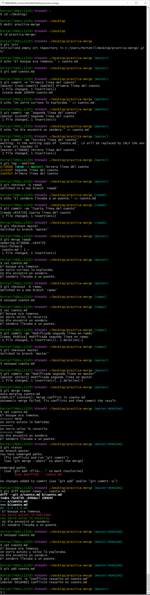
</p>


&nbsp;&nbsp;&nbsp;[↩️](#tabla-de-contenido)

# 7. Moviéndonos en el Historial de Git  

Git nos permite navegar entre diferentes versiones de nuestro proyecto, ya sea para revisar cambios previos, deshacer errores o incluso recuperar versiones antiguas. En este capítulo, aprenderás cómo moverte en el historial de commits sin perder información.  

A lo largo de esta sección, exploraremos tres comandos esenciales:  

- **`git checkout <commit>`**: Para movernos a un commit específico.  
- **`git reset`**: Para deshacer commits y regresar a un estado anterior.  
- **`git revert`**: Para deshacer cambios sin modificar el historial.  

Con estos comandos, podrás viajar en el tiempo dentro de tu repositorio y manejar de forma segura los cambios en tu código.  

---

### * `git checkout`: Movernos a un commit específico  

Git es como una **máquina del tiempo** para tu código. A veces necesitas retroceder para revisar un cambio, ver cómo estaba tu código hace unos días o depurar errores. Para eso, Git tiene varios **atajos geniales** para moverte en el historial.  

> [!NOTE]  
> Desde 2019, Git introdujo `git switch` como una alternativa más clara y específica para cambiar de rama. Aun así, `git checkout` sigue funcionando y muchos desarrolladores siguen usándolo por costumbre o compatibilidad.  

La mayoría de los desarrolladores suelen hacerlo de la siguiente manera:  

① **Ver el historial en versión corta:**  
   ```bash
   git log --oneline
   ```
   Esto mostrará algo como esto:  
   ```plaintext
   * a1b2c3d (HEAD -> master) Fix en validación de formulario  
   * f6g7h8i Nueva funcionalidad de login  
   * j9k0l1m Implementación de API  
   * c2d3e4f Refactorización del código  
   * g4h5i6j Mejora en la documentación  
   * k7l8m9n Eliminación de código obsoleto  
   * p0q1r2s Configuración inicial de CI/CD  
   * t3u4v5w Agregado soporte para logs  
   * x6y7z8a Estructura base del proyecto  
   * b9c0d1e Commit inicial  
   ```

   Aquí, `HEAD -> master` indica la posición actual de `HEAD`, es decir, el último commit en la rama `master`.  

② **Copiar el hash del commit al que quieres ir.**  

③ **Usar `git checkout` para moverte a un commit específico:**  
   ```bash
   git checkout c2d3e4f
   ```
   `HEAD` ahora pasará a estar en `c2d3e4f` (**Refactorización del código**).  

---

También es posible retroceder sin necesidad de copiar un hash, usando atajos más rápidos:  

✅ **Un paso atrás**  
   ```bash
   git checkout HEAD^
   ```  
   Si `HEAD` se encontraba en `a1b2c3d`, ahora pasará a estar en `f6g7h8i` (**Nueva funcionalidad de login**).  

   > [!TIP]  
   > ```bash
   > git checkout -
   > ```  
   > Vuelve a la rama o commit anterior en un solo paso. 🔄✨

✅ **Dos pasos atrás**  
   ```bash
   git checkout HEAD^^
   ```  
   Si `HEAD` se encontraba en `a1b2c3d`, ahora pasará a estar en `j9k0l1m` (**Implementación de API**).  

✅ **Tres pasos atrás**  
   ```bash
   git checkout HEAD^^^
   ```  
   Si `HEAD` se encontraba en `a1b2c3d`, ahora pasará a estar en `c2d3e4f` (**Refactorización del código**).  

✅ **Retroceder N commits**  
   ```bash
   git checkout HEAD~5
   ```
   Si `HEAD` se encontraba en `a1b2c3d`, ahora pasará a estar en `k7l8m9n` (**Eliminación de código obsoleto**).  

✅ **Saltar a un commit y retroceder desde ahí**  
```bash
git checkout c2d3e4f
git checkout HEAD^^
```  
No importa en qué commit estés, este comando **primero te lleva a `c2d3e4f`** (**Refactorización del código**) y luego **retrocede dos commits más**, aterrizando en `k7l8m9n` (**Eliminación de código obsoleto**).  

> <h4>⚡ Hack</h4>  
>  
> Hazlo en **un solo comando**:  
> ```bash
> git checkout c2d3e4f^^
> ```  
> Salta directamente a `c2d3e4f` y retrocede dos commits **sin interrupciones. Pero shhh... que esto quede entre nosotros. 🤫
>

✅ **Retroceder desde una rama específica (`ramab`)**  
   ```bash
   git checkout ramab^^
   ```
   Si `HEAD` estaba en la punta de la rama `ramab`, ahora pasará a estar dos commits atrás en la misma rama.  

📌 **Ejemplo:**  
```bash
git checkout ramab~5
```
Si `HEAD` estaba en la punta de `ramab`, ahora pasará a estar **cinco commits atrás** en la misma rama.  

---

### 🚨 ¿Qué es el "detached HEAD"?  

Cuando usas `git checkout <commit>` o cualquiera de los atajos anteriores, **HEAD deja de seguir una rama y se posiciona en un commit específico**. Esto se conoce como **detached HEAD**, y significa que:  

✅ Puedes ver el código tal como estaba en ese commit.  
❌ No estás en ninguna rama.  
⚠️ Si haces cambios aquí y no los guardas, **se perderán al cambiar de commit**.  

Cuando HEAD está "desconectado", no apunta a ninguna rama en particular, sino solo a un commit específico.  

> **Tip:** Si quieres modificar el código sin perderlo, **crea una nueva rama antes de hacer cambios**:  
> ```bash
> git checkout -b mi-nueva-rama
> ```

---

### 🔍 ¿Cómo saber si estás en "detached HEAD"?  

Después de moverte con `git checkout <commit>`, Git te lo advertirá con un mensaje como este:  

```plaintext
Note: switching to 'c2d3e4f'.

You are in 'detached HEAD' state.
```

También puedes verificarlo manualmente con:  
```bash
git status
```
Si estás en detached HEAD, verás algo como esto:  

```plaintext
HEAD detached at c2d3e4f
```

---

### ⏩ ¿Cómo volver a la normalidad?  

Si solo querías explorar un commit y regresar, usa:  

```bash
git checkout master  # O la rama en la que estabas antes
```

Esto te devuelve a una **rama activa**, evitando que Git borre tu trabajo.

Si no recuerdas en qué commit estabas antes, puedes revisar el historial de movimientos con:  
```bash
git reflog
```
Y para volver a una posición anterior reciente:  
```bash
git checkout HEAD@{N}
```
📌 **Ejemplo:**  
```bash
git checkout HEAD@{2}  # Regresa a donde estabas hace dos movimientos
```

> [!NOTE]  
> Linus Torvalds no diseñó Git para ser fácil, sino **para ser poderoso**. Él mismo dijo que era una herramienta para gente inteligente. 🧠🔥  

> [!IMPORTANT]  
> Ahora piensa bien qué hace el siguiente comando y prepárate para recordarlo en el examen del profesorcito 😏:
> ```bash
> git checkout HEAD@{1}
> ```  
>

&nbsp;&nbsp;&nbsp;[↩️](#tabla-de-contenido)

