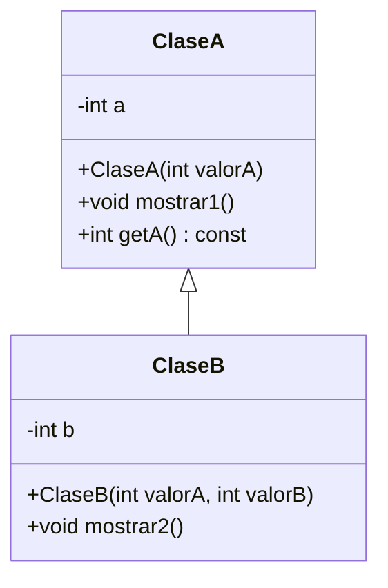
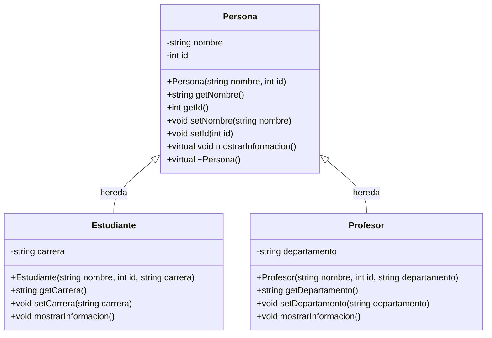
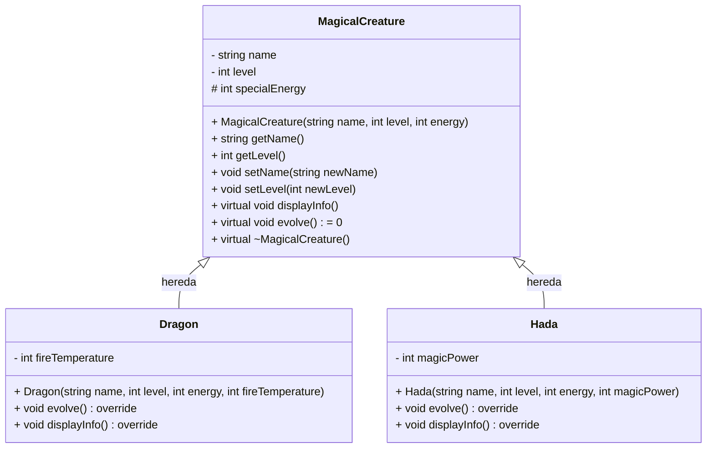
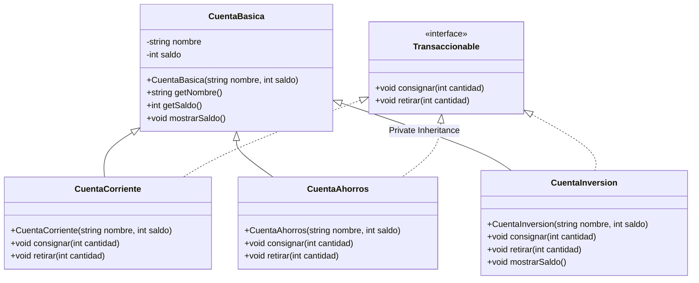

---

# 💻 300CIS017 Programación Orientada a Objetos 2025-02  <!-- omit in toc -->

[](https://creativecommons.org/licenses/by-nc-nd/4.0/)

---

# 🌟 Tema 3: POO - Parte 1 (Herencia) <!-- omit in toc -->

---

### 🎥 Videos que inspiraron este tema:

<table style="border-collapse: collapse; width: 100%; border: none; margin: 10px 0;">
  <tr>
    <td style="text-align: center; padding: 5px; border: none;">
      <a href="https://www.youtube.com/watch?v=92XVwY54h5k">
        
      </a>
      <br>
      <span style="font-size: 12px; margin-top: 5px; display: inline-block;">Car Radio<br>TØP</span>
    </td>
    <td style="text-align: center; padding: 5px; border: none;">
      <a href="https://www.youtube.com/watch?v=eJnQBXmZ7Ek">
        
      </a>
      <br>
      <span style="font-size: 12px; margin-top: 5px; display: inline-block;">Chlorine<br>TØP</span>
    </td>
    <td style="text-align: center; padding: 5px; border: none;">
      <a href="https://www.youtube.com/watch?v=UprcpdwuwCg">
        
      </a>
      <br>
      <span style="font-size: 12px; margin-top: 5px; display: inline-block;">Heathens<br>TØP</span>
    </td>
  </tr>
</table>

---

### 💻 Creado por   

Profesorcito © 2025

<!-- <svg version="1.1" width="16" height="16" viewBox="0 0 16 16" class="octicon octicon-trash" aria-label="The trash icon" role="img"><path d="M11 1.75V3h2.25a.75.75 0 0 1 0 1.5H2.75a.75.75 0 0 1 0-1.5H5V1.75C5 .784 5.784 0 6.75 0h2.5C10.216 0 11 .784 11 1.75ZM4.496 6.675l.66 6.6a.25.25 0 0 0 .249.225h5.19a.25.25 0 0 0 .249-.225l.66-6.6a.75.75 0 0 1 1.492.149l-.66 6.6A1.748 1.748 0 0 1 10.595 15h-5.19a1.75 1.75 0 0 1-1.741-1.575l-.66-6.6a.75.75 0 1 1 1.492-.15ZM6.5 1.75V3h3V1.75a.25.25 0 0 0-.25-.25h-2.5a.25.25 0 0 0-.25.25Z"></path></svg>

<svg version="1.1" width="16" height="16" viewBox="0 0 16 16" class="octicon octicon-pencil" aria-label="The pencil icon" role="img"><path d="M11.013 1.427a1.75 1.75 0 0 1 2.474 0l1.086 1.086a1.75 1.75 0 0 1 0 2.474l-8.61 8.61c-.21.21-.47.364-.756.445l-3.251.93a.75.75 0 0 1-.927-.928l.929-3.25c.081-.286.235-.547.445-.758l8.61-8.61Zm.176 4.823L9.75 4.81l-6.286 6.287a.253.253 0 0 0-.064.108l-.558 1.953 1.953-.558a.253.253 0 0 0 .108-.064Zm1.238-3.763a.25.25 0 0 0-.354 0L10.811 3.75l1.439 1.44 1.263-1.263a.25.25 0 0 0 0-.354Z"></path></svg>

<svg aria-hidden="true" focusable="false" class="mt-1" viewBox="0 0 16 16" width="16" height="16" fill="currentColor" style="display: inline-block; user-select: none; vertical-align: text-bottom; overflow: visible;"><path d="M10.561 8.073a6.005 6.005 0 0 1 3.432 5.142.75.75 0 1 1-1.498.07 4.5 4.5 0 0 0-8.99 0 .75.75 0 0 1-1.498-.07 6.004 6.004 0 0 1 3.431-5.142 3.999 3.999 0 1 1 5.123 0ZM10.5 5a2.5 2.5 0 1 0-5 0 2.5 2.5 0 0 0 5 0Z"></path></svg>

<svg version="1.1" width="16" height="16" viewBox="0 0 16 16" class="octicon octicon-repo" aria-hidden="true"><path d="M2 2.5A2.5 2.5 0 0 1 4.5 0h8.75a.75.75 0 0 1 .75.75v12.5a.75.75 0 0 1-.75.75h-2.5a.75.75 0 0 1 0-1.5h1.75v-2h-8a1 1 0 0 0-.714 1.7.75.75 0 1 1-1.072 1.05A2.495 2.495 0 0 1 2 11.5Zm10.5-1h-8a1 1 0 0 0-1 1v6.708A2.486 2.486 0 0 1 4.5 9h8ZM5 12.25a.25.25 0 0 1 .25-.25h3.5a.25.25 0 0 1 .25.25v3.25a.25.25 0 0 1-.4.2l-1.45-1.087a.249.249 0 0 0-.3 0L5.4 15.7a.25.25 0 0 1-.4-.2Z"></path></svg>

<svg version="1.1" width="16" height="16" viewBox="0 0 16 16" class="octicon octicon-trash" aria-label="The trash icon" role="img"><path d="M11 1.75V3h2.25a.75.75 0 0 1 0 1.5H2.75a.75.75 0 0 1 0-1.5H5V1.75C5 .784 5.784 0 6.75 0h2.5C10.216 0 11 .784 11 1.75ZM4.496 6.675l.66 6.6a.25.25 0 0 0 .249.225h5.19a.25.25 0 0 0 .249-.225l.66-6.6a.75.75 0 0 1 1.492.149l-.66 6.6A1.748 1.748 0 0 1 10.595 15h-5.19a1.75 1.75 0 0 1-1.741-1.575l-.66-6.6a.75.75 0 1 1 1.492-.15ZM6.5 1.75V3h3V1.75a.25.25 0 0 0-.25-.25h-2.5a.25.25 0 0 0-.25.25Z"></path></svg>

<svg aria-hidden="true" focusable="false" class="Octicon-sc-9kayk9-0 kfGkqo" viewBox="0 0 16 16" width="16" height="16" fill="currentColor" style="display: inline-block; user-select: none; vertical-align: text-bottom; overflow: visible;"><path d="M0 8a8 8 0 1 1 16 0A8 8 0 0 1 0 8Zm8-6.5a6.5 6.5 0 1 0 0 13 6.5 6.5 0 0 0 0-13ZM6.5 7.75A.75.75 0 0 1 7.25 7h1a.75.75 0 0 1 .75.75v2.75h.25a.75.75 0 0 1 0 1.5h-2a.75.75 0 0 1 0-1.5h.25v-2h-.25a.75.75 0 0 1-.75-.75ZM8 6a1 1 0 1 1 0-2 1 1 0 0 1 0 2Z"></path></svg>
 -->
---

### 🎶 Dedicado a 

[Tyler Joseph y Josh Dun](https://en.wikipedia.org/wiki/Twenty_One_Pilots) (Tyler y Josh) 🎤


--- 

Con lo visto hasta ahora hemos trabajado principalmente los elementos propios del lenguaje C++ 💻. A partir de este capítulo daremos un paso importante: comenzaremos a adentrarnos en el paradigma de la programación orientada a objetos.

Para iniciar este recorrido, abordaremos directamente uno de sus conceptos más potentes: **la herencia**. A través de su estudio iremos comprendiendo cómo se construyen y organizan las clases, cómo se comparten y reutilizan comportamientos, y cómo representar estas relaciones de manera visual mediante **diagramas UML**. 🚀

---

### **Tabla de Contenido**

- [1. **Introducción a la Herencia en C++**](#1-introducción-a-la-herencia-en-c)
- [2. **Clases Base y Clases Derivadas**](#2-clases-base-y-clases-derivadas)
  - [**Clase Base (o Superclase):**](#clase-base-o-superclase)
  - [**Clase Derivada (o Subclase):**](#clase-derivada-o-subclase)
  - [**Ejemplo 1** - Herencia entre ClaseA y ClaseB](#ejemplo-1---herencia-entre-clasea-y-claseb)
- [3. **Modificadores de Acceso en C++**](#3-modificadores-de-acceso-en-c)
- [4. **Tipos de Herencia**](#4-tipos-de-herencia)
  - [Herencia Pública (`public`)](#herencia-pública-public)
  - [Herencia Protegida (`protected`)](#herencia-protegida-protected)
  - [Herencia Privada (`private`)](#herencia-privada-private)
- [5. **Visibilidad de Atributos y Métodos en C++**](#5-visibilidad-de-atributos-y-métodos-en-c)
- [6. **Modificación de Accesos Según la Herencia**](#6-modificación-de-accesos-según-la-herencia)
  - [**Ejemplo 2** - Persona, Estudiante, Profesor](#ejemplo-2---persona-estudiante-profesor)
    - [📌 1. **Clase `Persona`**](#-1-clase-persona)
    - [📌 2. **Clase `Estudiante`**](#-2-clase-estudiante)
    - [📌 3. **Clase `Profesor`**](#-3-clase-profesor)
    - [📌 4. **Función `main()`**](#-4-función-main)
    - [Diagrama UML](#diagrama-uml)
  - [**Ejemplo 3** - Criaturas Mágicas](#ejemplo-3---criaturas-mágicas)
    - [📌 1. **Clase `MagicalCreature` (Base)**](#-1-clase-magicalcreature-base)
    - [📌 2. **Clase `Dragon` (Derivada de `MagicalCreature`)**](#-2-clase-dragon-derivada-de-magicalcreature)
    - [📌 3. **Clase `Hada` (Derivada de `MagicalCreature`)**](#-3-clase-hada-derivada-de-magicalcreature)
    - [📌 4. **Función `main()`**](#-4-función-main-1)
    - [📌 5. **Revisualización tras Evolución:**](#-5-revisualización-tras-evolución)
    - [📌 6. **Liberación de Memoria:**](#-6-liberación-de-memoria)
    - [Diagrama UML](#diagrama-uml-1)
  - [**Ejemplo 4** - Herencia Múltiple](#ejemplo-4---herencia-múltiple)
    - [📌 1. **Clase `CuentaBasica`**](#-1-clase-cuentabasica)
    - [📌 2. **Clase `Transaccionable` (Interfaz)**](#-2-clase-transaccionable-interfaz)
    - [📌 3. **Clase `CuentaCorriente`**](#-3-clase-cuentacorriente)
    - [📌 4. **Clase `CuentaAhorros`**](#-4-clase-cuentaahorros)
    - [📌 5. **Clase `CuentaInversion`**](#-5-clase-cuentainversion)
    - [📌 6. **Función `main()`**](#-6-función-main)
    - [Diagrama UML](#diagrama-uml-2)

---

# Herencia en C++ <!-- omit in toc -->

# 1. **Introducción a la Herencia en C++**

La herencia es un mecanismo fundamental de la Programación Orientada a Objetos (POO) que permite crear nuevas clases a partir de clases existentes. Este proceso se realiza copiando características (atributos y métodos) de una clase base a una clase derivada. La principal ventaja de la herencia es la reutilización de código y la posibilidad de extender o modificar comportamientos sin alterar el código original.

# 2. **Clases Base y Clases Derivadas**

## **Clase Base (o Superclase):**  
Es una clase que sirve como modelo para crear otras clases. Define atributos y métodos comunes que pueden ser reutilizados por otras clases para evitar repetir código.  

## **Clase Derivada (o Subclase):**  
Es una clase que se crea a partir de una clase base, heredando sus atributos y métodos. Además, puede agregar o modificar funcionalidades para adaptarse a necesidades específicas.  

## 💡 ¿Cómo se define la herencia?  <!-- omit in toc -->

En C++, la herencia se especifica utilizando el símbolo `:` seguido de un modificador de acceso (`public`, `protected` o `private`) y el nombre de la clase base. Ejemplo:

```cpp
class ClaseB : public ClaseA { ... };
```

## **Ejemplo 1** - Herencia entre ClaseA y ClaseB

En este ejemplo, `ClaseB` hereda de `ClaseA`, accediendo a sus métodos públicos y utilizando un método para obtener el atributo privado `a`. Además, `ClaseB` agrega un nuevo atributo `b` y un método para mostrar ambos valores.


```cpp
#include <iostream>
using namespace std;

class ClaseA {
private:
    int a;
public:
    ClaseA(int valorA) : a(valorA) {}

    void mostrar1() {
        cout << "[ a=" << a << " ]" << endl;
    }

    int getA() const {
        return a;
    }
};

class ClaseB : public ClaseA {
private:
    int b;

public:
    ClaseB(int valorA, int valorB) : ClaseA(valorA), b(valorB) {}

    void mostrar2() {
        cout << "[ a=" << getA() << ", b=" << b << " ]" << endl;
    }
};

int main() {
    ClaseA x(10);
    ClaseB y(20, 30);
    x.mostrar1();
    y.mostrar1();
    y.mostrar2();

    return 0;
}
```

**Salida:**

```
[ a=10 ]
[ a=20 ]
[ a=20, b=30 ]
```

<details><summary>👨‍🏫 Explicación</summary>

### 🔍 **Clases y Atributos:**  <!-- omit in toc --> 
- **`ClaseA` (Clase Base):**  
  - **Atributo privado:** `int a;` — No accesible directamente fuera de la clase, reforzando el encapsulamiento.  
  - **Constructor:** Inicializa `a` con el valor pasado como argumento (`valorA`).  
  - **Método público `mostrar1()`:** Imprime el valor del atributo `a` con el formato: `[ a=valor ]`.  
  - **Método `getA()`:** Devuelve el valor de `a` para permitir el acceso controlado desde fuera de la clase. Este método es `const`, asegurando que no modifica el objeto.  
  
---

- **`ClaseB` (Clase Derivada):**  <!-- omit in toc -->
  - Hereda de `ClaseA` mediante **herencia pública** (`public ClaseA`). Esto significa que `ClaseB` puede acceder a los métodos públicos de `ClaseA` pero no a sus atributos privados.  
  - **Atributo privado:** `int b;` — Exclusivo de `ClaseB` y no accesible fuera de la clase.  
  - **Constructor:** Inicializa `b` y también llama al constructor de `ClaseA` para inicializar `a` (mediante `ClaseA(valorA)`).  
  - **Método `mostrar2()`:** Muestra ambos atributos (`a` y `b`). Como `a` es privado en `ClaseA`, se accede a él mediante el método `getA()`. El formato de salida es: `[ a=valorA, b=valorB ]`.  
  
---

### 🔍 **Función `main()`:**  <!-- omit in toc -->
En la función `main()`, se crean dos objetos:  

- `x` de tipo `ClaseA`, inicializado con `a = 10`.  
- `y` de tipo `ClaseB`, inicializado con `a = 20` y `b = 30`.  

Llamadas a métodos:  

1. `x.mostrar1()` imprime: **`[ a=10 ]`**.  
2. `y.mostrar1()` imprime: **`[ a=20 ]`**. Aquí se está llamando al método `mostrar1()` heredado de `ClaseA`.  
3. `y.mostrar2()` imprime: **`[ a=20, b=30 ]`**. Para mostrar `a`, se llama al método `getA()` de la clase base `ClaseA` que devuelve su valor.  

</details>

---

## **Diagrama de Clases (UML)** <!-- omit in toc -->

UML, que significa **Unified Modeling Language** (Lenguaje de Modelado Unificado), es un estándar visual ampliamente utilizado en la ingeniería de software para representar la estructura de un sistema mediante diagramas. UML permite describir las relaciones y comportamientos de los componentes de un sistema de forma gráfica, facilitando su comprensión y comunicación entre los desarrolladores y otros interesados.

En particular, el **Diagrama de Clases** es uno de los diagramas más importantes de UML. Este diagrama muestra cómo las clases están relacionadas entre sí, qué atributos y métodos tienen, y cómo interactúan.

A continuación, se presenta un diagrama UML que muestra la relación de herencia entre `ClaseA` y `ClaseB`, del ejemplo anterior. De ahora en adelante, utilizaremos diagramas UML para modelar nuestros desarrollos.

<div style="display: flex; justify-content: center;">



</div>

### Explicación del Diagrama <!-- omit in toc -->

En este diagrama, la **flecha vacía** entre `ClaseA` y `ClaseB` indica una relación de **herencia**. Específicamente, muestra que **`ClaseB` hereda de `ClaseA`**, lo que significa que `ClaseB` puede acceder a los métodos públicos de `ClaseA` (como `mostrar1()` y `getA()`), pero no a sus atributos privados.

Es importante notar el uso de los signos `+` y `-` en el diagrama:  
- El signo `+` delante de un atributo o método indica que es **público** y, por lo tanto, accesible desde fuera de la clase.  
- El signo `-` delante de un atributo indica que es **privado**, lo que significa que no es accesible directamente desde fuera de la clase. En este caso, el atributo `a` en `ClaseA` está marcado con un `-`, lo que significa que no se puede acceder a él directamente desde `ClaseB`, sino que debe hacerse a través de métodos públicos como `getA()`. Esto asegura el **encapsulamiento**, protegiendo la integridad de los datos de la clase base.

Además, el diagrama muestra que `ClaseA` tiene un atributo privado `a` y un constructor que recibe un valor para inicializarlo. La clase `ClaseB` también tiene su propio atributo privado `b` y un método `mostrar2()` que permite visualizar ambos atributos. Para acceder al valor de `a` desde `ClaseB`, se utiliza el método público `getA()` de la clase base.

Este tipo de diagramas facilita la visualización de las relaciones entre clases, permitiendo comprender de manera clara y rápida cómo se organiza la estructura del código y cómo interactúan los diferentes componentes.

---

# 3. **Modificadores de Acceso en C++**

Hasta ahora, hemos trabajado con dos modificadores de acceso principales en nuestras clases:

- **`public`**: Todo lo que está aquí es accesible desde fuera de la clase.  
- **`private`**: Todo lo que está aquí es inaccesible desde fuera de la clase, lo que permite ocultar los detalles internos y restringir el acceso solo dentro de la clase.

Ahora, al adentrarnos en el mundo de la herencia, necesitamos un nuevo nivel de acceso:

- **`protected`**: Aunque es inaccesible desde fuera de la clase, **puede ser accedido por clases derivadas**. Esto permite compartir información con subclases sin comprometer la encapsulación total.

> [!NOTE]
> ¿Por qué Bjarne Stroustrup le puso el nombre de protected? Cuando Bjarne Stroustrup diseñó C++, necesitaba un mecanismo que permitiera a las clases derivadas heredar ciertos atributos o métodos de su clase base **sin exponerlos completamente al mundo exterior**. El modificador `protected` refleja precisamente esta intención: proteger ciertos elementos de ser accesibles libremente desde fuera de la clase, pero permitiendo que las clases derivadas puedan utilizarlos. De esta manera, se garantiza la **encapsulación** al mismo tiempo que se facilita la herencia, permitiendo que las subclases extiendan o modifiquen el comportamiento de la clase base sin comprometer su seguridad.
>

---

## En resumen: <!-- omit in toc -->

- **public:** Accesible por todos.
- **private:** Accesible solo por la misma clase.
- **protected:** Accesible por la misma clase y sus clases derivadas.

# 4. **Tipos de Herencia**

## Herencia Pública (`public`)
Los miembros **públicos** y **protegidos** son accesibles en la clase derivada, pero **no los privados**.  

```cpp
#include <iostream>
using namespace std;

class Base {
public:
    int x;
protected:
    int y;
private:
    int z;
};

class Derivada : public Base {  // Cambié de 'protected' a 'public'
public:
    Derivada() {
        x = 10;  // Permitido (sigue siendo público en Derivada)
        y = 20;  // Permitido (protegido en Derivada)
        // z = 30;  // Error: 'z' es privado en Base
    }

    void mostrar() {
        cout << "x: " << x << endl;
        cout << "y: " << y << endl;
    }
};

int main() {
    Derivada obj;
    obj.x = 15;     // Ahora permitido (x es público por herencia pública)
    // obj.y = 25;  // Error: No accesible (protegido)
    // obj.z = 35;  // Error: No accesible (privado)
    obj.mostrar();
    return 0;
}
```

**Salida:**

```
x: 15
y: 20
```

---

## Herencia Protegida (`protected`) 

Los miembros **públicos** y **protegidos** de la clase base se convierten en **protegidos** en la clase derivada. Los privados siguen inaccesibles.  

```cpp
#include <iostream>
using namespace std;

class Base {
public:
    int x;
protected:
    int y;
private:
    int z;
};

class Derivada : protected Base {
public:
    Derivada() {
        x = 10;  // Permitido (protegido en Derivada)
        y = 20;  // Permitido (protegido en Derivada)
        // z = 30;  // Error: 'z' es privado en Base
    }

    void mostrar() {
        cout << "x: " << x << endl;
        cout << "y: " << y << endl;
    }
};

int main() {
    Derivada obj;
    // obj.x = 10;   // Error: No accesible (protected)
    // obj.y = 20;   // Error: No accesible (protected)
    // obj.z = 30;   // Error: No accesible (private)
    obj.mostrar();
    return 0;
}
```

**Salida:**

```
x: 10
y: 20
```


---

## Herencia Privada (`private`)
Todos los miembros de la clase base (públicos y protegidos) se convierten en **privados** en la clase derivada. Los privados originales de la base siguen inaccesibles.  

```cpp
#include <iostream>
using namespace std;

class Base {
public:
    int x;
protected:
    int y;
private:
    int z;
};

class Derivada : private Base {  // Cambié de 'protected' a 'private'
public:
    Derivada() {
        x = 10;  // Permitido (convertido a privado en Derivada)
        y = 20;  // Permitido (convertido a privado en Derivada)
        // z = 30;  // Error: 'z' es privado en Base
    }

    void mostrar() {
        cout << "x: " << x << endl;
        cout << "y: " << y << endl;
    }
};

int main() {
    Derivada obj;
    // obj.x = 15;    // Error: No accesible (privado por herencia privada)
    // obj.y = 25;    // Error: No accesible (privado por herencia privada)
    // obj.z = 35;    // Error: No accesible (privado en Base)
    obj.mostrar();
    return 0;
}
```

**Salida:**

```
x: 10
y: 20
```

# 5. **Visibilidad de Atributos y Métodos en C++**

En C++, la visibilidad de atributos y métodos se controla mediante modificadores de acceso (`public`, `protected` y `private`). Estos modificadores determinan qué partes del programa pueden acceder a miembros específicos de una clase. A continuación se muestra cómo funciona cada uno:  


| Tipo de acceso | Desde la misma clase | Desde clases derivadas | Desde fuera (main, otros objetos, etc.) |
|----------------|---------------------|-----------------------|---------------------------------------|
| `public`       | ✅ Sí               | ✅ Sí                 | ✅ Sí                                 |
| `protected`    | ✅ Sí               | ✅ Sí                 | ❌ No                                 |
| `private`      | ✅ Sí               | ❌ No                 | ❌ No                                 |

- **`public`**: Los miembros declarados como `public` son accesibles desde cualquier parte del código, incluidas las clases derivadas y funciones externas.  
- **`protected`**: Los miembros `protected` son accesibles desde la misma clase y sus clases derivadas, pero no desde fuera de la jerarquía de herencia.  
- **`private`**: Los miembros `private` solo pueden ser accedidos desde la propia clase donde se declararon, sin acceso directo desde clases derivadas ni funciones externas.  

> [!IMPORTANT]
> 
> Estos modificadores son esenciales para garantizar la encapsulación y el control de acceso adecuado en programas orientados a objetos.
>

# 6. **Modificación de Accesos Según la Herencia**

En C++, el tipo de herencia que se utiliza (`public`, `protected` o `private`) afecta directamente la visibilidad de los miembros heredados de una clase base en la clase derivada. Este mecanismo es fundamental para controlar el acceso y la protección de datos en la programación orientada a objetos.  


| Tipo de acceso en la clase base | Herencia Pública (`: public`) | Herencia Protegida (`: protected`) | Herencia Privada (`: private`) |
|---------------------------------|------------------------------|-----------------------------------|--------------------------------|
| `public`                        | 🔓 Sigue siendo `public`      | 🔒 Se convierte en `protected`     | 🔒 Se convierte en `private`    |
| `protected`                     | 🔒 Sigue siendo `protected`   | 🔒 Sigue siendo `protected`        | 🔒 Se convierte en `private`    |
| `private`                       | 🔐 Sigue siendo `private`     | 🔐 Sigue siendo `private`          | 🔐 Sigue siendo `private`       |

#### 🔍 **Explicación Detallada:**  <!-- omit in toc --> 
- **Herencia Pública (`: public`)**:  
  Los miembros `public` de la clase base permanecen `public` en la clase derivada. Los miembros `protected` se heredan como `protected`. Los miembros `private` no se heredan directamente, aunque pueden ser accesibles mediante funciones `public` o `protected` de la clase base.  

- **Herencia Protegida (`: protected`)**:  
  Los miembros `public` de la clase base se convierten en `protected` en la clase derivada. Los miembros `protected` se mantienen `protected`, mientras que los `private` no se heredan. Esto limita el acceso a los miembros heredados, permitiendo que solo las clases derivadas tengan acceso a ellos.  

- **Herencia Privada (`: private`)**:  
  Todos los miembros heredados (`public` y `protected`) se convierten en `private` dentro de la clase derivada. Los miembros `private` de la clase base no se heredan. Este tipo de herencia se utiliza principalmente para implementar composición o para ocultar completamente la interfaz pública de la clase base.  

> [!IMPORTANT]
> 
> Este control de accesos permite definir claramente qué se puede heredar y cómo debe ser accedido desde clases derivadas, asegurando así la encapsulación adecuada.
>

---

## **Ejemplo 2** - Persona, Estudiante, Profesor

A continuación, crearemos un programa que define una clase base llamada `Persona` y dos clases derivadas, `Estudiante` y `Profesor`, que heredan de `Persona`. Este ejemplo demostrará cómo las clases derivadas pueden extender y modificar el comportamiento de la clase base, así como la utilización de getters y setters para acceder y modificar atributos privados.

```cpp
#include <iostream>
#include <string>
#include <vector>

using namespace std;

class Persona {
private:
    string nombre;
    int id;

public:
    Persona(const string& nombre, int id) : nombre(nombre), id(id) {}

    string getNombre() const { return nombre; }
    int getId() const { return id; }

    void setNombre(const string& nuevoNombre) { nombre = nuevoNombre; }
    void setId(int nuevoId) { id = nuevoId; }

    virtual void mostrarInformacion() const {
        cout << "[ Persona: " << nombre << ", " << id << " ]" << endl;
    }

    virtual ~Persona() {} // Destructor virtual
};

class Estudiante : public Persona {
private:
    string carrera;

public:
    Estudiante(const string& nombre, int id, const string& carrera)
        : Persona(nombre, id), carrera(carrera) {}

    string getCarrera() const { return carrera; }
    void setCarrera(const string& nuevaCarrera) { carrera = nuevaCarrera; }

    void mostrarInformacion() const override {
        cout << "[ Estudiante: " << getNombre() << ", " << getId()
             << ", " << carrera << " ]" << endl;
    }
};

class Profesor : public Persona {
private:
    string departamento;

public:
    Profesor(const string& nombre, int id, const string& departamento)
        : Persona(nombre, id), departamento(departamento) {}

    string getDepartamento() const { return departamento; }
    void setDepartamento(const string& nuevoDepartamento) { departamento = nuevoDepartamento; }

    void mostrarInformacion() const override {
        cout << "[ Profesor: " << getNombre() << ", " << getId()
             << ", " << departamento << " ]" << endl;
    }
};

int main() {
    vector<Persona*> listaPersonas;

    listaPersonas.push_back(new Estudiante("Carlos", 20, "Ingenieria en Sistemas"));
    listaPersonas.push_back(new Estudiante("Ana", 22, "Matematicas"));
    listaPersonas.push_back(new Profesor("Dra. Maria", 45, "Ciencias de la Computacion"));
    listaPersonas.push_back(new Profesor("Dr. Pedro", 50, "Fisica"));

    // Mostrar información de cada persona
    for (const auto& persona : listaPersonas) {
        persona->mostrarInformacion();
    }

    // Modificando atributos
    listaPersonas[0]->setNombre("Carlos Alberto");
    listaPersonas[1]->setId(23);

    cout << endl;

    // Mostrar información modificada
    for (const auto& persona : listaPersonas) {
        persona->Persona::mostrarInformacion();
    }

    // Liberar memoria
    for (auto persona : listaPersonas) {
        delete persona;
    }

    return 0;
}
```

### Explicación <!-- omit in toc -->

Este programa define un sistema básico para manejar información sobre **Personas**, **Estudiantes** y **Profesores**. Los datos se almacenan en un vector (`listaPersonas`) y se muestran o modifican usando métodos específicos de cada clase. A continuación, se explican los componentes principales del código:

---

### 📌 1. **Clase `Persona`**  
La clase `Persona` representa a una persona general con nombre e identificación.

- **Atributos privados:**  
  - `nombre`: Almacena el nombre de la persona.  
  - `id`: Identificador único de la persona.

- **Constructor:**  
  Permite inicializar el `nombre` y el `id` al crear un objeto de tipo `Persona`.

- **Métodos públicos:**  
  - Métodos `getNombre()` y `getId()` para obtener los valores de los atributos.  
  - Métodos `setNombre()` y `setId()` para modificar esos valores.  
  - `mostrarInformacion()`:  
    ```cpp
    virtual void mostrarInformacion() const {
        cout << "[ Persona: " << nombre << ", " << id << " ]" << endl;
    }
    ```
    Declarado como `virtual` para que pueda redefinirse en clases que hereden de `Persona`, permitiendo que cada tipo muestre su información personalizada.
  
- **Destructor:**  
  ```cpp
  virtual ~Persona() {}
  ```
  Declarado como `virtual` para asegurarse de que al eliminar un objeto que hereda de `Persona`, se libere correctamente la memoria.

---

### 📌 2. **Clase `Estudiante`**
La clase `Estudiante` hereda de `Persona` y agrega información adicional sobre un estudiante.

- **Atributo privado:**  
  - `carrera`: Indica la carrera que cursa el estudiante.

- **Constructor:**  
  Permite inicializar `nombre`, `id` y `carrera`.

- **Métodos públicos:**  
  - Métodos `getCarrera()` y `setCarrera()` para obtener y modificar la carrera.  
  - `mostrarInformacion() const`:  
    ```cpp
    void mostrarInformacion() const override {
        cout << "[ Estudiante: " << getNombre() << ", " << getId() << ", " << carrera << " ]" << endl;
    }
    ```
    Usa `override` para asegurar que se está redefiniendo correctamente el método `mostrarInformacion()` de `Persona`.

---

### 📌 3. **Clase `Profesor`**
La clase `Profesor` hereda de `Persona` y agrega información sobre un profesor.

- **Atributo privado:**  
  - `departamento`: Indica el departamento al que pertenece el profesor.

- **Constructor:**  
  Permite inicializar `nombre`, `id` y `departamento`.

- **Métodos públicos:**  
  - Métodos `getDepartamento()` y `setDepartamento()` para obtener y modificar el departamento.  
  - `mostrarInformacion() const`:  
    ```cpp
    void mostrarInformacion() const override {
        cout << "[ Profesor: " << getNombre() << ", " << getId() << ", " << departamento << " ]" << endl;
    }
    ```
    Usa `override` para personalizar cómo se muestra la información de un profesor.

---

### 📌 4. **Función `main()`**
Esta función maneja la creación, modificación, visualización y eliminación de los objetos.  

1. **Creación de objetos y almacenaje en un vector:**  
   ```cpp
   vector<Persona*> listaPersonas;
   listaPersonas.push_back(new Estudiante("Carlos", 20, "Ingenieria en Sistemas"));
   listaPersonas.push_back(new Estudiante("Ana", 22, "Matematicas"));
   listaPersonas.push_back(new Profesor("Dra. Maria", 45, "Ciencias de la Computacion"));
   listaPersonas.push_back(new Profesor("Dr. Pedro", 50, "Fisica"));
   ```

> [!IMPORTANT]
>
>Usamos `vector<Persona*>` en lugar de `vector<Persona>` para evitar un problema llamado *slicing*. El *slicing* ocurre cuando intentamos guardar un objeto de una clase derivada (`Estudiante`, `Profesor`) dentro de un contenedor que solo acepta objetos de la clase base (`Persona`). Al hacerlo, se pierde toda la información específica de la clase derivada y solo se conserva la parte que pertenece a `Persona`.  
>
>Al usar punteros (`Persona*`), en lugar de copiar objetos completos, almacenamos sus direcciones en memoria. Esto permite que cada objeto mantenga toda su información y funcione correctamente, incluso si tiene datos o funciones adicionales que no están en `Persona`. Además, al usar punteros, nos aseguramos de que se libere la memoria correctamente cuando se usa `delete`.
>

2. **Mostrar información de cada objeto:**  
   ```cpp
   for (const auto& persona : listaPersonas) {
       persona->mostrarInformacion();
   }
   ```

> [!NOTE]
> Aquí se utiliza el operador `->` en lugar de `.` para acceder a métodos y atributos porque `persona` es un puntero. Este operador permite invocar métodos como `mostrarInformacion()` de manera directa sobre el objeto al que apunta.

3. **Modificar atributos de algunos objetos:**  
   ```cpp
   listaPersonas[0]->setNombre("Carlos Alberto");
   listaPersonas[1]->setId(23);
   ```

4. **Mostrar información modificada con el método original de `Persona`:**  
   ```cpp
   for (const auto& persona : listaPersonas) {
       persona->Persona::mostrarInformacion();
   }
   ```

5. **Liberar memoria:**  
   ```cpp
   for (auto persona : listaPersonas) {
       delete persona;
   }
   ```

---

### Diagrama UML




---

### Explicación del Diagrama <!-- omit in toc -->  

En este diagrama, las **flechas vacías** entre `Persona` y las clases `Estudiante` y `Profesor` indican una relación de **herencia pública**. Específicamente, muestra que **`Estudiante` y `Profesor` heredan de `Persona`**, lo que significa que ambas clases pueden acceder a los métodos públicos de `Persona` (`getNombre()`, `getId()`, `setNombre()`, `setId()`, `mostrarInformacion()`), pero no a sus atributos privados (`nombre`, `id`).  

Es importante notar el uso de los signos `+` y `-` en el diagrama:  
- El signo `+` delante de un atributo o método indica que es **público** y, por lo tanto, accesible desde fuera de la clase.  
- El signo `-` delante de un atributo indica que es **privado**, lo que significa que no es accesible directamente desde fuera de la clase.  

En este caso, el atributo `nombre` y `id` en `Persona` están marcados con un `-`, lo que significa que no se puede acceder a ellos directamente desde `Estudiante` o `Profesor`, sino que debe hacerse a través de métodos públicos como `getNombre()` o `getId()`. Esto asegura el **encapsulamiento**, protegiendo la integridad de los datos de la clase base.  

Además, el diagrama muestra que `Persona` tiene un destructor virtual (`~Persona()`), lo cual es importante para que la eliminación de objetos derivados (`Estudiante`, `Profesor`) se realice correctamente.  

---

## **Ejemplo 3** - Criaturas Mágicas

En este ejemplo, exploraremos el concepto de atributos `protected` en la herencia de clases en C++. Crearemos una clase base llamada `CriaturaMagica` y dos clases derivadas, `Dragon` y `Hada`, que heredarán de `CriaturaMagica`. Veremos cómo los atributos `protected` permiten a las clases derivadas acceder directamente a los atributos de la clase base, facilitando la implementación de comportamientos específicos para cada tipo de criatura. Este ejemplo demostrará la importancia de `protected` para lograr un equilibrio entre encapsulación y acceso controlado en la herencia.

```cpp
#include <iostream>
#include <string>
#include <vector>
#include <map>  // Incluimos la STL map

using namespace std;

// Clase base que representa a cualquier Criatura Mágica
class MagicalCreature {
private:
    string name;
    int level;

protected:
    int specialEnergy;  // Este atributo debe ser protected para que las clases derivadas lo accedan directamente

public:
    MagicalCreature(const string& name, int level, int energy)
        : name(name), level(level), specialEnergy(energy) {}

    string getName() const { return name; }
    int getLevel() const { return level; }

    void setName(const string& newName) { name = newName; }
    void setLevel(int newLevel) { level = newLevel; }

    virtual void displayInfo() const {
        cout << "[Creature: " << name << ", Level: " << level
             << ", Special Energy: " << specialEnergy << "]" << endl;
    }

    virtual void evolve() = 0;  // Método puro para evolución personalizada

    virtual ~MagicalCreature() {}
};

// Clase derivada Dragon
class Dragon : public MagicalCreature {
private:
    int fireTemperature;

public:
    Dragon(const string& name, int level, int energy, int fireTemperature)
        : MagicalCreature(name, level, energy), fireTemperature(fireTemperature) {}

    void evolve() override {
        if (specialEnergy >= 100) {
            specialEnergy -= 100;
            setLevel(getLevel() + 1);
            fireTemperature += 200;
            cout << getName() << " evolved. Fire temperature: " << fireTemperature << "C." << endl;
        } else {
            cout << getName() << " lacks energy to evolve." << endl;
        }
    }

    void displayInfo() const override {
        cout << "[Dragon: " << getName() << ", Level: " << getLevel()
             << ", Special Energy: " << specialEnergy
             << ", Fire Temperature: " << fireTemperature << "C]" << endl;
    }
};

// Clase derivada Hada
class Hada : public MagicalCreature {
private:
    int magicPower;

public:
    Hada(const string& name, int level, int energy, int magicPower)
        : MagicalCreature(name, level, energy), magicPower(magicPower) {}

    void evolve() override {
        if (specialEnergy >= 80) {
            specialEnergy -= 80;
            setLevel(getLevel() + 1);
            magicPower += 150;
            cout << getName() << " evolved. Magic power: " << magicPower << "." << endl;
        } else {
            cout << getName() << " lacks energy to evolve." << endl;
        }
    }

    void displayInfo() const override {
        cout << "[Hada: " << getName() << ", Level: " << getLevel()
             << ", Special Energy: " << specialEnergy
             << ", Magic Power: " << magicPower << "]" << endl;
    }
};

int main() {
    vector<MagicalCreature*> creatures;
    map<int, vector<MagicalCreature*>> creatureMapByLevel; // Map por nivel

    // Creamos objetos de criaturas por fuera
    Dragon* drakos = new Dragon("Drakos", 5, 120, 1000);
    Hada* lumina = new Hada("Lumina", 3, 90, 300);
    Hada* floria = new Hada("Floria", 2, 70, 250);
    Dragon* pyros = new Dragon("Pyros", 4, 110, 950);
    Hada* sylph = new Hada("Sylph", 3, 150, 400); // Sylph ahora tiene nivel 3

    // Los agregamos al vector
    creatures.push_back(drakos);
    creatures.push_back(lumina);
    creatures.push_back(floria);
    creatures.push_back(pyros);
    creatures.push_back(sylph);

    // Los agregamos al mapa por nivel
    for (auto creature : creatures) {
        creatureMapByLevel[creature->getLevel()].push_back(creature);
    }

    // Mostrar información usando el vector
    for (const auto& creature : creatures) {
        creature->displayInfo();
    }

    cout << "\nEvolving creatures...\n" << endl;

    // Intentar evolucionar cada criatura
    for (auto& creature : creatures) {
        creature->evolve();
    }

    cout << "\nInformation after evolution:\n" << endl;

    // Mostrar información usando el map por nivel
    for (const auto& pair : creatureMapByLevel) {
        cout << "Level " << pair.first << ":" << endl;
        for (const auto& creature : pair.second) {
            creature->displayInfo();
        }
    }

    // Ejemplo de búsqueda rápida por nivel
    int searchLevel = 3; // Buscamos el nivel donde hay dos criaturas
    if (creatureMapByLevel.count(searchLevel)) {
        cout << "\nCreatures at level " << searchLevel << ":" << endl;
        for (auto creature : creatureMapByLevel[searchLevel]) {
            creature->displayInfo();
        }
    } else {
        cout << "No creatures found at level " << searchLevel << endl;
    }

    // Liberar memoria
    for (auto creature : creatures) {
        delete creature;
    }

    return 0;
}
```

### Explicación <!-- omit in toc -->

Este programa implementa un sistema para manejar **Criaturas Mágicas** con características específicas y la capacidad de evolucionar bajo ciertas condiciones. Utiliza **herencia, polimorfismo y STL (`vector` y `map`)** para almacenar y gestionar estas criaturas. A continuación, se explican los componentes principales del código:

---

### 📌 1. **Clase `MagicalCreature` (Base)**

Esta clase define la estructura base de cualquier criatura mágica.

- **Atributos privados:**

  - `name`: Nombre de la criatura.
  - `level`: Nivel actual de la criatura.

- **Atributo protegido:**

  - `specialEnergy`: Energía especial necesaria para evolucionar. Declarada como `protected` para que pueda ser accedida directamente por las clases derivadas.

- **Constructor:**  
  Inicializa los atributos `name`, `level` y `specialEnergy`.

- **Métodos públicos:**

  - `getName()`, `getLevel()`: Devuelven los atributos privados.
  - `setName()`, `setLevel()`: Modifican los atributos privados.
  - `displayInfo()`: Muestra la información de la criatura de manera genérica.
  - `evolve()`: Método puro (`= 0`), forzando a las clases derivadas a implementar su propia evolución.

- **Destructor virtual:**  
  Asegura la correcta liberación de la memoria al usar polimorfismo.

---

### 📌 2. **Clase `Dragon` (Derivada de `MagicalCreature`)**

Esta clase define un tipo específico de criatura mágica: **Dragones**.

- **Atributo privado:**

  - `fireTemperature`: Indica la temperatura máxima que puede alcanzar su fuego.

- **Constructor:**  
  Inicializa `name`, `level`, `specialEnergy` y `fireTemperature`.

- **Métodos públicos:**

  - `evolve()`: Si la energía especial (`specialEnergy`) es al menos `100`, aumenta el nivel en `1`, disminuye la energía en `100` y aumenta la temperatura de fuego en `200C`.
  - `displayInfo()`: Muestra la información específica del Dragón, sobrescribiendo la función base.

---

### 📌 3. **Clase `Hada` (Derivada de `MagicalCreature`)**

Esta clase define otro tipo de criatura mágica: **Hadas**.

- **Atributo privado:**

  - `magicPower`: Indica el poder mágico del hada.

- **Constructor:**  
  Inicializa `name`, `level`, `specialEnergy` y `magicPower`.

- **Métodos públicos:**

  - `evolve()`: Si la energía especial (`specialEnergy`) es al menos `80`, aumenta el nivel en `1`, disminuye la energía en `80` y aumenta el poder mágico en `150`.
  - `displayInfo()`: Muestra la información específica del Hada, sobrescribiendo la función base.

---

### 📌 4. **Función `main()`**

La función principal se encarga de:

1. **Creación de Objetos:**  
   Instancia de objetos `Dragon` y `Hada` y se almacenan en un `vector` de punteros a `MagicalCreature`.

2. **Agrupación por Nivel:**  
   Los objetos se almacenan en un `map<int, vector<MagicalCreature*>>` donde la clave es el nivel de la criatura.  
   Esto permite una búsqueda rápida por nivel.

---

### 💡 **¿Cómo funciona el uso del `map`?**  <!-- omit in toc -->

El `map<int, vector<MagicalCreature*>> creatureMapByLevel;` se utiliza para **agrupar criaturas mágicas por su nivel**. Vamos a descomponer su funcionamiento:

- **Declaración:**
  ```cpp
  map<int, vector<MagicalCreature*>> creatureMapByLevel;
  ```
  Este `map` utiliza como clave (`int`) el nivel de cada criatura (`creature->getLevel()`) y como valor un `vector` de punteros a `MagicalCreature` que contiene todas las criaturas con ese nivel.

- **Agregación de criaturas al `map`:**
  ```cpp
  creatureMapByLevel[creature->getLevel()].push_back(creature);
  ```
  - Aquí se accede al `vector` asociado al nivel `creature->getLevel()`.
  - Si ese nivel aún no existe en el `map`, se crea automáticamente un nuevo `vector` vacío.
  - Luego, se agrega el puntero `creature` al `vector` correspondiente.

- **Acceso y visualización por nivel:**
  ```cpp
  for (const auto& pair : creatureMapByLevel) {
      cout << "Level " << pair.first << ":" << endl;
      for (const auto& creature : pair.second) {
          creature->displayInfo();
      }
  }
  ```
  - El bucle `for` itera sobre cada par (`clave-valor`) en el `map`.
  - `pair.first` es el nivel (`int`) y `pair.second` es el `vector<MagicalCreature*>`.
  - Cada `creature` en el `vector` se muestra llamando al método polimórfico `displayInfo()`.

- **Búsqueda rápida por nivel:**
  ```cpp
  if (creatureMapByLevel.count(searchLevel)) {
      for (auto creature : creatureMapByLevel[searchLevel]) {
          creature->displayInfo();
      }
  }
  ```
  Este fragmento permite buscar eficientemente todas las criaturas en un nivel específico (`searchLevel`) gracias a la naturaleza de acceso en tiempo constante promedio de `map`.

---

### 📌 5. **Revisualización tras Evolución:**  
Después de intentar evolucionar cada criatura, la información se muestra nuevamente, pero agrupada por nivel usando el `map`. Este proceso permite visualizar rápidamente qué criaturas mejoraron y en qué medida, ya que cada criatura mantiene su tipo y muestra su información específica (`Dragon` o `Hada`) mediante el uso de polimorfismo. Además, permite notar cambios en sus atributos característicos (`fireTemperature` o `magicPower`) tras la evolución.

---

### 📌 6. **Liberación de Memoria:**  
Se asegura la liberación de la memoria para cada objeto creado dinámicamente con `new`, evitando fugas de memoria.

---

### Diagrama UML



### Explicación del Diagrama <!-- omit in toc -->  

En este diagrama, las **flechas vacías** entre `MagicalCreature` y las clases `Dragon` y `Hada` indican una relación de **herencia pública**. Específicamente, muestra que **`Dragon` y `Hada` heredan de `MagicalCreature`**, lo que significa que ambas clases pueden acceder a los métodos públicos de `MagicalCreature` (`getName()`, `getLevel()`, `setName()`, `setLevel()`, `displayInfo()`), pero no a sus atributos privados (`name`, `level`) ni al protegido (`specialEnergy`).  

Es importante notar el uso de los signos `+`, `-` y `#` en el diagrama:  
- El signo `+` indica que un método es **público** y accesible desde fuera de la clase.  
- El signo `-` indica que un atributo es **privado**, por lo que no es accesible directamente desde clases derivadas.  
- El signo `#` indica que un atributo es **protegido**, lo cual permite el acceso desde clases derivadas pero no desde fuera.  

El uso de un método puro virtual (`evolve() = 0`) en `MagicalCreature` convierte a esta clase en una **clase abstracta**, lo que significa que no se puede instanciar directamente. Las clases derivadas (`Dragon` y `Hada`) deben implementar (`override`) el método `evolve()` con su propia lógica.  

Finalmente, el destructor virtual (`~MagicalCreature()`) garantiza que la eliminación de objetos derivados (`Dragon`, `Hada`) se realice correctamente y se libere la memoria adecuadamente.

## **Ejemplo 4** - Herencia Múltiple

En este ejemplo, vamos a aplicar **herencia múltiple con accesos diferentes** para simular un sistema bancario que maneja distintos tipos de cuentas. Tendremos dos clases base: `CuentaBasica` y `Transaccionable`, y tres clases derivadas: `CuentaCorriente`, `CuentaAhorros` y `CuentaInversion`.

```cpp
#include <iostream>
#include <string>
#include <vector>

using namespace std;

// Clase base CuentaBasica
class CuentaBasica {
protected: // Acceso protegido
    string nombre;
    int saldo;

public:
    CuentaBasica(const string& nombre, int saldo) : nombre(nombre), saldo(saldo) {}

    string getNombre() const { return nombre; }
    int getSaldo() const { return saldo; }
    void mostrarSaldo() const { cout << nombre << " tiene un saldo de: " << saldo << endl; }
};

// Clase base Transaccionable
class Transaccionable {
public:
    virtual void consignar(int cantidad) = 0;
    virtual void retirar(int cantidad) = 0;
    virtual ~Transaccionable() {}
};

// Clase derivada CuentaCorriente
class CuentaCorriente : public CuentaBasica, public Transaccionable {
public:
    CuentaCorriente(const string& nombre, int saldo) : CuentaBasica(nombre, saldo) {}

    void consignar(int cantidad) override { saldo += cantidad; }

    void retirar(int cantidad) override {
        if (saldo >= cantidad) saldo -= cantidad;
        else cout << "Fondos insuficientes" << endl;
    }
};

// Clase derivada CuentaAhorros
class CuentaAhorros : public CuentaBasica, public Transaccionable {
public:
    CuentaAhorros(const string& nombre, int saldo) : CuentaBasica(nombre, saldo) {}

    void consignar(int cantidad) override { saldo += cantidad; }

    void retirar(int cantidad) override {
        if (saldo >= cantidad) saldo -= cantidad;
        else cout << "Fondos insuficientes" << endl;
    }
};

// Clase derivada CuentaInversion
class CuentaInversion : private CuentaBasica, public Transaccionable {
public:
    CuentaInversion(const string& nombre, int saldo) : CuentaBasica(nombre, saldo) {}

    void consignar(int cantidad) override { saldo += cantidad; }

    void retirar(int cantidad) override {
        if (saldo >= cantidad) saldo -= cantidad;
        else cout << "Fondos insuficientes" << endl;
    }

    void mostrarSaldo() const { CuentaBasica::mostrarSaldo(); } // Acceso privado, se debe usar esta función para acceder
};

int main() {
    CuentaCorriente cc("Carlos", 1000);
    CuentaAhorros ca("Ana", 2000);
    CuentaInversion ci("Inversionista1", 5000);

    cc.consignar(500);
    cc.retirar(300);
    cc.mostrarSaldo();

    ca.consignar(1000);
    ca.retirar(500);
    ca.mostrarSaldo();

    ci.consignar(2000);
    ci.retirar(1000);
    ci.mostrarSaldo();

    return 0;
}
```

---

### Explicación <!-- omit in toc -->  

Este programa implementa un sistema de cuentas bancarias utilizando **herencia múltiple y acceso protegido (`protected`)**. También se muestra cómo la herencia privada puede restringir el acceso a ciertas funciones y atributos. A continuación, se explican los componentes principales del código:  

---

### 📌 1. **Clase `CuentaBasica`**  
La clase `CuentaBasica` actúa como una clase base que define atributos y métodos comunes para todas las cuentas.  

- **Atributos protegidos (`protected`):**  
  - `nombre`: Nombre del titular de la cuenta.  
  - `saldo`: Cantidad de dinero disponible en la cuenta.  

- **Constructor:**  
  Permite inicializar `nombre` y `saldo` al crear un objeto de tipo `CuentaBasica`.  

- **Métodos públicos:**  
  - `getNombre()`: Devuelve el nombre del titular.  
  - `getSaldo()`: Devuelve el saldo actual.  
  - `mostrarSaldo()`: Muestra el saldo disponible.  

---

### 📌 2. **Clase `Transaccionable` (Interfaz)**  
Esta clase actúa como una **interfaz pura** que define operaciones esenciales para cualquier cuenta que permita transacciones.  

- **Métodos virtuales puros:**  
  - `consignar(int cantidad)`: Deposita una cantidad en la cuenta.  
  - `retirar(int cantidad)`: Retira una cantidad de la cuenta.  
  - **Destructor virtual:** Garantiza la correcta eliminación de objetos derivados.  

---

### 📌 3. **Clase `CuentaCorriente`**  
La clase `CuentaCorriente` hereda de `CuentaBasica` y de `Transaccionable`.  

- **Herencia pública:**  
  Permite acceder a los métodos protegidos (`nombre`, `saldo`) y redefinir los métodos `consignar()` y `retirar()`.  

- **Implementaciones de métodos:**  
  - `consignar()`: Aumenta el saldo según la cantidad especificada.  
  - `retirar()`: Disminuye el saldo si hay fondos suficientes, de lo contrario, muestra un mensaje de error.  
  - `mostrarSaldo()`: Se hereda directamente de `CuentaBasica`.  

---

### 📌 4. **Clase `CuentaAhorros`**  
La clase `CuentaAhorros` también hereda de `CuentaBasica` y de `Transaccionable`.  

- **Herencia pública:**  
  Permite implementar los métodos `consignar()` y `retirar()` con la misma lógica que `CuentaCorriente`.  

- **Implementaciones de métodos:**  
  - `consignar()`: Aumenta el saldo con la cantidad especificada.  
  - `retirar()`: Disminuye el saldo si es posible; de lo contrario, muestra un mensaje de error.  

---

### 📌 5. **Clase `CuentaInversion`**  
Esta clase hereda de `CuentaBasica` de manera **privada** y de `Transaccionable` de manera **pública**.  

- **Herencia privada (`private`):**  
  Los atributos `nombre` y `saldo` solo son accesibles a través de métodos públicos que expone `CuentaInversion`.  
  Esto asegura un control estricto sobre cómo se accede a la información de la cuenta.  

- **Implementaciones de métodos:**  
  - `consignar()`: Aumenta el saldo de la cuenta.  
  - `retirar()`: Disminuye el saldo si es suficiente.  
  - `mostrarSaldo()`: Método propio que utiliza `CuentaBasica::mostrarSaldo()` para mostrar el saldo, pues la herencia es privada.  

---

### 📌 6. **Función `main()`**  
El código principal muestra cómo se crean y manipulan objetos de las clases derivadas.  

1. **Creación de objetos:**  
   ```cpp
   CuentaCorriente cc("Carlos", 1000);
   CuentaAhorros ca("Ana", 2000);
   CuentaInversion ci("Inversionista1", 5000);
   ```
   Cada uno se inicializa con un nombre y un saldo.  

2. **Operaciones de transacción:**  
   - `consignar()`: Se incrementa el saldo en función de la cantidad especificada.  
   - `retirar()`: Se intenta reducir el saldo. Si no hay suficiente dinero, se muestra un mensaje de error.  

3. **Mostrar el saldo:**  
   Cada clase tiene su forma de mostrar el saldo, especialmente `CuentaInversion`, que utiliza su método propio para acceder al saldo de la clase base.  

---

### Diagrama UML



### Explicación del Diagrama <!-- omit in toc -->  

En este diagrama, las **flechas vacías** indican relaciones de **herencia**. Específicamente, muestra que:  
- **`CuentaCorriente` y `CuentaAhorros` heredan públicamente de `CuentaBasica`**, lo cual les permite acceder a sus métodos públicos (`getNombre()`, `getSaldo()`, `mostrarSaldo()`) pero no a sus atributos privados (`nombre`, `saldo`).  
- **`CuentaInversion` hereda privadamente de `CuentaBasica`**, lo cual significa que sus métodos y atributos heredados son privados en `CuentaInversion`. Para mostrar el saldo, debe usar un método específico (`mostrarSaldo()`) que llama internamente a la función de la clase base.  

Además, las líneas punteadas que apuntan desde `CuentaCorriente`, `CuentaAhorros` y `CuentaInversion` hacia `Transaccionable` indican que estas clases **implementan la interfaz `Transaccionable`**. Esto significa que deben proporcionar sus propias implementaciones de los métodos `consignar()` y `retirar()`.  

El uso del signo `+` indica que un método es **público**, mientras que `-` indica que un atributo es **privado**.  

Finalmente, el diagrama refleja un diseño basado en **polimorfismo e interfaces**, donde `Transaccionable` asegura que todas las cuentas puedan realizar transacciones de forma coherente.

---

