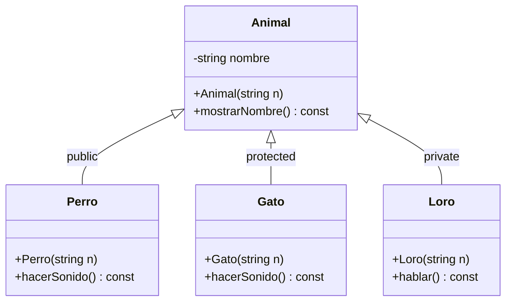
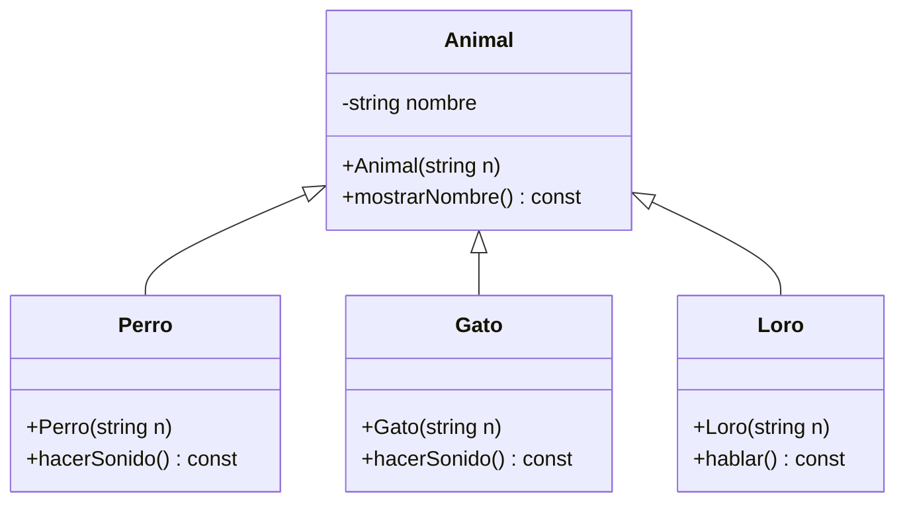
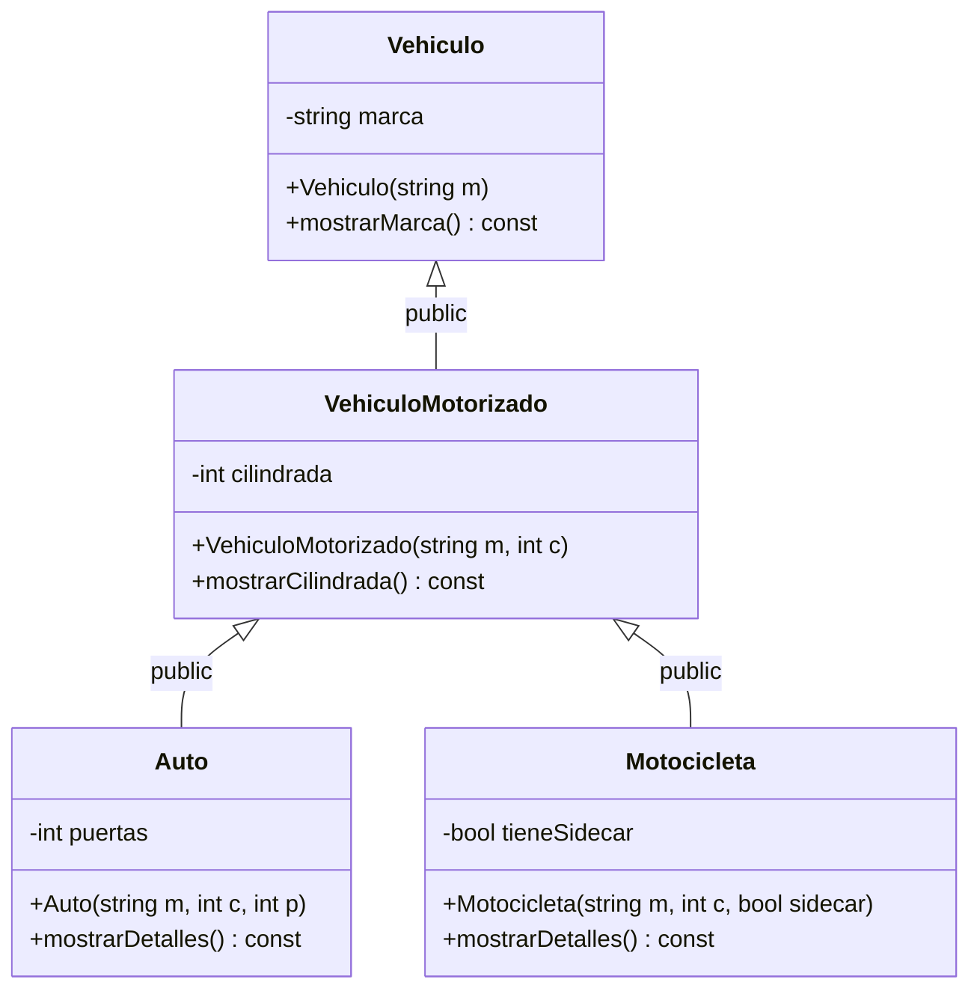
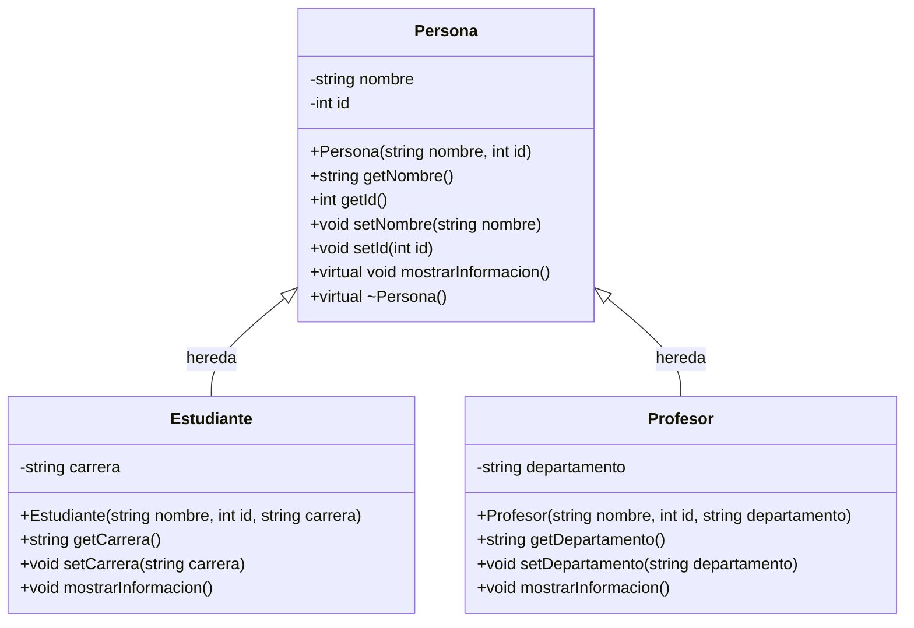
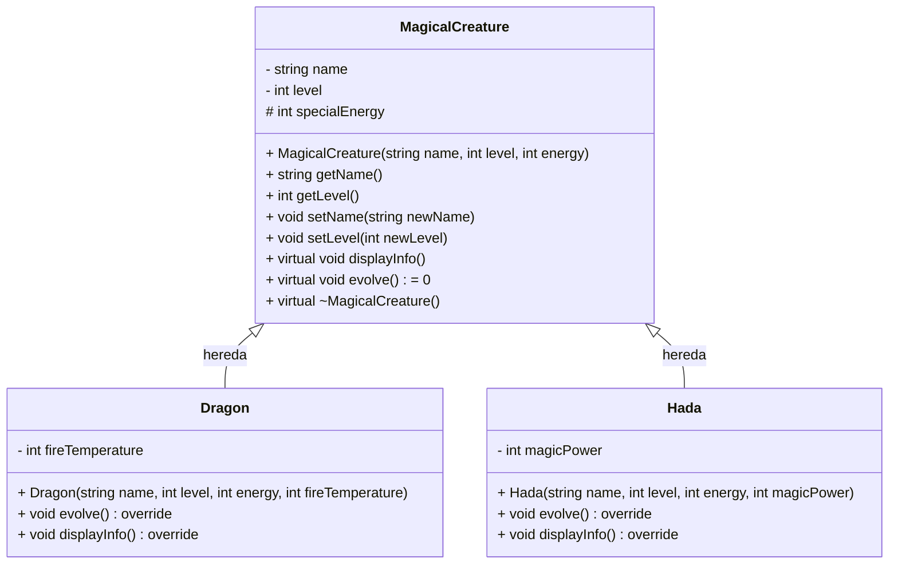

# Herencia en C++

## ¿Qué es la Herencia?

La herencia es un mecanismo fundamental de la Programación Orientada a Objetos (POO) que permite crear nuevas clases a partir de clases existentes. Este proceso se realiza copiando características (atributos y métodos) de una clase base a una clase derivada. La principal ventaja de la herencia es la reutilización de código y la posibilidad de extender o modificar comportamientos sin alterar el código original.

## Clases Base y Clases Derivadas  

### 📌 **Clase Base (o Superclase):**  
Es una clase que sirve como modelo para crear otras clases. Define atributos y métodos comunes que pueden ser reutilizados por otras clases para evitar repetir código.  

### 📌 **Clase Derivada (o Subclase):**  
Es una clase que se crea a partir de una clase base, heredando sus atributos y métodos. Además, puede agregar o modificar funcionalidades para adaptarse a necesidades específicas.  

## 💡 ¿Cómo se define la herencia?  

En C++, la herencia se especifica utilizando el símbolo `:` seguido de un modificador de acceso (`public`, `protected` o `private`) y el nombre de la clase base. Ejemplo:

```cpp
class ClaseB : public ClaseA { ... };
```

## Ejemplo

```cpp
#include <iostream>
using namespace std;

class ClaseA {
private:
    int a;
public:
    ClaseA(int valorA) : a(valorA) {}

    void mostrar1() {
        cout << "[ a=" << a << " ]" << endl;
    }

    int getA() const {
        return a;
    }
};

class ClaseB : public ClaseA {
private:
    int b;

public:
    ClaseB(int valorA, int valorB) : ClaseA(valorA), b(valorB) {}

    void mostrar2() {
        cout << "[ a=" << getA() << ", b=" << b << " ]" << endl;
    }
};

int main() {
    ClaseA x(10);
    ClaseB y(20, 30);
    x.mostrar1();
    y.mostrar1();
    y.mostrar2();

    return 0;
}
```

**Salida:**

```
[ a=10 ]
[ a=20 ]
[ a=20, b=30 ]
```

<details><summary>👨‍🏫 Explicación</summary>

### 🔍 **Clases y Atributos:**  
- **`ClaseA` (Clase Base):**  
  - **Atributo privado:** `int a;` — No accesible directamente fuera de la clase, reforzando el encapsulamiento.  
  - **Constructor:** Inicializa `a` con el valor pasado como argumento (`valorA`).  
  - **Método público `mostrar1()`:** Imprime el valor del atributo `a` con el formato: `[ a=valor ]`.  
  - **Método `getA()`:** Devuelve el valor de `a` para permitir el acceso controlado desde fuera de la clase. Este método es `const`, asegurando que no modifica el objeto.  
  
---

- **`ClaseB` (Clase Derivada):**  
  - Hereda de `ClaseA` mediante **herencia pública** (`public ClaseA`). Esto significa que `ClaseB` puede acceder a los métodos públicos de `ClaseA` pero no a sus atributos privados.  
  - **Atributo privado:** `int b;` — Exclusivo de `ClaseB` y no accesible fuera de la clase.  
  - **Constructor:** Inicializa `b` y también llama al constructor de `ClaseA` para inicializar `a` (mediante `ClaseA(valorA)`).  
  - **Método `mostrar2()`:** Muestra ambos atributos (`a` y `b`). Como `a` es privado en `ClaseA`, se accede a él mediante el método `getA()`. El formato de salida es: `[ a=valorA, b=valorB ]`.  
  
---

### 🔍 **Función `main()`:**  
En la función `main()`, se crean dos objetos:  

- `x` de tipo `ClaseA`, inicializado con `a = 10`.  
- `y` de tipo `ClaseB`, inicializado con `a = 20` y `b = 30`.  

Llamadas a métodos:  

1. `x.mostrar1()` imprime: **`[ a=10 ]`**.  
2. `y.mostrar1()` imprime: **`[ a=20 ]`**. Aquí se está llamando al método `mostrar1()` heredado de `ClaseA`.  
3. `y.mostrar2()` imprime: **`[ a=20, b=30 ]`**. Para mostrar `a`, se llama al método `getA()` de la clase base `ClaseA` que devuelve su valor.  

</details>

## Tipos de Herencia 

### ✅ **1. Herencia Pública (`public`)**  
Los miembros **públicos** y **protegidos** son accesibles en la clase derivada, pero **no los privados**.  

```cpp
#include <iostream>
using namespace std;

class Base {
public:
    int x;
protected:
    int y;
private:
    int z;
};

class Derivada : public Base {  // Cambié de 'protected' a 'public'
public:
    Derivada() {
        x = 10;  // Permitido (sigue siendo público en Derivada)
        y = 20;  // Permitido (protegido en Derivada)
        // z = 30;  // Error: 'z' es privado en Base
    }

    void mostrar() {
        cout << "x: " << x << endl;
        cout << "y: " << y << endl;
    }
};

int main() {
    Derivada obj;
    obj.x = 15;     // Ahora permitido (x es público por herencia pública)
    // obj.y = 25;  // Error: No accesible (protegido)
    // obj.z = 35;  // Error: No accesible (privado)
    obj.mostrar();
    return 0;
}
```

**Salida:**

```
x: 15
y: 20
```

---

### 🔒 **2. Herencia Protegida (`protected`)**  
Los miembros **públicos** y **protegidos** de la clase base se convierten en **protegidos** en la clase derivada. Los privados siguen inaccesibles.  

```cpp
#include <iostream>
using namespace std;

class Base {
public:
    int x;
protected:
    int y;
private:
    int z;
};

class Derivada : protected Base {
public:
    Derivada() {
        x = 10;  // Permitido (protegido en Derivada)
        y = 20;  // Permitido (protegido en Derivada)
        // z = 30;  // Error: 'z' es privado en Base
    }

    void mostrar() {
        cout << "x: " << x << endl;
        cout << "y: " << y << endl;
    }
};

int main() {
    Derivada obj;
    // obj.x = 10;   // Error: No accesible (protected)
    // obj.y = 20;   // Error: No accesible (protected)
    // obj.z = 30;   // Error: No accesible (private)
    obj.mostrar();
    return 0;
}
```

**Salida:**

```
x: 10
y: 20
```


---

### ❌ **3. Herencia Privada (`private`)**  
Todos los miembros de la clase base (públicos y protegidos) se convierten en **privados** en la clase derivada. Los privados originales de la base siguen inaccesibles.  

```cpp
#include <iostream>
using namespace std;

class Base {
public:
    int x;
protected:
    int y;
private:
    int z;
};

class Derivada : private Base {  // Cambié de 'protected' a 'private'
public:
    Derivada() {
        x = 10;  // Permitido (convertido a privado en Derivada)
        y = 20;  // Permitido (convertido a privado en Derivada)
        // z = 30;  // Error: 'z' es privado en Base
    }

    void mostrar() {
        cout << "x: " << x << endl;
        cout << "y: " << y << endl;
    }
};

int main() {
    Derivada obj;
    // obj.x = 15;    // Error: No accesible (privado por herencia privada)
    // obj.y = 25;    // Error: No accesible (privado por herencia privada)
    // obj.z = 35;    // Error: No accesible (privado en Base)
    obj.mostrar();
    return 0;
}
```

**Salida:**

```
x: 10
y: 20
```

## Resumen

### Visibilidad de Atributos y Métodos en C++

| Tipo de acceso | Desde la misma clase | Desde clases derivadas | Desde fuera (main, otros objetos, etc.) |
|----------------|---------------------|-----------------------|---------------------------------------|
| `public`       | ✅ Sí               | ✅ Sí                 | ✅ Sí                                 |
| `protected`    | ✅ Sí               | ✅ Sí                 | ❌ No                                 |
| `private`      | ✅ Sí               | ❌ No                 | ❌ No                                 |


### Modificación de Accesos Según el Tipo de Herencia

| Tipo de acceso en la clase base | Herencia Pública (`: public`) | Herencia Protegida (`: protected`) | Herencia Privada (`: private`) |
|---------------------------------|------------------------------|-----------------------------------|--------------------------------|
| `public`                        | 🔓 Sigue siendo `public`      | 🔒 Se convierte en `protected`     | 🔒 Se convierte en `private`    |
| `protected`                     | 🔒 Sigue siendo `protected`   | 🔒 Sigue siendo `protected`        | 🔒 Se convierte en `private`    |
| `private`                       | 🔐 Sigue siendo `private`     | 🔐 Sigue siendo `private`          | 🔐 Sigue siendo `private`       |

---

### 📌 **Conceptos demostrados:**  
- En herencia pública, `x` sigue siendo accesible directamente desde el `main()`, mientras que `y` no.  
- En herencia protegida, tanto `x` como `y` se vuelven inaccesibles desde `main()`, pero son accesibles desde la clase derivada.  
- En herencia privada, `x` y `y` se convierten en privados en la clase derivada y no pueden ser accedidos desde `main()`.  

---


### 🔍 **Concepto Básico: Herencia en C++**
En C++, una clase puede **heredar de otra clase** para **reutilizar atributos y métodos**. La herencia puede ser de tres tipos:

1. **Herencia Pública (`public`)** - Los miembros públicos y protegidos de la clase base mantienen su visibilidad en la clase derivada.
2. **Herencia Protegida (`protected`)** - Los miembros públicos y protegidos de la clase base se vuelven `protected` en la clase derivada.
3. **Herencia Privada (`private`)** - Todos los miembros de la clase base se vuelven `private` en la clase derivada.

---

### 💡 **Ejemplo de Clases (C++ Código)**

```cpp
#include <iostream>
#include <string>
using namespace std;

// Clase base
class Animal {
protected:  // Visible para clases derivadas
    string nombre;

public:
    Animal(string n) : nombre(n) {}

    void mostrarNombre() const {
        cout << "Nombre del animal: " << nombre << endl;
    }
};

// Clase derivada con herencia pública
class Perro : public Animal {
public:
    Perro(string n) : Animal(n) {}

    void hacerSonido() const {
        cout << nombre << " dice: ¡Guau guau!" << endl;
    }
};

// Clase derivada con herencia protegida
class Gato : protected Animal {
public:
    Gato(string n) : Animal(n) {}

    void hacerSonido() const {
        cout << nombre << " dice: ¡Miau miau!" << endl;
    }
};

// Clase derivada con herencia privada
class Loro : private Animal {
public:
    Loro(string n) : Animal(n) {}

    void hablar() const {
        cout << nombre << " dice: ¡Hola humano!" << endl;
    }
};

int main() {
    Perro miPerro("Firulais");
    miPerro.mostrarNombre(); // Accesible porque la herencia es pública
    miPerro.hacerSonido();

    Gato miGato("Michi");
    // miGato.mostrarNombre();  <-- No permitido, la herencia es protegida
    miGato.hacerSonido();

    Loro miLoro("Polly");
    // miLoro.mostrarNombre();  <-- No permitido, la herencia es privada
    miLoro.hablar();

    return 0;
}
```

---

### 📌 **Explicación:**
1. **Herencia Pública (`Perro`)**: Hereda todo tal cual. Los métodos `public` y `protected` de `Animal` siguen siendo accesibles.
2. **Herencia Protegida (`Gato`)**: Los métodos `public` y `protected` de `Animal` se convierten en `protected` en `Gato`.
3. **Herencia Privada (`Loro`)**: Todo lo heredado se convierte en `private` dentro de `Loro`.

---

### 🎨 **Diagrama UML en Mermaid**
Vamos a dibujar cómo se relacionan estas clases usando Mermaid.



---

¿Te gustaría que convierta este ejemplo en algo más interactivo o que lo lleve a un proyecto más completo? 🚀😊

¡Exactamente! 😄 En **Mermaid**, la sintaxis estándar para herencia es simplemente:

```mermaid
Animal <|-- Perro
```

Esto indica que `Perro` hereda de `Animal`, **pero no especifica si la herencia es pública, protegida o privada**. Es algo que Mermaid no maneja por defecto.

---

### 📌 **¿Cómo podríamos indicarlo?**
Podemos usar **etiquetas de texto o anotaciones manuales** para simularlo. Algo así:



---

### 🔍 **Explicación:**
- Le agregué etiquetas `<<public>>`, `<<protected>>`, `<<private>>` a cada relación para indicar el tipo de herencia.
- **Esto es solo un truco visual**. Mermaid realmente no entiende la diferencia, pero nosotros sí. 😉

---

¡Me encanta la idea! 😄 Vamos a hacer un ejemplo con **herencia múltiple y en varios niveles** para que se entienda cómo funciona. Esto es más complejo pero súper interesante. 🚀

---

## 📌 **Ejemplo: Sistema de Vehículos (Herencia en Múltiples Niveles)**

### 🔍 **Contexto:**  
Queremos modelar un sistema de vehículos con las siguientes clases:  
- `Vehiculo`: Clase base general que define características básicas de cualquier vehículo.  
- `VehiculoMotorizado`: Clase derivada que hereda de `Vehiculo` y añade características específicas de vehículos con motor.  
- `Auto`: Clase derivada de `VehiculoMotorizado` que agrega características únicas de los autos.  
- `Motocicleta`: Clase derivada de `VehiculoMotorizado` que agrega características únicas de las motocicletas.  

---

### 📚 **Código C++ con Herencia en Múltiples Niveles**
```cpp
#include <iostream>
#include <string>
using namespace std;

// Clase base: Vehiculo
class Vehiculo {
protected:
    string marca;

public:
    Vehiculo(string m) : marca(m) {}

    void mostrarMarca() const {
        cout << "Marca: " << marca << endl;
    }
};

// Clase derivada: VehiculoMotorizado (herencia pública)
class VehiculoMotorizado : public Vehiculo {
protected:
    int cilindrada;

public:
    VehiculoMotorizado(string m, int c) : Vehiculo(m), cilindrada(c) {}

    void mostrarCilindrada() const {
        cout << "Cilindrada: " << cilindrada << " cc" << endl;
    }
};

// Clase derivada: Auto (herencia pública de VehiculoMotorizado)
class Auto : public VehiculoMotorizado {
private:
    int puertas;

public:
    Auto(string m, int c, int p) : VehiculoMotorizado(m, c), puertas(p) {}

    void mostrarDetalles() const {
        mostrarMarca();
        mostrarCilindrada();
        cout << "Puertas: " << puertas << endl;
    }
};

// Clase derivada: Motocicleta (herencia pública de VehiculoMotorizado)
class Motocicleta : public VehiculoMotorizado {
private:
    bool tieneSidecar;

public:
    Motocicleta(string m, int c, bool sidecar) : VehiculoMotorizado(m, c), tieneSidecar(sidecar) {}

    void mostrarDetalles() const {
        mostrarMarca();
        mostrarCilindrada();
        cout << "Tiene Sidecar: " << (tieneSidecar ? "Sí" : "No") << endl;
    }
};

int main() {
    Auto miAuto("Toyota", 1800, 4);
    miAuto.mostrarDetalles();

    Motocicleta miMoto("Harley-Davidson", 1200, true);
    miMoto.mostrarDetalles();

    return 0;
}
```

---

### 🔑 **Explicación:**
1. 📂 `Vehiculo` es la clase base de todo vehículo.
2. 🔋 `VehiculoMotorizado` extiende `Vehiculo` añadiendo `cilindrada` (algo que solo aplica a vehículos con motor).
3. 🚗 `Auto` hereda de `VehiculoMotorizado` añadiendo `puertas`.
4. 🏍️ `Motocicleta` hereda de `VehiculoMotorizado` añadiendo `tieneSidecar`.

---

### 🎨 **Mermaid UML Diagrama (Herencia Múltiple y Niveles)**  


---

### 💡 **¿Por qué tiene sentido?**
- Este modelo permite que `VehiculoMotorizado` actúe como un **puente** entre `Vehiculo` y los tipos específicos como `Auto` y `Motocicleta`.  
- La herencia pública garantiza que cada nivel pueda aprovechar completamente los métodos de sus ancestros.

---

¿Te ayudo a hacer esto aún más interesante agregando **herencia protegida o privada en algún nivel intermedio** para que se vea más realista? 😄🚀 Y también podemos mejorarlo en el diagrama UML. 💪
### Notación UML para Herencia

En un diagrama UML, la herencia se representa con una flecha vacía apuntando de la clase derivada hacia la clase base.

## Ejemplo 1

A continuación, crearemos un programa que define una clase base llamada `Persona` y dos clases derivadas, `Estudiante` y `Profesor`, que heredan de `Persona`. Este ejemplo demostrará cómo las clases derivadas pueden extender y modificar el comportamiento de la clase base, así como la utilización de getters y setters para acceder y modificar atributos privados.

```cpp
#include <iostream>
#include <string>
#include <vector>

using namespace std;

class Persona {
private:
    string nombre;
    int id;

public:
    Persona(const string& nombre, int id) : nombre(nombre), id(id) {}

    string getNombre() const { return nombre; }
    int getId() const { return id; }

    void setNombre(const string& nuevoNombre) { nombre = nuevoNombre; }
    void setId(int nuevoId) { id = nuevoId; }

    virtual void mostrarInformacion() const {
        cout << "[ Persona: " << nombre << ", " << id << " ]" << endl;
    }

    virtual ~Persona() {} // Destructor virtual
};

class Estudiante : public Persona {
private:
    string carrera;

public:
    Estudiante(const string& nombre, int id, const string& carrera)
        : Persona(nombre, id), carrera(carrera) {}

    string getCarrera() const { return carrera; }
    void setCarrera(const string& nuevaCarrera) { carrera = nuevaCarrera; }

    void mostrarInformacion() const override {
        cout << "[ Estudiante: " << getNombre() << ", " << getId()
             << ", " << carrera << " ]" << endl;
    }
};

class Profesor : public Persona {
private:
    string departamento;

public:
    Profesor(const string& nombre, int id, const string& departamento)
        : Persona(nombre, id), departamento(departamento) {}

    string getDepartamento() const { return departamento; }
    void setDepartamento(const string& nuevoDepartamento) { departamento = nuevoDepartamento; }

    void mostrarInformacion() const override {
        cout << "[ Profesor: " << getNombre() << ", " << getId()
             << ", " << departamento << " ]" << endl;
    }
};

int main() {
    vector<Persona*> listaPersonas;

    listaPersonas.push_back(new Estudiante("Carlos", 20, "Ingenieria en Sistemas"));
    listaPersonas.push_back(new Estudiante("Ana", 22, "Matematicas"));
    listaPersonas.push_back(new Profesor("Dra. Maria", 45, "Ciencias de la Computacion"));
    listaPersonas.push_back(new Profesor("Dr. Pedro", 50, "Fisica"));

    // Mostrar información de cada persona
    for (const auto& persona : listaPersonas) {
        persona->mostrarInformacion();
    }

    // Modificando atributos
    listaPersonas[0]->setNombre("Carlos Alberto");
    listaPersonas[1]->setId(23);

    cout << endl;

    // Mostrar información modificada
    for (const auto& persona : listaPersonas) {
        persona->Persona::mostrarInformacion();
    }

    // Liberar memoria
    for (auto persona : listaPersonas) {
        delete persona;
    }

    return 0;
}
```

### Explicación

Este programa define un sistema básico para manejar información sobre **Personas**, **Estudiantes** y **Profesores**. Los datos se almacenan en un vector (`listaPersonas`) y se muestran o modifican usando métodos específicos de cada clase. A continuación, se explican los componentes principales del código:

---

### 📌 1. **Clase `Persona`**  
La clase `Persona` representa a una persona general con nombre e identificación.

- **Atributos privados:**  
  - `nombre`: Almacena el nombre de la persona.  
  - `id`: Identificador único de la persona.

- **Constructor:**  
  Permite inicializar el `nombre` y el `id` al crear un objeto de tipo `Persona`.

- **Métodos públicos:**  
  - Métodos `getNombre()` y `getId()` para obtener los valores de los atributos.  
  - Métodos `setNombre()` y `setId()` para modificar esos valores.  
  - `mostrarInformacion()`:  
    ```cpp
    virtual void mostrarInformacion() const {
        cout << "[ Persona: " << nombre << ", " << id << " ]" << endl;
    }
    ```
    Declarado como `virtual` para que pueda redefinirse en clases que hereden de `Persona`, permitiendo que cada tipo muestre su información personalizada.
  
- **Destructor:**  
  ```cpp
  virtual ~Persona() {}
  ```
  Declarado como `virtual` para asegurarse de que al eliminar un objeto que hereda de `Persona`, se libere correctamente la memoria.

---

### 📌 2. **Clase `Estudiante`**
La clase `Estudiante` hereda de `Persona` y agrega información adicional sobre un estudiante.

- **Atributo privado:**  
  - `carrera`: Indica la carrera que cursa el estudiante.

- **Constructor:**  
  Permite inicializar `nombre`, `id` y `carrera`.

- **Métodos públicos:**  
  - Métodos `getCarrera()` y `setCarrera()` para obtener y modificar la carrera.  
  - `mostrarInformacion() const`:  
    ```cpp
    void mostrarInformacion() const override {
        cout << "[ Estudiante: " << getNombre() << ", " << getId() << ", " << carrera << " ]" << endl;
    }
    ```
    Usa `override` para asegurar que se está redefiniendo correctamente el método `mostrarInformacion()` de `Persona`.

---

### 📌 3. **Clase `Profesor`**
La clase `Profesor` hereda de `Persona` y agrega información sobre un profesor.

- **Atributo privado:**  
  - `departamento`: Indica el departamento al que pertenece el profesor.

- **Constructor:**  
  Permite inicializar `nombre`, `id` y `departamento`.

- **Métodos públicos:**  
  - Métodos `getDepartamento()` y `setDepartamento()` para obtener y modificar el departamento.  
  - `mostrarInformacion() const`:  
    ```cpp
    void mostrarInformacion() const override {
        cout << "[ Profesor: " << getNombre() << ", " << getId() << ", " << departamento << " ]" << endl;
    }
    ```
    Usa `override` para personalizar cómo se muestra la información de un profesor.

---

### 📌 4. **Función `main()`**
Esta función maneja la creación, modificación, visualización y eliminación de los objetos.  

1. **Creación de objetos y almacenaje en un vector:**  
   ```cpp
   vector<Persona*> listaPersonas;
   listaPersonas.push_back(new Estudiante("Carlos", 20, "Ingenieria en Sistemas"));
   listaPersonas.push_back(new Estudiante("Ana", 22, "Matematicas"));
   listaPersonas.push_back(new Profesor("Dra. Maria", 45, "Ciencias de la Computacion"));
   listaPersonas.push_back(new Profesor("Dr. Pedro", 50, "Fisica"));
   ```

> [!IMPORTANT]
>
>Usamos `vector<Persona*>` en lugar de `vector<Persona>` para evitar un problema llamado *slicing*. El *slicing* ocurre cuando intentamos guardar un objeto de una clase derivada (`Estudiante`, `Profesor`) dentro de un contenedor que solo acepta objetos de la clase base (`Persona`). Al hacerlo, se pierde toda la información específica de la clase derivada y solo se conserva la parte que pertenece a `Persona`.  
>
>Al usar punteros (`Persona*`), en lugar de copiar objetos completos, almacenamos sus direcciones en memoria. Esto permite que cada objeto mantenga toda su información y funcione correctamente, incluso si tiene datos o funciones adicionales que no están en `Persona`. Además, al usar punteros, nos aseguramos de que se libere la memoria correctamente cuando se usa `delete`.
>

2. **Mostrar información de cada objeto:**  
   ```cpp
   for (const auto& persona : listaPersonas) {
       persona->mostrarInformacion();
   }
   ```

> [!NOTE]
> Aquí se utiliza el operador `->` en lugar de `.` para acceder a métodos y atributos porque `persona` es un puntero. Este operador permite invocar métodos como `mostrarInformacion()` de manera directa sobre el objeto al que apunta.

3. **Modificar atributos de algunos objetos:**  
   ```cpp
   listaPersonas[0]->setNombre("Carlos Alberto");
   listaPersonas[1]->setId(23);
   ```

4. **Mostrar información modificada con el método original de `Persona`:**  
   ```cpp
   for (const auto& persona : listaPersonas) {
       persona->Persona::mostrarInformacion();
   }
   ```

5. **Liberar memoria:**  
   ```cpp
   for (auto persona : listaPersonas) {
       delete persona;
   }
   ```

---

### Diagrama UML




## Ejemplo 2

En este ejemplo, exploraremos el concepto de atributos `protected` en la herencia de clases en C++. Crearemos una clase base llamada `CriaturaMagica` y dos clases derivadas, `Dragon` y `Hada`, que heredarán de `CriaturaMagica`. Veremos cómo los atributos `protected` permiten a las clases derivadas acceder directamente a los atributos de la clase base, facilitando la implementación de comportamientos específicos para cada tipo de criatura. Este ejemplo demostrará la importancia de `protected` para lograr un equilibrio entre encapsulación y acceso controlado en la herencia.

```cpp
#include <iostream>
#include <string>
#include <vector>
#include <map>  // Incluimos la STL map

using namespace std;

// Clase base que representa a cualquier Criatura Mágica
class MagicalCreature {
private:
    string name;
    int level;

protected:
    int specialEnergy;  // Este atributo debe ser protected para que las clases derivadas lo accedan directamente

public:
    MagicalCreature(const string& name, int level, int energy)
        : name(name), level(level), specialEnergy(energy) {}

    string getName() const { return name; }
    int getLevel() const { return level; }

    void setName(const string& newName) { name = newName; }
    void setLevel(int newLevel) { level = newLevel; }

    virtual void displayInfo() const {
        cout << "[Creature: " << name << ", Level: " << level
             << ", Special Energy: " << specialEnergy << "]" << endl;
    }

    virtual void evolve() = 0;  // Método puro para evolución personalizada

    virtual ~MagicalCreature() {}
};

// Clase derivada Dragon
class Dragon : public MagicalCreature {
private:
    int fireTemperature;

public:
    Dragon(const string& name, int level, int energy, int fireTemperature)
        : MagicalCreature(name, level, energy), fireTemperature(fireTemperature) {}

    void evolve() override {
        if (specialEnergy >= 100) {
            specialEnergy -= 100;
            setLevel(getLevel() + 1);
            fireTemperature += 200;
            cout << getName() << " evolved. Fire temperature: " << fireTemperature << "C." << endl;
        } else {
            cout << getName() << " lacks energy to evolve." << endl;
        }
    }

    void displayInfo() const override {
        cout << "[Dragon: " << getName() << ", Level: " << getLevel()
             << ", Special Energy: " << specialEnergy
             << ", Fire Temperature: " << fireTemperature << "C]" << endl;
    }
};

// Clase derivada Hada
class Hada : public MagicalCreature {
private:
    int magicPower;

public:
    Hada(const string& name, int level, int energy, int magicPower)
        : MagicalCreature(name, level, energy), magicPower(magicPower) {}

    void evolve() override {
        if (specialEnergy >= 80) {
            specialEnergy -= 80;
            setLevel(getLevel() + 1);
            magicPower += 150;
            cout << getName() << " evolved. Magic power: " << magicPower << "." << endl;
        } else {
            cout << getName() << " lacks energy to evolve." << endl;
        }
    }

    void displayInfo() const override {
        cout << "[Hada: " << getName() << ", Level: " << getLevel()
             << ", Special Energy: " << specialEnergy
             << ", Magic Power: " << magicPower << "]" << endl;
    }
};

int main() {
    vector<MagicalCreature*> creatures;
    map<int, vector<MagicalCreature*>> creatureMapByLevel; // Map por nivel

    // Creamos objetos de criaturas por fuera
    Dragon* drakos = new Dragon("Drakos", 5, 120, 1000);
    Hada* lumina = new Hada("Lumina", 3, 90, 300);
    Hada* floria = new Hada("Floria", 2, 70, 250);
    Dragon* pyros = new Dragon("Pyros", 4, 110, 950);
    Hada* sylph = new Hada("Sylph", 3, 150, 400); // Sylph ahora tiene nivel 3

    // Los agregamos al vector
    creatures.push_back(drakos);
    creatures.push_back(lumina);
    creatures.push_back(floria);
    creatures.push_back(pyros);
    creatures.push_back(sylph);

    // Los agregamos al mapa por nivel
    for (auto creature : creatures) {
        creatureMapByLevel[creature->getLevel()].push_back(creature);
    }

    // Mostrar información usando el vector
    for (const auto& creature : creatures) {
        creature->displayInfo();
    }

    cout << "\nEvolving creatures...\n" << endl;

    // Intentar evolucionar cada criatura
    for (auto& creature : creatures) {
        creature->evolve();
    }

    cout << "\nInformation after evolution:\n" << endl;

    // Mostrar información usando el map por nivel
    for (const auto& pair : creatureMapByLevel) {
        cout << "Level " << pair.first << ":" << endl;
        for (const auto& creature : pair.second) {
            creature->displayInfo();
        }
    }

    // Ejemplo de búsqueda rápida por nivel
    int searchLevel = 3; // Buscamos el nivel donde hay dos criaturas
    if (creatureMapByLevel.count(searchLevel)) {
        cout << "\nCreatures at level " << searchLevel << ":" << endl;
        for (auto creature : creatureMapByLevel[searchLevel]) {
            creature->displayInfo();
        }
    } else {
        cout << "No creatures found at level " << searchLevel << endl;
    }

    // Liberar memoria
    for (auto creature : creatures) {
        delete creature;
    }

    return 0;
}
```

### Explicación

Este programa implementa un sistema para manejar **Criaturas Mágicas** con características específicas y la capacidad de evolucionar bajo ciertas condiciones. Utiliza **herencia, polimorfismo y STL (`vector` y `map`)** para almacenar y gestionar estas criaturas. A continuación, se explican los componentes principales del código:

---

### 📌 1. **Clase `MagicalCreature` (Base)**

Esta clase define la estructura base de cualquier criatura mágica.

- **Atributos privados:**

  - `name`: Nombre de la criatura.
  - `level`: Nivel actual de la criatura.

- **Atributo protegido:**

  - `specialEnergy`: Energía especial necesaria para evolucionar. Declarada como `protected` para que pueda ser accedida directamente por las clases derivadas.

- **Constructor:**  
  Inicializa los atributos `name`, `level` y `specialEnergy`.

- **Métodos públicos:**

  - `getName()`, `getLevel()`: Devuelven los atributos privados.
  - `setName()`, `setLevel()`: Modifican los atributos privados.
  - `displayInfo()`: Muestra la información de la criatura de manera genérica.
  - `evolve()`: Método puro (`= 0`), forzando a las clases derivadas a implementar su propia evolución.

- **Destructor virtual:**  
  Asegura la correcta liberación de la memoria al usar polimorfismo.

---

### 📌 2. **Clase `Dragon` (Derivada de `MagicalCreature`)

Esta clase define un tipo específico de criatura mágica: **Dragones**.

- **Atributo privado:**

  - `fireTemperature`: Indica la temperatura máxima que puede alcanzar su fuego.

- **Constructor:**  
  Inicializa `name`, `level`, `specialEnergy` y `fireTemperature`.

- **Métodos públicos:**

  - `evolve()`: Si la energía especial (`specialEnergy`) es al menos `100`, aumenta el nivel en `1`, disminuye la energía en `100` y aumenta la temperatura de fuego en `200C`.
  - `displayInfo()`: Muestra la información específica del Dragón, sobrescribiendo la función base.

---

### 📌 3. **Clase `Hada` (Derivada de `MagicalCreature`)

Esta clase define otro tipo de criatura mágica: **Hadas**.

- **Atributo privado:**

  - `magicPower`: Indica el poder mágico del hada.

- **Constructor:**  
  Inicializa `name`, `level`, `specialEnergy` y `magicPower`.

- **Métodos públicos:**

  - `evolve()`: Si la energía especial (`specialEnergy`) es al menos `80`, aumenta el nivel en `1`, disminuye la energía en `80` y aumenta el poder mágico en `150`.
  - `displayInfo()`: Muestra la información específica del Hada, sobrescribiendo la función base.

---

### 📌 4. **Función `main()`**

La función principal se encarga de:

1. **Creación de Objetos:**  
   Instancia de objetos `Dragon` y `Hada` y se almacenan en un `vector` de punteros a `MagicalCreature`.

2. **Agrupación por Nivel:**  
   Los objetos se almacenan en un `map<int, vector<MagicalCreature*>>` donde la clave es el nivel de la criatura.  
   Esto permite una búsqueda rápida por nivel.

---

### 💡 **¿Cómo funciona el uso del `map`?**

El `map<int, vector<MagicalCreature*>> creatureMapByLevel;` se utiliza para **agrupar criaturas mágicas por su nivel**. Vamos a descomponer su funcionamiento:

- **Declaración:**
  ```cpp
  map<int, vector<MagicalCreature*>> creatureMapByLevel;
  ```
  Este `map` utiliza como clave (`int`) el nivel de cada criatura (`creature->getLevel()`) y como valor un `vector` de punteros a `MagicalCreature` que contiene todas las criaturas con ese nivel.

- **Agregación de criaturas al `map`:**
  ```cpp
  creatureMapByLevel[creature->getLevel()].push_back(creature);
  ```
  - Aquí se accede al `vector` asociado al nivel `creature->getLevel()`.
  - Si ese nivel aún no existe en el `map`, se crea automáticamente un nuevo `vector` vacío.
  - Luego, se agrega el puntero `creature` al `vector` correspondiente.

- **Acceso y visualización por nivel:**
  ```cpp
  for (const auto& pair : creatureMapByLevel) {
      cout << "Level " << pair.first << ":" << endl;
      for (const auto& creature : pair.second) {
          creature->displayInfo();
      }
  }
  ```
  - El bucle `for` itera sobre cada par (`clave-valor`) en el `map`.
  - `pair.first` es el nivel (`int`) y `pair.second` es el `vector<MagicalCreature*>`.
  - Cada `creature` en el `vector` se muestra llamando al método polimórfico `displayInfo()`.

- **Búsqueda rápida por nivel:**
  ```cpp
  if (creatureMapByLevel.count(searchLevel)) {
      for (auto creature : creatureMapByLevel[searchLevel]) {
          creature->displayInfo();
      }
  }
  ```
  Este fragmento permite buscar eficientemente todas las criaturas en un nivel específico (`searchLevel`) gracias a la naturaleza de acceso en tiempo constante promedio de `map`.

---

### 📌 5. **Revisualización tras Evolución:**  
Después de intentar evolucionar cada criatura, la información se muestra nuevamente, pero agrupada por nivel usando el `map`. Este proceso permite visualizar rápidamente qué criaturas mejoraron y en qué medida, ya que cada criatura mantiene su tipo y muestra su información específica (`Dragon` o `Hada`) mediante el uso de polimorfismo. Además, permite notar cambios en sus atributos característicos (`fireTemperature` o `magicPower`) tras la evolución.

---

### 📌 6. **Liberación de Memoria:**  
Se asegura la liberación de la memoria para cada objeto creado dinámicamente con `new`, evitando fugas de memoria.

---

### 📌 **Mejoras Posibles:**

- Implementar un sistema de almacenamiento persistente para conservar las criaturas entre ejecuciones.
- Añadir más tipos de criaturas con comportamientos únicos.
- Integrar un menú interactivo para gestionar criaturas dinámicamente durante la ejecución del programa.

---

### Diagrama UML





```cpp


#include <iostream>
#include <vector>

using namespace std;

class Figura {
public:
    virtual void dibujar() const = 0; // Método puro virtual (Clase Abstracta)
};

class Circulo : public Figura {
public:
    void dibujar() const override {
        cout << "Dibujando un círculo." << endl;
    }
};

class Rectangulo : public Figura {
public:
    void dibujar() const override {
        cout << "Dibujando un rectángulo." << endl;
    }
};

int main() {
    vector<Figura*> figuras;
    figuras.push_back(new Circulo());
    figuras.push_back(new Rectangulo());

    for (Figura* figura : figuras) {
        figura->dibujar();
    }

    for (Figura* figura : figuras) {
        delete figura;
    }

    return 0;
}
```

### Explicación

En este ejemplo, `Figura` es una **clase abstracta** que define un método virtual puro `dibujar()`. Las clases `Circulo` y `Rectangulo` heredan de `Figura` e implementan `dibujar()` de manera distinta.  
Además, utilizamos un `vector` para almacenar punteros a `Figura`, lo que permite manejar múltiples objetos de clases derivadas de forma polimórfica.

## Conclusión

La herencia en C++ permite la reutilización de código y facilita el desarrollo de aplicaciones más estructuradas y fáciles de mantener. La combinación de herencia con estructuras de la STL como `vector` permite implementar patrones de diseño útiles para la creación de aplicaciones más complejas.

¿Te gustaría que continúe desarrollando este documento con diagramas UML y un enfoque aún más detallado para que sea un recurso completo para tus estudiantes?

