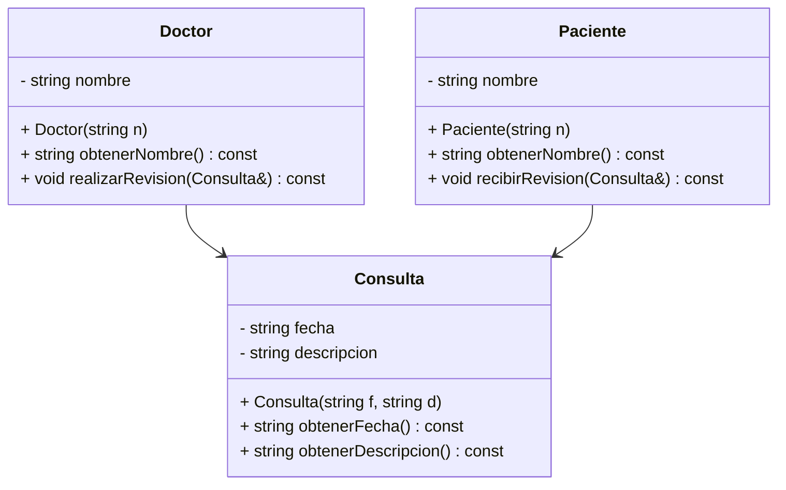
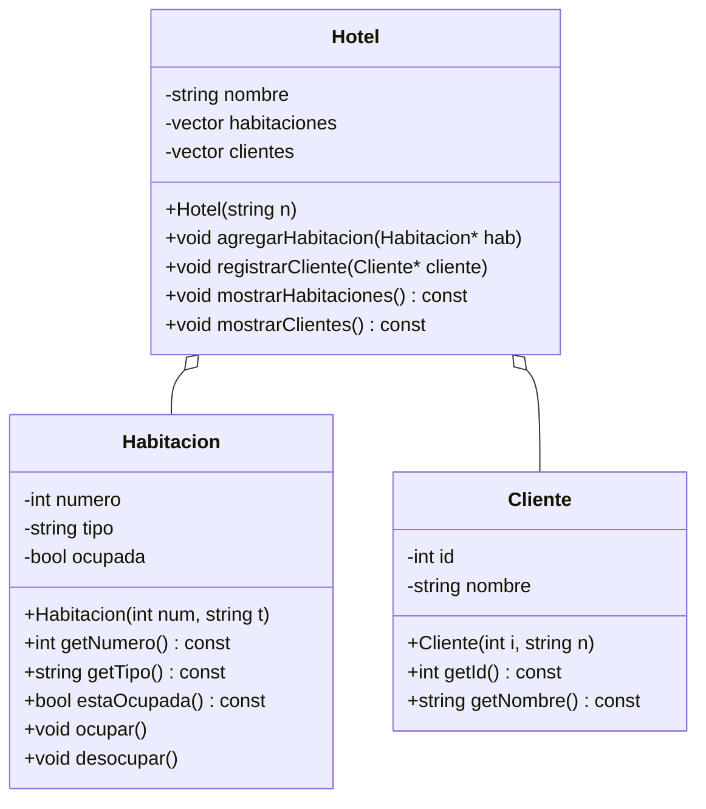
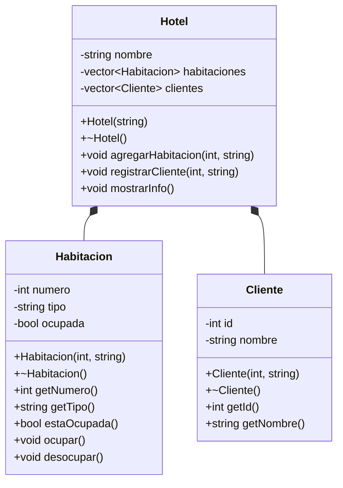

---

# 💻 300CIS017 Programación Orientada a Objetos 2025-01  <!-- omit in toc -->

[](https://creativecommons.org/licenses/by-nc-nd/4.0/)

---

# 🌟 Tema 3: POO - Parte 2 (Asociaciones) <!-- omit in toc -->

---

### 🎥 Videos que inspiraron este tema:

<table style="border-collapse: collapse; width: 100%; border: none; margin: 10px 0;">
  <tr>
    <td style="text-align: center; padding: 5px; border: none;">
      <a href="https://www.youtube.com/watch?v=92XVwY54h5k">
        
      </a>
      <br>
      <span style="font-size: 12px; margin-top: 5px; display: inline-block;">Car Radio<br>TØP</span>
    </td>
    <td style="text-align: center; padding: 5px; border: none;">
      <a href="https://www.youtube.com/watch?v=eJnQBXmZ7Ek">
        
      </a>
      <br>
      <span style="font-size: 12px; margin-top: 5px; display: inline-block;">Chlorine<br>TØP</span>
    </td>
    <td style="text-align: center; padding: 5px; border: none;">
      <a href="https://www.youtube.com/watch?v=UprcpdwuwCg">
        
      </a>
      <br>
      <span style="font-size: 12px; margin-top: 5px; display: inline-block;">Heathens<br>TØP</span>
    </td>
  </tr>
</table>

---

### 💻 Creado por   

Profesorcito © 2025

<!-- <svg version="1.1" width="16" height="16" viewBox="0 0 16 16" class="octicon octicon-trash" aria-label="The trash icon" role="img"><path d="M11 1.75V3h2.25a.75.75 0 0 1 0 1.5H2.75a.75.75 0 0 1 0-1.5H5V1.75C5 .784 5.784 0 6.75 0h2.5C10.216 0 11 .784 11 1.75ZM4.496 6.675l.66 6.6a.25.25 0 0 0 .249.225h5.19a.25.25 0 0 0 .249-.225l.66-6.6a.75.75 0 0 1 1.492.149l-.66 6.6A1.748 1.748 0 0 1 10.595 15h-5.19a1.75 1.75 0 0 1-1.741-1.575l-.66-6.6a.75.75 0 1 1 1.492-.15ZM6.5 1.75V3h3V1.75a.25.25 0 0 0-.25-.25h-2.5a.25.25 0 0 0-.25.25Z"></path></svg>

<svg version="1.1" width="16" height="16" viewBox="0 0 16 16" class="octicon octicon-pencil" aria-label="The pencil icon" role="img"><path d="M11.013 1.427a1.75 1.75 0 0 1 2.474 0l1.086 1.086a1.75 1.75 0 0 1 0 2.474l-8.61 8.61c-.21.21-.47.364-.756.445l-3.251.93a.75.75 0 0 1-.927-.928l.929-3.25c.081-.286.235-.547.445-.758l8.61-8.61Zm.176 4.823L9.75 4.81l-6.286 6.287a.253.253 0 0 0-.064.108l-.558 1.953 1.953-.558a.253.253 0 0 0 .108-.064Zm1.238-3.763a.25.25 0 0 0-.354 0L10.811 3.75l1.439 1.44 1.263-1.263a.25.25 0 0 0 0-.354Z"></path></svg>

<svg aria-hidden="true" focusable="false" class="mt-1" viewBox="0 0 16 16" width="16" height="16" fill="currentColor" style="display: inline-block; user-select: none; vertical-align: text-bottom; overflow: visible;"><path d="M10.561 8.073a6.005 6.005 0 0 1 3.432 5.142.75.75 0 1 1-1.498.07 4.5 4.5 0 0 0-8.99 0 .75.75 0 0 1-1.498-.07 6.004 6.004 0 0 1 3.431-5.142 3.999 3.999 0 1 1 5.123 0ZM10.5 5a2.5 2.5 0 1 0-5 0 2.5 2.5 0 0 0 5 0Z"></path></svg>

<svg version="1.1" width="16" height="16" viewBox="0 0 16 16" class="octicon octicon-repo" aria-hidden="true"><path d="M2 2.5A2.5 2.5 0 0 1 4.5 0h8.75a.75.75 0 0 1 .75.75v12.5a.75.75 0 0 1-.75.75h-2.5a.75.75 0 0 1 0-1.5h1.75v-2h-8a1 1 0 0 0-.714 1.7.75.75 0 1 1-1.072 1.05A2.495 2.495 0 0 1 2 11.5Zm10.5-1h-8a1 1 0 0 0-1 1v6.708A2.486 2.486 0 0 1 4.5 9h8ZM5 12.25a.25.25 0 0 1 .25-.25h3.5a.25.25 0 0 1 .25.25v3.25a.25.25 0 0 1-.4.2l-1.45-1.087a.249.249 0 0 0-.3 0L5.4 15.7a.25.25 0 0 1-.4-.2Z"></path></svg>

<svg version="1.1" width="16" height="16" viewBox="0 0 16 16" class="octicon octicon-trash" aria-label="The trash icon" role="img"><path d="M11 1.75V3h2.25a.75.75 0 0 1 0 1.5H2.75a.75.75 0 0 1 0-1.5H5V1.75C5 .784 5.784 0 6.75 0h2.5C10.216 0 11 .784 11 1.75ZM4.496 6.675l.66 6.6a.25.25 0 0 0 .249.225h5.19a.25.25 0 0 0 .249-.225l.66-6.6a.75.75 0 0 1 1.492.149l-.66 6.6A1.748 1.748 0 0 1 10.595 15h-5.19a1.75 1.75 0 0 1-1.741-1.575l-.66-6.6a.75.75 0 1 1 1.492-.15ZM6.5 1.75V3h3V1.75a.25.25 0 0 0-.25-.25h-2.5a.25.25 0 0 0-.25.25Z"></path></svg>

<svg aria-hidden="true" focusable="false" class="Octicon-sc-9kayk9-0 kfGkqo" viewBox="0 0 16 16" width="16" height="16" fill="currentColor" style="display: inline-block; user-select: none; vertical-align: text-bottom; overflow: visible;"><path d="M0 8a8 8 0 1 1 16 0A8 8 0 0 1 0 8Zm8-6.5a6.5 6.5 0 1 0 0 13 6.5 6.5 0 0 0 0-13ZM6.5 7.75A.75.75 0 0 1 7.25 7h1a.75.75 0 0 1 .75.75v2.75h.25a.75.75 0 0 1 0 1.5h-2a.75.75 0 0 1 0-1.5h.25v-2h-.25a.75.75 0 0 1-.75-.75ZM8 6a1 1 0 1 1 0-2 1 1 0 0 1 0 2Z"></path></svg>
 -->
---

### 🎶 Dedicado a 

[Tyler Joseph y Josh Dun](https://en.wikipedia.org/wiki/Twenty_One_Pilots) (Tyler y Josh) 🎤


--- 

En este capítulo, continuaremos profundizando en la programación orientada a objetos en C++. 💻 Después de estudiar la herencia, ahora exploraremos otro tipo de relaciones entre objetos: las asociaciones. 🔗 Analizaremos tres tipos principales en C++: Asociación Simple, Agregación y Composición, comprendiendo su impacto en el ciclo de vida de los objetos y la gestión de la memoria, así como su representación en diagramas UML. 📊

---

### **Tabla de Contenido**

- [1. **Introducción a las Asociaciones en C++**](#1-introducción-a-las-asociaciones-en-c)
- [2. **Tipos de Asociación**](#2-tipos-de-asociación)
  - [2.1 **Asociación Simple**](#21-asociación-simple)
    - [📌 **Ejemplo 1:** Asociación entre Doctor, Paciente y Consulta](#-ejemplo-1-asociación-entre-doctor-paciente-y-consulta)
      - [📌 **Código**](#-código)
      - [📌 **Explicación**](#-explicación)
      - [📌 **Diagrama UML**](#-diagrama-uml)
      - [📌 **Explicación del Diagrama UML**](#-explicación-del-diagrama-uml)
  - [2.2 **Agregación**](#22-agregación)
    - [📌 **Ejemplo 2:** Hotel y Habitaciones (Agregación)](#-ejemplo-2-hotel-y-habitaciones-agregación)
      - [📌 **Código**](#-código-1)
      - [📌 **Explicación**](#-explicación-1)
      - [📌 **Diagrama UML**](#-diagrama-uml-1)
      - [📌 **Explicación del Diagrama UML**](#-explicación-del-diagrama-uml-1)
  - [2.3 **Composición**](#23-composición)
    - [📌 **Ejemplo 3:** Hotel y Habitaciones (Composición)](#-ejemplo-3-hotel-y-habitaciones-composición)
      - [📌 **Código**](#-código-2)
      - [📌 **Explicación**](#-explicación-2)
      - [📌 **Diagrama UML**](#-diagrama-uml-2)
      - [📌 **Explicación del Diagrama UML**](#-explicación-del-diagrama-uml-2)
- [3. **Comparación entre Agregación y Composición**](#3-comparación-entre-agregación-y-composición)
  - [**Principales Diferencias**](#principales-diferencias)
  - [**Ventajas y Desventajas**](#ventajas-y-desventajas)
    - [📌 **Agregación:**](#-agregación)
    - [📌 **Composición:**](#-composición)
  - [**Cuándo usar cada uno**](#cuándo-usar-cada-uno)
- [4. Conclusiones](#4-conclusiones)
- [5. Ejercicios](#5-ejercicios)
  - [Programa 1](#programa-1)
  - [Programa 2](#programa-2)

---

# Asociaciones <!-- omit in toc -->

# 1. **Introducción a las Asociaciones en C++**

En la Programación Orientada a Objetos (POO), la **Asociación** es un tipo de relación que se establece entre dos o más clases, donde los objetos de una clase pueden comunicarse o interactuar con objetos de otra. Existen principalmente tres tipos de asociaciones:


- **Asociación Simple:** Relación débil entre dos objetos, donde uno utiliza al otro sin poseerlo.
- **Agregación:** Una relación débil donde un objeto es parte de otro, pero puede existir independientemente (por ejemplo, un coche tiene ruedas, pero las ruedas pueden existir sin el coche).
- **Composición:** Una relación fuerte donde un objeto depende completamente del otro (por ejemplo, un cuerpo humano tiene un corazón que no puede existir por sí solo).

> [!NOTE]
>
>**Intercambiabilidad conceptual:** En ciertos diseños, la diferencia entre agregación y composición puede ser ambigua. Por ejemplo, si se modela un Hotel y sus Habitaciones, uno podría considerarlo:  
>
>- **Agregación:** Si se permite que las Habitaciones existan como objetos independientes reutilizables (por ejemplo, habitaciones gestionadas por un sistema externo).  
>- **Composición:** Si las Habitaciones solo tienen sentido como parte del Hotel y su destrucción implica la destrucción de las Habitaciones.  
>

En este documento se explicará cada tipo de asociación con ejemplos en C++, sus diagramas UML y una comparación final entre Agregación y Composición.

# 2. **Tipos de Asociación**

## 2.1 **Asociación Simple**

En una **Asociación Simple**, un objeto utiliza a otro sin que exista una relación de propiedad. Ambos objetos pueden existir independientemente.

### 📌 **Ejemplo 1:** Asociación entre Doctor, Paciente y Consulta

Este ejemplo muestra cómo un `Doctor` y un `Paciente` interactúan con objetos de tipo `Consulta`.

#### 📌 **Código**

```cpp
#include <iostream>
#include <string>
using namespace std;

class Consulta;

class Doctor {
private:
    string nombre;

public:
    Doctor(string n) : nombre(n) {}
    string obtenerNombre() const { return nombre; }

    void realizarRevision(Consulta& consulta) const;
};

class Paciente {
private:
    string nombre;

public:
    Paciente(string n) : nombre(n) {}
    string obtenerNombre() const { return nombre; }

    void recibirRevision(Consulta& consulta) const;
};

class Consulta {
private:
    string fecha;
    string descripcion;

public:
    Consulta(string f, string d) : fecha(f), descripcion(d) {}

    string obtenerFecha() const { return fecha; }
    string obtenerDescripcion() const { return descripcion; }
};

void Doctor::realizarRevision(Consulta& consulta) const {
    cout << "Doctor " << nombre << " realiza revision en la fecha: " << consulta.obtenerFecha()
         << " - Detalle: " << consulta.obtenerDescripcion() << endl;
}

void Paciente::recibirRevision(Consulta& consulta) const {
    cout << "Paciente " << nombre << " recibe revision en la fecha: " << consulta.obtenerFecha()
         << " - Detalle: " << consulta.obtenerDescripcion() << endl;
}

int main() {
    Doctor doctor1("Rodriguez");
    Doctor doctor2("Fernandez");
    Paciente paciente1("Carlos Perez");
    Paciente paciente2("Ana Gomez");

    Consulta consulta1("17/03/2025", "Chequeo general");
    Consulta consulta2("18/03/2025", "Consulta de seguimiento");
    Consulta consulta3("19/03/2025", "Chequeo dental");

    // Doctor 1 atiende al Paciente 1
    doctor1.realizarRevision(consulta1);
    paciente1.recibirRevision(consulta1);

    doctor1.realizarRevision(consulta2);
    paciente1.recibirRevision(consulta2);

    doctor1.realizarRevision(consulta3);
    paciente1.recibirRevision(consulta3);

    cout << "------------------------" << endl;

    // Doctor 2 atiende al Paciente 2
    doctor2.realizarRevision(consulta1);
    paciente2.recibirRevision(consulta1);

    doctor2.realizarRevision(consulta2);
    paciente2.recibirRevision(consulta2);

    doctor2.realizarRevision(consulta3);
    paciente2.recibirRevision(consulta3);

    return 0;
}
```

**Salida:**

```
Doctor Rodriguez realiza revision en la fecha: 17/03/2025 - Detalle: Chequeo general
Paciente Carlos Perez recibe revision en la fecha: 17/03/2025 - Detalle: Chequeo general
Doctor Rodriguez realiza revision en la fecha: 18/03/2025 - Detalle: Consulta de seguimiento
Paciente Carlos Perez recibe revision en la fecha: 18/03/2025 - Detalle: Consulta de seguimiento
Doctor Rodriguez realiza revision en la fecha: 19/03/2025 - Detalle: Chequeo dental
Paciente Carlos Perez recibe revision en la fecha: 19/03/2025 - Detalle: Chequeo dental
------------------------
Doctor Fernandez realiza revision en la fecha: 17/03/2025 - Detalle: Chequeo general
Paciente Ana Gomez recibe revision en la fecha: 17/03/2025 - Detalle: Chequeo general
Doctor Fernandez realiza revision en la fecha: 18/03/2025 - Detalle: Consulta de seguimiento
Paciente Ana Gomez recibe revision en la fecha: 18/03/2025 - Detalle: Consulta de seguimiento
Doctor Fernandez realiza revision en la fecha: 19/03/2025 - Detalle: Chequeo dental
Paciente Ana Gomez recibe revision en la fecha: 19/03/2025 - Detalle: Chequeo dental
```

---

#### 📌 **Explicación**

Este programa simula un sistema de gestión de consultas médicas, con tres clases principales: `Doctor`, `Paciente` y `Consulta`. Cada clase tiene un rol específico:  

La clase `Doctor` representa a un médico con un nombre que puede realizar revisiones. La clase `Paciente` representa a un paciente con un nombre que puede recibir esas revisiones. Por último, la clase `Consulta` guarda información sobre una consulta médica, como su fecha y una descripción.  

El constructor de la clase `Doctor` inicializa el nombre del doctor y tiene un método `realizarRevision()` que muestra un mensaje en la consola indicando que está atendiendo una consulta. De forma similar, la clase `Paciente` tiene un método `recibirRevision()` que muestra un mensaje indicando que está recibiendo la revisión.  

El programa también tiene la clase `Consulta` que recibe como parámetros la fecha y la descripción de la consulta. Estos datos se pueden obtener con los métodos `obtenerFecha()` y `obtenerDescripcion()`.  

Las interacciones entre estas clases se realizan en la función `main()`. Primero, se crean dos doctores llamados "Rodriguez" y "Fernandez", y dos pacientes llamados "Carlos Perez" y "Ana Gomez". Además, se crean tres consultas diferentes con sus respectivas fechas y descripciones.  

El `Doctor 1` realiza revisiones para el `Paciente 1` en las tres consultas. Después, el `Doctor 2` realiza las mismas revisiones para el `Paciente 2`. Todo se muestra en la consola, detallando la fecha y la descripción de cada consulta realizada.  

---

#### 📌 **Diagrama UML**



#### 📌 **Explicación del Diagrama UML**

- `Doctor` y `Paciente` se relacionan con `Consulta` mediante métodos que la utilizan temporalmente.
- Las flechas apuntan hacia `Consulta` mostrando que ambos interactúan con ella, pero no la poseen.
- Esto es un ejemplo claro de una **Asociación Simple**.

## 2.2 **Agregación**

En una **Agregación**, un objeto se relaciona con otros objetos sin ser su propietario. Esto significa que la existencia de esos objetos no depende del objeto que los utiliza. Dicho objeto que usa o gestiona otros objetos se denomina **contenedor**, ya que los "contiene" o los gestiona sin poseerlos realmente.

### 📌 **Ejemplo 2:** Hotel y Habitaciones (Agregación)

En este ejemplo, un `Hotel` se relaciona con `Habitaciones`, pero no las crea ni las destruye. Las `Habitaciones` existen de manera independiente del `Hotel` que las usa o gestiona.

#### 📌 **Código**
```cpp
//HOTEL CON AGREGACION

#include <iostream>
#include <vector>
#include <string>
using namespace std;

class Habitacion {
private:
    int numero;
    string tipo;
    bool ocupada;

public:
    Habitacion(int num, string t) : numero(num), tipo(t), ocupada(false) {
        cout << "Habitacion creada: " << numero << endl;
    }
    int getNumero() const { return numero; }
    string getTipo() const { return tipo; }
    bool estaOcupada() const { return ocupada; }
    void ocupar() { ocupada = true; }
    void desocupar() { ocupada = false; }
};

class Cliente {
private:
    int id;
    string nombre;

public:
    Cliente(int i, string n) : id(i), nombre(n) {
        cout << "Cliente creado: " << nombre << endl;
    }
    int getId() const { return id; }
    string getNombre() const { return nombre; }
};

class Hotel {
private:
    string nombre;
    vector<Habitacion*> habitaciones; // Agregación: Hotel NO es dueño de las habitaciones.
    vector<Cliente*> clientes;        // Agregación: Hotel NO es dueño de los clientes.

public:
    Hotel(string n) : nombre(n) {
        cout << "Hotel creado: " << nombre << endl;
    }

    ~Hotel() { // Destructor explícito
        cout << "Hotel destruido: " << nombre << endl;
    }

    void agregarHabitacion(Habitacion* hab) { habitaciones.push_back(hab); }
    void registrarCliente(Cliente* cliente) { clientes.push_back(cliente); }

    void mostrarHabitaciones() const {
        cout << "\nHabitaciones en el hotel " << nombre << ":\n";
        for (const auto& hab : habitaciones) {
            cout << "Numero: " << hab->getNumero() << ", Tipo: " << hab->getTipo()
                 << ", Ocupada: " << (hab->estaOcupada() ? "Si" : "No") << endl;
        }
    }

    void mostrarClientes() const {
        cout << "\nClientes registrados en el hotel " << nombre << ":\n";
        for (const auto& cliente : clientes) {
            cout << "ID: " << cliente->getId() << ", Nombre: " << cliente->getNombre() << endl;
        }
    }
};

int main() {
    // Creación de habitaciones y clientes de forma independiente
    Habitacion hab1(101, "Simple");
    Habitacion hab2(102, "Doble");
    Cliente cli1(1, "Alice");
    Cliente cli2(2, "Bob");

    {
        // Crear hotel en un bloque de alcance limitado
        Hotel hotel("Hotel Paraiso");

        // Agregar habitaciones y clientes al hotel
        hotel.agregarHabitacion(&hab1);
        hotel.agregarHabitacion(&hab2);
        hotel.registrarCliente(&cli1);
        hotel.registrarCliente(&cli2);

        // Mostrar información del hotel
        hotel.mostrarHabitaciones();
        hotel.mostrarClientes();

        // El hotel se destruye aquí, pero las habitaciones y clientes siguen existiendo
    }

    // Demostración de que las habitaciones aún existen y se pueden usar
    cout << "\nEl hotel ha sido destruido, pero las habitaciones siguen existiendo:\n";
    cout << "Numero: " << hab1.getNumero() << ", Tipo: " << hab1.getTipo() 
         << ", Ocupada: " << (hab1.estaOcupada() ? "Si" : "No") << endl;

    cout << "Numero: " << hab2.getNumero() << ", Tipo: " << hab2.getTipo() 
         << ", Ocupada: " << (hab2.estaOcupada() ? "Si" : "No") << endl;

    return 0;
}
```

**Salida:**

```
Habitacion creada: 101
Habitacion creada: 102
Cliente creado: Alice
Cliente creado: Bob
Hotel creado: Hotel Paraiso

Habitaciones en el hotel Hotel Paraiso:
Numero: 101, Tipo: Simple, Ocupada: No
Numero: 102, Tipo: Doble, Ocupada: No

Clientes registrados en el hotel Hotel Paraiso:
ID: 1, Nombre: Alice
ID: 2, Nombre: Bob
Hotel destruido: Hotel Paraiso

El hotel ha sido destruido, pero las habitaciones siguen existiendo:
Numero: 101, Tipo: Simple, Ocupada: No
Numero: 102, Tipo: Doble, Ocupada: No
```

#### 📌 **Explicación**

- **Contenedor:** El `Hotel` actúa como un contenedor que gestiona `Habitaciones` y `Clientes` sin ser su propietario.
- **Independencia de Objetos:** Las `Habitaciones` y `Clientes` se crean en el `main()` y se pasan al `Hotel` por referencia, lo que significa que el `Hotel` solo las gestiona pero no es responsable de su ciclo de vida.

#### 📌 **Diagrama UML**



#### 📌 **Explicación del Diagrama UML**

- El diagrama muestra tres clases: `Hotel`, `Habitacion` y `Cliente`.
- Las relaciones están representadas por líneas con un rombo vacío (`o--`), lo cual indica **Agregación**.
- Estas relaciones indican que un `Hotel` contiene múltiples `Habitaciones` y múltiples `Clientes`, pero estos no son destruidos cuando el `Hotel` deja de existir.

## 2.3 **Composición**

En una **Composición**, un objeto posee y controla completamente el ciclo de vida de otro. Si el objeto contenedor se destruye, también se destruyen sus componentes. Esta relación se representa mediante un rombo negro en los diagramas UML.

### 📌 **Ejemplo 3:** Hotel y Habitaciones (Composición)

En este ejemplo, un `Hotel` crea y destruye las `Habitaciones` y los `Clientes` que posee. Cuando un `Hotel` es destruido, sus `Habitaciones` y `Clientes` también lo son.

#### 📌 **Código**
```cpp
#include <iostream>
#include <vector>
#include <string>
using namespace std;

class Habitacion {
private:
    int numero;
    string tipo;
    bool ocupada;

public:
    Habitacion(int num, string t) : numero(num), tipo(t), ocupada(false) {
        cout << "Habitacion creada: " << numero << endl;
    }

    ~Habitacion() {
        cout << "Habitacion destruida: " << numero << endl;
    }

    int getNumero() const { return numero; }
    string getTipo() const { return tipo; }
    bool estaOcupada() const { return ocupada; }

    void ocupar() { ocupada = true; }
    void desocupar() { ocupada = false; }
};

class Cliente {
private:
    int id;
    string nombre;

public:
    Cliente(int i, string n) : id(i), nombre(n) {
        cout << "Cliente creado: " << nombre << endl;
    }

    ~Cliente() {
        cout << "Cliente destruido: " << nombre << endl;
    }

    int getId() const { return id; }
    string getNombre() const { return nombre; }
};

class Hotel {
private:
    string nombre;
    vector<Habitacion> habitaciones;
    vector<Cliente> clientes;

public:
    Hotel(string n) : nombre(n) {
        cout << "Hotel " << nombre << " creado." << endl;
    }

    ~Hotel() {
        cout << "Hotel " << nombre << " destruido." << endl;
    }

    void agregarHabitacion(int numero, string tipo) {
        habitaciones.emplace_back(numero, tipo);
    }

    void registrarCliente(int id, string nombre) {
        clientes.emplace_back(id, nombre);
    }

    void mostrarInfo() const {
        cout << "Hotel: " << nombre << endl;
        cout << "Numero de habitaciones: " << habitaciones.size() << endl;
        cout << "Numero de clientes: " << clientes.size() << endl;
    }
};

int main() {
    Hotel hotel("Hotel Paraiso");
    hotel.agregarHabitacion(101, "Simple");
    hotel.agregarHabitacion(102, "Doble");
    hotel.registrarCliente(1, "Juan Perez");
    hotel.registrarCliente(2, "Ana Lopez");

    hotel.mostrarInfo();

    return 0;
}
```

**Salida:**

```
Hotel Hotel Paraiso creado.
Habitacion creada: 101
Habitacion creada: 102
Habitacion destruida: 101
Cliente creado: Juan Perez
Cliente creado: Ana Lopez
Cliente destruido: Juan Perez
Hotel: Hotel Paraiso
Numero de habitaciones: 2
Numero de clientes: 2
Hotel Hotel Paraiso destruido.
Cliente destruido: Juan Perez
Cliente destruido: Ana Lopez
Habitacion destruida: 101
Habitacion destruida: 102
```

#### 📌 **Explicación**

- **Composición**: La clase `Hotel` posee vectores de objetos `Habitacion` y `Cliente`. Cuando se destruye un objeto `Hotel`, todos los objetos `Habitacion` y `Cliente` que contiene también se destruyen.

- **Creación y Destrucción**: Los constructores y destructores de cada clase imprimen mensajes para demostrar el ciclo de vida de los objetos.

- **Métodos útiles**: `mostrarInfo()` permite ver la cantidad de habitaciones y clientes registrados en el hotel.

#### 📌 **Diagrama UML**



#### 📌 **Explicación del Diagrama UML**

- El diagrama muestra tres clases principales: `Hotel`, `Habitacion` y `Cliente`.
- Las relaciones están representadas por líneas con un rombo lleno (`*--`), lo cual indica **Composición**.
- Estas relaciones indican que un `Hotel` posee múltiples `Habitaciones` y múltiples `Clientes`, y ambos son destruidos junto con el `Hotel` si este deja de existir.
- La clase `Hotel` gestiona las `Habitaciones` y `Clientes` a través de vectores (`vector<Habitacion>` y `vector<Cliente>`).
- La `Clase Habitacion` puede ser ocupada o desocupada.
- La `Clase Cliente` almacena un identificador único y un nombre.

# 3. **Comparación entre Agregación y Composición**

Tanto la **Agregación** como la **Composición** son tipos específicos de asociación en la Programación Orientada a Objetos que describen relaciones "todo/parte". La diferencia clave entre ambos conceptos radica en la fuerza de la relación entre los objetos.

## **Principales Diferencias**
| Característica        | Agregación                               | Composición                              |
|-----------------------|-----------------------------------------|----------------------------------------|
| Naturaleza            | Relación débil (no posee).              | Relación fuerte (posee).               |
| Ciclo de vida         | Independiente.                         | Dependiente del objeto principal.     |
| Representación en UML | Rombo vacío (`o--`).                   | Rombo sólido (`*--`).                 |
| Gestión de objetos    | El objeto "contenedor" no destruye a los objetos que contiene. | El objeto "contenedor" destruye a los objetos que contiene. |

## **Ventajas y Desventajas**

### 📌 **Agregación:**
- ✅ **Ventajas:**
  - Flexibilidad para reutilizar objetos en otros contextos.
  - Mayor independencia entre clases, lo cual facilita el mantenimiento.

- ❌ **Desventajas:**
  - Menor control sobre el ciclo de vida de los objetos relacionados.
  - Puede complicar la gestión de recursos si no se maneja adecuadamente.

### 📌 **Composición:**
- ✅ **Ventajas:**
  - Mayor encapsulamiento y control sobre los objetos que componen al principal.
  - Garantiza que los objetos "hijo" no existan sin su "padre".

- ❌ **Desventajas:**
  - Menor flexibilidad para reutilizar componentes en otros contextos.
  - Mayor acoplamiento entre clases, lo cual dificulta su modificación.

## **Cuándo usar cada uno**
- 📌 **Usar Agregación:** Cuando se necesita que los objetos puedan existir independientemente del objeto "contenedor". Por ejemplo, un `Hotel` que puede gestionar `Habitaciones` que existen por sí mismas o que son reutilizables en otros sistemas.

- 📌 **Usar Composición:** Cuando se desea un control total sobre los objetos "hijo" y garantizar que su existencia depende completamente del objeto "contenedor". Por ejemplo, un `Hotel` que posee `Habitaciones` que son destruidas cuando el `Hotel` es destruido.


# 4. Conclusiones

- Las relaciones en la POO se pueden modelar mediante **asociación simple**, **agregación** y **composición**, dependiendo de la fuerza de la relación y la gestión del ciclo de vida de los objetos.
- La **asociación simple** es adecuada cuando dos objetos necesitan interactuar pero no tienen dependencia en su existencia.
- La **agregación** es adecuada cuando el ciclo de vida del objeto contenido es independiente del contenedor.
- La **composición** debe usarse cuando se desea una relación de pertenencia fuerte, donde la destrucción del contenedor implica la destrucción de sus componentes.
- Comprender estas diferencias permite diseñar sistemas más robustos y seguros en C++ y otros lenguajes orientados a objetos.

# 5. Ejercicios

Realizar el diagrama de clases para los siguientes programas:

## Programa 1

```cpp
#include <iostream>
#include <vector>
#include <string>
using namespace std;

class Habitacion {
private:
    int numero;
    string tipo;
    bool ocupada;

public:
    Habitacion(int num, string t) : numero(num), tipo(t), ocupada(false) {
        cout << "Habitacion creada: " << numero << endl;
    }

    ~Habitacion() {
        cout << "Habitacion destruida: " << numero << endl;
    }

    int getNumero() const { return numero; }
    string getTipo() const { return tipo; }
    bool estaOcupada() const { return ocupada; }
    void ocupar() { ocupada = true; }
    void desocupar() { ocupada = false; }
};

class Cliente {
private:
    int id;
    string nombre;

public:
    Cliente(int i, string n) : id(i), nombre(n) {
        cout << "Cliente creado: " << nombre << endl;
    }

    ~Cliente() {
        cout << "Cliente destruido: " << nombre << endl;
    }

    int getId() const { return id; }
    string getNombre() const { return nombre; }
};

class Hotel {
private:
    string nombre;
    vector<Habitacion> habitaciones; // Composición: El Hotel posee las habitaciones.
    vector<Cliente*> clientes;       // Agregación: El Hotel tiene punteros a Clientes.

public:
    Hotel(string n) : nombre(n) {
        cout << "Hotel " << nombre << " creado." << endl;
    }

    ~Hotel() {
        cout << "Hotel " << nombre << " destruido." << endl;
        
        // No se destruyen los clientes porque son externos al Hotel.
        if (!clientes.empty()) {
            cout << "Advertencia: Los clientes aun existen fuera del hotel." << endl;
        }
    }

    void agregarHabitacion(int numero, string tipo) {
        habitaciones.emplace_back(numero, tipo);
    }

    void registrarCliente(Cliente* cliente) {
        clientes.push_back(cliente);
    }

    void mostrarInfo() const {
        cout << "\nHotel: " << nombre << endl;
        cout << "Numero de habitaciones: " << habitaciones.size() << endl;
        cout << "Numero de clientes: " << clientes.size() << endl;

        cout << "\nClientes registrados:" << endl;
        for (const auto& cliente : clientes) {
            cout << "- " << cliente->getNombre() << endl;
        }
    }
};

int main() {
    Cliente* cliente1 = new Cliente(1, "Juan Perez");
    Cliente* cliente2 = new Cliente(2, "Ana Lopez");

    {
        Hotel hotel("Hotel Paraiso");

        hotel.agregarHabitacion(101, "Simple");
        hotel.agregarHabitacion(102, "Doble");

        hotel.registrarCliente(cliente1);
        hotel.registrarCliente(cliente2);

        hotel.mostrarInfo();
    } // El Hotel se destruye aquí, pero los clientes siguen existiendo

    cout << "\nEl hotel ha sido destruido, pero los clientes aún existen en memoria.\n";

    // Liberar memoria de clientes
    delete cliente1;
    delete cliente2;

    return 0;
}
```

## Programa 2

```cpp
#include <iostream>
#include <vector>
#include <string>
using namespace std;

// Clase Auto (Agregación con AgenciaRenta)
class Auto {
private:
    string placa;
    string modelo;
    bool disponible;

public:
    Auto(string p, string m) : placa(p), modelo(m), disponible(true) {
        cout << "Auto creado: " << modelo << " (" << placa << ")" << endl;
    }

    ~Auto() {
        cout << "Auto destruido: " << modelo << " (" << placa << ")" << endl;
    }

    string getPlaca() const { return placa; }
    string getModelo() const { return modelo; }
    bool estaDisponible() const { return disponible; }
    void rentar() { disponible = false; }
    void devolver() { disponible = true; }
};

// Clase Cliente (Agregación con AgenciaRenta)
class Cliente {
private:
    int id;
    string nombre;

public:
    Cliente(int i, string n) : id(i), nombre(n) {
        cout << "Cliente creado: " << nombre << endl;
    }

    ~Cliente() {
        cout << "Cliente destruido: " << nombre << endl;
    }

    int getId() const { return id; }
    string getNombre() const { return nombre; }
};

// Clase Contrato (Asociación Simple entre Auto y Cliente)
class Contrato {
private:
    Cliente* cliente;
    Auto* autoRentado;
    int dias;

public:
    Contrato(Cliente* c, Auto* a, int d) : cliente(c), autoRentado(a), dias(d) {
        if (a->estaDisponible()) {
            autoRentado->rentar();
            cout << "Contrato creado: " << cliente->getNombre() 
                 << " rentó el auto " << autoRentado->getModelo() 
                 << " por " << dias << " días." << endl;
        } else {
            cout << "El auto " << autoRentado->getModelo() << " no está disponible." << endl;
        }
    }

    ~Contrato() {
        if (!autoRentado->estaDisponible()) {
            autoRentado->devolver();
            cout << "Contrato finalizado: El auto " << autoRentado->getModelo() 
                 << " ha sido devuelto por " << cliente->getNombre() << "." << endl;
        }
    }
};

// Clase AgenciaRenta (Agregación con Auto y Cliente)
class AgenciaRenta {
private:
    string nombre;
    vector<Auto*> autos;       // Punteros porque se crean con new en main
    vector<Cliente*> clientes;  // Punteros porque se crean con new en main

public:
    AgenciaRenta(string n) : nombre(n) {
        cout << "Agencia de Renta creada: " << nombre << endl;
    }

    ~AgenciaRenta() {
        cout << "Agencia de Renta destruida: " << nombre << endl;
        
        for (auto autoPtr : autos)
            delete autoPtr;

        for (auto clientePtr : clientes)
            delete clientePtr;
    }

    void agregarAuto(Auto* autoPtr) {
        autos.push_back(autoPtr);
    }

    void agregarCliente(Cliente* clientePtr) {
        clientes.push_back(clientePtr);
    }

    void mostrarInfo() const {
        cout << "\nAgencia: " << nombre << endl;
        cout << "Autos disponibles:" << endl;
        for (const auto& autoPtr : autos) {
            cout << "- " << autoPtr->getModelo() << " (" 
                 << (autoPtr->estaDisponible() ? "Disponible" : "No disponible") << ")" << endl;
        }

        cout << "Clientes registrados:" << endl;
        for (const auto& clientePtr : clientes) {
            cout << "- " << clientePtr->getNombre() << endl;
        }
    }
};

int main() {
    // Creación de la agencia
    AgenciaRenta agencia("Renta Fácil");

    // Creación de autos y clientes usando new (Agregación)
    Auto* auto1 = new Auto("ABC123", "Toyota Corolla");
    Auto* auto2 = new Auto("DEF456", "Honda Civic");
    Cliente* cliente1 = new Cliente(1, "Carlos Perez");
    Cliente* cliente2 = new Cliente(2, "Maria Lopez");

    // Registro en la agencia
    agencia.agregarAuto(auto1);
    agencia.agregarAuto(auto2);
    agencia.agregarCliente(cliente1);
    agencia.agregarCliente(cliente2);

    agencia.mostrarInfo();

    // Creación de contratos (Asociación Simple)
    Contrato contrato1(cliente1, auto1, 5);  // Este auto se marca como rentado
    Contrato contrato2(cliente2, auto2, 3);  // Este auto se marca como rentado

    agencia.mostrarInfo();

    // Termina el programa y se liberan los recursos
    return 0;
}
```

---

