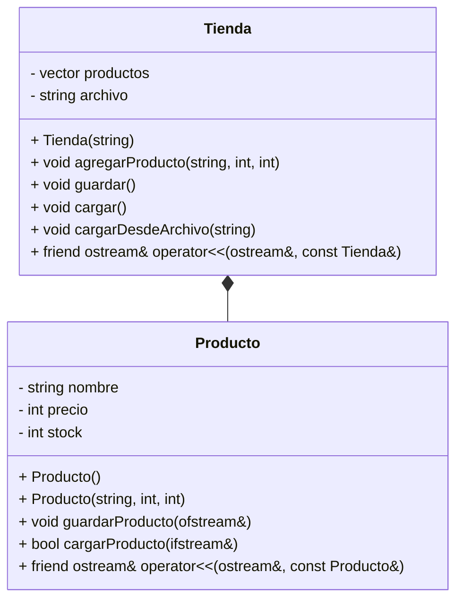
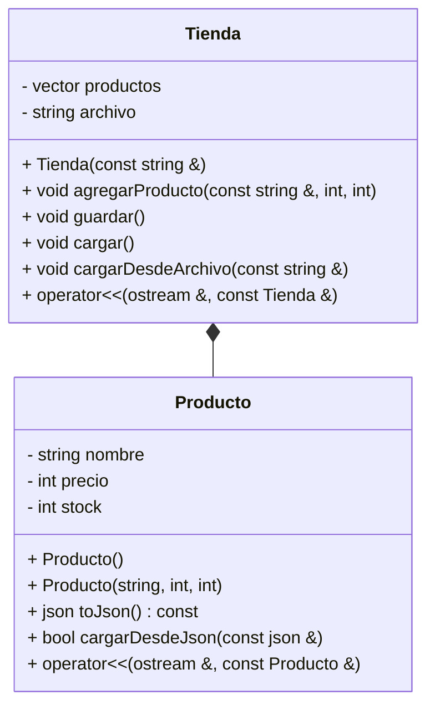

---

# 💻 300CIS017 Programación Orientada a Objetos 2025-01  <!-- omit in toc -->

[](https://creativecommons.org/licenses/by-nc-nd/4.0/)

---

# 🌟 Tema 3: POO - Parte 3 (Persistencia) <!-- omit in toc -->

---

### 🎥 Videos que inspiraron este tema:

<table style="border-collapse: collapse; width: 100%; border: none; margin: 10px 0;">
  <tr>
    <td style="text-align: center; padding: 5px; border: none;">
      <a href="https://www.youtube.com/watch?v=92XVwY54h5k">
        
      </a>
      <br>
      <span style="font-size: 12px; margin-top: 5px; display: inline-block;">Car Radio<br>TØP</span>
    </td>
    <td style="text-align: center; padding: 5px; border: none;">
      <a href="https://www.youtube.com/watch?v=eJnQBXmZ7Ek">
        
      </a>
      <br>
      <span style="font-size: 12px; margin-top: 5px; display: inline-block;">Chlorine<br>TØP</span>
    </td>
    <td style="text-align: center; padding: 5px; border: none;">
      <a href="https://www.youtube.com/watch?v=UprcpdwuwCg">
        
      </a>
      <br>
      <span style="font-size: 12px; margin-top: 5px; display: inline-block;">Heathens<br>TØP</span>
    </td>
  </tr>
</table>

---

### 💻 Creado por   

Profesorcito © 2025

<!-- <svg version="1.1" width="16" height="16" viewBox="0 0 16 16" class="octicon octicon-trash" aria-label="The trash icon" role="img"><path d="M11 1.75V3h2.25a.75.75 0 0 1 0 1.5H2.75a.75.75 0 0 1 0-1.5H5V1.75C5 .784 5.784 0 6.75 0h2.5C10.216 0 11 .784 11 1.75ZM4.496 6.675l.66 6.6a.25.25 0 0 0 .249.225h5.19a.25.25 0 0 0 .249-.225l.66-6.6a.75.75 0 0 1 1.492.149l-.66 6.6A1.748 1.748 0 0 1 10.595 15h-5.19a1.75 1.75 0 0 1-1.741-1.575l-.66-6.6a.75.75 0 1 1 1.492-.15ZM6.5 1.75V3h3V1.75a.25.25 0 0 0-.25-.25h-2.5a.25.25 0 0 0-.25.25Z"></path></svg>

<svg version="1.1" width="16" height="16" viewBox="0 0 16 16" class="octicon octicon-pencil" aria-label="The pencil icon" role="img"><path d="M11.013 1.427a1.75 1.75 0 0 1 2.474 0l1.086 1.086a1.75 1.75 0 0 1 0 2.474l-8.61 8.61c-.21.21-.47.364-.756.445l-3.251.93a.75.75 0 0 1-.927-.928l.929-3.25c.081-.286.235-.547.445-.758l8.61-8.61Zm.176 4.823L9.75 4.81l-6.286 6.287a.253.253 0 0 0-.064.108l-.558 1.953 1.953-.558a.253.253 0 0 0 .108-.064Zm1.238-3.763a.25.25 0 0 0-.354 0L10.811 3.75l1.439 1.44 1.263-1.263a.25.25 0 0 0 0-.354Z"></path></svg>

<svg aria-hidden="true" focusable="false" class="mt-1" viewBox="0 0 16 16" width="16" height="16" fill="currentColor" style="display: inline-block; user-select: none; vertical-align: text-bottom; overflow: visible;"><path d="M10.561 8.073a6.005 6.005 0 0 1 3.432 5.142.75.75 0 1 1-1.498.07 4.5 4.5 0 0 0-8.99 0 .75.75 0 0 1-1.498-.07 6.004 6.004 0 0 1 3.431-5.142 3.999 3.999 0 1 1 5.123 0ZM10.5 5a2.5 2.5 0 1 0-5 0 2.5 2.5 0 0 0 5 0Z"></path></svg>

<svg version="1.1" width="16" height="16" viewBox="0 0 16 16" class="octicon octicon-repo" aria-hidden="true"><path d="M2 2.5A2.5 2.5 0 0 1 4.5 0h8.75a.75.75 0 0 1 .75.75v12.5a.75.75 0 0 1-.75.75h-2.5a.75.75 0 0 1 0-1.5h1.75v-2h-8a1 1 0 0 0-.714 1.7.75.75 0 1 1-1.072 1.05A2.495 2.495 0 0 1 2 11.5Zm10.5-1h-8a1 1 0 0 0-1 1v6.708A2.486 2.486 0 0 1 4.5 9h8ZM5 12.25a.25.25 0 0 1 .25-.25h3.5a.25.25 0 0 1 .25.25v3.25a.25.25 0 0 1-.4.2l-1.45-1.087a.249.249 0 0 0-.3 0L5.4 15.7a.25.25 0 0 1-.4-.2Z"></path></svg>

<svg version="1.1" width="16" height="16" viewBox="0 0 16 16" class="octicon octicon-trash" aria-label="The trash icon" role="img"><path d="M11 1.75V3h2.25a.75.75 0 0 1 0 1.5H2.75a.75.75 0 0 1 0-1.5H5V1.75C5 .784 5.784 0 6.75 0h2.5C10.216 0 11 .784 11 1.75ZM4.496 6.675l.66 6.6a.25.25 0 0 0 .249.225h5.19a.25.25 0 0 0 .249-.225l.66-6.6a.75.75 0 0 1 1.492.149l-.66 6.6A1.748 1.748 0 0 1 10.595 15h-5.19a1.75 1.75 0 0 1-1.741-1.575l-.66-6.6a.75.75 0 1 1 1.492-.15ZM6.5 1.75V3h3V1.75a.25.25 0 0 0-.25-.25h-2.5a.25.25 0 0 0-.25.25Z"></path></svg>

<svg aria-hidden="true" focusable="false" class="Octicon-sc-9kayk9-0 kfGkqo" viewBox="0 0 16 16" width="16" height="16" fill="currentColor" style="display: inline-block; user-select: none; vertical-align: text-bottom; overflow: visible;"><path d="M0 8a8 8 0 1 1 16 0A8 8 0 0 1 0 8Zm8-6.5a6.5 6.5 0 1 0 0 13 6.5 6.5 0 0 0 0-13ZM6.5 7.75A.75.75 0 0 1 7.25 7h1a.75.75 0 0 1 .75.75v2.75h.25a.75.75 0 0 1 0 1.5h-2a.75.75 0 0 1 0-1.5h.25v-2h-.25a.75.75 0 0 1-.75-.75ZM8 6a1 1 0 1 1 0-2 1 1 0 0 1 0 2Z"></path></svg>
 -->
---

### 🎶 Dedicado a 

[Tyler Joseph y Josh Dun](https://en.wikipedia.org/wiki/Twenty_One_Pilots) (Tyler y Josh) 🎤


--- 

En este capítulo, continuaremos explorando la programación orientada a objetos en C++. 💾 Tras estudiar la **herencia** y las **asociaciones entre clases** (asociación simple, agregación y composición), ahora nos centraremos en un aspecto fundamental del desarrollo de software: la **persistencia de objetos**. 🗄️  Aprenderemos cómo los datos pueden mantenerse más allá del ciclo de vida de un programa, explorando técnicas para almacenar y recuperar objetos en archivos.   

---

### **Tabla de Contenido**

- [1. **Introducción a la Persistencia en C++**](#1-introducción-a-la-persistencia-en-c)
  - [2. **Persistencia con Archivos de Texto en C++**](#2-persistencia-con-archivos-de-texto-en-c)
    - [🔹 **Cómo Funciona**](#-cómo-funciona)
    - [📌 **Ejemplo 1:** Almacenamiento de productos en una tienda mediante archivos de texto.](#-ejemplo-1-almacenamiento-de-productos-en-una-tienda-mediante-archivos-de-texto)
      - [📌 **Código**](#-código)
      - [📌 **Explicación**](#-explicación)
      - [📌 **Diagrama UML**](#-diagrama-uml)
  - [3. **Persistencia con Serialización en JSON en C++**](#3-persistencia-con-serialización-en-json-en-c)
    - [🔹 **¿Qué es la serialización?**](#-qué-es-la-serialización)
    - [🔹 **Cómo Funciona en C++**](#-cómo-funciona-en-c)
    - [📌 **Ejemplo 2:** Almacenamiento de productos en una tienda mediante serialización con JSON.](#-ejemplo-2-almacenamiento-de-productos-en-una-tienda-mediante-serialización-con-json)
      - [📌 **Código**](#-código-1)
      - [📌 **Explicación**](#-explicación-1)
      - [📌 **Diagrama UML**](#-diagrama-uml-1)

---

# Persistencia en C++ <!-- omit in toc -->

# 1. **Introducción a la Persistencia en C++**

En C++, los datos solo existen mientras el programa está activo, pero al cerrarlo, todo se borra. Para evitar esto, se usa la **persistencia**, que permite almacenar y recuperar información incluso después de que el programa haya terminado.  

La persistencia es clave en la programación, ya que garantiza que los datos no se pierdan tras la ejecución. En C++, existen distintos métodos para lograrla, cada uno con sus propias ventajas y aplicaciones.

Las principales técnicas de persistencia en C++ incluyen:

- **Archivos de texto:** Para almacenar información en un formato legible y accesible.
- **Archivos binarios:** Para guardar estructuras de datos de manera eficiente y compacta.
- **Bases de datos:** Para gestionar grandes volúmenes de información de manera estructurada.
- **Serialización:** Para convertir objetos en formatos intercambiables como JSON o XML.

> [!NOTE]
>
> **Elección del método adecuado:** La mejor técnica de persistencia depende de las necesidades del proyecto. Por ejemplo:
>
> - **Archivos de texto** son útiles para para almacenar información de forma simple y legible.
> - **Archivos binarios** optimizan el almacenamiento de estructuras grandes.
> - **Bases de datos** permiten acceso estructurado y eficiente a grandes volúmenes de datos.
> - **Serialización** facilita la interoperabilidad con otros sistemas.
>

En este documento, exploraremos dos formas de persistencia en C++:  

- **Uso de archivos de texto** para almacenar productos en una tienda.  
- **Uso de Serialización con JSON** para almacenar productos en una tienda.  

## 2. **Persistencia con Archivos de Texto en C++**  

Los archivos de texto son una de las formas más simples de persistencia en C++. Se utilizan para guardar información en un formato legible, permitiendo que los datos sean recuperados en futuras ejecuciones del programa.  

### 🔹 **Cómo Funciona**  
El proceso básico de uso de archivos de texto en C++ consiste en:  

1. **Abrir un archivo** usando `ofstream` (para escribir) o `ifstream` (para leer).  
2. **Escribir datos** en el archivo si queremos guardarlos.  
3. **Leer datos** desde el archivo cuando necesitemos recuperarlos.  
4. **Cerrar el archivo** para liberar recursos.  

C++ proporciona la biblioteca `<fstream>` para manejar archivos de manera sencilla.  

---

### 📌 **Ejemplo 1:** Almacenamiento de productos en una tienda mediante archivos de texto.

#### 📌 **Código**

```cpp
#include <iostream>
#include <fstream>
#include <vector>
#include <string>

using namespace std;

class Producto {
private:
    string nombre;
    int precio;
    int stock;

public:
    Producto() : nombre(""), precio(0), stock(0) {
    }

    Producto(string n, int p, int s) : nombre(n), precio(p), stock(s) {
    }

    void guardarProducto(ofstream &archivo) const {
        archivo << nombre << " " << precio << " " << stock << endl;
    }

    bool cargarProducto(ifstream &archivo) {
        archivo >> nombre >> precio >> stock;
        return !archivo.fail(); // Retorna true si la lectura fue exitosa
    }

    friend ostream &operator<<(ostream &os, const Producto &p) {
        os << "[" << p.nombre << ", " << p.precio << ", " << p.stock << "]";
        return os;
    }
};

class Tienda {
private:
    vector<Producto> productos;
    string archivo;

public:
    Tienda(const string &nombreArchivo) {
        archivo = nombreArchivo;
    }

    void agregarProducto(const string &nombre, int precio, int stock) {
        productos.emplace_back(nombre, precio, stock);
    }

    void guardar() {
        ofstream fileOut(archivo);
        if (!fileOut) {
            cerr << "Error al abrir " << archivo << endl;
            return;
        }
        for (const auto &p: productos) {
            p.guardarProducto(fileOut);
        }
        fileOut.close();
        cout << "Tienda guardada en: " << archivo << endl;
    }

    void cargar() {
        cargarDesdeArchivo(archivo);
    }

    void cargarDesdeArchivo(const string &archivoFuente) {
        ifstream fileIn(archivoFuente);
        if (!fileIn) {
            cout << "Archivo '" << archivoFuente << "' no encontrado." << endl;
            return;
        }

        productos.clear();
        while (!fileIn.eof()) {
            Producto p;
            if (p.cargarProducto(fileIn)) {
                productos.push_back(p);
            } else {
                break;
            }
        }
        fileIn.close();
        cout << "Productos cargados desde '" << archivoFuente << "'." << endl;
    }

    friend ostream &operator<<(ostream &os, const Tienda &t) {
        for (const auto &p: t.productos) {
            os << p << endl;
        }
        return os;
    }
};

int main() {
    Tienda electroShop("../electroShop.txt");
    Tienda gameStore("../gameStore.txt");

    electroShop.agregarProducto("Laptop", 1200, 15);
    electroShop.agregarProducto("Auriculares", 80, 30);
    electroShop.agregarProducto("Monitor", 500, 20);

    cout << "ElectroShop:" << endl << electroShop << endl;
    electroShop.guardar();

    gameStore.cargarDesdeArchivo("../electroShop.txt");
    gameStore.agregarProducto("Mouse", 100, 100);
    gameStore.guardar();
    cout << "GameStore:" << endl << gameStore << endl;

    return 0;
}
```

**Salida:**

```
ElectroShop:
[Laptop, 1200, 15]
[Auriculares, 80, 30]
[Monitor, 500, 20]
Tienda guardada en: ../electroShop.txt
Productos cargados desde '../electroShop.txt'.
Tienda guardada en: ../gameStore.txt
GameStore:
[Laptop, 1200, 15]
[Auriculares, 80, 30]
[Monitor, 500, 20]
[Mouse, 100, 100]
```

---

#### 📌 **Explicación**

Este código representa una tienda que maneja productos y permite **guardar** y **cargar** los datos desde archivos de texto.  

### **1️⃣ Bibliotecas Incluidas** <!-- omit in toc -->

```cpp
#include <iostream>
#include <fstream>
#include <vector>
#include <string>
```

- `iostream`: Permite la entrada y salida estándar (`cout`, `cin`).  
- `fstream`: Maneja archivos (`ofstream` para escribir y `ifstream` para leer).  
- `vector`: Estructura de datos para almacenar productos en una lista dinámica.  
- `string`: Para manejar cadenas de caracteres.  

---

### **2️⃣ Clase Producto** <!-- omit in toc -->
Representa un producto con tres atributos:  
- `nombre` (ej: "Laptop")  
- `precio` (ej: 1200)  
- `stock` (ej: 15)  

### **🛠️ Atributos y Constructores** <!-- omit in toc -->
```cpp
class Producto {
private:
    string nombre;
    int precio;
    int stock;

public:
    Producto() : nombre(""), precio(0), stock(0) {}  // Constructor vacío

    Producto(string n, int p, int s) : nombre(n), precio(p), stock(s) {}  // Constructor con valores
```
- Constructor **vacío**: Inicializa con valores por defecto (`""`, `0`, `0`).  
- Constructor **con parámetros**: Permite crear un producto con valores específicos.  

---

### **📝 Guardar Producto en un Archivo** <!-- omit in toc -->
```cpp
void guardarProducto(ofstream &archivo) const {
    archivo << nombre << " " << precio << " " << stock << endl;
}
```
- **Escribe el producto** en un archivo en formato de texto.  
- Ejemplo de cómo quedaría en el archivo:  
  ```
  Laptop 1200 15
  Auriculares 80 30
  Monitor 500 20
  ```
---

### **📥 Cargar Producto desde un Archivo** <!-- omit in toc -->
```cpp
bool cargarProducto(ifstream &archivo) {
    archivo >> nombre >> precio >> stock;
    return !archivo.fail();  // Retorna true si la lectura fue exitosa
}
```
- **Lee** los datos de un producto desde el archivo.  
- Si la lectura falla, retorna `false` para indicar error.  

---

### **📌 Sobrecarga del operador `<<`** <!-- omit in toc -->
```cpp
friend ostream &operator<<(ostream &os, const Producto &p) {
    os << "[" << p.nombre << ", " << p.precio << ", " << p.stock << "]";
    return os;
}
```
- Permite usar `cout` directamente con un objeto `Producto`.  
- Ejemplo de salida en consola:
  ```
  [Laptop, 1200, 15]
  ```

---

## **3️⃣ Clase `Tienda`** <!-- omit in toc -->
Esta clase representa una tienda que **maneja productos** y los **guarda/carga** en un archivo.  

### **🛠️ Atributos y Constructor** <!-- omit in toc -->
```cpp
private:
    vector<Producto> productos;
    string archivo;

public:
    Tienda(const string &nombreArchivo) {
        archivo = nombreArchivo;
    }
```
- `productos`: Un **vector** donde se almacenan los productos de la tienda.  
- `archivo`: Nombre del archivo donde se guardarán los productos.  

---

### **➕ Agregar Producto a la Tienda** <!-- omit in toc -->
```cpp
void agregarProducto(const string &nombre, int precio, int stock) {
    productos.emplace_back(nombre, precio, stock);
}
```
- Usa `emplace_back()` para **añadir** un producto al `vector productos`.  
- Ejemplo de uso:
  ```cpp
  electroShop.agregarProducto("Laptop", 1200, 15);
  ```
  Esto agrega el producto `Laptop` con precio `1200` y stock `15`.

---

### **💾 Guardar Productos en un Archivo** <!-- omit in toc -->
```cpp
void guardar() {
    ofstream fileOut(archivo);
    if (!fileOut) {
        cerr << "Error al abrir " << archivo << endl;
        return;
    }
    for (const auto &p: productos) {
        p.guardarProducto(fileOut);
    }
    fileOut.close();
    cout << "Tienda guardada en: " << archivo << endl;
}
```
#### **Paso a paso:** <!-- omit in toc -->
1. **`ofstream fileOut(archivo);`**  
   - Abre el archivo de salida (`ofstream`).
   - Si el archivo ya existe, **se sobrescribe**.  

2. **`if (!fileOut) { cerr << "Error al abrir " << archivo << endl; return; }`**  
   - Verifica si hubo error al abrir el archivo.  

3. **`for (const auto &p: productos) { p.guardarProducto(fileOut); }`**  
   - **Guarda** todos los productos en el archivo usando `guardarProducto()`.  

4. **`fileOut.close();`**  
   - **Cierra el archivo** para evitar problemas.  

5. **Mensaje en consola**  
   ```
   Tienda guardada en: ../electroShop.txt
   ```

---

### **📥 Cargar Productos desde un Archivo** <!-- omit in toc -->
```cpp
void cargarDesdeArchivo(const string &archivoFuente) {
    ifstream fileIn(archivoFuente);
    if (!fileIn) {
        cout << "Archivo '" << archivoFuente << "' no encontrado." << endl;
        return;
    }

    productos.clear();
    while (!fileIn.eof()) {
        Producto p;
        if (p.cargarProducto(fileIn)) {
            productos.push_back(p);
        } else {
            break;
        }
    }
    fileIn.close();
    cout << "Productos cargados desde '" << archivoFuente << "'." << endl;
}
```
#### **Paso a paso:** <!-- omit in toc -->
1. **Abre el archivo con `ifstream`**  
   - Si el archivo no existe, muestra un mensaje de error y termina.  

2. **`productos.clear();`**  
   - Borra los productos actuales antes de cargar nuevos.  

3. **`while (!fileIn.eof())`**  
   - Mientras no sea el final del archivo:  
     - Crea un objeto `Producto`.  
     - Llama a `cargarProducto()`.  
     - Si la lectura fue exitosa, lo agrega a la lista.  

4. **`fileIn.close();`**  
   - **Cierra el archivo** al finalizar.  

---

## **4️⃣ `main()` - Programa Principal** <!-- omit in toc -->
```cpp
int main() {
    Tienda electroShop("../electroShop.txt");
    Tienda gameStore("../gameStore.txt");

    electroShop.agregarProducto("Laptop", 1200, 15);
    electroShop.agregarProducto("Auriculares", 80, 30);
    electroShop.agregarProducto("Monitor", 500, 20);

    cout << "ElectroShop:" << endl << electroShop << endl;
    electroShop.guardar();

    gameStore.cargarDesdeArchivo("../electroShop.txt");
    gameStore.agregarProducto("Mouse", 100, 100);
    gameStore.guardar();
    cout << "GameStore:" << endl << gameStore << endl;

    return 0;
}
```
### **¿Qué hace `main()`?** <!-- omit in toc -->
1. **Crea la tienda `electroShop` y `gameStore`.**
2. **Añade productos a `electroShop`** y los muestra en pantalla.
3. **Guarda los productos en `electroShop.txt`.**
4. **Carga los productos de `electroShop.txt` en `gameStore`**.
5. **Añade un producto extra (`Mouse`) a `gameStore`.**
6. **Guarda `gameStore` en `gameStore.txt` y lo muestra en pantalla.**

---

#### 📌 **Diagrama UML**



## 3. **Persistencia con Serialización en JSON en C++**  

Además de los archivos de texto, otra forma eficiente de almacenar datos es mediante **serialización**, convirtiendo objetos en un formato estructurado como **JSON**. Esto facilita la persistencia y permite que los datos sean compartidos entre diferentes sistemas o lenguajes de programación.  

### 🔹 **¿Qué es la serialización?**  
La **serialización** es el proceso de convertir un objeto en un formato que pueda ser almacenado o transmitido y posteriormente reconstruido en su estado original. En este caso, usamos **JSON (JavaScript Object Notation)**, un formato ligero y legible.  

### 🔹 **Cómo Funciona en C++**  
Para serializar y deserializar objetos en JSON, usamos la biblioteca [`nlohmann/json`](https://github.com/nlohmann/json), que proporciona una forma sencilla de convertir objetos de C++ a JSON y viceversa.  

El proceso general es:  
1. **Convertir objetos a JSON** usando un método `toJson()`.  
2. **Guardar el JSON en un archivo** con `ofstream`.  
3. **Leer el JSON desde un archivo** con `ifstream`.  
4. **Convertir el JSON de vuelta a objetos** para su uso en el programa.  

---

### 📌 **Ejemplo 2:** Almacenamiento de productos en una tienda mediante serialización con JSON.

#### 📌 **Código**

```cpp
#include <iostream>
#include <fstream>
#include <vector>
#include <string>
#include "json.hpp"

using namespace std;
using json = nlohmann::json;

class Producto {
private:
    string nombre;
    int precio;
    int stock;

public:
    Producto() : nombre(""), precio(0), stock(0) {}

    Producto(string n, int p, int s) : nombre(n), precio(p), stock(s) {}

    json toJson() const {
        return json{{"nombre", nombre}, {"precio", precio}, {"stock", stock}};
    }

    bool cargarDesdeJson(const json &j) {
        if (j.contains("nombre") && j.contains("precio") && j.contains("stock")) {
            nombre = j["nombre"].get<string>();
            precio = j["precio"].get<int>();
            stock = j["stock"].get<int>();
            return true;
        }
        return false;
    }

    friend ostream &operator<<(ostream &os, const Producto &p) {
        os << "[" << p.nombre << ", " << p.precio << ", " << p.stock << "]";
        return os;
    }
};

class Tienda {
private:
    vector<Producto> productos;
    string archivo;

public:
    Tienda(const string &nombreArchivo) {
        archivo = nombreArchivo;
    }

    void agregarProducto(const string &nombre, int precio, int stock) {
        productos.emplace_back(nombre, precio, stock);
    }

    void guardar() {
        json j;
        for (const auto &p : productos) {
            j.push_back(p.toJson());
        }

        ofstream fileOut(archivo);
        if (!fileOut) {
            cerr << "Error al abrir " << archivo << endl;
            return;
        }
        fileOut << j.dump(4);
        fileOut.close();
        cout << "Tienda guardada en: " << archivo << endl;
    }

    void cargar() {
        cargarDesdeArchivo(archivo);
    }

    void cargarDesdeArchivo(const string &archivoFuente) {
        ifstream fileIn(archivoFuente);
        if (!fileIn) {
            cout << "Archivo '" << archivoFuente << "' no encontrado." << endl;
            return;
        }

        json j;
        fileIn >> j;
        fileIn.close();

        productos.clear();
        for (const auto &elem : j) {
            Producto p;
            if (p.cargarDesdeJson(elem)) {
                productos.push_back(p);
            }
        }
        cout << "Productos cargados desde '" << archivoFuente << "'." << endl;
    }

    friend ostream &operator<<(ostream &os, const Tienda &t) {
        for (const auto &p : t.productos) {
            os << p << endl;
        }
        return os;
    }
};

int main() {
    Tienda electroShop("../electroShop.json");
    Tienda gameStore("../gameStore.json");

    electroShop.agregarProducto("Laptop", 1200, 15);
    electroShop.agregarProducto("Auriculares", 80, 30);
    electroShop.agregarProducto("Monitor", 500, 20);

    cout << "ElectroShop:\n" << electroShop << endl;
    electroShop.guardar();

    gameStore.cargarDesdeArchivo("../electroShop.json");
    gameStore.agregarProducto("Mouse", 100, 100);
    gameStore.guardar();

    cout << "GameStore:\n" << gameStore << endl;

    return 0;
}
```

**Salida:**

```
ElectroShop:
[Laptop, 1200, 15]
[Auriculares, 80, 30]
[Monitor, 500, 20]
Tienda guardada en: ../electroShop.json
Productos cargados desde '../electroShop.json'.
Tienda guardada en: ../gameStore.json
GameStore:
[Laptop, 1200, 15]
[Auriculares, 80, 30]
[Monitor, 500, 20]
[Mouse, 100, 100]
```

---

#### 📌 **Explicación**

## **1️⃣ Bibliotecas Incluidas** <!-- omit in toc -->
```cpp
#include <iostream>
#include <fstream>
#include <vector>
#include <string>
#include "json.hpp"
```
🔹 `iostream`: Permite la entrada y salida estándar (`cout`, `cin`).  
🔹 `fstream`: Maneja archivos (`ofstream` para escribir y `ifstream` para leer).  
🔹 `vector`: Para almacenar una lista dinámica de productos.  
🔹 `string`: Para manejar cadenas de caracteres.  
🔹 `json.hpp`: Biblioteca externa para manipular archivos **JSON**.  
👉 Se usa `nlohmann::json`, una biblioteca popular para trabajar con JSON en C++.  

```cpp
using namespace std;
using json = nlohmann::json;
```
🔹 `using json = nlohmann::json;` → Define un alias `json` para facilitar su uso.  

---

### 📌 **Cómo obtener `json.hpp`** <!-- omit in toc -->
Para usar esta biblioteca en tu proyecto, sigue estos pasos:

🔹 **Paso 1: Descargar `json.hpp` desde GitHub**  
- Abre tu navegador y dirígete al repositorio oficial de la biblioteca en GitHub:  
   🔗 [https://github.com/nlohmann/json](https://github.com/nlohmann/json)  

- Ve a la pestaña **"Releases"** en la parte derecha o accede directamente aquí:  
   🔗 [https://github.com/nlohmann/json/releases](https://github.com/nlohmann/json/releases)  

- Busca el archivo **`json.hpp`** dentro de los archivos adjuntos (**Assets**) y haz clic en él para descargarlo.  

🔹 **Paso 2: Ubicar `json.hpp` en tu proyecto**  

- Mueve el archivo `json.hpp` a la misma carpeta donde está `main.cpp`.  

---

# **2️⃣ Clase `Producto`**  <!-- omit in toc -->  
Esta clase representa un producto con **nombre, precio y stock**.  

### **🛠️ Atributos y Constructores** <!-- omit in toc -->
```cpp
private:
    string nombre;
    int precio;
    int stock;

public:
    Producto() : nombre(""), precio(0), stock(0) {}

    Producto(string n, int p, int s) : nombre(n), precio(p), stock(s) {}
```
🔹 Constructor **vacío**: Inicializa con valores predeterminados (`""`, `0`, `0`).  
🔹 Constructor **con parámetros**: Crea un producto con valores específicos.  

---

### **📌 Conversión a JSON** <!-- omit in toc -->
```cpp
json toJson() const {
    return json{{"nombre", nombre}, {"precio", precio}, {"stock", stock}};
}
```
🔹 **Convierte** el objeto `Producto` en un formato JSON, por ejemplo:  
```json
{"nombre": "Laptop", "precio": 1200, "stock": 15}
```
Esto permite **guardar los datos en archivos JSON**.  

---

### **📥 Cargar Producto desde JSON** <!-- omit in toc -->
```cpp
bool cargarDesdeJson(const json &j) {
    if (j.contains("nombre") && j.contains("precio") && j.contains("stock")) {
        nombre = j["nombre"].get<string>();
        precio = j["precio"].get<int>();
        stock = j["stock"].get<int>();
        return true;
    }
    return false;
}
```
🔹 **Lee** los datos desde un archivo JSON y los asigna a los atributos.  
🔹 **Verifica** que el JSON contenga las claves necesarias antes de cargarlas.  

---

### **📌 Sobrecarga del operador `<<`** <!-- omit in toc -->
```cpp
friend ostream &operator<<(ostream &os, const Producto &p) {
    os << "[" << p.nombre << ", " << p.precio << ", " << p.stock << "]";
    return os;
}
```
🔹 **Permite imprimir** un `Producto` directamente con `cout`.  
🔹 Ejemplo de salida:  
```plaintext
[Laptop, 1200, 15]
```

---

# **3️⃣ Clase `Tienda`**   <!-- omit in toc -->
Esta clase representa una tienda que maneja un **conjunto de productos** y los **guarda/carga en archivos JSON**.  

### **🛠️ Atributos y Constructor** <!-- omit in toc -->
```cpp
private:
    vector<Producto> productos;
    string archivo;

public:
    Tienda(const string &nombreArchivo) {
        archivo = nombreArchivo;
    }
```
🔹 `productos`: **Vector dinámico** que almacena los productos de la tienda.  
🔹 `archivo`: **Nombre del archivo** donde se guardan/cargan los productos.  

---

### **➕ Agregar Producto a la Tienda** <!-- omit in toc -->
```cpp
void agregarProducto(const string &nombre, int precio, int stock) {
    productos.emplace_back(nombre, precio, stock);
}
```
🔹 Usa `emplace_back()` para **añadir** un producto al `vector productos`.  
🔹 Ejemplo de uso:
```cpp
electroShop.agregarProducto("Laptop", 1200, 15);
```
Esto agrega **Laptop** con precio `1200` y stock `15`.

---

### **💾 Guardar Productos en un Archivo JSON** <!-- omit in toc -->
```cpp
void guardar() {
    json j;
    for (const auto &p : productos) {
        j.push_back(p.toJson());
    }

    ofstream fileOut(archivo);
    if (!fileOut) {
        cerr << "Error al abrir " << archivo << endl;
        return;
    }
    fileOut << j.dump(4);
    fileOut.close();
    cout << "Tienda guardada en: " << archivo << endl;
}
```
🔹 Convierte todos los productos a formato JSON y **los guarda en un archivo**.  
🔹 `dump(4)` → Formato JSON con **indentación de 4 espacios** (legible).  
🔹 **Ejemplo de archivo `electroShop.json` generado**:  
```json
[
    {
        "nombre": "Laptop",
        "precio": 1200,
        "stock": 15
    },
    {
        "nombre": "Auriculares",
        "precio": 80,
        "stock": 30
    }
]
```

---

### **📥 Cargar Productos desde un Archivo JSON** <!-- omit in toc -->
```cpp
void cargarDesdeArchivo(const string &archivoFuente) {
    ifstream fileIn(archivoFuente);
    if (!fileIn) {
        cout << "Archivo '" << archivoFuente << "' no encontrado." << endl;
        return;
    }

    json j;
    fileIn >> j;
    fileIn.close();

    productos.clear();
    for (const auto &elem : j) {
        Producto p;
        if (p.cargarDesdeJson(elem)) {
            productos.push_back(p);
        }
    }
    cout << "Productos cargados desde '" << archivoFuente << "'." << endl;
}
```
🔹 **Lee el archivo JSON y carga los productos** en la tienda.  
🔹 **Limpia** el vector `productos` antes de agregar los nuevos datos.  

---

# **4️⃣ `main()` - Programa Principal** <!-- omit in toc -->
```cpp
int main() {
    Tienda electroShop("../electroShop.json");
    Tienda gameStore("../gameStore.json");

    electroShop.agregarProducto("Laptop", 1200, 15);
    electroShop.agregarProducto("Auriculares", 80, 30);
    electroShop.agregarProducto("Monitor", 500, 20);

    cout << "ElectroShop:\n" << electroShop << endl;
    electroShop.guardar();

    gameStore.cargarDesdeArchivo("../electroShop.json");
    gameStore.agregarProducto("Mouse", 100, 100);
    gameStore.guardar();

    cout << "GameStore:\n" << gameStore << endl;

    return 0;
}
```
### **Flujo de ejecución:** <!-- omit in toc -->
1️⃣ `ElectroShop` **crea productos** y los **guarda en un archivo** (`electroShop.json`).  
2️⃣ `GameStore` **carga los productos desde `electroShop.json`**.  
3️⃣ `GameStore` **agrega un nuevo producto** (`Mouse`).  
4️⃣ `GameStore` **guarda los datos en otro archivo** (`gameStore.json`).  
5️⃣ **Se muestran los productos en pantalla**.  

---

#### 📌 **Diagrama UML**



