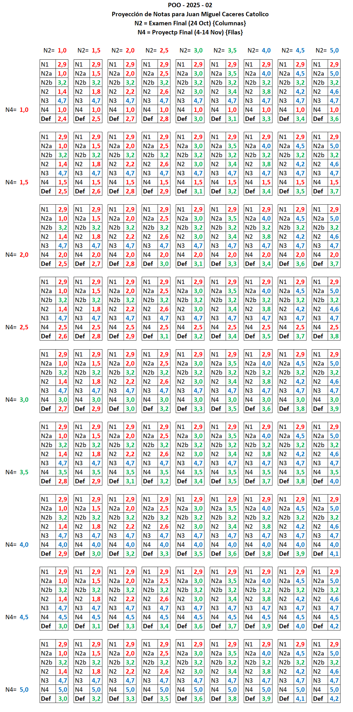
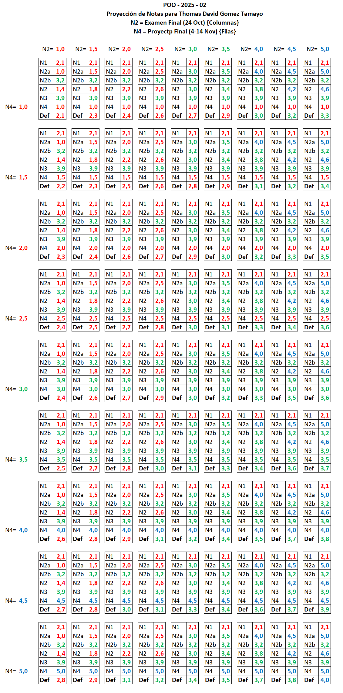

# **Proyecciones 2025-02** <!-- omit in toc -->

Este documento muestra las **proyecciones de notas** de cada estudiante para la materia POO - 2025-02. Cada proyección permite ver cómo diferentes combinaciones de nota en el **Examen Final (N2)** y en el **Proyecto Final (N4)** afectan la **nota definitiva (Def)**. Usa el menú de estudiantes para saltar a tu sección y revisa tu proyección personal.  

## Menú de estudiantes <!-- omit in toc -->

- [1. Christian David Ruiz Medina](#1-christian-david-ruiz-medina)
- [2. David Gaviria Leiton](#2-david-gaviria-leiton)
- [3. Derik Camilo Muñoz Calderon](#3-derik-camilo-muñoz-calderon)
- [4. Esteban Posso Orozco](#4-esteban-posso-orozco)
- [5. Juan David Narvaez Gelpud](#5-juan-david-narvaez-gelpud)
- [6. Juan Esteban Marin Cardona](#6-juan-esteban-marin-cardona)
- [7. Juan Esteban Ramirez Delarosa](#7-juan-esteban-ramirez-delarosa)
- [8. Juan Felipe Castillo Castaño](#8-juan-felipe-castillo-castaño)
- [9. Juan Jose Larrahondo Giron](#9-juan-jose-larrahondo-giron)
- [10. Juan Jose Rojas Canencio](#10-juan-jose-rojas-canencio)
- [11. Juan Manuel Camacho Ibarguen](#11-juan-manuel-camacho-ibarguen)
- [12. Juan Miguel Caceres Catolico](#12-juan-miguel-caceres-catolico)
- [13. Juan Pablo Toro Ruiz](#13-juan-pablo-toro-ruiz)
- [14. Julian Andres Rodriguez Castro](#14-julian-andres-rodriguez-castro)
- [15. Leidy Jimena Caso Piamba](#15-leidy-jimena-caso-piamba)
- [16. Maria Camila Gaitan Angel](#16-maria-camila-gaitan-angel)
- [17. Moises Agudelo Ocampo](#17-moises-agudelo-ocampo)
- [18. Nikolas Jimenez Sanchez](#18-nikolas-jimenez-sanchez)
- [19. Samuel Muñoz Quiroga](#19-samuel-muñoz-quiroga)
- [20. Santiago Lasso Garcia](#20-santiago-lasso-garcia)
- [21. Santiago Mazo Andrade](#21-santiago-mazo-andrade)
- [22. Thomas David Gomez Tamayo](#22-thomas-david-gomez-tamayo)

---

## Cómo usar este documento <!-- omit in toc -->

Este documento contiene las **proyecciones de notas para cada estudiante** de la materia POO - 2025-02. Cada proyección muestra **81 posibles escenarios** de nota final, combinando el desempeño en:

- **N2 = Examen Final** (columnas)  
- **N4 = Proyecto Final** (filas)  

La **intersección** entre la fila y la columna indica la **nota definitiva (Def)** que obtendrías en el curso para esa combinación de examen y proyecto.  

### Pasos para usar la tabla: <!-- omit in toc -->

1. Busca tu nombre en el menú y ve a tu sección correspondiente.  
2. Observa la tabla de proyección de notas. 
3. Identifica la **columna N2** que representa la nota que esperas sacar en el **examen final**. Por ejemplo:  
   - Si crees que sacarás **3,0 en el examen**, selecciona la columna **N2=3,0**.  
4. Identifica la **fila N4** que representa la nota que esperas sacar en el **proyecto final**. Por ejemplo:  
   - Si crees que sacarás **4,5 en el proyecto**, selecciona la fila **N4=4,5**.  
5. La celda donde se cruzan tu **columna N2** y **fila N4** te indica la **nota final proyectada (Def)** que obtendrías en el curso.  

Usando esta tabla, puedes **explorar todos los 81 escenarios posibles** de combinación entre examen final y proyecto final, y así planear estratégicamente tu desempeño según tu objetivo:  
- Aprobar la materia  
- Alcanzar una nota específica (por ejemplo, 4,0)  
- Optimizar tu rendimiento general

---

## 1. Christian David Ruiz Medina

  

---

## 2. David Gaviria Leiton

  

---

## 3. Derik Camilo Muñoz Calderon

  

---

## 4. Esteban Posso Orozco

  

---

## 5. Juan David Narvaez Gelpud

  

---

## 6. Juan Esteban Marin Cardona

  

---

## 7. Juan Esteban Ramirez Delarosa

  

---

## 8. Juan Felipe Castillo Castaño

  

---

## 9. Juan Jose Larrahondo Giron

  

---

## 10. Juan Jose Rojas Canencio

  

---

## 11. Juan Manuel Camacho Ibarguen

  

---

## 12. Juan Miguel Caceres Catolico

  

---

## 13. Juan Pablo Toro Ruiz

  

---

## 14. Julian Andres Rodriguez Castro

  

---

## 15. Leidy Jimena Caso Piamba

  

---

## 16. Maria Camila Gaitan Angel

  

---

## 17. Moises Agudelo Ocampo

  

---

## 18. Nikolas Jimenez Sanchez

  

---

## 19. Samuel Muñoz Quiroga

  

---

## 20. Santiago Lasso Garcia

  

---

## 21. Santiago Mazo Andrade

  

---

## 22. Thomas David Gomez Tamayo

  

