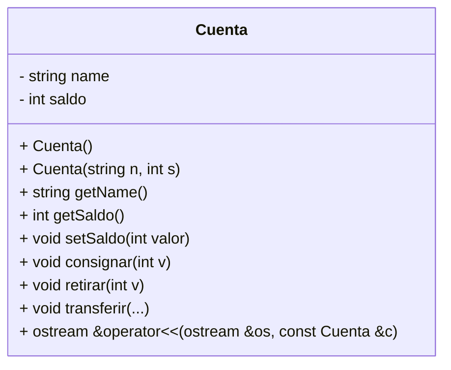
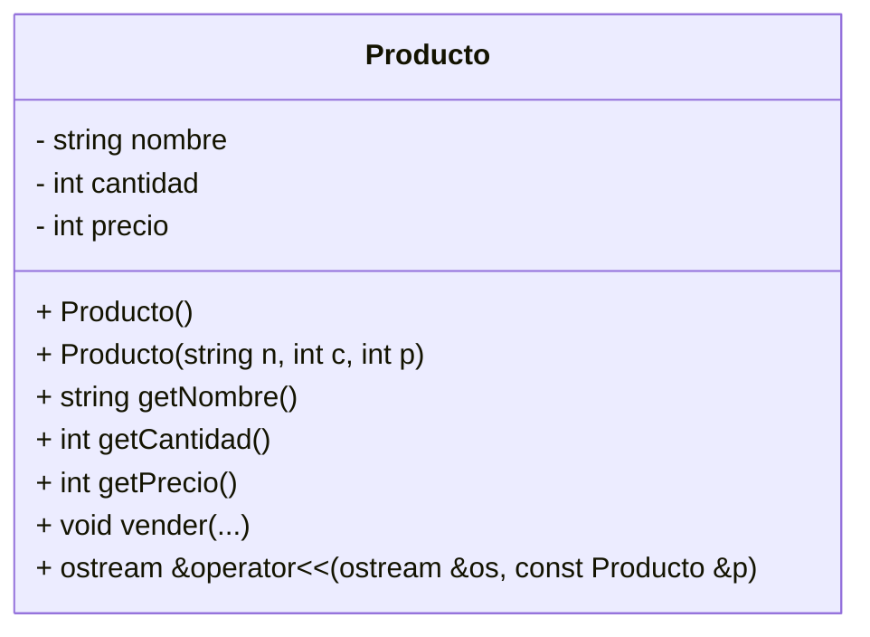

# **🧮 Tarea 4 - Dominando Clases y Objetos en C++**

[](https://classroom.github.com/a/9ovHgCtm)


## **📢🚨 FECHA LÍMITE: Martes 4 de marzo - 23:59 🚨📢** <!-- omit in toc -->

⚠️ **ENTREGAS FUERA DE TIEMPO NO SERÁN ACEPTADAS.**  
✅ **Haz `commit` y `push` antes del plazo y verifica tu entrega en GitHub Classroom.**

---

## **📖 Descripción de la Tarea** <!-- omit in toc -->

¡Estamos cada vez más cerca del examen! 📚💡 Esta tarea es una excelente oportunidad para reforzar tus habilidades en **C++**, aplicando conceptos clave como estructuras de control, tipos de datos, arreglos, manipulación de clases, programación orientada a objetos, encapsulación, métodos, sobrecarga de operadores, manejo de funciones, entrada y salida de datos, manipulación de cadenas y control de versiones con Git y GitHub.

En esta actividad, trabajarás con **dos programas**:  

✅ **Sistema de Gestión Bancaria**: Implementarás un sistema para gestionar cuentas bancarias, permitiendo operaciones como agregar, eliminar, consignar, retirar y transferir dinero.  
✅ **Gestor Integral de Comercio**: Diseñarás un sistema de inventario que permitirá administrar productos, registrar ventas y generar facturas.  

🛠 **Sigue el código base proporcionado**, implementa las funcionalidades faltantes y asegúrate de probar bien tu solución antes de subirla a **GitHub Classroom**.  

> [!IMPORTANT] 
> 
> La fecha límite es el **martes 4 de marzo a las 23:59**. ¡No dejes la entrega para el último momento! 🚀🔍  
>

¡Manos a la obra y mucho éxito! 💪💻

## **📌 Problema 1 (40 puntos) Sistema de Gestión Bancaria**  <!-- omit in toc -->

En este desafío, desarrollarás un sistema bancario en C++ que permitirá administrar cuentas y procesar transacciones de manera eficiente. A través de una serie de comandos, los usuarios podrán gestionar múltiples cuentas, realizar operaciones financieras y consultar información relevante del sistema.

## 📌 Funcionalidad

El programa debe admitir los siguientes comandos:

1️⃣ **AGREGAR** `<nombre>` `<saldo>`  
- Crea una nueva cuenta con el nombre y saldo especificados.  

2️⃣ **ELIMINAR** `<nombre>`  
- Elimina la cuenta con el nombre indicado.  

3️⃣ **BUSCAR** `<nombre>`  
- (Aún por implementar) Busca una cuenta y muestra su información.  

4️⃣ **CONSIGNAR** `<nombre>` `<cantidad>`  
- Aumenta el saldo de la cuenta indicada en la cantidad especificada.  

5️⃣ **RETIRAR** `<nombre>` `<cantidad>`  
- Disminuye el saldo de la cuenta indicada en la cantidad especificada.  
- Permite que el saldo quede negativo (en rojo).

6️⃣ **LISTAR**  
- Muestra todas las cuentas registradas en el sistema.  

7️⃣ **TOTALES**  
- Muestra la suma total de los saldos de todas las cuentas.  

8️⃣ **TRANSFERIR** `<origen>` `<destino>` `<cantidad>`  
- (Aún por implementar) Transfiere una cantidad de dinero entre cuentas.  
- Permite que la cuenta de origen quede con saldo negativo.

9️⃣ **SALIR**  
- Finaliza la ejecución del programa.  

Si el usuario ingresa un comando no reconocido, el programa debe mostrar un mensaje de error.


---

### **Ejemplos de Entrada y Salida**  <!-- omit in toc -->

#### **Ejemplo 1**<!-- omit in toc -->

##### Entrada:  <!-- omit in toc -->
```
AGREGAR Juan 500
AGREGAR Maria 1000
AGREGAR Pedro 3400
LISTAR
BUSCAR Juan
CONSIGNAR Juan 200
RETIRAR Maria 500
ELIMINAR Pedro
LISTAR
TOTALES
SALIR
```  

##### Salida:  <!-- omit in toc -->
```
[Juan, 500]
[Maria, 1000]
[Pedro, 3400]
500
[Juan, 700]
[Maria, 500]
1200
```  

---
#### **Ejemplo 2**<!-- omit in toc -->

##### Entrada:  <!-- omit in toc -->
```
AGREGAR Juan 500
AGREGAR Maria 1000
AGREGAR Pedro 2000
AGREGAR Lucia 1500
AGREGAR Carlos 800
LISTAR
CONSIGNAR Juan 300
RETIRAR Maria 400
BUSCAR Juan
TRANSFERIR Pedro Lucia 500
TRANSFERIR Carlos Juan 200
LISTAR
TOTALES
SALIR
```  

##### Salida:  <!-- omit in toc -->
```
[Juan, 500]
[Maria, 1000]
[Pedro, 2000]
[Lucia, 1500]
[Carlos, 800]
800
[Juan, 1000]
[Maria, 600]
[Pedro, 1500]
[Lucia, 2000]
[Carlos, 600]
5700
```  
---

## 📌 Diagrama de Clases 



### **📜 Código Base** <!-- omit in toc -->
El siguiente código base debe usarse para resolver este problema.  
⚠️ **No se debe cambiar el nombre de los archivos.**  
- `main.cpp`: Archivo principal del programa.  
- `Cuenta.h`: Archivo de cabecera que define la clase `Cuenta`.  
- `Cuenta.cpp`: Implementación de la clase `Cuenta`.  

#### 📝 `main.cpp`
```cpp
#include <iostream>
#include <sstream>
#include "Cuenta.h"

using namespace std;

const int MAX_SIZE = 100;

int main() {
    Cuenta banco[MAX_SIZE];
    int numCuentas = 0;
    string comando, nombre;
    int cantidad;

    while (true) {
        string linea;
        cin >> comando;
        if (comando == "AGREGAR") {
            cin >> nombre >> cantidad;
            if (numCuentas < MAX_SIZE) {
                banco[numCuentas++] = Cuenta(nombre, cantidad);
            }
        } else if (comando == "ELIMINAR") {
            cin >> nombre;
            for (int i = 0; i < numCuentas; i++) {
                if (banco[i].getName() == nombre) {
                    // Mover las cuentas una posición atrás para eliminarla
                    for (int j = i; j < numCuentas - 1; j++) {
                        banco[j] = banco[j + 1];
                    }
                    numCuentas--;
                    break;
                }
            }
        } else if (comando == "BUSCAR") {
            cin >> nombre;
            // TODO: Implementar la solución para buscar
        } else if (comando == "CONSIGNAR") {
            cin >> nombre >> cantidad;
            for (int i = 0; i < numCuentas; i++) {
                if (banco[i].getName() == nombre) {
                    banco[i].consignar(cantidad);
                    break;
                }
            }
        } else if (comando == "RETIRAR") {
            cin >> nombre >> cantidad;
            for (int i = 0; i < numCuentas; i++) {
                if (banco[i].getName() == nombre) {
                    banco[i].retirar(cantidad);
                    break;
                }
            }
        } else if (comando == "LISTAR") {
            for (int i = 0; i < numCuentas; i++) {
                cout << banco[i] << endl;
            }
        } else if (comando == "TOTALES") {
            int total = 0;
            for (int i = 0; i < numCuentas; i++) {
                total += banco[i].getSaldo();
            }
            cout << total << endl;
        } else if (comando == "TRANSFERIR") {
            string origen, destino;
            cin >> origen >> destino >> cantidad;

            // TODO: Implementar la solución para el transferir
        } else if (comando == "SALIR") {
            break;
        } else {
            cout << "ERROR" << endl;
        }
    }

    return 0;
}
```

#### 📝 `Cuenta.h`
```cpp
#ifndef CUENTA_H
#define CUENTA_H

#include <iostream>
using namespace std;

class Cuenta {
private:
    string name;
    int saldo;

public:
    Cuenta();
    Cuenta(const string &n, const int s);

    string getName() const;
    int getSaldo() const;
    void setSaldo(const int &valor);
    void consignar(const int &v);
    void retirar(const int &v);

    friend ostream &operator<<(ostream &os, const Cuenta &c);
};

#endif // CUENTA_H
```

#### 📝 `Cuenta.cpp`
```cpp
#include "Cuenta.h"

// Constructor por defecto
Cuenta::Cuenta() : name("N/A"), saldo(0) {}

// Constructor parametrizado
Cuenta::Cuenta(const string &n, const int s) : name(n), saldo(s) {}

// Métodos de acceso
string Cuenta::getName() const {
    return name;
}

int Cuenta::getSaldo() const {
    return saldo;
}

void Cuenta::setSaldo(const int &valor) {
    saldo += valor;
}

// Métodos de operación
void Cuenta::consignar(const int &v) {
    saldo += v;
}

void Cuenta::retirar(const int &v) {
    saldo -= v;
}

// Sobrecarga del operador de salida
ostream &operator<<(ostream &os, const Cuenta &c) {
    return os << "[" << c.getName() << ", " << c.getSaldo() << "]";
}
```

## **📌 Problema 2 (60 puntos) Gestor Integral de Comercio**  <!-- omit in toc -->

Imagina que eres el dueño de una tienda en crecimiento y cada día recibes más clientes. Manejar el inventario manualmente se ha vuelto un desafío, y necesitas una solución eficiente para registrar productos, gestionar ventas y calcular facturas de manera rápida y precisa.  

Tu misión es desarrollar un programa en **C++** que funcione como un **sistema de gestión de inventario**, permitiendo agregar nuevos productos, registrar ventas y calcular ingresos de manera automática. Este sistema será clave para optimizar la administración de la tienda y mejorar la experiencia de los clientes.  

## 📌 Funcionalidad

El programa debe admitir los siguientes comandos:

1️⃣ **AGREGAR** `<nombre>` `<cantidad>` `<precio>`  
- Agrega un nuevo producto con el nombre, cantidad y precio especificados.  

2️⃣ **ELIMINAR** `<nombre>`  
- Elimina el producto con el nombre indicado del inventario.  

3️⃣ **BUSCAR** `<nombre>`  
- Muestra la cantidad y el precio del producto indicado.  

4️⃣ **INVENTARIO**  
- Muestra todos los productos registrados en el sistema.  

5️⃣ **VENDER** `<nombre>` `<cantidad>`  
- Reduce la cantidad de un producto en el inventario y suma el costo a la factura total.  

6️⃣ **FACTURAR**  
- Muestra el total acumulado de la factura y lo reinicia a cero.  

7️⃣ **SALIR**  
- Finaliza la ejecución del programa.  

Si el usuario ingresa un comando no reconocido, el programa debe mostrar un mensaje de error.

---

### **Ejemplos de Entrada y Salida**  <!-- omit in toc -->

#### **Ejemplo 1**<!-- omit in toc -->

##### Entrada:  <!-- omit in toc -->
```
AGREGAR Pan 10 500
AGREGAR Leche 20 1500
BUSCAR Pan
INVENTARIO
VENDER Pan 3
VENDER Leche 5
INVENTARIO
FACTURAR
SALIR
```  

##### Salida:  <!-- omit in toc -->
```
10 500
[Pan, 10, 500]
[Leche, 20, 1500]
[Pan, 7, 500]
[Leche, 15, 1500]
9000
```  

---

#### **Ejemplo 2**<!-- omit in toc -->

##### Entrada:  <!-- omit in toc -->
```
AGREGAR Manzana 30 200
AGREGAR Banana 25 300
AGREGAR Naranja 40 250
INVENTARIO
VENDER Manzana 10
VENDER Naranja 5
FACTURAR
VENDER Banana 3
VENDER Manzana 5
FACTURAR
INVENTARIO
SALIR
```  

##### Salida:  <!-- omit in toc -->
```
[Manzana, 30, 200]
[Banana, 25, 300]
[Naranja, 40, 250]
3250
1900
[Manzana, 15, 200]
[Banana, 22, 300]
[Naranja, 35, 250]
```  


## 📌 Diagrama de Clases 



### **📜 Código Base** <!-- omit in toc -->
El siguiente código base debe usarse para resolver este problema.  
⚠️ **No se debe cambiar el nombre de los archivos.**  
- `tienda.cpp`: Archivo principal del programa.  
- `Producto.h`: Archivo de cabecera que define la clase `Producto`.  
- `Producto.cpp`: Implementación de la clase `Producto`.  

#### 📝 `tienda.cpp`
```cpp
#include <iostream>
#include <sstream>
#include "Producto.h"

using namespace std;

const int MAX_SIZE = 100;

int main() {
    Producto tienda[MAX_SIZE];
    int numProductos = 0;
    string comando, nombre;
    int cantidad, precio;

    while (true) {
        cin >> comando;
        if (comando == "AGREGAR") {
            cin >> nombre >> cantidad >> precio;
            // TODO: Implementar la solución para agregar
        } else if (comando == "ELIMINAR") {
            cin >> nombre;
            // TODO: Implementar la solución para eliminar
        } else if (comando == "BUSCAR") {
            cin >> nombre;
            // TODO: Implementar la solución para buscar
        } else if (comando == "INVENTARIO") {
            for (int i = 0; i < numProductos; i++) {
                cout << tienda[i] << endl;
            }
        } else if (comando == "VENDER") {
            cin >> nombre >> cantidad;
            // TODO: Implementar la solución para vender
        } else if (comando == "FACTURAR") {
            // TODO: Implementar la solución para facturar
        } else if (comando == "SALIR") {
            break;
        } else {
            cout << "ERROR" << endl;
        }
    }

    return 0;
}
```

#### 📝 `Producto.h`
```cpp
#ifndef PRODUCTO_H
#define PRODUCTO_H

#include <iostream>
using namespace std;

class Producto {
private:
    string nombre;
    int cantidad;
    int precio;

public:
    Producto();
    Producto(const string &n, int c, int p);

    string getNombre() const;
    int getCantidad() const;
    int getPrecio() const;

    friend ostream &operator<<(ostream &os, const Producto &p);
};

#endif //PRODUCTO_H
```

#### 📝 `Producto.cpp`
```cpp
#include "Producto.h"

// Constructor por defecto
Producto::Producto() : nombre("N/A"), cantidad(0), precio(0) {}

// Constructor parametrizado
Producto::Producto(const string &n, int c, int p) : nombre(n), cantidad(c), precio(p) {}

// Métodos de acceso
string Producto::getNombre() const {
    return "";
}

int Producto::getCantidad() const {
    return 0;
}

int Producto::getPrecio() const {
    return 0;
}

// Sobrecarga del operador de salida para imprimir productos
ostream &operator<<(ostream &os, const Producto &p) {
    return os << "[" << p.getNombre() << ", " << p.getCantidad() << ", " << p.getPrecio() << "]";
}
```

## **📌 ¿Cómo entregar la tarea en GitHub Classroom?** <!-- omit in toc -->

### **📝 Pasos para entregar tu código correctamente:** <!-- omit in toc -->

## 1️⃣ Aceptar la tarea  <!-- omit in toc -->
1. **Accede al enlace de la tarea:** [https://classroom.github.com/a/sHyJsgJf](https://classroom.github.com/a/sHyJsgJf).
2. **Haz clic en "Aceptar la tarea"** para que se genere un repositorio en GitHub automáticamente.
3. Una vez aceptada, **se habrá creado un repositorio en GitHub** con la siguiente dirección (reemplaza `TU_USUARIO` con tu nombre de usuario en GitHub):  
   ```
   https://github.com/profesorcito/tarea-4-TU_USUARIO
   ```
4. Verifica que el repositorio esté disponible en tu cuenta de GitHub.  

## 2️⃣ Clonar el repositorio en tu computadora <!-- omit in toc -->  
5. **Abre una terminal o Git Bash** en tu computadora.  
6. **Ubícate en la carpeta donde deseas guardar el proyecto** con el siguiente comando (puedes cambiar la ruta según tu preferencia):  
   ```bash
   cd ~/Desktop/CLionProjects
   ```
7. **Clona tu repositorio** con el siguiente comando (reemplaza `TU_USUARIO` con tu usuario en GitHub):  
   ```bash
   git clone https://github.com/profesorcito/tarea-4-TU_USUARIO.git
   ```

## 3️⃣ Abrir el proyecto en CLion <!-- omit in toc -->  
8. **Abre CLion y carga el proyecto:**  
   - Presiona `Alt + F`.  
   - Selecciona **New** → **Project**.  
   - En la parte izquierda, selecciona **C++ Executable**.  
   - Busca la carpeta donde quedó el repositorio dentro de `CLionProjects`.  
   - Debe llamarse:  
     ```
     tarea-4-TU_USUARIO
     ```
   - Haz clic en **Create**.  
   - Si aparece un mensaje preguntando si deseas confiar en el proyecto, selecciona **Yes**.  

## 4️⃣ Modificar y probar el código <!-- omit in toc -->  
9. **Edita y prueba el código:**  
   - Abre `main.cpp` y escribe el código necesario.  
   - Ejecuta el programa y verifica que la salida sea la esperada.  
   - Realiza pruebas para asegurarte de que todo funcione correctamente.  

## 5️⃣ Guardar y subir los cambios a GitHub <!-- omit in toc -->  
10. **Guarda los cambios y súbelos a GitHub** con los siguientes comandos en la terminal dentro de la carpeta del repositorio:  
   ```bash
   git add .
   git commit -m "Entrega de la tarea"
   git push origin master
   ```
   
> [!WARNING]  
> Si el comando `git push` falla debido a cambios en el repositorio remoto, primero ejecuta `git pull` para sincronizar los cambios y luego vuelve a intentar con `git push`.

## 6️⃣ Verificar la entrega en GitHub Classroom <!-- omit in toc -->  
11. **Revisa en GitHub si tu tarea fue subida correctamente:**  
   - Ingresa a tu repositorio en GitHub.
   - Verifica que los archivos y cambios estén reflejados.  
12. **Revisa la pestaña "Actions" en GitHub:**  
   - Si la tarea fue aceptada, se mostrará un ícono verde ✅.  
   - Si hubo errores, se mostrará un ícono rojo ❌.  
   - Haz clic en el commit más reciente y revisa **"run-autograding-test"** para ver los detalles.  
13. **Corrige los errores y sube los cambios nuevamente** hasta que la evaluación esté en verde.

---
> [!IMPORTANT]  
>- **No cambies el nombre de los archivos (`main.cpp`).**  
>- **Asegúrate de hacer `commit` y `push` antes de la fecha límite.**  
>- **Si encuentras errores en el autograder, revisa la salida y ajústala según los ejemplos dados.**  
>


