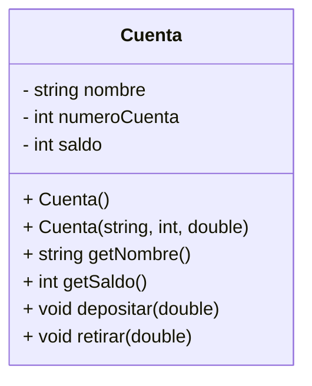

# **🧮 Tarea 5 - Desarrollo del Sistema Bancario del Tercer Punto del 1er Examen**

## **📢🚨 FECHA LÍMITE: Martes 11 de marzo - 23:59 🚨📢** <!-- omit in toc -->

---

## **📖 Descripción de la Tarea** <!-- omit in toc -->

Cada estudiante deberá realizar un video explicativo en el que resuelva el problema del **Sistema Bancario** (punto 3 del primer examen) en C++ utilizando CLion y dos enfoques distintos:

1. **Código en un solo archivo:** La solución deberá desarrollarse íntegramente dentro de un único archivo denominado `main.cpp`. El proyecto se puede llamar `Examen1Parte1`
2. **Uso de principios de diseño modular en C++:** Se deberá estructurar el código en múltiples archivos, separando la declaración y la implementación de las clases. Para ello, las clases deben definirse en archivos de encabezado (.h) y sus métodos implementarse en archivos fuente (.cpp). El proyecto se puede llamar `Examen1Parte2`

## **Enunciado del problema**
Desarrollar un programa en C++ que gestione cuentas bancarias mediante una clase `Cuenta`, la cual debe contener el nombre del titular, número de cuenta y saldo disponible. El programa debe permitir agregar nuevas cuentas con un saldo inicial, buscar una cuenta por el nombre del titular y realizar transferencias entre cuentas, validando que la cuenta de origen tenga saldo suficiente antes de efectuar la operación.

## **Diagrama de Clases**




> [!NOTE]
>
> Este diagrama es solo una sugerencia y puede adaptarse según sea necesario.
> 
#### **Ejemplo**<!-- omit in toc -->

##### Entrada:  <!-- omit in toc -->
```
AGREGAR Juan 500  
AGREGAR Maria 1000
BUSCAR Juan
BUSCAR Maria
TRANSFERIR Juan Maria 200
BUSCAR Juan
BUSCAR Maria
SALIR
```  

##### Salida:  <!-- omit in toc -->
```
500
1000
300
1200
```  
---

## **Reglas obligatorias**
- **Solo se puede compilar después de haber escrito todo el código.**
- **Si existe algún error de compilación, el video será inválido y se deberá iniciar de nuevo.**
- Se pueden grabar los videos por separado para la primera y la segunda parte.
- Debe escribir el código sin apoyos visuales de ningún tipo (notas, código previo, etc.).

## **Requisitos del video**
- Explicación clara de ambas implementaciones.
- Duración mínima: **No tiene** 
- Subir el video a YouTube y enviar el enlace al correo **yoan.pinzon@javerianacali.edu.co**.

