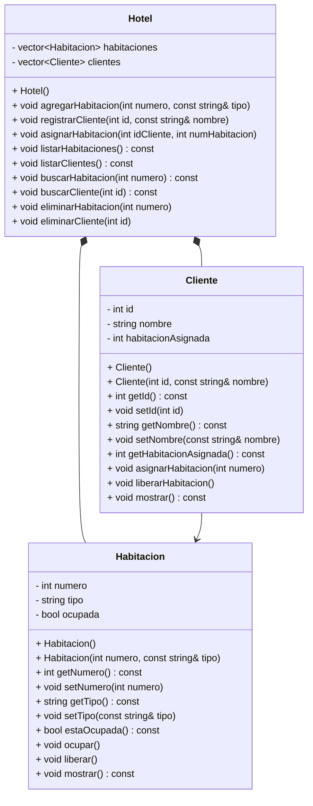
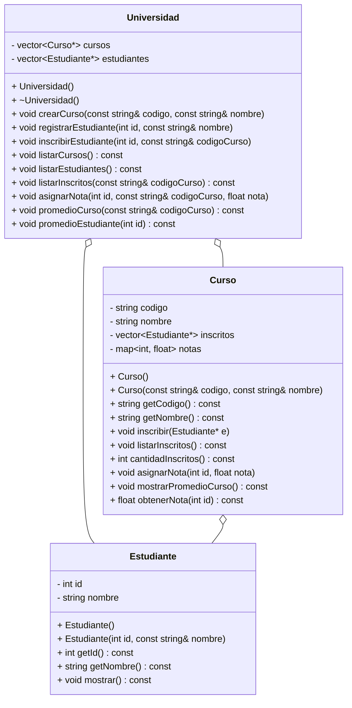

# **🧮 Tarea 5 - Composición y Agregación**

## **📢🚨 FECHA LÍMITE: Jueves 16 de octubre - 23:59 🚨📢** <!-- omit in toc -->

[](https://classroom.github.com/a/9tpFaIgN)

⚠️ **ENTREGAS FUERA DE TIEMPO NO SERÁN ACEPTADAS.**  
✅ **Haz `commit` y `push` antes del plazo y verifica tu entrega en GitHub Classroom.**


## 🧠 **Introducción General a la Tarea**

En esta tarea reforzarás tus conocimientos de **Programación Orientada a Objetos (POO)** en **C++**, comprendiendo en profundidad dos conceptos clave: **composición** y **agregación**. Ambos representan **formas de asociación entre clases**, pero con diferencias fundamentales respecto a la **dependencia del ciclo de vida** de los objetos. A través de **dos sistemas prácticos**, aprenderás a:

* Modelar relaciones entre objetos del mundo real.
* Implementar correctamente la composición y la agregación.
* Aplicar principios de encapsulamiento, modularidad y reutilización de código.

La tarea está dividido en **dos partes**:

1️⃣ **Parte 1 – Sistema de Gestión Hotelera (Composición)**

2️⃣ **Parte 2 – Sistema de Gestión de Cursos (Agregación)**

---

## 🚀 **🧩 Parte 1 – Sistema de Gestión Hotelera (Composición)**

En esta primera parte desarrollarás un **sistema de gestión hotelera** que permita administrar habitaciones, clientes y sus asignaciones. El objetivo es aplicar el concepto de **composición**, en el cual los objetos **dependen completamente** de la existencia del objeto principal (en este caso, el `Hotel`). Si el hotel se destruye, **sus habitaciones y clientes también dejan de existir**. De esta forma, podrás identificar claramente cuándo utilizar **composición** dentro de un diseño orientado a objetos.


### 🎯 **Descripción del Problema**

Implementarás un programa en **C++** que gestione un hotel, permitiendo registrar habitaciones, clientes y asignar habitaciones a los clientes.

El propósito principal es que aprendas a implementar y manipular clases que contienen otras clases como atributos, consolidando así tus conocimientos sobre **composición en POO**.

## 📌 Funcionalidad

El programa debe admitir los siguientes comandos:

1️⃣ **AGREGAR_HABITACION** `<numero>` `<tipo>`  
- Crea y registra una nueva habitación con los siguientes atributos:
  - `numero`: Número de la habitación (entero).
  - `tipo`: Tipo de habitación (`sencilla` o `doble`).
  - Por defecto, la habitación debe crearse como **no ocupada** (`ocupada = false`).

2️⃣ **REGISTRAR_CLIENTE** `<id>` `<nombre>`  
- Registra un nuevo cliente con los siguientes atributos:
  - `id`: Identificador único del cliente (entero).
  - `nombre`: Nombre del cliente (cadena de texto).

3️⃣ **ASIGNAR_HABITACION** `<id_cliente>` `<numero_habitacion>`
- Asigna una habitación a un cliente, cambiando el estado de la habitación a **ocupada**.
- Un cliente solo puede ocupar una habitación a la vez y viceversa.
- Si la habitación ya está ocupada, se muestra un mensaje de error.

4️⃣ **LISTAR_HABITACIONES**
- Muestra todas las habitaciones registradas indicando su número, tipo y si están ocupadas o no.

5️⃣ **LISTAR_CLIENTES**
- Muestra todos los clientes registrados indicando su ID y nombre.

6️⃣ **BUSCAR_HABITACION** `<numero>`
- Muestra la información de la habitación especificada si existe.

7️⃣ **BUSCAR_CLIENTE** `<id>`
- Muestra la información del cliente especificado si existe.

8️⃣ **ELIMINAR_HABITACION** `<numero>`
- Elimina la habitación especificada del sistema.

9️⃣ **ELIMINAR_CLIENTE** `<id>`
- Elimina el cliente especificado del sistema.

1️⃣0️⃣ **SALIR**
- Termina la ejecución del programa.

---

### **Ejemplos de Entrada y Salida**  <!-- omit in toc -->

#### **Ejemplo 1**<!-- omit in toc -->

##### Entrada:  <!-- omit in toc -->
```
AGREGAR_HABITACION 101 sencilla
AGREGAR_HABITACION 102 doble
REGISTRAR_CLIENTE 1 Ana
REGISTRAR_CLIENTE 2 Luis
LISTAR_HABITACIONES
LISTAR_CLIENTES
ASIGNAR_HABITACION 1 101
LISTAR_HABITACIONES
BUSCAR_CLIENTE 1
BUSCAR_HABITACION 101
ELIMINAR_HABITACION 102
LISTAR_HABITACIONES
SALIR
```  

##### Salida:  <!-- omit in toc -->
```
Hab. 101 (sencilla) agregada correctamente.
Hab. 102 (doble) agregada correctamente.
Cliente 1 (Ana) registrado correctamente.
Cliente 2 (Luis) registrado correctamente.
--- Lista de Habitaciones ---
Hab. 101 | Tipo: sencilla | Ocupada: No
Hab. 102 | Tipo: doble | Ocupada: No
--- Lista de Clientes ---
ID: 1 | Nombre: Ana
ID: 2 | Nombre: Luis
Hab. 101 asignada al cliente 1 (Ana).
--- Lista de Habitaciones ---
Hab. 101 | Tipo: sencilla | Ocupada: Si
Hab. 102 | Tipo: doble | Ocupada: No
Cliente encontrado: ID: 1 | Nombre: Ana | Habitacion asignada: 101
Hab. encontrada: Hab. 101 | Tipo: sencilla | Ocupada: Si
Hab. 102 eliminada correctamente.
--- Lista de Habitaciones ---
Hab. 101 | Tipo: sencilla | Ocupada: Si
```  

---

## 📌 Diagrama de Clases 




## 🚀 **🧩 Parte 2 – Sistema de Gestión de Cursos (Agregación)**

En esta segunda parte, implementarás un **sistema de gestión académica simple** en **C++**, aplicando el concepto de **agregación** entre clases.
A diferencia del primer punto (composición), aquí los objetos **no dependen del ciclo de vida** de la clase principal: los objetos existen **de forma independiente** y se **vinculan temporalmente** entre sí.

El propósito es que aprendas a **reutilizar instancias de clases** y comprender cómo funciona la **agregación** dentro de la programación orientada a objetos (POO).

---

### 🎯 **Descripción del Problema**

Imagina que una universidad desea gestionar sus **cursos y estudiantes**.
Un **curso** puede tener varios **estudiantes inscritos**, pero los estudiantes **no son creados ni destruidos** por el curso: pueden existir sin pertenecer a ninguno, y pueden inscribirse en distintos cursos.

Tu programa deberá permitir **registrar cursos y estudiantes**, y **asociar** estudiantes a cursos existentes.

---

### 📌 **Requisitos funcionales**

1️⃣ **CREAR_CURSO** `<codigo>` `<nombre>`

* Crea un nuevo curso con el código y nombre indicados.

2️⃣ **REGISTRAR_ESTUDIANTE** `<id>` `<nombre>`

* Crea un nuevo estudiante con un identificador y nombre.

3️⃣ **INSCRIBIR_ESTUDIANTE** `<id_estudiante>` `<codigo_curso>`

* Asocia (agrega) un estudiante existente a un curso.
* Un estudiante puede estar en varios cursos, y un curso puede tener varios estudiantes.
* Si el curso o el estudiante no existen, muestra un mensaje de error.

4️⃣ **LISTAR_CURSOS**

* Muestra todos los cursos creados y cuántos estudiantes tiene cada uno.

5️⃣ **LISTAR_ESTUDIANTES**

* Muestra todos los estudiantes registrados.

6️⃣ **LISTAR_INSCRITOS** `<codigo_curso>`

* Muestra los estudiantes inscritos en el curso indicado.

7️⃣ **SALIR**

* Termina la ejecución del programa.

---

### 📘 **Pistas de Implementación**

* Crea las clases `Estudiante`, `Curso` y `Universidad`.
* La clase `Universidad` **mantiene listas** de cursos y estudiantes.
* Cada `Curso` **tiene una lista de punteros o referencias** a los `Estudiante` registrados (→ relación de **agregación**).
* Si la universidad o el curso se destruyen, los estudiantes **siguen existiendo**.

---

### 🧠 **Ejemplo de Entrada y Salida**

#### **Ejemplo 1**<!-- omit in toc -->

#### **Entrada:**

```
CREAR_CURSO CS101 Programacion
CREAR_CURSO MAT202 Calculo
REGISTRAR_ESTUDIANTE 1 Ana
REGISTRAR_ESTUDIANTE 2 Luis
INSCRIBIR_ESTUDIANTE 1 CS101
INSCRIBIR_ESTUDIANTE 2 CS101
INSCRIBIR_ESTUDIANTE 1 MAT202
LISTAR_CURSOS
LISTAR_INSCRITOS CS101
LISTAR_ESTUDIANTES
SALIR
```

#### **Salida:**

```
Curso CS101 (Programacion) creado correctamente.
Curso MAT202 (Calculo) creado correctamente.
Estudiante 1 (Ana) registrado correctamente.
Estudiante 2 (Luis) registrado correctamente.
Estudiante 1 (Ana) inscrito en el curso CS101.
Estudiante 2 (Luis) inscrito en el curso CS101.
Estudiante 1 (Ana) inscrito en el curso MAT202.
--- Lista de Cursos ---
CS101 - Programacion | 2 estudiantes inscritos
MAT202 - Calculo | 1 estudiantes inscritos
--- Estudiantes inscritos en CS101 ---
ID: 1 | Nombre: Ana
ID: 2 | Nombre: Luis
--- Lista de Estudiantes ---
ID: 1 | Nombre: Ana
ID: 2 | Nombre: Luis
```

#### **Ejemplo 2**<!-- omit in toc -->

#### **Entrada:**

```
CREAR_CURSO CS101 Programacion
CREAR_CURSO MAT202 Calculo
REGISTRAR_ESTUDIANTE 1 Ana
REGISTRAR_ESTUDIANTE 2 Luis
INSCRIBIR_ESTUDIANTE 1 CS101
INSCRIBIR_ESTUDIANTE 2 CS101
INSCRIBIR_ESTUDIANTE 1 MAT202
ASIGNAR_NOTA 1 CS101 4.5
ASIGNAR_NOTA 2 CS101 3.8
ASIGNAR_NOTA 1 MAT202 4.0
PROMEDIO_CURSO CS101
PROMEDIO_ESTUDIANTE 1
SALIR
```

#### **Salida:**

```
Curso CS101 (Programacion) creado correctamente.
Curso MAT202 (Calculo) creado correctamente.
Estudiante 1 (Ana) registrado correctamente.
Estudiante 2 (Luis) registrado correctamente.
Estudiante 1 (Ana) inscrito en el curso CS101.
Estudiante 2 (Luis) inscrito en el curso CS101.
Estudiante 1 (Ana) inscrito en el curso MAT202.
Nota 4.5 asignada a estudiante 1 en curso CS101.
Nota 3.8 asignada a estudiante 2 en curso CS101.
Nota 4 asignada a estudiante 1 en curso MAT202.
Promedio del curso CS101: 4.15
Promedio del estudiante 1 (Ana): 4.25
```

---

### 📊 **Diagrama de Clases (Agregación)**



---

## **📌 ¿Cómo entregar la tarea en GitHub Classroom?** <!-- omit in toc -->

### **📝 Pasos para entregar tu código correctamente:** <!-- omit in toc -->

## 1️⃣ Aceptar la tarea  <!-- omit in toc -->
1. **Accede al enlace de la tarea**.
2. **Haz clic en "Aceptar la tarea"** para que se genere un repositorio en GitHub automáticamente.
3. Una vez aceptada, **se habrá creado un repositorio en GitHub** con la siguiente dirección (reemplaza `TU_USUARIO` con tu nombre de usuario en GitHub):  
   ```
   https://github.com/profesorcito/tarea5-TU_USUARIO
   ```
4. Verifica que el repositorio esté disponible en tu cuenta de GitHub.  

## 2️⃣ Clonar el repositorio en tu computadora <!-- omit in toc -->  
5. **Abre una terminal o Git Bash** en tu computadora.  
6. **Ubícate en la carpeta donde deseas guardar el proyecto** con el siguiente comando (puedes cambiar la ruta según tu preferencia):  
   ```bash
   cd ~/Desktop/CLionProjects
   ```
7. **Clona tu repositorio** con el siguiente comando (reemplaza `TU_USUARIO` con tu usuario en GitHub):  
   ```bash
   git clone https://github.com/profesorcito/tarea5-TU_USUARIO.git
   ```

## 3️⃣ Abrir el proyecto en CLion <!-- omit in toc -->  
8. **Abre CLion y carga el proyecto:**  
   - Presiona `Alt + F`.  
   - Selecciona **New** → **Project**.  
   - En la parte izquierda, selecciona **C++ Executable**.  
   - Busca la carpeta donde quedó el repositorio dentro de `CLionProjects`.  
   - Debe llamarse:  
     ```
     tarea5-TU_USUARIO
     ```
   - Haz clic en **Create**.  
   - Si aparece un mensaje preguntando si deseas confiar en el proyecto, selecciona **Yes**.  

## 4️⃣ Modificar y probar el código <!-- omit in toc -->  
9. **Edita y prueba el código:**  
   - Abre `main.cpp` y escribe el código necesario.  
   - Ejecuta el programa y verifica que la salida sea la esperada.  
   - Realiza pruebas para asegurarte de que todo funcione correctamente.  

## 5️⃣ Guardar y subir los cambios a GitHub <!-- omit in toc -->  
10. **Guarda los cambios y súbelos a GitHub** con los siguientes comandos en la terminal dentro de la carpeta del repositorio:  
   ```bash
   git add .
   git commit -m "Entrega de la tarea"
   git push origin master
   ```
   
> [!WARNING]  
> Si el comando `git push` falla debido a cambios en el repositorio remoto, primero ejecuta `git pull` para sincronizar los cambios y luego vuelve a intentar con `git push`.

## 6️⃣ Verificar la entrega en GitHub Classroom <!-- omit in toc -->  
11. **Revisa en GitHub si tu tarea fue subida correctamente:**  
   - Ingresa a tu repositorio en GitHub.
   - Verifica que los archivos y cambios estén reflejados.  
12. **Revisa la pestaña "Actions" en GitHub:**  
   - Si la tarea fue aceptada, se mostrará un ícono verde ✅.  
   - Si hubo errores, se mostrará un ícono rojo ❌.  
   - Haz clic en el commit más reciente y revisa **"run-autograding-test"** para ver los detalles.  
13. **Corrige los errores y sube los cambios nuevamente** hasta que la evaluación esté en verde.

---
> [!IMPORTANT]  
>- **No cambies el nombre de los archivos (`main.cpp`).**  
>- **Asegúrate de hacer `commit` y `push` antes de la fecha límite.**  
>- **Si encuentras errores en el autograder, revisa la salida y ajústala según los ejemplos dados.**  
>


