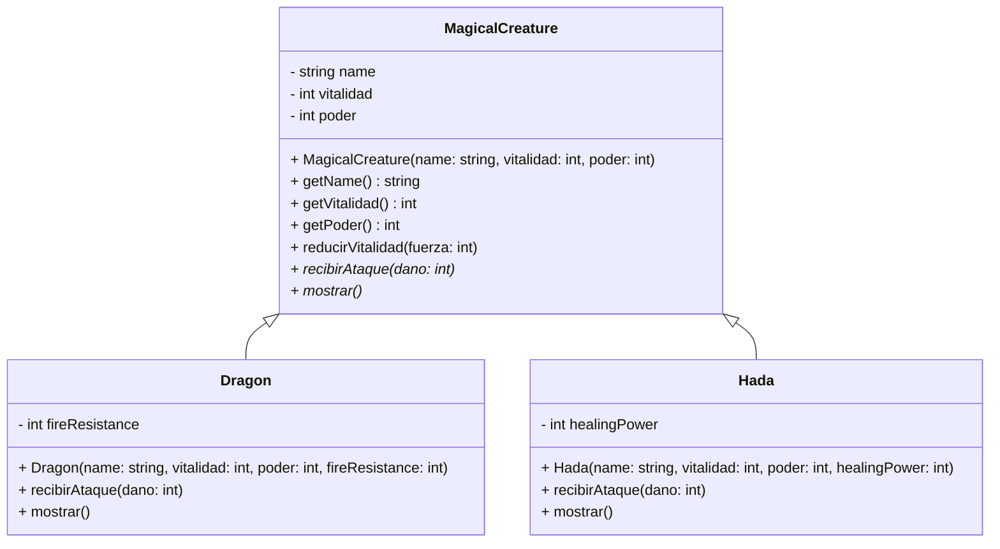

# **🧮 Tarea 6 - Sistema de Batalla RPG**

## **📢🚨 FECHA LÍMITE: Jueves 20 de marzo - 23:59 🚨📢** <!-- omit in toc -->

⚠️ **ENTREGAS FUERA DE TIEMPO NO SERÁN ACEPTADAS.**  
✅ **Haz `commit` y `push` antes del plazo y verifica tu entrega en GitHub Classroom.**

---

## **📖 Descripción de la Tarea** <!-- omit in toc -->

En el mágico mundo de **Evermoor**, la guerra entre **Dragones** y **Hadas** ha alcanzado un punto crítico. Los Dragones, poderosos y destructivos, poseen una notable **Resistencia al Fuego**, mientras que las Hadas, guardianas de la naturaleza, emplean su excepcional **Poder de Curación** para regenerar su vitalidad. Los aventureros han descubierto que ciertas combinaciones de ataques o patrones de combate pueden desencadenar efectos especiales no documentados, pero sus detalles permanecen ocultos.  

El programa que desarrollarás en **C++** permitirá a los usuarios invocar, registrar y hacer combatir a estas criaturas místicas mediante comandos específicos. Es importante notar que para maximizar la efectividad de los ataques, **los usuarios deben implementar un cálculo dinámico de prioridad entre las criaturas dependiendo de su vitalidad restante, poder y ataques previos**. No realizar este cálculo correctamente podría llevar a un desenlace fatal en combate.  

## 📌 Funcionalidad

El programa debe admitir los siguientes comandos:

1️⃣ **CREA_DRAGON** `<nombre>` `<vitalidad>` `<poder>` `<resistencia_fuego>`  
- Crea un nuevo Dragón con las características especificadas.  

2️⃣ **CREA_HADA** `<nombre>` `<vitalidad>` `<poder>` `<poder_curacion>`  
- Crea un nuevo Hada con las características especificadas.  

3️⃣ **MOSTRAR**  
- Muestra todas las criaturas registradas en el sistema, indicando su nombre, vitalidad, poder y atributo especial. 
- Se indica si están muertas cuando la vitalidad es 0. 

4️⃣ **ATACA** `<atacante>` `<objetivo>` `<fuerza>`  
- Permite a una criatura atacar a otra, calculando el daño infligido con base en su poder.  
- El atacante recibe un 10% del daño como auto-daño.  
- Las hadas se curan parcialmente del daño recibido según su poder de curación.  
- Los dragones aplican su resistencia al fuego para mitigar el daño recibido.  

5️⃣ **BUSCAR** `<nombre>`  
- Muestra la información de la criatura indicada si existe.  

6️⃣ **ELIMINAR** `<nombre>`  
- Elimina la criatura especificada del sistema.  

7️⃣ **SALIR**  
- Finaliza la ejecución del programa.  

---

### **📌 🔥 Reglas de Combate**

1. **Vitalidad Inicial:**
   - Cada criatura se crea con una cantidad específica de vitalidad.

2. **Ataque:**
   - Cuando una criatura ataca a otra, esta última pierde vitalidad igual al valor de la fuerza de ataque (`fuerza`), ajustada según sus características especiales.

3. **Modificadores Especiales:**
   - **Dragón:**
     - Tiene un atributo llamado `fireResistance` (resistencia al fuego), que reduce el daño recibido en un porcentaje determinado.
     - Fórmula para calcular daño recibido:  
       $$
       \text{Daño Recibido} = \text{fuerza} \times \left(1 - \frac{\text{fireResistance}}{100}\right)
       $$
   - **Hada:**
     - Tiene un atributo llamado `healingPower` (poder de curación), que permite recuperarse un porcentaje del daño recibido después de cada ataque.
     - Fórmula para curación:  
       $$
       \text{Curación} = \frac{\text{Daño Recibido} \times \text{healingPower}}{100}
       $$
     - El `Hada` recupera vida inmediatamente después de recibir el ataque.

4. **Muerte de la Criatura:**
   - Cuando la vitalidad de una criatura llega a **0 o menos**, se declara muerta y no puede atacar ni ser atacada nuevamente.
   - El programa debe imprimir un mensaje como:
     ```
     Celestia ha sido derrotada.
     ```

5. **Fin de la Batalla:**
   - La batalla termina cuando todas las criaturas menos una son derrotadas, o si se indica explícitamente por un comando especial (opcional).

---

### **Ejemplos de Entrada y Salida**  <!-- omit in toc -->

#### **Ejemplo 1**<!-- omit in toc -->

##### Entrada:  <!-- omit in toc -->
```
CREA_DRAGON Smaug 1000 200 50
CREA_HADA Tinkerbell 300 50 30
MOSTRAR
ATACA Smaug Tinkerbell 100
MOSTRAR
ATACA Tinkerbell Smaug 30
MOSTRAR
SALIR
```  

##### Salida:  <!-- omit in toc -->
```
[Smaug, 1000, 200, 50]
[Tinkerbell, 300, 50, 30]
[Smaug, 990, 200, 50]
[Tinkerbell, 90, 50, 30]
[Smaug, 950, 200, 50]
[Tinkerbell, 87, 50, 30]
```  

<details><summary>👨‍🏫 Explicación</summary>

### **Entrada:**  
```
CREA_DRAGON Smaug 1000 200 50
```
✅ Se crea un Dragón llamado **Smaug** con:
- Vitalidad: **1000**  
- Poder: **200**  
- Resistencia al fuego: **50%**  

---

### **Entrada:**  
```
CREA_HADA Tinkerbell 300 50 30
```
✅ Se crea un Hada llamada **Tinkerbell** con:  
- Vitalidad: **300**  
- Poder: **50**  
- Poder de curación: **30%**  

---

### **Entrada:**  
```
MOSTRAR
```
📌 **Salida:**  
```
[Smaug, 1000, 200, 50]
[Tinkerbell, 300, 50, 30]
```
✅ La función `mostrar()` imprime la información de las criaturas creadas hasta el momento.

---

### **Entrada:**  
```
ATACA Smaug Tinkerbell 100
```
✅ Proceso del ataque:  

1. **Cálculo del daño:**  
   - Daño = `fuerza + poder del atacante = 100 + 200 = 300`  

2. **Auto-daño aplicado al atacante:**  
   - Auto-daño = `10% de fuerza = 100 / 10 = 10`  
   - Vitalidad de **Smaug**: `1000 - 10 = 990`  

3. **Tinkerbell recibe el ataque:**  
   - Su vitalidad se reduce en `300`, pero su curación se aplica después.  
   - Curación: `30% del daño recibido = 300 * 0.3 = 90`.  
   - Vitalidad final: `300 - 300 + 90 = 90`.  

---

### **Entrada:**  
```
MOSTRAR
```
📌 **Salida:**  
```
[Smaug, 990, 200, 50]
[Tinkerbell, 90, 50, 30]
```
✅ Los valores actualizados muestran que:  
- **Smaug** perdió **10 puntos** de vitalidad (auto-daño).  
- **Tinkerbell** tiene su vitalidad reducida a **90** después de aplicar su curación.  

---

### **Entrada:**  
```
ATACA Tinkerbell Smaug 30
```
✅ Proceso del ataque:  

1. **Cálculo del daño:**  
   - Daño = `fuerza + poder del atacante = 30 + 50 = 80`  

2. **Auto-daño aplicado al atacante:**  
   - Auto-daño = `10% de fuerza = 30 / 10 = 3`  
   - Vitalidad de **Tinkerbell**: `90 - 3 = 87`  

3. **Smaug recibe el ataque (con resistencia al fuego):**  
   - Daño recibido = `80 * (100 - 50) / 100 = 80 * 0.5 = 40`  
   - Vitalidad final: `990 - 40 = 950`  

---

### **Entrada:**  
```
MOSTRAR
```
📌 **Salida:**  
```
[Smaug, 950, 200, 50]
[Tinkerbell, 87, 50, 30]
```
✅ Los valores finales son:  
- **Smaug:** Perdió **40 puntos de vitalidad** (ataque reducido por su resistencia al fuego).  
- **Tinkerbell:** Perdió **3 puntos de vitalidad** (auto-daño).  

</details>


---
#### **Ejemplo 2**<!-- omit in toc -->

##### Entrada:  <!-- omit in toc -->
```
CREA_DRAGON Drogon 300 250 40
CREA_HADA Celestia 1800 70 30
MOSTRAR
ATACA Drogon Celestia 2000
ATACA Celestia Drogon 1500
MOSTRAR
ATACA Celestia Drogon 5500
MOSTRAR
SALIR
```  

##### Salida:  <!-- omit in toc -->
```
[Drogon, 300, 250, 40]
[Celestia, 1800, 70, 30]
[Drogon, 0, 250, 40] Muerto
[Celestia, 525, 70, 30]
[Drogon, 0, 250, 40] Muerto
[Celestia, 0, 70, 30] Muerta
```  

---

## 📌 Diagrama de Clases 



## **📌 ¿Cómo entregar la tarea en GitHub Classroom?** <!-- omit in toc -->

### **📝 Pasos para entregar tu código correctamente:** <!-- omit in toc -->

## 1️⃣ Aceptar la tarea  <!-- omit in toc -->
1. **Accede al enlace de la tarea**.
2. **Haz clic en "Aceptar la tarea"** para que se genere un repositorio en GitHub automáticamente.
3. Una vez aceptada, **se habrá creado un repositorio en GitHub** con la siguiente dirección (reemplaza `TU_USUARIO` con tu nombre de usuario en GitHub):  
   ```
   https://github.com/profesorcito/tarea-6-TU_USUARIO
   ```
4. Verifica que el repositorio esté disponible en tu cuenta de GitHub.  

## 2️⃣ Clonar el repositorio en tu computadora <!-- omit in toc -->  
5. **Abre una terminal o Git Bash** en tu computadora.  
6. **Ubícate en la carpeta donde deseas guardar el proyecto** con el siguiente comando (puedes cambiar la ruta según tu preferencia):  
   ```bash
   cd ~/Desktop/CLionProjects
   ```
7. **Clona tu repositorio** con el siguiente comando (reemplaza `TU_USUARIO` con tu usuario en GitHub):  
   ```bash
   git clone https://github.com/profesorcito/tarea-6-TU_USUARIO.git
   ```

## 3️⃣ Abrir el proyecto en CLion <!-- omit in toc -->  
8. **Abre CLion y carga el proyecto:**  
   - Presiona `Alt + F`.  
   - Selecciona **New** → **Project**.  
   - En la parte izquierda, selecciona **C++ Executable**.  
   - Busca la carpeta donde quedó el repositorio dentro de `CLionProjects`.  
   - Debe llamarse:  
     ```
     tarea-6-TU_USUARIO
     ```
   - Haz clic en **Create**.  
   - Si aparece un mensaje preguntando si deseas confiar en el proyecto, selecciona **Yes**.  

## 4️⃣ Modificar y probar el código <!-- omit in toc -->  
9. **Edita y prueba el código:**  
   - Abre `main.cpp` y escribe el código necesario.  
   - Ejecuta el programa y verifica que la salida sea la esperada.  
   - Realiza pruebas para asegurarte de que todo funcione correctamente.  

## 5️⃣ Guardar y subir los cambios a GitHub <!-- omit in toc -->  
10. **Guarda los cambios y súbelos a GitHub** con los siguientes comandos en la terminal dentro de la carpeta del repositorio:  
   ```bash
   git add .
   git commit -m "Entrega de la tarea"
   git push origin master
   ```
   
> [!WARNING]  
> Si el comando `git push` falla debido a cambios en el repositorio remoto, primero ejecuta `git pull` para sincronizar los cambios y luego vuelve a intentar con `git push`.

## 6️⃣ Verificar la entrega en GitHub Classroom <!-- omit in toc -->  
11. **Revisa en GitHub si tu tarea fue subida correctamente:**  
   - Ingresa a tu repositorio en GitHub.
   - Verifica que los archivos y cambios estén reflejados.  
12. **Revisa la pestaña "Actions" en GitHub:**  
   - Si la tarea fue aceptada, se mostrará un ícono verde ✅.  
   - Si hubo errores, se mostrará un ícono rojo ❌.  
   - Haz clic en el commit más reciente y revisa **"run-autograding-test"** para ver los detalles.  
13. **Corrige los errores y sube los cambios nuevamente** hasta que la evaluación esté en verde.

---
> [!IMPORTANT]  
>- **No cambies el nombre de los archivos (`main.cpp`).**  
>- **Asegúrate de hacer `commit` y `push` antes de la fecha límite.**  
>- **Si encuentras errores en el autograder, revisa la salida y ajústala según los ejemplos dados.**  
>


